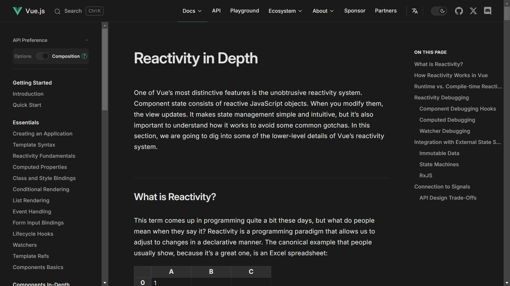
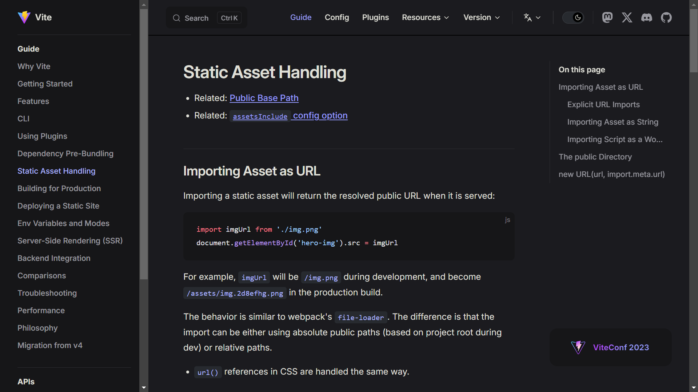
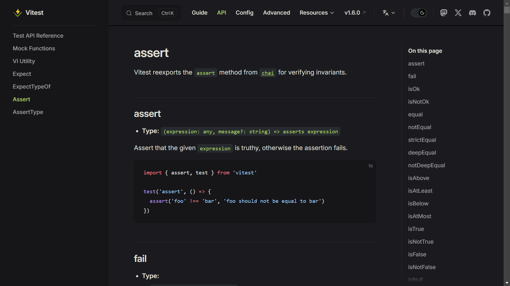

## 静态站点生成器之殇

不只有我一个人在使用静态站点生成器时感受到不满：在自定义站点上与站点生成器作战的耗费使生成器的效益随自定义深度增加而减少，不循规蹈矩的用户几乎没有什么选择。

<details>
<summary>搬迁个人网站时尝试过的静态站点生成器概述</summary>

### Jekyll

新时代静态站点生成器的鼻祖，透射着原始的粗糙。“blog-aware”事实上是忽略了博客以外的用途：无法为非博文的列表数据分页，即使不使用也会创建posts集合。它代表了一众框死了内容格式和结构的站点生成器，把静态站点生成器想象得过于简单。

### Eleventy

Eleventy是一颗静态站点生成器界的新星，是以简单著称的后起之秀。它符合Web原住民精神，旨在简化现有生成器的繁琐配置。即使不创建配置文件，也能用它生成站点。但我每次观摩它的文档都感觉“哇，好乱”，世上竟有如此让人迷路的文档。

它依旧面向模板语言而作，但支持使用WebC作为模板语法，在大部分位置使用JavaScript作为数据格式，就已经领先太多了。WebC是Eleventy的作者@zachleat为Eleventy设计的组件系统，受到Vue SFC的很大影响。它依旧要求为文章创建集合，而不直接支持glob。它完全不青睐ES module和TypeScript，只有页面可以以TypeScript编写，配置文件必须为JavaScript。

### VitePress

常逛Vue生态圈的人一定很熟悉Vue 3官方文档的页面风格，这便是VitePress默认主题。VitePress是驱动Vue、Vite、VueUse、Vitest、Pinia、Rollup等库文档的静态站点生成器（static site generator），[于今年3月发布了正式版](https://blog.vuejs.org/posts/vitepress-1.0)。

<div class="paracol">




</div>

它们是少见的在网络条件较差的环境下也能正常浏览的网站，这得益于VitePress采用初次访问提前渲染，站内路由动态加载的策略。不过，它们也是少见的在网络条件很差的环境下点击链接没反应的网站，页面内外都没有正在载入的标志。

如Next.js和Nuxt Content之流，虽是内容站点，也倾向于作为SPA构建。VitePress支持MPA但仍是实验性功能，不开启则无法做到0 JavaScript。

我觉得奇怪的是，明明可以用Vue模板语法直接指定，为什么要用配置项“管理”头元素？这可能也是受到SPA思路影响。

VitePress在制作技术文档站点方面极具竞争力，但对个人博客来说有所不足。特点是，官方提供的createContentLoader解决方案脱离页面渲染管线，带来重复计算和值不一致的问题，例如不会把自动识别到的h1放进title属性，也不会从Git获取lastUpdated。通过Vite的`import.meta.glob`方法和强行使用内部导出`__pageData`能批量获取经处理的文章信息，这一点都不像Vue和Vite本体那么优雅。

### Nuxt Content

我又发现了Nuxt Content。它基于Nuxt，是比VitePress更重量级的SSR/SSG站点框架。重量级框架本非我所愿，可既然尝试过不启用JavaScript为实验性功能的VitePress，不如也试试这种。

MDC的语法相比VitePress的选择更融汇了Markdown风格，让整个系统更加一体，而不像VitePress有种一切设施皆为默认主题服务，默认主题专为Vue文档服务的感觉。

安装依赖花了很久，还有一堆弃用包警告。启动服务器时被遥测数据请求整了个措手不及，新项目的打包就因不明原因失败，至此我不便太想继续尝试，对Nuxt Content的体验遗憾而终。

</details>

<figure>
<table>
<tr><td colspan=2>MkDocs Jekyll Eleventy Astro VitePress Nuxt Next.js
<tr><td>← 简单而复杂<td align=right>启动即重担 →
</table>
</figure>

[Jamstack生成器](https://jamstack.org/generators/)页面上的大部分静态站点生成器都遵循同样的套路：提供命令行工具用于构建和预览，编写配置文件来描述站点，使用模板语言自定义样式，支持Markdown作为内容创作格式，通过YAML frontmatter指定文章标题和日期等元数据。

星数最多的中，有少数几个框架基于React、Vue、Svelte，用它们作为模板语言，用JavaScript作为配置语言。由于不知道哪些部分是客户端必需的，即使什么可交互组件都没有，也会在最终产物中产生大量JavaScript。

接下来，多数生成器选择JSON、YAML、TOML作为配置文件格式，使用Liquid、Nunjucks、Mustache、Handlebars、Jinja2作为模板引擎，不支持Markdown以外的内容。其中较完善的框架提供钩子，通过插件扩展能力。但是，怎么也逃不开上述刻板流程。

到了底端，多是一人随手糊的脚本，随手就向生成器列表投稿了，可复用性很差。但中有微光零星，似可照亮静态站点生成器界的前路。

@fvsch[对现有静态站点生成器的抱怨](https://fvsch.com/static-site-generators)非常在理：静态站点的重心在于内容管理，可几乎所有静态站点生成器都专注于单页，强迫开发者使用贫弱的模板语言，无视自由组织页面结构的需求，集合和分类树有如亡羊补牢，无谓地增添着系统的复杂度。市面上的静态站点生成器把配置和编程能力藏在布局模板、打包插件、预置主题之下，是在无视命令行工具复杂性的原罪。

## 这不是个简单的项目

“不过是把Markdown批量转换成HTML，我花两个小时就能写一个静态站点生成器。”这样的想法太过常见，于是新的站点生成器无休止地涌现，在生成了一个站点后就永无重见天日之时。

### Ad hoc Lisp定律：能清晰描述策略的唯有程序

能上手操办静态站点所面向的用户，自是不甘平凡的用户。静态站点生成器需要面对千人千面的需求，不具备足够的用户级可扩展能力是不行的。然而，模板引擎和配置文件充分适用格林斯潘第十定律，孱弱的扩展性对渴望对站点自定义的互联网原住民来说远远不够，无论对于普通用户还是自食其力的开发者都不好用，所以请至少让开发者使用真正的编程语言指定生成站点的方法。

> All templating languages grow to be Turing-complete. Just cut out the middle-man, and use JS!
>
> — [EJS](https://ejs.co/)

更好的是允许用户用惯用手段来处理超文本，也就是~~jQuery~~ DOM API。这意味着用JavaScript操作页面元素而非字符串，用CSS选择器快速定位目标，用IDL属性而非通用的setAttribute方法操作语义化元素。jsdom是必不可少的助力，[domco](https://domco.robino.dev/)是一个不错的尝试。

### Ad hoc SQL定律：目录是结构化查询语言的界面

生成页面列表的能力是条件查询所有页面的能力的子集。集合、过滤器、分页、导航，没有一个是不能对页面数据库写一条SQL查询解决的，如果有，那就写两条。于是，在引入了图灵完备的模板引擎之后，一般通过的静态站点生成器要么压根不支持生成目录和导航条，要么实现了一个很烂的内存数据库。请至少让开发者使用真正的查询语言。

### 声明式目标轻松引入复杂依赖图，成为精确增量编译的拦路虎

静态站点生成器的核心功能在于构建输出静态资源目录，但有时被忽视的是提供预览。诚然，在用优秀的Markdown编辑器编写纯文本文章时，不必打开站点预览，但在开发主题和进行复杂排版时，编辑器预览不能提供准确信息，即刻预览对加速反馈尤为重要。试想在Discourse论坛中发帖而无法在编辑中看到onebox、投票、隐藏详细信息、模糊剧透的样子，只能在发布后发现投票发送失败再手忙脚乱地修改。

若从简，预览亦实施全站构建，也未尝不可。然而，每修改一篇文章就遍历全部Markdown文件并重复渲染，页面多起来将耗费不少时间。故实时预览应是增量的。Discourse发帖框每打一个字就全量重新渲染，体验却也不错，就是因为它不涉及文件系统操作。内存和硬盘就是如此相隔大洋两岸。

增量编译是快速反馈循环的重要构件，但丰富的功能导致难以正确地计算增量。由于可以根据数据生成页面，集合中的页面数量不定。目录数据变化，分页变化，页面间链接关系即变化。为了使页面内容正确，必须以正确的顺序生成页面，按依赖关系为页面拓扑排序，使增量编译的实现复杂度与完整的响应式系统平起平坐。

## 响应式号召无处不在

Excel有从文件导入数据的功能，电子表格以响应式著称，也有公式能处理文本，VBA与公式系统无缝连接。莫非Excel才是静态站点生成器真正的最终形态？这个时候，就要说到[Vue为什么是神](../480/)了。

通常，静态站点的构建过程是纯函数，这意味着可以实行缓存优化，[Typst高速的秘诀就在于此](https://crates.io/crates/comemo)。对于与前端结合紧密的项目，需要此库的JavaScript版本，基于Vue来做再合适不过了。

设想一个站点生成器，以预览服务为核心，需要用户具有JavaScript编程能力，通过下列API完成任务。

```typescript
/** 预览服务器的回调。应根据path（例如，首页为'/index.html'）返回对应的文件内容。 */
export type Renderer = (path: string, fs: Readonly<Record<string, {
  text: string,
  buffer: Buffer,
  stat: fs.Stats,
}>>) => string | Buffer
/** 启动预览服务器。 */
declare export function serve(render: Renderer, source = '.'): void
/** 构建静态站点。 */
declare export function build(render: Renderer, source = '.', destination = '_site'): void
/** 在Renderer中调用，标记没有被自动链接，但应构建的资源。 */
declare export function link(path: string): void
```

1. Vue提供响应式能力。fs是响应式对象，渲染后的页面是计算值。
2. Chokidar监视文件系统的变化。在文件变化时，读取内容，并保存在fs中。这将使使用到该文件内容的页面失效。
3. node:http、Express、Koa等均可作为预览服务器。浏览器访问页面时，读取计算值。因为计算值惰性求值，所以不会渲染未访问的页面。
4. 用户提供的渲染函数访问fs中的属性时，Vue会记录页面间内容依赖关系，并在依赖项更新时计划重新渲染。
5. parse5可以解析HTML，根据首页标记的src和href属性访问到下级页面，并进而在构建时爬取整个站点所有的页面和资源。
6. 有未能收集到的资源的话，通过在Renderer中调用link函数以标记页面引用的资源。隐藏页面也可通过此法确保被构建。

用户提供的核心对象是Renderer，服务器的请求回调函数，这有点像[Frozen-Flask](https://frozen-flask.readthedocs.io/)，包括服务器和链接必须通过`flask.url_for`产生才会被收集到这点。区别在于，每个页面的内容会被Vue计算值缓存，从而实现增量编译；这在Flask的场合需要手动实现。

由此一来，在保持所有生成逻辑皆由用户程序控制的前提下，又能快速地增量预览。作出的仅有的假设是输入来自文件，以及生成产物入口为HTML。可能的问题是全部文件内容都保存在内存中，但这对内容网站和今日硬件应不是问题。
