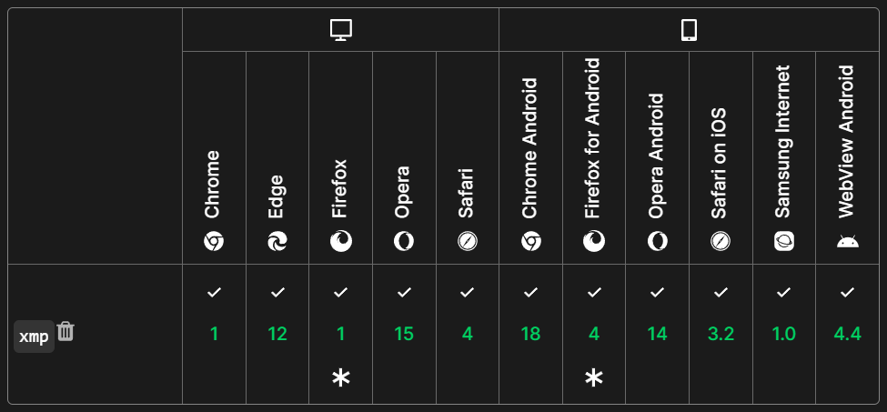

<div class="admonition">
本文描述的静态站点生成器投入使用未半而中道崩殂，但其中的部分特性仍得以保留。
</div>

没有“后端”
----------

服务器毕竟是要交钱的，没有后端服务意味着我可以通过任意的静态站点提供商免费部署本站。不仅仅是GitHub Pages，还有很多支持发布静态站点的服务都可以一样地部署，为<ruby>去中心化<rt>狡兔三窟</rt></ruby>铺平道路。

本站采用自编的静态网站生成器，选择Python的原因起初只是Beautiful Soup。

```python
import bs4
```

也因为我享受Python的类型检查和各语言中最好用的字典。

```python
from functools import cache
from collections import defaultdict
from collections.abc import Mapping, Iterable
```

没有“前端”
----------

不知何时起，网页三剑客中的JavaScript摇身一变，从小丑变成了核心。

[超媒体](https://hypermedia.systems/hypermedia-reintroduction/)是好文明，[htmz](https://leanrada.com/htmz/)这样贯彻超媒体精神的微型脚本也是好文明，没有半点JavaScript更是好文明。

> If we haven’t shocked you with our deeply-questionable design decisions yet, this one might shock the younger developers out there most of all: our website doesn’t use any Javascript. Zero.
>
> — Alex Cabal, [How Standard Ebooks serves millions of requests per month with a 2GB VPS; or, a paean to the classic web](https://alexcabal.com/posts/standard-ebooks-and-classic-web-tech)

本站文章页没有强制要求的JavaScript。区区几个字，凭什么要执行客户端脚本才能正常阅读？

Prism（代码高亮）、MathJax（公式排版）、[赫蹏](https://sivan.github.io/heti/)（中文排版）的默认行为是扫描页面，并视之为服务到位。既然手写HTML维护整个网站已是过去时，这些纯函数就更应在源码预处理阶段执行，何苦浪费每个访客的计算资源。

不知道为什么，highlight.js和Prism都不屑于用`<span>`包裹变量名等标识符，没法对它们设置特殊的颜色。我选择老牌代码高亮库Pygments，它甚至把空格也标出来了。

```python
import pygments
```

[随着Chrome 109一起到来的是MathML支持。](https://chromestatus.com/feature/5240822173794304)Firefox从最初就支持MathML，在这点上已经领先Chrome十多年了。自然，数学公式就用MathML解决，唯一的问题是语法实在是太啰嗦了。

至于中文排版中脚本解决的最重要的中西文间距问题，将随CSS 4级文本模块中的`text-autospace`属性得到自动解决。目前，这个属性还没有MDN页面，但是在[Chrome 120中已经可以手动开启了](https://developer.chrome.com/blog/css-i18n-features#inter-script_spacing_text-autospace)。可以相信，再过五十年，超文本排版就能跟最精细的TeX书籍媲美了！

没有Markdown
------------

功能丰富的Markdown库确实会帮忙处理代码高亮和LaTeX公式，可是我很不喜欢Markdown。Markdown更适合英文：一个换行是空格，两个换行是分段，斜体比粗体更可及，扩展语法依赖分词。一行开头打几个空格当段首缩进，好家伙，变成代码块了。有的问题是继承自HTML的：对英文来说，[换行当是语义分割](https://sembr.org/)；对中文来说，语义化不了一点。[CSS 3级文本模块就说了中文中的换行应该删掉而不是变为空格](https://www.w3.org/TR/css-text-3/#line-break-transform)，用户代理的实现倒是统一得很，保守加空格一把梭。那就别换行了，靠编辑器自动换行也蛮好。

更重要的是，Markdown的精简使其缺乏一些也很常用的功能，比如定义列表。结果是，每个Markdown库、应用或用户都要自己决定如何实现定义列表：直接写HTML，[PHP Markdown采用的`:`](https://michelf.ca/projects/php-markdown/extra/#def-list)，[MDN采用的`- :`](https://openwebdocs.org/content/posts/markdown-conversion/)。

即使是语法上达成共识的元素也不能满足常见需求：Markdown表格不支持跨行跨列的单元格，但凡有一个合并的单元格，就得推翻整个表格，用HTML重写。

一些有用的标记，如`<mark>`和`<ruby>`，更是只能手工输入。用Markdown编写包含较多不支持部件的页面时，甚至会觉得还不如手写全部的HTML。

写多了伪装成Markdown的HTML，会发现手写整页的超文本其实并没有那么麻烦，因为——

没有`</p>`
----------

这是因为在HTML5标准中，缺失的标签会被自动补全。[《Google HTML/CSS样式指南》推荐省略一切可以省略的标签。](https://google.github.io/styleguide/htmlcssguide.html#Optional_Tags)

> ```html
> <!-- Not recommended -->
> <!DOCTYPE html>
> <html>
>   <head>
>     <title>Spending money, spending bytes</title>
>   </head>
>   <body>
>     <p>Sic.</p>
>   </body>
> </html>
> ```
>
> ```html
> <!-- Recommended -->
> <!DOCTYPE html>
> <title>Saving money, saving bytes</title>
> <p>Qed.
> ```

HTML是为纯文本编辑器优化的。1991年，不用说Visual Studio Code没有问世，Visual Studio没有诞生，就连Windows都还在准备即将到来的3.1版本。在记事本的用户体验甩开强有力的命令行竞争产品几条街的年代产生的标记语言，无一不是便于手工输入的。（这也是我比起LaTeX更喜欢plain TeX的原因之一，不过那就是另一个故事了。）

有了Beautiful Soup和html5lib，就能以与各浏览器一致的方式解析HTML，省掉的标签都能解析回来。

```python
def read_page(filename: str) -> Page:
    # …
    with open(filename, "rb") as file:
        page = Page(bs4.BeautifulSoup(file, "html5lib"))
    head = page.soup.find("head")
    assert isinstance(head, bs4.Tag)  # 由html5lib保证存在
    # …
```

由于Visual Studio Code自带的HTML语言功能不懂这种略写，总是误以为`<p><p>`是两个段落嵌套在一起，并执意加上缩进和补全尾标记，好像还是把语言模式改成纯文本写起来方便些。

在HTML里贴代码也没有那么麻烦。多数时候，直接粘贴也不必转义，更不必调整缩进。空格环绕的小于号并不会被识别成标记；除非正好需要取一个叫amp的变量的地址，否则也不用转义“&”。

```html
<pre><code class="language-c">if (ret < 0) {
	value = value << 4 & 0xf0 | value >> 4 & 0xf;
}</code></pre>
```

没有符合HTML标准
----------------

最头疼的是在HTML里贴HTML代码。所以最早的HTML有个`<xmp>`标记，像`\begin{verbatim}`那样免除转义的烦扰，但早在HTML 2.0标准中就已不建议用户使用。[`<marquee>`，我的`<marquee>`！](https://marquee-rocket.glitch.me/why)

> **已弃用：**不再推荐使用该特性。虽然一些（所有）浏览器仍然支持它，但也许（并没有）已从相关的 web 标准中移除，也许正准备移除（也没有）或出于兼容性而保留（唯一事实）。请尽量不要使用该特性（但没有替代品），并更新现有的代码（又不是不能用）；参见本页面底部的[兼容性表格](https://developer.mozilla.org/zh-CN/docs/Web/HTML/Element/xmp#浏览器兼容性)以指导你作出决定。请注意，该特性随时可能无法正常工作（并不是）。

千万别被MDN上硕大的弃用警告吓到了，反倒是这种早早弃用的功能往往有着极其优秀的浏览器支持！弃用得越早，兼容性越好！



不过，事实上我只在源文件中使用了`<xmp>`，在经过预处理器后，就变为了符合标准的`<pre><code>`。实现细节，实现细节。

没有`<a target=_blank>`
-----------------------

为什么随便一个网站都能控制访客点击某个链接时会不会打开新标签页？

没有配置文件
------------

一个不需要配置的静态网站生成器？做梦吧。~~一切过去的<ruby>事<rt>配置</rt></ruby>都不会真的过去，它们总会换一种方式陪在我们身边。~~

抛开XML中唯一的值类型是字符串，JSON写起来费劲还不能加注释，YAML的裸字符串带来反直觉和安全隐患，INI没有统一标准这些问题不谈，“配置”在小脚本上只会把程序复杂化。

即使选用如梦如幻的TOML，也会发现最大的问题所在：配置文件与程序余下的部分之间，没有丝毫关联。期望从配置里加载到的是符合类型定义的对象，自动校验却是奢侈。有多少次是因为键名拼错而导致程序找不到配置项？配置文件里有自动补全吗？有一个天然带自动补全和类型检查的位置可以存放配置，想得起来吗？

[数据可以以Lua程序的格式存储](https://lua.org/pil/10.1.html)，不必自己写解析器，只需叫解释器帮忙求值。[Sphinx的配置文件是Python程序](https://www.sphinx-doc.org/en/master/usage/configuration.html)，这样就能有条件配置和动态配置了。其他语言当然也一样。若配置来源可信任，不如直接以程序作为配置格式。

这是本站对网址部件（slug）生成格式的配置：

```python
def slugify(x: str, /) -> str:
    return re.sub(r"[\\/:*?\"<>| !@#$%^&`'{}-]+", "-", x).strip("-")
```

其他网站生成器顶多给你配置是否允许URL中出现Unicode字符，以及每文章的覆盖选项。函数类型的配置项提供无限的自由度，可以自定义允许出现的字符，可以随心所欲地选择第三方库，甚至可以联网获取信息。

不过更多时候，我并不屑于把任何字符串提取成配置。生成目标是写死了超过三遍的名为\_site的文件夹。

```python
if os.path.isdir("_site"):
    shutil.rmtree("_site")
# …
shutil.copytree(".", "_site")
```

这个字符串有足够的特征，纵使在源码中被复制粘贴到处使用了三百遍，编辑器的查找和替换也是为此而生的。

没有模板
--------

模板是更复杂的配置文件。

不知何时起，内容和模板的地位逆转过来了。早期的超文本处理工具多是在内容页引入导航条模板、版权信息模板等，模板小，内容大；现在的静态网站生成器却是在模板里引入文章内容，内容小，模板大。

文章归档页模板里要包含迭代文章数组的程序，这通常依赖于模板引擎提供的只能用于这一家引擎的特殊循环语法。既然这都已经是程序了，为什么不用真正的程序语言来写？

本站没有Liquid模板，没有Jinja模板，没有PHP模板。文章列表是靠真真正正的Python程序列举出来的。导航条和版权信息也是作为字典和字符串写在Python程序里，为每个页面追加的。

```python
def decorate_page(page: Page) -> None:
    # …
    body = page.soup.find("body")
    assert isinstance(body, bs4.Tag)
    # …
    body.append(h("footer", "Copyright © 2013–2024 Frog Chen. All rights reserved."))
    if main := body.find("main"):
        assert isinstance(main, bs4.Tag)
        if page.title:
            main.insert(0, h("h1", page.title))
        main.append(
            h(
                "section",
                *(
                    h(
                        "div",
                        h(
                            "a",
                            revision.commit_hash[:7],
                            href=f"https://github.com/satgo1546/satgo1546.github.io/commit/{revision.commit_hash}",
                        ),
                        h(
                            "time",
                            revision.date.isoformat(" "),
                            datetime=revision.date.isoformat(),
                        ),
                        h("span", revision.author),
                    )
                    for revision in page.revisions
                ),
                class_="revisions",
            )
        )
        # …
```

其中的h函数是轻量[HyperScript](https://github.com/hyperhype/hyperscript)框架用户十分熟悉的创建元素的函数的简化版。Beautiful Soup提供的方法显然不是那么适合像我这样硬是在Python里写“HTML”的用户。

```python
def h(name: str, /, *children: bs4.PageElement | str, **attrs: str) -> bs4.Tag:
    # It's unfortunate that creating HTML templates in BeautifulSoup is both verbose and untyped, so that I have to write wrapper for it.
    tag = bs4.Tag(
        name=name,
        attrs={key.strip("_").replace("_", "-"): value for key, value in attrs.items()},
    )
    tag.extend(children)
    return tag
```

因为采用了传统的内容页为大的宗旨，超文本源文件本身已包含完整的页面结构，即使不经过预处理，也能在浏览器中正常显示主要内容，作为文章小样预览。

不知何时起，文章开头的YAML元数据节（front-matter）成了标准配置，通常包含文章标题、作者、日期、标签、页面模板、链接地址、草稿状态等信息。但是，经过仔细分析和实现，我发现，一旦文章页有了对页面头元素的控制权，而网站生成器能解析HTML，50%的元数据都没有必要额外给出：

标题
: 从`<title>`元素中得到。

标签
: 通过`<meta name=keywords>`指定。

页面模板
: 自行用`<link rel=stylesheet>`引入样式表。

```python
def read_page(filename: str) -> Page:
    # …
    if title := head.find("title"):
        assert isinstance(title, bs4.Tag)
        page.title = title.get_text(strip=True)
        title.decompose()
    if keywords := head.find("meta", {"name": "keywords", "content": True}):
        assert isinstance(keywords, bs4.Tag)
        keywords = keywords["content"]
        assert isinstance(keywords, str)
        page.keywords = keywords.split(",")
    # …
```

而剩下的50%同样没有必要，则是得益于——

没有忘记Git
-----------

链接地址
: 文件存放路径就是链接地址。

作者、日期
: 可以从Git提交历史获知。

草稿状态
: 尚未合并到主分支的更改就是草稿。因为不在工作目录里，所以自然不会被处理。

```python
def read_page(filename: str) -> Page:
    # …
    page.revisions = sorted(
        Revision(datetime.datetime.fromisoformat(date), author, hash)
        for commit in subprocess.check_output(
            ["git", "log", "--pretty=format:%aI%x1f%aN%x1f%H", filename],
            encoding="utf-8",
        )
        .strip()
        .splitlines()
        # 下面一行的for只具有let的功能。
        for date, author, hash in (commit.split("\x1f"),)
    )
    page.authors = list(dict.fromkeys(revision.author for revision in page.revisions))
    # …
    return page
```

解放吧。为什么要手写电脑早已知道的元数据，或者用专门的命令行工具只为创建一篇当日的文章？

没有多少文件夹
--------------

我把所有文件全部堆放在根目录，这样我就不用在每次需要引入公共资源时去数要写几个`../`了。页面通过`<link>`等引入的资源也不会因为静态资源实际存放在另一个文件夹里而解析失败。也不会很乱：文件已经有文件名作为标识了，这就足够了。听上去挺不可思议的，系统复杂度又降低了。

要取消处理某个文件，最简单的办法就是不要让文件名以“.html”结尾，比如改成“.htm”或“.HTML”。

没有离开GitHub
--------------

好吧，去中心化失败了。古典的博客需要一套Web 1.0的评论系统，目前最低成本的实现方式是引导用户到一个Web 2.0网站上授权，这样能自动绑定用户的身份，并获得附带的Markdown渲染和垃圾评论过滤等服务。虽然我不喜欢Markdown，但是访客没得选。

没有说不能搞点别的
------------------

最初，我在Jamstack的网站生成器列表里找到了@sunainapai编写的makesite.py，一个单文件、无配置、超简单的静态网站生成器脚本。

> With [makesite.py](https://github.com/sunainapai/makesite/blob/master/makesite.py), you are in full control. There is no hidden magic! There is no need to read any documentation to understand how it works. There is no need to learn how to write configuration files to produce some desired effect.
>
> With [makesite.py](https://github.com/sunainapai/makesite/blob/master/makesite.py):
>
> - The code is the documentation.
> - The code is the configuration.

本站的生成器受它启发，但因想法不同而完全重写了。这正是代码即文档、代码即配置的微型实现的魅力所在：改着改着，就内化了整个系统。

我还试图用TypeScript编写具有同样功能的网站生成器，这样就能得到JSX语法，使生成列表元素等操作变得很方便。另外，TypeScript圈对类型的态度也比Python那边更重视一些，这样我就可以少写几个`assert`。

```tsx
function decoratePage(page: Page): void {
  const { head, body } = page.document
  // …
  body.append(<footer>Copyright © 2013–2024 Frog Chen. All rights reserved.</footer>)
  for (const main of body.getElementsByTagName('main')) {
    if (page.title) main.prepend(<h1>{page.title}</h1>)
    main.append(
      <section class="revisions">
        {page.revisions.map(({ date, author, commit_hash }) => (
          <div>
            <a href={`https://github.com/satgo1546/satgo1546.github.io/commit/${commit_hash}`}>{commit_hash.slice(0, 7)}</a>
            <time datetime={date.toISOString()}>{date.toString()}</time>
            <span>{author}</span>
          </div>
        ))}
      </section>
    )
    // …
  }
}
```

但是，浏览器外的JavaScript运行时需要jsdom这样的库来补充DOM API，React外的JSX也很难开箱即用。用Node.js的话，还得建个package.json记录依赖，[Deno就不需要](https://docs.deno.com/runtime/manual/basics/modules/#remote-import)。无论如何都不得不花时间调通JSX语法的类型检查，最终写出下面这段代码。

```typescript
/**
 * React nonsense just to make JSX work.
 */
declare namespace React.JSX {
  type Element = HTMLElement
  type IntrinsicElements = Record<string, any>
}
const React = {
  createElement(name: string, attrs: Record<string, string>, ...children: (string | Node)[]): HTMLElement {
    const el = document.createElement(name)
    for (const [key, value] of Object.entries(attrs || {})) {
      el.setAttribute(key, value)
    }
    el.append(...children)
    return el
  },
}
```

我不能接受一个简单的超文本处理脚本里有十几行垃圾代码，遂弃之。但这是个还不错的起点。
