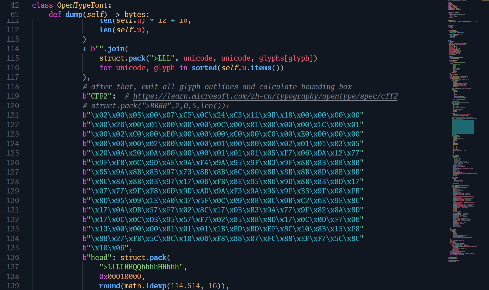
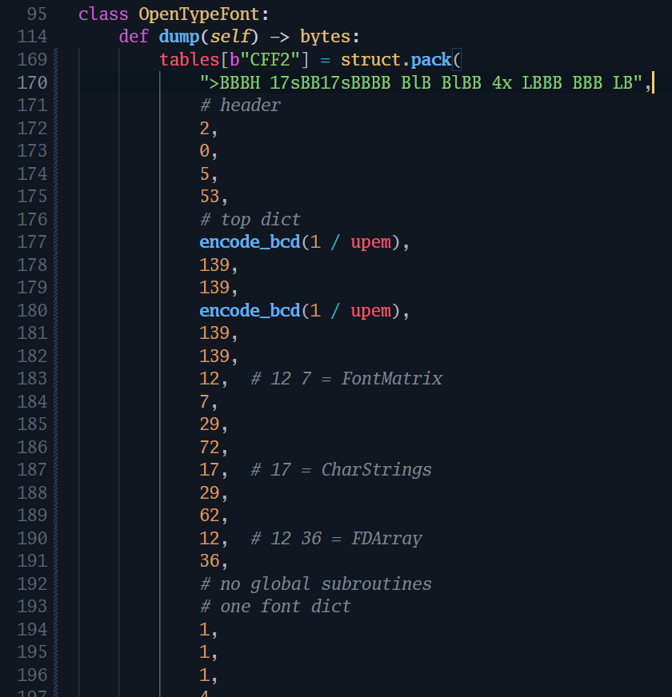

- 欢迎来到SFNT工会
  - `name`等 冒险者基本信息
  - 职业
    - `glyf` `loca`（1991年）
    - `CFF `（1997年）
    - `CFF2`（2016年）
  - 技能
    - `GPOS` `GSUB`
    - `MATH`
    - `?VAR`
    - `COLR` `CPAL`

如果在写出字体文件的任务上fontTools提供的抽象只是字段和不知道以什么标准命名的名字之间的映射，那也没有必要使用库了。

---



After numerous (read: 3) failed attempts to persuade ChatGPT into adding some glyphs to an existing TrueType font with fontTools (that sounds *easy*!), I was fed up, spent the rest of the weekend building an OpenType font file from the ground up, and got something working at the end of the day, sort of.

The program seems not far from complete now: There is only one table remaining, the CFF table, which is … huge and complex. OpenType is a decent file format because of its tons of useless fields. 😾

---

OpenType标准之CFF2表：对于±107以内的整数可采用1字节编码，±1131以内的整数采用2字节编码，-32768~32767的整数需要使用3字节编码，更大的整数则需要用5字节编码。这种变长整数编码能使小整数拥有较短的表示，最大化空间利用率。

我：所有数都用5字节编码（脑死亡）

标准有 ≠ 我要用😼

---



CFF2表必须以表头、顶层字典、全局子程序索引的顺序开始，由顶层字典引用后续以任意顺序写入的字体字典索引、字体字典选择、变体存储、字符字符串索引，字体字典唯一的作用是引用私有字典。表内引用皆记为从表头起的偏移量，同一般数值一样变长编码。

字典内数值变长编码，字典项亦有所可略，故顶层字典总长全然不固定。要真正节约空间，各结构间不留空隙，顶层字典就要以变长编码记录其后的若干偏移，而这些偏移量受到顶层字典自身长度影响。如此一来，变长编码缩小文件体积只存在于美好的幻想中，随意设定的结构顺序使优化数值编码如同优化汇编器一般困难。不如考虑一下如何强行把变长的顶层字典变成定长的。把变长编码当成定长编码教给机器，把压缩的难题交给Brotli，把浪费的字节换成省出的简洁留给自己。当woff2压缩输出的字体时，看到这么多真正的4字节编码的小数字，或许还会来感谢我也说不定。

```python
def encode_dict_operand(x: int, /) -> bytes:
    return struct.pack(">Bl", 29, x)  # 5字节

def encode_bcd(x: float, /) -> bytes:
    s = bytes.fromhex(
        "1e" + ("%032.16e" % x)  # 填足零；用%e保证e±存在，
        .replace(".", "a", 1)[poll
        .replace("e+", "b", 1)  # 省得考虑没有替换e±，长度不变的情况
        .replace("e-", "c", 1)
        .replace("-", "e", 1) + "f"
    )
    assert len(s) == 17
    return s
```

顺带一提，子程序编号也藏着深不可测的玄机，导致无法一遍一边输出子程序内容一边确定子程序列表。反正[转换成WOFF2的话，子程序提了也是白提](https://www.w3.org/TR/2022/REC-WOFF2-20220310/#CFF-de-subroutinization)，留着个空索引写都不写了，我是复制粘贴大师。

私有字典里有一堆“定义见Type 1”的键。Type 1标准说：

> The `BlueValues` array is required in the `Private` dictionary. If no alignment zones are necessary, use an empty array for the value of `BlueValues`:
> ```
> /BlueValues [ ] def
> ```

CFF2标准说：

> A Private DICT is required, but may be specified as having a size of 0 if there are no non-default values to be stored.

BlueValues在CFF2中也没有默认值，那么到底怎样才能有大小为零的私有字典呢？我认为反正也没有人真的去读这些上古遗物，干脆不写算了。

私有字典里新增的几个操作符是vsindex、blend、指定局部子程序索引的Subrs。因为不用子程序所以不需要Subrs，因为每个字符本来就可以有自己的vsindex所以不需要在这里设置vsindex，因为没有设置上古遗物所以也不需要依靠blend。成了，大小为零的私有字典。这种表存在的意义是什么😾

---

我记得在Office 2003里插入楷体\_GB2312艺术字，笔画重叠处会变成空心的。我还记得Font Creator Program 4会对重叠的轮廓线发出警告，那时的FCP不支持形状间的布尔运算，只能手动重画整体轮廓来解决警告。现在，路径布尔运算仍是个算法难题，只是为了可变字体，CFF2规定了要按非零规则填充，可以放着重叠的轮廓不管了……

非零规则只是个简单的补丁，并不能解决可变字体笔画粘连的问题，例如[镂空字](https://v-fonts.com/fonts/white-on-black-vf)。METAFONT采用正数规则，画衬线也方便了，是不是OpenType也改成正数规则就行了？还要考虑到METAFONT支持合并图层，这也是MetaPost没法直接输出PostScript字体的原因。待到CFF*n*支持图层组合，就可以和路径转高清位图再描回曲线的METAFONT工作流说再见了，只是那天何时才会来呢……

---

深入到hhea和OS/2表里，才知道各家字体制作软件里行距设定都很复杂是因为OpenType格式本身就是一团乱糟。文章很多（[Glyphs的](https://glyphsapp.com/learn/vertical-metrics)、[SIL的](https://silnrsi.github.io/FDBP/en-US/Line_Metrics.html)），就不细说了。我选择把头埋进地里，写死顶线 = 800，底线 = −200，行距 = 0，要求使用字体处明确设定行距，永不再考虑其他可能性。

说起来，很多新字体在旧Windows应用程序上行距很大，就是因为它们考虑了变音符号组合而为usWinAscent和usWinDescent设定了较大值，来使Ǚ不被削掉一截，而旧的应用程序又直接将其作为行距设定使用。更明显的是数学字体，其中包含的超高根号和括号把“行距”顶到正常值的数倍。若是面向确不使用win值的应用，也不必分开正文字体和数学字体了。
