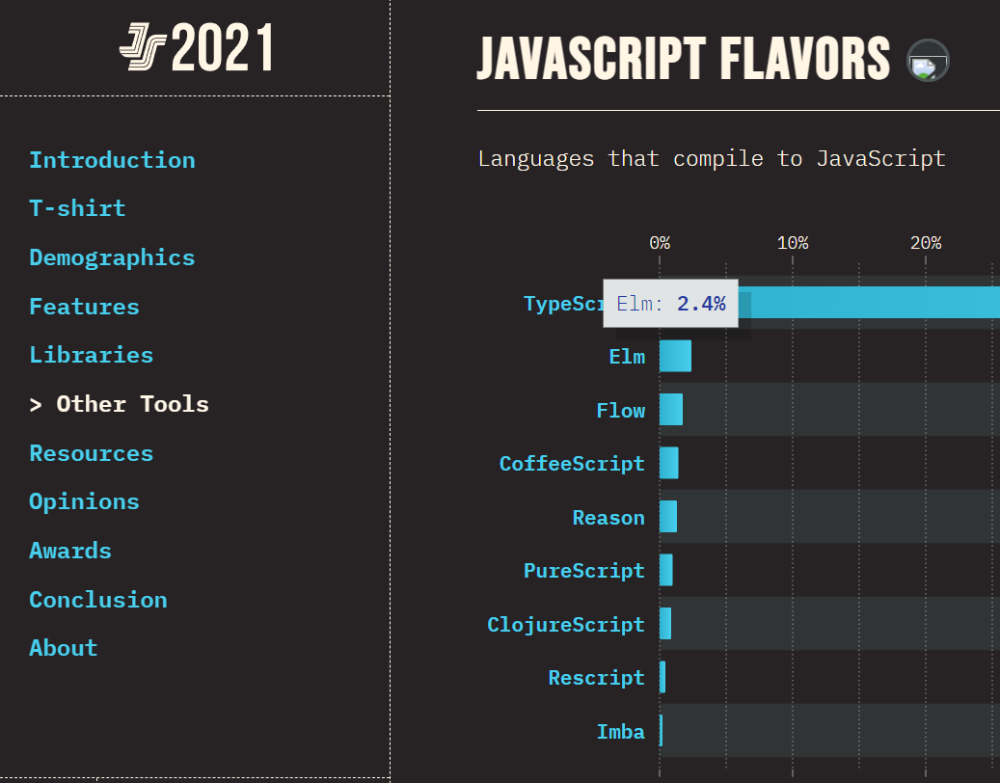
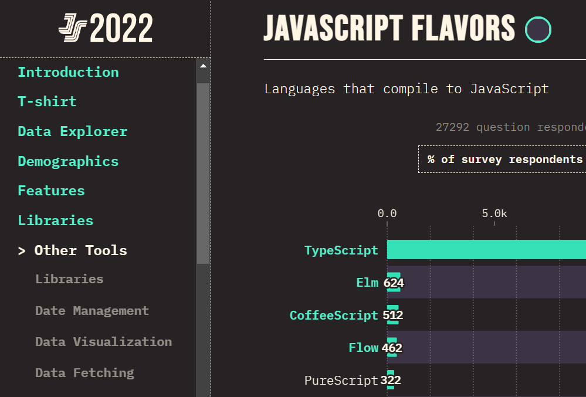

突然H属性大爆发（函数）的我第114次尝试入门Elm。

<i>插播一条说明：在英语中，elm是榆树的意思。</i>

Elm是编译到JavaScript的纯函数式语言。

JS作为新时代汇编，以JS为目标早已不是什么新鲜事。在早年:ruby:Ruby还是时代潮流、ES6尚未普及的时候，注重改善JS烂语法和语言特性的CoffeeScript赢得了不少青睐，不过现在浏览器已原生支持ES6，CoffeeScript也随之退出历史舞台。今天，编译到JS的语言或是还拥有编译到其他目标的能力以实现跨平台（例如Haxe和Nim），或是在拥抱JS的基础上注重改善语言工程可用性（例如为JS添加类型系统的TypeScript和Flow）。Elm的唯一编译目标是JS，它比仍期待推广并做到了的、提供渐进类型系统的TypeScript更加激进，完全废除变量，为Web平台带来了纯函数式编程。

State of JavaScript 2023网站不知道为什么寄了，所以这里看下2021和2022的数据：




无视TypeScript这个事实上已经完全与JS生态系统融为一体的方言的话，Elm已经稳坐几年“编译到JS系语言”的王位了。

神奇的是，虽然Elm最新版本凝固在了2019年10月发布的0.19.1，但在五年后的今天，仍不断有用户入坑（比如我）。这说明这门语言确实提供了其他方言和工具无法提供的特性：真纯函数，无畏重构。经常给科普博主饭吃的Brilliant内部绘图工具就是利用了Elm的纯函数特性保证绘图逻辑无副作用（参照Strange Loop 2022上的演讲[《Diagrammar: Simply Make Interactive Diagrams》](https://youtu.be/gT9Xu-ctNqI)）。

重构的自信确实需要通过抛弃可变性来实现最大化，但Elm的贯彻方式似乎并不是以推广为前提设计的。

TypeScript通过看似人畜无害的类型标注，让原来就是饿死也不会学一点类型理论的JS程序员掌握了主流语言中最强大的类型系统。TypeScript没有破坏JS原本的语法：不使用新语言特性的话，只需要滤去类型标注，就能透视到原本要执行的JS代码。这种完全兼容的渐进式的类型系统让JS程序员不需要完全舍弃已学会的语言另起炉灶，是很有效的教学方法。

另一方面，Elm的语法则取自ML系语言，和JS可以说是没有半毛钱关系；编译器更是以Haskell写成，未自举保持至今。这种与JS世界的割裂感让试图学习Elm的JS用户望而却步，或许正是造成Elm和TypeScript在榜上落差一大截的原因。这并不是说ML系语法不好，只是不适合JS的世界。

下一门编译到JS的函数式语言完全可以直接使用现成的JS语法，甚至保留命令式的外壳，甚至保留名称重绑定。基本上，只要禁止全局变量，禁止while和三段for，加上尾递归，JS又何尝不是一种纯函数式语言呢？JS用户本就熟悉函数式地处理列表的方法。在保留熟悉的语法的同时，又能获得更强的静态分析能力，与之带来的更强的优化能力，何乐而不为呢。

反过来，对于想要踏入Haskell世界的JS用户，使用Elm入门可能是个不错的选择……我瞎说的，没人拦着你不让你装GHC啊。

---

ML系语言语法主要指的应是不需要函数调用和参数分隔符号。在C系语言中，用两个参数x和y调用函数f写作`f(x, y)`（一般数学记法），但在ML系语言中写作`f x y`（λ演算记法）。

进一步调查后发现，相似度到此为止了。怎么其他元素全都不一样？

C系|Haskell|OCaml|F#|Elm
-|-|-|-|-
`f(x, y)`<br>`f(x)(y)`|`f x y`|`f x y`|`f x y`|`f x y`
`f(g(x))`|`f $ g x`<br>`x & g & f`|`f @@ g x`<br>`x \|> g \|> f`|`f <\| g x`<br>`x \|> g \|> f`|`f <\| g x`<br>`x \|> g \|> f`
`x ↦ y`|`\x -> y`|`fun x -> y`|`fun x -> y`|`\x -> y`
`x ↦ f(g(x))`|`f . g`<br>`g >>> f`\*|无|`f << g`<br>`g >> f`|`f << g`<br>`g >> f`
`x + y`（整数）|`x + y`|`x + y`|`x + y`|`x + y`
`x + y`（浮点数）|`x + y`|`x +. y`|`x + y`|`x + y`
`x + y`（字符串）|`x ++ y`|`x ^ y`|`x + y`|`x ++ y`
`x + y`（列表）|`x ++ y`|`x @ y`|`x @ y`|`x ++ y`
`[x] + y`|`x :: y`|`x :: y`|`x :: y`|`x :: y`
`x == y`|`x == y`|`x = y`（值）|`x = y`|`x == y`
`x != y`|`x /= y`|`x <> y`（值）|`x <> y`|`x /= y`
`x \|\| y`|`x \|\| y`|`x \|\| y`|`x \|\| y`|`x \|\| y`
`false`|`False`|`false`|`false`|`False`
`x << y`|`x << y`\*|`x lsl y`|`x <<< y`|`shiftLeftBy y x`\*

<div>* 需要导入标准库</div>

不像C系语言只能重载规定的若干运算符，ML系语言给予了运算符的定义极大的自由度：Haskell允许随便定义运算符优先级，OCaml和F#通过符号约定运算符类型……Elm在0.19版本中移除了自定义运算符的能力。

---

各语言的类型标注语法也不尽相同。以The Elm Architecture§Forms中的viewInput函数为例。这是一个接收四个参数、返回一个值的函数。TypeScript写法如下：

```ts
function viewInput<msg>(t: string, p: string, v: string, toMsg: (arg: string) => msg): Html<msg> {
  return input([type_(t), placeholder(p), value(v), onInput(toMsg)], [])
}
```

Elm的写法与Haskell相似。声明函数类型时，Elm使用一个冒号，Haskell使用两个冒号，除此之外语法完全一致。注意完全不需要声明msg是泛型参数，类型中出现的小写标识符会自动成为泛型参数。函数名必须在类型定义和实现中重复出现，因为这里的实现实际上是一条模式匹配。

```elm
viewInput : String -> String -> String -> (String -> msg) -> Html msg
viewInput t p v toMsg =
  input [ type_ t, placeholder p, value v, onInput toMsg ] []
```

由于类型定义模式匹配分支也被计入引用次数，Elm LSP认为一个未使用的函数有2次引用，一个仅用到一次的函数有3次引用。

OCaml和F#的类型标注语法相似，更像是主流语言的做法。同样不需要提前声明msg是泛型参数，但用单引号标注出来了。F#还支持用`<'msg>`明确写出泛型参数、用`Html<'msg>`表示`'msg Html`的C系语法。OCaml中类型名必须为小写。

```ocaml
let viewInput (t : string) (p : string) (v : string) (toMsg : string -> 'msg) : 'msg Html =
  input [ type_ t; placeholder p; value v; onInput toMsg ] []
```

---

喜闻乐见的ADT又在搞名称泄漏哦。ML系语言咋都这样啊？

在Rust中，可以随便命名分支而不会造成污染，因为分支名需要类型名限定。

```rust
#[derive(Debug)]
enum User {
    Regular(String, i32),
    Visitor(String),
    Anonymous,
}

fn main() {
    println!("{:?}", User::Visitor(String::from("username")));
    // 不加“User::”是不行的
}
```

ML系语言都不需要类型名限定，直接使用分支名。

```elm
-- Elm语法
type User               -- Haskell：data User
  = Regular String Int  -- OCaml和F#：Regular of string * int
  | Visitor String
  | Anonymous

main = Visitor "username"
-- 没有什么User.Visitor的写法
```

哦，我想起来有两个C系语言也不需要类型名限定，猜猜是谁？哈哈，是C和C++。C++还能用别的命名空间包一层，但C没有命名空间，搞得C用户都不想用enum了。

---

Elm疑似有一些夸大宣传，如同JS生态里的一切。

Elm号称可以消去运行时错误。连类型系统极为严格的Rust和Haskell都不敢这么说！这应当是JS自古以来从未有过一丁点编译器类型检查导致的。

Elm架构“似乎会自然浮现”，“虽然没有提前规划，但是最终写出架构良好的代码，属实有点诡异”，因为模型传来传去是在纯函数式语言里模拟变量，虚拟DOM是将DOM元素视作数据的结果，消息是在纯函数式语言里唯一的响应事件的方式。所谓架构就是没有架构，根本就只能这么写。

---

Elm的指南里感叹句浓度太高了，感觉莫名其妙地被狂吼。

在Elm中，不应该像React和Vue那样编写组件。整个页面只能由一个传统意义上的组件构成，但可以自己编写函数抽象可重用的部分。如果需要纯界面组件，就抽象出渲染函数。如果需要具有状态的组件，就抽象出它的模型类型、渲染函数、更新函数，然后将这些函数散装地提供给外部使用。组件使用者必须手动将这些部分安排到自己的模型、视图、更新函数中。如果需要能主动发出请求、读取外部数据，或有其他副作用的组件，就抽象出它的模型类型、渲染函数、更新函数和订阅函数，组件使用者必须手动将这些部分安排到自己的……我隐约感觉这种做法是将函数式强行套用在并不适合的场景上。

Html.Lazy提供了传统意义上的组件分界面，用于跳过模型未变化的部分的渲染和比较。Html.Keyed提供了指定虚拟DOM的比较键的能力。包括这些功能在内，虚拟DOM的实际实现皆在Elm JS运行时中，而非用Elm实现。这应是为性能考虑，但也表明无法用Elm实现这些功能。例如，Elm没有比较引用相等的方法，就无法以相同的性能实现Html.Lazy。

某些Elm官方库具有定义自定义运算符的特权，即相同的代码在Elm官方库中可以运行，但在用户代码中就不行。例如，Url.Parser提供了`</>`和`<?>`运算符，其定义语句在用户和第三方库代码中会报错。也就是说，第三方库无法实现和官方库一致的使用语法。

```elm
infix right 7 (</>) = slash
infix left 8 (<?>) = questionMark
```

Task相当于JS中的Promise，但与Haskell IO不同，Task通过perform或attempt转换为一个Cmd，再由Elm运行时处理。这块来回的流程看不明白，感觉有点奇怪。

---

Elm FAQ中解释了[Cmd和Task的区别](https://faq.elm-community.org/#what-is-the-difference-between-cmd-and-task)：Task支持andThen函数（等于JS Promise的then方法），从而顺序执行多个任务；Task能单向转换成Cmd，只有Cmd能被真正执行；Cmd通过在主循环（更新函数）中处理也能接续执行其他Cmd（包括转换自Task的Cmd）。没有统一疑似历史遗留。

目前Elm仍缺少创建命令行程序的能力，仿佛一切都是为了创建网页应用而设计的。非惰性求值的纯函数理应能被命令式的JS方便地直接调用，但Elm也不支持。考虑到编译器仓库已多年没有任何提交，在可见的未来内也不会有什么动静。这就比较寄了。
