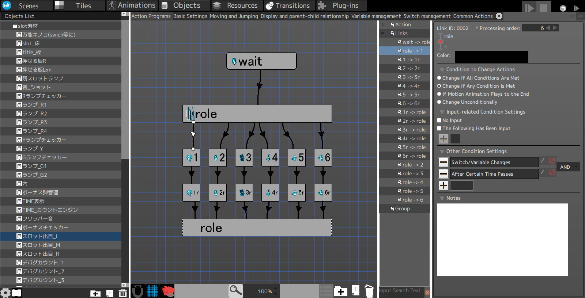

以RPG Maker系列闻名的ツクール系列游戏制作软件看起来是由原Enterbrain公司转到角川旗下公司Gotcha Gotcha Games了。与十多年前Enterbrain出品的软件アクションゲームツクール译名同名、设定为继承作的Action Game Maker现在出现在了Steam商店。

<iframe src="https://store.steampowered.com/widget/2987180/" width="646" height="190"></iframe>

与几十年不变界面的RPG Maker相比，这边的变化大得多：以前是Flash的时代，后来重命名为Pixel Game Maker，而现在的它基于Godot引擎。

制作方在通讯中明确表示，Action Game Maker就是个Godot编辑器的魔改版，兼容Godot插件，会阉割掉整套3D功能，但增加了可视化脚本，但可视化脚本只能用于Action Game Maker特有的节点。

Godot于4.0版本中删除了可视化脚本语言VisualScript，主要原因是使用率低，用起来也不方便。[据Godot开发人员描述](https://godotengine.org/article/godot-4-will-discontinue-visual-scripting/)，许多原本想使用可视化脚本的用户尝试后发现传统编程语言GDScript学起来也并不困难，要好过其他主流引擎脚本的编写体验。而可视化脚本因为缺乏高阶抽象能力，引擎本身的抽象层次也低，使用起来很繁琐，还缺少足够的文档支持。

我对Godot移除可视化脚本感到十分遗憾，但这是Godot团队不得不作出的决定。我完全不是对学习新语言感到畏惧，而是相中可视化脚本带来的额外效益。Godot的编辑器很好用，比如它有完整的属性面板自动生成能力，在移动文件时自动更新场景资源引用，瞬时的响应速度……但一到传统敲键盘编程的阶段，这一切都没有了。因为类型推断残缺而没有工具提示无法直达文档，默认设置下需要等待才会弹出自动补全，最基本的重命名重构能力几乎为零……这些事项在可视化编辑器中是无法被容忍的，传统编程语言却认为这些都能接受。

合理猜测，Action Game Maker会提供更高阶的游戏部件，以简化脚本的编写，从而提升可视化脚本的可用性。这也是Maker系列一直以来核心的卖点，即不需要非常专业的技能（敲键盘编程）也能做出自己想象中的游戏。但我也担心这种基于完整的引擎魔改的做法是否会因为制作方对原本的引擎不够熟悉，或本就没想要完全融入而不能有机结合，这会对用户造成困扰。

---

Action Game Maker目前共有三个版本：

年份|日文名|英文名|编辑器|游戏引擎|游戏逻辑
-|-|-|-|-|-
2009|アクションゲームツクール|无|.NET|多种|状态机
2019|アクションゲームツクールMV|[Pixel Game Maker MV](https://store.steampowered.com/app/837510/)|Qt|Electron + JavaScript|节点图可视化编程
未发售|ACTION GAME MAKER|[ACTION GAME MAKER](https://store.steampowered.com/app/2987180/)|Godot|Godot|节点图可视化编程、GDScript等

MV版和初版在界面布置上区别并不太大，实际上仍为状态机编程，只是增加了状态机流转可视化。但这个界面美工实在是一言难尽。

能想象吗？这居然是一个2019年售价￥286 CNY的软件的界面截图？

再引用几段MV版的商店介绍的中文翻译：

> 大家可以使用来自世界各地用户的材料啊！

> 『像素游戏制作大师』从初学者到专业开发者，皆适合任何人士制作正宗的2D游戏。

什么是不正宗的2D游戏？是我想的那种吗？可是经常有用RPG Maker做的“那种”游戏……

我很少能用“好笑”来形容一个软件🤣

从目前ACTION GAME MAKER放出的截图来看，其可视化编程可能也是基于状态机流转的，而界面则沿用了Godot引擎原先的VisualScript语言。
