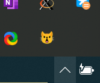
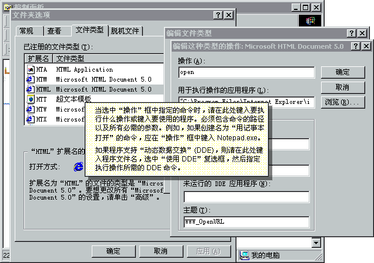

单文件网页应用的式微若是权限收紧的必然牺牲，我将反过来敞开信任的大门，回归大群宣告昔日个人计算的本征。

---

file:///协议不能fetch，同源问题又给予其重创。无需构建的纯静态网站也要启动localhost服务器已成为前端开发的常识。因为简单的服务器是最容易编写的实用程序，现成的静态服务器应有尽有。

但它们有一个通病：操作麻烦。命令行工具也好，图形界面工具也好，都需要为每个项目手动指定根目录，然后启动。能不能更自然些呢？



我写了个开机自动启动、可在托盘区观察状态的本地Flask服务器，开放端点`/c/:path`，把整个硬盘暴露在localhost上了。双击HTML文件，然后把地址栏中的`file:///C:/`替换为`localhost:1546/c/`，就能启用受限的Web平台功能。

```python
from flask import Flask, send_from_directory

app = Flask(__name__)

@app.route("/c/<path:path>")
def serve_c(path):
    return send_from_directory("C:\\", path)
```

安全管理员应该已经昏厥了，不过其实没有那么危险。本机应用程序本就可以肆无忌惮地读写磁盘。我把服务器监听限制在`::1`，因此网络上的其他计算机不能访问这个端点。

不过，这会导致打开的不同页面共享localStorage等存储，带来串扰。一般解决方案是给每个根目录分配不同的端口号，但动态端口号对浏览器历史记录不太友好。我想到，服务器其实可以区分访问时使用的子域名（利用IP通用性访问同源站点）。

形如`*.localhost`的域名不必配置就会解析到本机，可以为不同的根目录分配可预测的子域名，共用一个端口也不会互相干扰。

```python
app = Flask(__name__, subdomain_matching=True)
app.config["SERVER_NAME"] = "localhost:1546"

subdomains = {"apps": "D:\\AppStore", "code": "D:\\Code"}
@app.route("/<path:path>", subdomain="<subdomain>")
def serve_dir(subdomain, path):
    return send_from_directory(subdomains[subdomain], path)
```

子域名可以根据文件名自动化生成。

```python
import re
def slugify(x: str) -> str:
    return re.sub(r"-+", "-",
        re.sub(r"[^A-Za-z0-9]", "-", x).strip("-").lower())
```

打开HTML文件时，如果其所在目录不是一个已知的根目录，就为其分配新的子域名。

```python
import os
import urllib.parse
def visit(path: str) -> str:
    dirname, filename = os.path.split(path)
    subdomain = slugify(os.path.basename(dirname))
    while dirname != subdomains.get(subdomain) != None:
        subdomain += "-copy"  # - 副本 - 副本 - 副本
    subdomains[subdomain] = dirname
    return f"http://{subdomain}.localhost:1546/{urllib.parse.quote(filename)}"
```

由于打开的文件与访问的URL具有复杂关系，需要设置用服务器脚本打开HTML文件，将与服务器间的通信过程注入到HTML文件关联中。修改文件关联本是点点鼠标的事……

<!---->

但Windows 10阉割了自定义打开方式的对话框。如果能方便地创建stub EXE的话就好了，可惜我没装编译工具链。采用直接修改注册表的方法，需要修改下列值。

- HKCR\\Applications\\⟨应用名称⟩\\shell\\open\\command\\(默认) = `"C:\Windows\pyw.exe" "⟨脚本路径⟩" "%1"`
- HKCR\\Applications\\⟨应用名称⟩\\DefaultIcon\\(默认)
- HKCU\\Software\\Microsoft\\Windows\\CurrentVersion\\Explorer\\FileExts\\.html\\OpenWithList

然后手动操作一次，选择始终用这个应用打开。

我在[Windows 98图标集](https://win98icons.alexmeub.com/)里选取了web_file.ico  作为HTML文件的新图标。唉，这个压缩包里面怎么还有.DS_Store啊？真是绷不住了 😾

通过双击打开文件被调用时，会在`sys.argv`中收到文件路径。在主程序中，通过远程过程调用，使服务器进程分配子域名并要求浏览器打开页面对应的地址。

```python
import webbrowser
@app.route("/open")
def open_subdomain():
    webbrowser.open(visit(request.args.get("path")))
    return ""

if len(sys.argv) > 1:
    import requests
    requests.get("http://localhost:1546/open", {"path": sys.argv[1]})
else:
    app.run(host="::1", port=1546)
```

buildless的站点现已加入serverless（dev-serverless？）。或许本就该是如此。

完整脚本可[在GitHub上查看](https://github.com/satgo1546/dot-product/blob/ebcc9e2a938d784798ec1aadfbb2d3ff35ff55b2/pystray/startup.py)。
