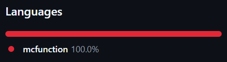
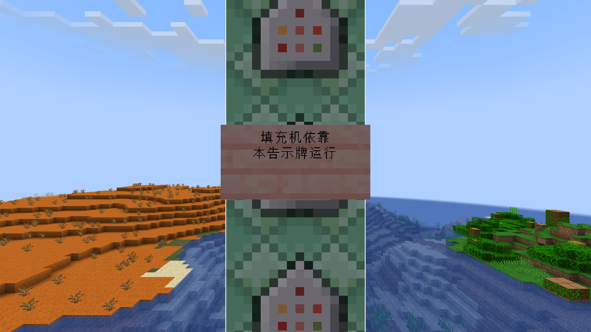
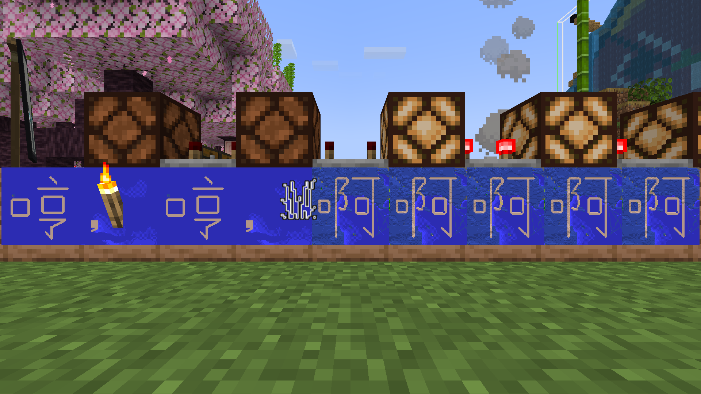

自从Minecraft 1.8弃用方块数值ID，换为带命名空间的标识符，我发觉这种命令编程化的势头很不妙，就退坑没再玩了。十年过去了。最近朋友开了个1.21.4版本的创造服务器，允许使用命令方块。趁此机会，我倒要看看Mojang把命令接口搞成什么鬼样子了。

广为玩家熟知的命令都保持了兼容性。Mojang说不定很想删除`/tp`和`/xp`，强制改为`/teleport`和`/experience`，但改不得。

面向地图制作者的命令，乃至自定义地图的制作流程则被毫不向后兼容地全盘修订。1.13（17w45a）几乎重构了整个命令系统，并首次将命令解析器开源；通过定义更合理的数据类型，原先想到哪加到哪的命令被整合、参数数量减少、泛用程度增加；同时期（17w48a）数据包的出现，为自定义地图增添了大量JSON可配置项的同时，函数的打包还使命令变得模块化、可复用……

这些词汇真的应该是用来描述一个游戏的吗？这和编程有什么区别？

在Minecraft中编程（不装了），一大把的问题来自语言能力不完善、标准库不够正交、接口设计不合理、开发体验欠打磨。

## 盼了十年的插值

建造大型建筑时，经常需要大面积填充同种方块。服务器上没有安装WorldEdit插件，所以只好用`/fill`命令。这个命令语法如下：

```sh
fill ⟨x₀⟩ ⟨y₀⟩ ⟨z₀⟩ ⟨x₁⟩ ⟨y₁⟩ ⟨z₁⟩ ⟨目标方块⟩

# 使用例：将(1, 1, -4)到(5, 1, -4)的5个方块填充为草
fill 1 1 -4 5 1 -4 grass_block
```

原版`/fill`和`/clone`虽然无需插件和mod，但只能通过输入坐标的方式使用，不能可视化地指定角点，是长久以来的痛点。结构方块的出现让复制粘贴变得稍微方便了一些，但还是避免不了手动确定XYZ轴向；要无中生有地填充，就完全没法可视化。

十年前，我就在想，能不能通过命令弥补这个不便。比如，在两角落放两个生物标记坐标，总比在命令输入框对着三个数抓瞎要好。但失败了。当时虽然已经有`/fill`命令，但命令不支持动态插值。虽然实体方便了坐标选取，但无法将这些值用在命令中。

如果不能动态插值，也就是不能动态生成命令的话，可以通过实体循环遍历区域中的每个方块来间接达到填充的效果。但要如何指定目标方块呢？这是个有数百种可能性的枚举型参数。我能想到的就是为每种可能的枚举值都写一条命令，听上去就很麻烦，也不能适应将来的变化。

十年后的今天，命令已经支持插值了（1.20.2新增）——

```
# 定义：开头的$表示本行中的$(…)需要发生字符串替换
$fill $(from_x) $(from_y) $(from_z) $(to_x) $(to_y) $(to_z) $(block)

# 调用
function mypack:fill {from_x:1,from_y:1,from_z:4,to_x:5,to_y:1,to_z:4,block:"minecraft:air"}
```

——但只有函数支持插值。目前函数必须定义在数据包中，没有仅通过命令定义函数的方法。似曾相识吗？是时候向Minecraft加入匿名函数了。

朋友的服务器因为建立在托管平台上，不能上传自定义数据包。即使可以，数据包的反馈循环周期太长，也会大幅降低乐趣。

阅览新增命令的文档时，我发现`/data`命令除了常规的修改世界数据，还可以切割字符串（1.19.4新增）。我突然想到：插值的本质是字符串拼接。把拼接后的字符串送入命令方块，也能动态执行命令。但`/data`命令只能切割字符串、向列表插入元素，不能拼接字符串。

通过搜索“如何在Minecraft中拼接字符串”（？），我在GitHub上找到了一系列字符串实用函数库（？？）。



[McTsts/Minecraft-String-Utilities](https://github.com/McTsts/Minecraft-String-Utilities)罗列了很多字符串操作的奇技淫巧。这个仓库的核心目标是实现`.split('')`，但其中也记载了拼接字符串的原理。

经过一番尝试，我得到了拼接字符串的一般步骤：

1. 在一块告示牌上用JSON富文本对象拼接字符串。
   - 因为告示牌上的文本一旦设置，就会计算其中的变量值并写回世界，而其他方式（例如实体名和书的内容）不能自动计算值，所以此步骤必须使用告示牌。
2. 将告示牌上的文字复制到一个非生物的实体的名称上。
    - 实体名称是富文本。
3. 用命令方块尝试给实体手持装备附魔。
    - 会失败，报错“×××不是此命令的有效实体”。
    - 一般命令的报错信息也是富文本，全游戏只有这一处报错信息会将富文本的实体名称转换为纯文本。
    - 命令方块会把报错信息写入方块数据。
4. 从上一步的报错信息中切出实体名。
    - 报错信息是富文本，但格式固定，实验得到偏移量`106 -21`后写死即可。
    - 因为报错信息是JSON富文本对象，切出的子字符串中，反斜杠、双引号、换行符会被转义，但根据用例，这一般不是什么大问题。

富文本对象中的字符串可以有各种来源，这就方便了。

除了上述抽象且变态的操作，还有一些小hack：

- 虽然刷怪蛋有标明生物类型，但是其实可以用来刷别的东西。
- 盔甲架自引入起就很受地图作者的欢迎，因为不像其他静态实体只能挂在墙上，盔甲架可以自由出现在任何地方。
    - 在更早期的版本中，倾向使用鱿鱼，因为它们在陆地上不能移动，也没有叫声。
    - 虽然现在有专用于标记的实体，但它不能被徒手攻击，生成后很难手动清理。
- `/help me`具有和shell脚本中`true`一样的作用（总是成功）。
- `/fill`命令要求参数必须为整数，而直接插值得到的是带`.0d`后缀的浮点数。类型转换的方法是借助只能保存32位整数的计分板。

通过这一大坨hack，我终于如愿以偿地在原版Minecraft中用上了可视化的矩形填充。

<!----><video src="demo.mp4" controls></video>

```sh
# 执行这个命令，以获得生成顶点实体的方法
give @p trader_llama_spawn_egg[rarity=epic,custom_name='"顶点"',entity_data={id:"minecraft:armor_stand",NoGravity:1b,Small:1b,CustomNameVisible:1b,Tags:["fillEnd"]}] 2

# 从下往上放置一列命令方块
# 在这列命令方块附近放置物品展示框，在其中放置填充目标方块
# 循环，不受制约，保持开启
execute at @n[tag=fillEnd] if entity @n[tag=fillEnd,distance=0.01..256] run help me
# 连锁，条件制约，保持开启
setblock ~ ~1 ~ redstone_block
me 本方块在执行时会被替换
# 脉冲，不受制约，红石控制
setblock ~ ~-1 ~ cherry_planks
# 连锁，不受制约，保持开启，下同
scoreboard objectives add x dummy
scoreboard objectives add y dummy
scoreboard objectives add z dummy
execute as @e[tag=fillEnd] store result score @s x run data get entity @s Pos[0]
execute as @e[tag=fillEnd] store result score @s y run data get entity @s Pos[1]
execute as @e[tag=fillEnd] store result score @s z run data get entity @s Pos[2]
setblock ~1 ~1 ~ cherry_wall_sign[facing=east]
data modify block ~1 ~ ~ front_text.messages[3] set value '["fill ",{"score":{"name":"@n[tag=fillEnd]","objective":"x"}}," ",{"score":{"name":"@n[tag=fillEnd]","objective":"y"}}," ",{"score":{"name":"@n[tag=fillEnd]","objective":"z"}}," ",{"score":{"name":"@e[tag=fillEnd,sort=furthest,limit=1]","objective":"x"}}," ",{"score":{"name":"@e[tag=fillEnd,sort=furthest,limit=1]","objective":"y"}}," ",{"score":{"name":"@e[tag=fillEnd,sort=furthest,limit=1]","objective":"z"}}," ",{"nbt":"Item.id","entity":"@n[type=item_frame]"}," keep"]'
execute unless entity @e[tag=concatenator] summon marker run tag @s add concatenator
data modify entity @n[tag=concatenator] CustomName set from block ~1 ~-2 ~ front_text.messages[3]
enchant @n[tag=concatenator] lure
data modify block ~ ~1 ~ Command set string block ~ ~-1 ~ LastOutput 106 -21
me 本命令方块用于占位，执行时内容会被改写
kill @e[tag=fillEnd]
```

<figure>

<figcaption>“填充机依靠本告示牌运行”<figcaption>
</figure>

<figure>

<figcaption>大型建筑：指在地图上写字。一幅地图画需要128×128方块，手工建造太累人了<figcaption>
</figure>

遗憾的是，在即将发布的1.21.5版本中，富文本的存储格式又发生了破坏性的变更，不过应该不会对思路有很大影响。

## 打游戏跟上班似的

Minecraft明明不是编程游戏，其编程化程度却在不断加深，当今编程的种种不良状况也在逐渐流入。

### 英语资源名阻碍非英语玩家<br>英语标识符阻碍非英语用户

最初推行数字ID换为字符串标识符时，许多中文玩家表达的不满是，原本只需要输入4就能表示的圆石，现在要输入cobblestone这么长一串单词。对于非英语玩家，记住这些单词往往比记住数字ID还要困难。英语作为通用语言，接口设计者可能不自觉地就把非英语用户排除在外了。

### 数据包的高门槛分裂玩家和地图作者<br>写代码的高门槛分裂用户和开发人员

游戏元素为什么不能在游戏内操作？不仅是函数，许多其他可在命令中调用的元素都不能在游戏内创造，只能通过外部编辑器在数据包中创建。在有能力操作文件系统的用户越来越稀有的今天，这导致相关功能得不到使用，也得不到有效的测试。

在图形界面已经学会且很容易完成的操作，为什么自动化就需要在一些完全不同的文档中查阅一套完全不同的操作方式？自动化的成本已高过手动处理，不是人类使用电脑，而是电脑控制人类。

### 命令格式破坏性变更需要额外的适应时间<br>程序接口不向后兼容需要额外的迁移工作

玩法的变化能在实践中慢慢适应，命令不能如期运行而报错总是立刻令人沮丧。版本升级不只是照着迁移指南做这么简单，更不用说Minecraft连迁移指南都没有。即使提供自动化迁移工具，也不应忽视其他方面的成本。

频繁的破坏性变更会导致新人难以融入进来。Minecraft wiki只记载了全面的参考资料，并不负责指导什么情况该用什么命令，也没有常见需求的示例。这些确实是社区教程负责的部分，但接连不断的破坏性变更使教程很快过期。

虽然看起来Minecraft采用语义化版本号（？），但事实上2.0版本被一次愚人节更新占据，Minecraft永远不会在正式版本中升级到2.0；修订版本也经常包含破坏性更新。

### 堆砌本用于交互执行的命令不能产生脚本语言

Minecraft命令最初只能交互式执行，与shell相似的背景引向了相似的不归路。

交互式执行时，语法越容易输入越好，因此字符串无需引号，参数用空格分隔，命令名和参数名十分简短。

```sh
/seed
pwd

/tp 1 1 -4
cd /tmp

/say @e[type=bat]
echo *.bat
```

但将命令保存下来以备批处理时，性质就变了：语法的目标从易写转向了易读；交互时可以人工控制，但连续自动执行就需要一定程度的自动控制。这些目标与交互执行是矛盾的。

```sh
/execute if entity @e[name=jeb_] run say Rainbow sheep!
[ -d .git ] && echo Version control!
```

把交互执行的一套语言设计搬到批处理程序上，看似减轻了学习新语法的负担，实则基础不牢，结果成为用户敌对型软件。
