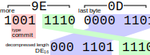
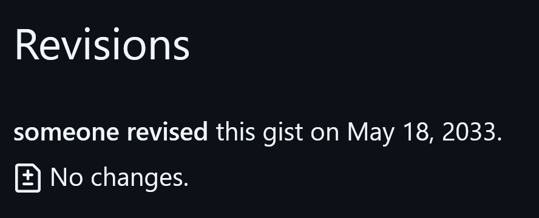

[上回](/archives/693/)实现了不克隆修改远端分支指向。用同样的代码也能创建和删除分支和轻量标签。这些操作不需要创建新对象，也不需要读取已有对象内容，传输空的pack就能完成。

要想修改仓库内容就需要创建新对象。任何非平凡的仓库都有提交（commit）、文件树（tree）、文件内容（blob）三类对象，此外还有附注标签对象（tag）。[Pro Git § 10.2 Git Objects](https://git-scm.com/book/en/v2/Git-Internals-Git-Objects)深入浅出地介绍了对象的概念、磁盘上的存储格式、散列值的计算方法，关于这些话题的详细信息请参照书中讲解。

```ts
type GitObject = {
	type: 'commit' | 'tree' | 'blob' | 'tag',
	data: string | Uint8Array,
}
```

本次目标是在不下载任何文件内容（甚至不知道仓库中任何文件名）的情况下，向远端推送一个空提交。“空”的含义与`git commit --allow-empty`命令中的empty相同，也就是不修改任何文件的提交。

既然不修改文件，就可复用上一提交引用的文件树，所以这个操作总共只需创建并推送一个提交对象。

## `git clone --bare`

先来看看git命令行的表现：结论是，很难抑制git命令行下载额外文件的冲动。GitHub博文[Get up to speed with partial clone and shallow clone](https://github.blog/open-source/git/get-up-to-speed-with-partial-clone-and-shallow-clone/)中介绍的应对大型仓库的方法，无论是浅层克隆（`git clone --depth=1`）还是无树克隆（`git clone --filter=tree:0`），都保留当前工作树，仍需下载工作树中所有文件。在无历史文件树的仓库中，每走一步就会请求一次远端，以补齐缺失的文件——无树不像是一种优化，更像是一种负债。

`git clone --bare`结合`--depth`和`--filter`参数，确实能做到只下载提交对象而不下载文件树和文件了，但得到的仓库也相应地没装陶瓷外壳，只剩马桶搋子可用。

```console
$ git clone --bare --depth=1 --filter=tree:0 https://gist.github.com/008e50722174267a95bd6c033c4c5d3d.git b
Cloning into bare repository 'b'...
remote: Enumerating objects: 1, done.
remote: Counting objects: 100% (1/1), done.
remote: Total 1 (delta 0), reused 1 (delta 0), pack-reused 0 (from 0)
Receiving objects: 100% (1/1), done.
$ cd b
$ git rev-parse HEAD
f9e7acd46c5a03e19d8c23379f66bdd29d2448d7
$ git cat-file -p HEAD
tree ad382a30f5f3f330b85f2e719f42e976f1779afc
…
$ echo '未来的提交' | GIT_AUTHOR_DATE=2033-05-18T03:33:20Z GIT_COMMITTER_DATE=2033-05-18T03:33:20Z git -c user.name=someone -c user.email=someone@example.com commit-tree ad382a3 -p f9e7acd
remote: Enumerating objects: 1, done.
remote: Counting objects: 100% (1/1), done.
remote: Total 1 (delta 0), reused 0 (delta 0), pack-reused 0 (from 0)
Receiving objects: 100% (1/1), 79 bytes | 79.00 KiB/s, done.
209ffbc589f3afa43ae98a5b7ceb40a970bdd19f
$ git update-ref refs/heads/main 209ffbc
$ git push
```

……而且就连马桶搋子也会下载文件树。

那行特别长的恐怖命令是在创建提交对象。执行命令前，仓库中只有一个提交对象，没有文件树对象。执行命令时，git发现指定的文件树对象在仓库中不存在，就去远端获取，随后将完整文件树对象保存到本地仓库中。

虽然创建提交并不需要文件树的内容，只需要散列，但即使在命令行中完整提供40位散列，也不能打消git连接远端的念头。

## `git commit-tree`

命令中列出了提交对象中的全部要素，不过必要参数只有文件树的散列值和上一提交的散列值。作者和日期通常会根据配置自动填写，而提交消息可以为空。

产生的提交对象如下。对象格式是纯文本，没有`\0`作祟，用字符串插值就能构造出来。这里暂且将所有提交信息都写死。

```
tree ad382a30f5f3f330b85f2e719f42e976f1779afc
parent f9e7acd46c5a03e19d8c23379f66bdd29d2448d7
author someone <someone@example.com> 2000000000 +0000
committer someone <someone@example.com> 2000000000 +0000

未来的提交
```

为了只凭散列值就能区分对象类型，散列不仅涵盖对象内容，还覆盖了一个可变长度的头。变长的原因是其中有无意义十进制数字 😾

```ts
const hashObject = async ({ type, data }: GitObject) => {
	const raw = typeof data === 'string' ? new TextEncoder().encode(data) : data
	const header = `${type} ${raw.length}\0` // ASCII only
	const buffer = new Uint8Array(header.length + raw.length)
	new TextEncoder().encodeInto(header, buffer)
	buffer.set(raw, header.length)
	return new Uint8Array(await crypto.subtle.digest('SHA-1', buffer)).toHex()
}

const commit: GitObject = {type: 'commit', data:
`tree ad382a30f5f3f330b85f2e719f42e976f1779afc
parent f9e7acd46c5a03e19d8c23379f66bdd29d2448d7
author someone <someone@example.com> 2000000000 +0000
committer someone <someone@example.com> 2000000000 +0000

未来的提交
`}
console.log(await hashObject(commit))
// ⇒ 209ffbc589f3afa43ae98a5b7ceb40a970bdd19f
```

这就做完了git commit-tree执意连接远端才完成的任务。

## `git pack-objects`

要上传对象到远端，需要将对象打包成pack，携带在POST请求中。

git提供了打包命令`git pack-objects`，可将指定的对象打包为pack文件。

```console
$ echo 209ffbc589f3afa43ae98a5b7ceb40a970bdd19f | git pack-objects p
Enumerating objects: 1, done.
Counting objects: 100% (1/1), done.
97184f253a5d57dbf566563c0e29d4bc061f1a4f
Writing objects: 100% (1/1), done.
Total 1 (delta 0), reused 0 (delta 0), pack-reused 0 (from 0)
$ xxd p-97184f2*.pack
00000000: 5041 434b 0000 0002 0000 0001 9e0d 789c  PACK..........x.
…
```

上回已经介绍了pack头尾。头尾之间的对象连续存储。每个对象由变长的type–length头和zlib流构成。类型–长度按ULEB128编码，但是二进制3位类型插在长度第3和第4位之间，长度还是解压后长度，数据流长度要靠zlib解析。神人编码 😾



为了省那么几个字节——省了吗？如省——要多写十行代码。

```ts
const pack = async (objects: GitObject[]) => {
	const body = await new Blob([
		new Uint8Array([
			0x50, 0x41, 0x43, 0x4b, 0, 0, 0, 2,
			objects.length >> 24, objects.length >> 16, objects.length >> 8, objects.length,
		]),
		...await Promise.all(objects.flatMap(({ type, data }) => {
			const raw = typeof data === 'string' ? new TextEncoder().encode(data) : data
			const typeLengthBytes = [
				{ commit: 0x10, tree: 0x20, blob: 0x30, tag: 0x40 }[type]
				| raw.length & 0xf
			]
			for (let l = raw.length >> 4; l; l >>= 7) {
				typeLengthBytes[typeLengthBytes.length - 1] |= 0x80
				typeLengthBytes.push(l & 0x7f)
			}
			return [
				new Uint8Array(typeLengthBytes),
				new Response(new Response(raw).body.pipeThrough(new CompressionStream('deflate'))).arrayBuffer(),
			]
		}))
	]).arrayBuffer()
	return await new Blob([body, await crypto.subtle.digest('SHA-1', body)]).arrayBuffer()
}
```

又见CompressionStream 😾 虽然HTTP下载支持先进且透明的压缩，但HTTP上传以及Git支持的其他协议都无此能力，所以pack文件的压缩仍有必要。

pack中不记载对象散列值，由服务器接收后自行计算。但为了在请求中指定修改后的分支指向，客户端仍需计算散列值。

```ts
fetch('https://gist.github.com/008e50722174267a95bd6c033c4c5d3d.git/git-receive-pack', {
	…, // method、headers同上回
	body: new Blob([
		pktLine(`5e5eda9c6e9897844aa0e56f40c9423ff95386ce ${await hashObject(commit)} refs/heads/main\0 report-status-v2\n`),
		new Uint8Array([0x30, 0x30, 0x30, 0x30]),
		await pack([
			commit,
		]),
	]),
})
```

端点返回下列成功响应。这个请求完成了一次推送操作，在main分支上追加了一个没有文件变化的空提交。

```
000eunpack ok
0017ok refs/heads/main
00000000
```


