什么是按钮？

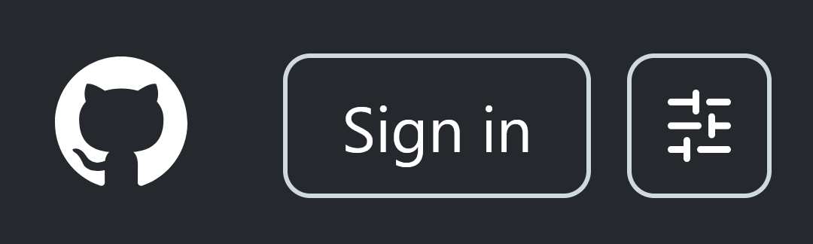
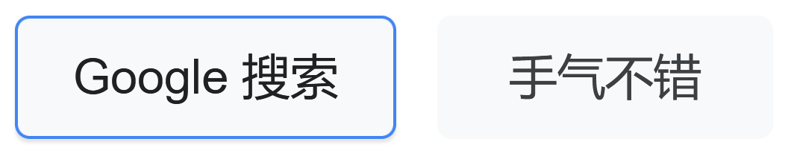
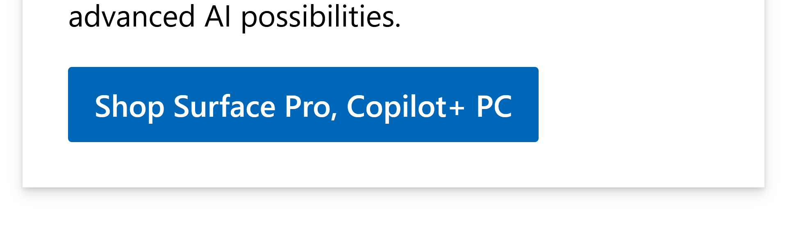
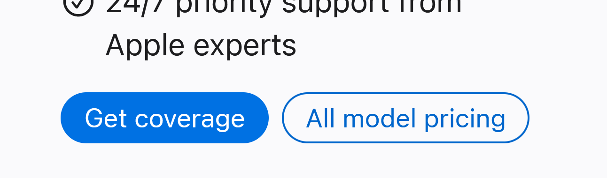

众所周知，按钮可以没有填充，可以没有描边，可以没有阴影，可以按不下去，但不能没有圆角！

border-radius将网页工程师从繁琐的切图中解放，却也消灭了其他形状的边框。设计师懒得画，程序员懒得实现，便利的圆角就此支配了整个互联网审美十余年。

好消息是，再等几年，倒角和内圆角也可以一样偷懒了。

## corner-shape

[CSS Borders and Box Decorations Module Level 4 § Corner Shaping: the `corner-shape` property](https://www.w3.org/TR/2025/WD-css-borders-4-20250722/#corner-shaping)目前已定稿，可供厂商实现了。Chrome是最先实装该功能的浏览器。

corner-shape属性指定圆角的超椭圆参数（？），即<var>x</var><sup><var>n</var></sup> + <var>y</var><sup><var>n</var></sup> = 1中的<var>n</var>。

<svg width="460" height="460" fill="currentColor" font-size="24">
  <g fill="none" stroke="currentColor" stroke-width="2">
    <path d="M30 30V430H430"/>
    <path d="M30 30C206.021 30 302.149 29.432 366.359 93.6414C430.568 157.851 430 253.979 430 430"/>
    <path d="M30 30C147.217 30 262.182 36.0587 343.062 116.938C423.941 197.818 430 312.783 430 430"/>
    <path d="M430 430C392.828 429.694 328.396 428.285 260.653 406.823C215.774 392.605 169.772 369.772 130 330C90.2276 290.228 67.3955 244.226 53.1772 199.347C31.7151 131.604 30.3057 67.1715 30 30"/>
    <path d="M30 30C30 78.2365 40.9358 207.615 146.66 313.34C252.385 419.064 381.763 430 430 430"/>
    <path d="M30 30C54.563 30 157.157 67.1189 275.019 184.981C392.881 302.843 430 405.437 430 430"/>
    <path d="M430 430A400 400 0 0030 30"/>
    <path d="M30 30C30 54.563 62.2235 162.052 180.086 279.914C297.948 397.776 405.437 430 430 430"/>
    <path d="M0 30H430V460"/>
    <path d="M30 30L430 430"/>
  </g>
  <text transform="translate(30 24)" font-weight="bold">superellipse</text>
  <text transform="translate(430 24)" text-anchor="end">∞</text>
  <g text-anchor="middle">
    <text transform="translate(370 90) rotate(45)">4</text>
    <text transform="translate(346 114) rotate(45)">2√<tspan style="text-decoration: overline;">2</tspan></text>
    <text transform="translate(316 144) rotate(45)">2</text>
    <text transform="translate(278 182) rotate(45)">√<tspan style="text-decoration: overline;">2</tspan></text>
    <text transform="translate(233 227) rotate(45)">1</text>
    <text transform="translate(185 275) rotate(45)">1/√<tspan style="text-decoration: overline;">2</tspan></text>
    <text transform="translate(150 310) rotate(45)">9/16</text>
    <text transform="translate(110 350) rotate(45)">1/2</text>
  </g>
  <text transform="translate(30 453)">0</text>
</svg>

不过`corner-shape: superellipse(⟨数值⟩)`的语法指定的值并不是<var>n</var>，而是log<sub>2</sub> <var>n</var>。据标准所述，这是为了扩大参数取值范围到全体实数，正值外凸，负值内凹，直线为0。

为什么CSSWG总喜欢搞奇奇怪怪的数学公式？套公式也就算了，可是套用的公式明显不符合直觉。我以前吐槽过[CSS带中点的渐变插值不对称](https://satgo1546.mist.so/archives/410)<!--【TODO】-->；这回，<var>n</var> = ½（内圆角）和<var>n</var> = 2（外圆角）还是不对称！

<var>x</var><sup><var>n</var></sup> + <var>y</var><sup><var>n</var></sup> = 1形式的超椭圆不可能在第一象限画出(<var>x</var> − 1)<sup>2</sup> + (<var>y</var> − 1)<sup>2</sup> = 1形式的内圆弧。将corner-shape定义的一个内圆角和一个外圆角拼在一起，会留下很大的缝隙：

<svg width="300" height="300" viewBox="0 0 400 400" font-size="24">
<rect width="400" height="400" fill="white"/>
<path d="M400 400C363 400 298 398 231 377 186 363 140 340 100 300 60 260 37 214 23 169 2 102 0 37 0 0A400 400 0 00400 400" fill="rebeccapurple"/>
<text x="60" y="300" text-anchor="end">½</text>
<text x="100" y="250">2</text>
</svg>

调整<var>n</var>，可以观察到在<var>n</var> = 9/16附近，超椭圆才与真正的内圆角近似重合，误差约为1‰。

<svg width="300" height="300" viewBox="0 0 400 400" font-size="24">
<rect width="400" height="400" fill="white"/>
<path d="M400 400C351.763 400 222.385 389.064 116.66 283.34 10.9358 177.615 0 48.2365 0 0A400 400 0 00400 400" fill="rebeccapurple"/>
<text x="150" y="350" text-anchor="end">9/16</text>
<text x="150" y="300">2</text>
</svg>

可是，当我用Chrome测试表现时发现，scoop和round的形状之间并不会产生理论上的大缝隙，反倒是superellipse(-0.83)和round之间有缝隙。

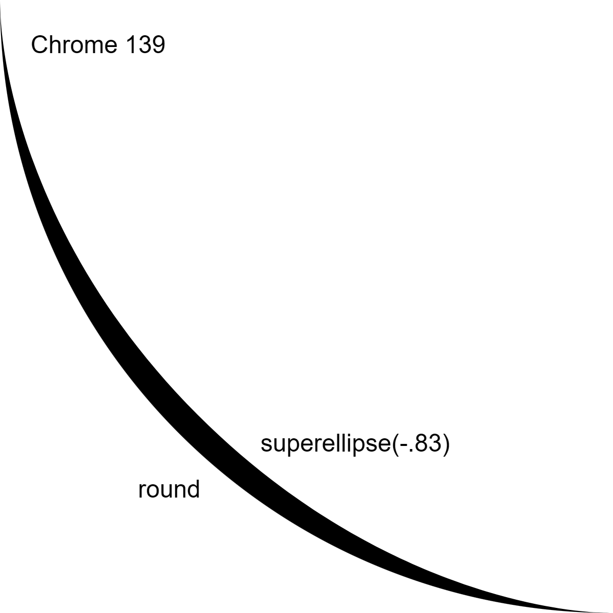

这是你的浏览器渲染上图的效果：

<iframe srcdoc="<!doctype html><body bgcolor=black><div style=position:absolute;top:0;left:0;width:300px;height:300px;background:white;border-bottom-left-radius:300px;corner-shape:round></div><div style=position:absolute;top:0;left:0;width:300px;height:300px;background:white;border-top-right-radius:300px;corner-shape:superellipse(-.83);mix-blend-mode:difference>" width="300" height="300"></iframe>

这是Chrome的实现有问题吗？我翻了Chromium源码，找到了将超椭圆转换为近似的贝塞尔曲线的函数[ApproximateSuperellipseHalfCornerAsBezierCurve](https://source.chromium.org/chromium/chromium/src/+/refs/tags/139.0.7258.128:third_party/blink/renderer/platform/geometry/path_builder.cc;l=31-32)，其中明确注释：

```cpp
  // This formula only works with convex superellipses. To apply to a concave
  // superellipse, flip the center and the outer point and apply the
  // equivalent convex formula (1/curvature).
  DCHECK_GE(curvature, 1);
```

corner-shape相关的代码将超椭圆参数<var>n</var>误称为曲率（curvature）；超椭圆上各点曲率并不相同。

稍向下，能看到实现确实是把<var>n</var> > 1和<var>n</var> < 1的情况特地当成对称来处理了。

```cpp
void AddCurvedCorner(SkPath& path, const Corner& corner) {
  if (corner.IsConcave()) {
    AddCurvedCorner(path, corner.Inverse());
    return;
  }
```

我在w3c/csswg-drafts发了个[议题](https://github.com/w3c/csswg-drafts/issues/12620)指出这一问题。@tabatkins回复道，标准确实规定要将内凹角翻成外凸角来绘制，只是这一点没有在文章中说明，而是由规定的执行步骤确定。

> 11. For each `T` between 0 and 1:
> 
>     1. Let `A` be <code>T<sup>K</sup></code>.
>     2. Let `B` be <code>1 - (1 - T)<sup>K</sup></code>.
>     3. Let `normalizedPoint` be `(A, B)` if `curvature` is positive, <mark>otherwise `(B, A)`</mark>.
>     4. Let `absolutePoint` be `normalizedPoint`, transformed by `projectionToCornerRect`.
>     5. If `absolutePoint` is within `trimRect`, extend path through `absolutePoint`.

(<var>t</var><sup>1/<var>n</var></sup>, (1 − <var>t</var>)<sup>1/<var>n</var></sup>) (0 ≤ <var>t</var> ≤ 1)是超椭圆的另一个参数方程形式。

所以，可以说corner-shape为了参数对称性，只支持<var>n</var> > 1的超椭圆。下面才是目前corner-shape实际能绘制的圆角形状：

<svg width="460" height="460" fill="currentColor" font-size="24">
  <path d="M0 30H430V460M30 30L430 430M30 30C206.021 30 302.149 29.432 366.359 93.6414 430.568 157.851 430 253.979 430 430M30 30C147.217 30 262.182 36.0587 343.062 116.938 423.941 197.818 430 312.783 430 430M30 30A400 400 0 01430 430M30 30C54.563 30 157.157 67.1189 275.019 184.981 392.881 302.843 430 405.437 430 430M30 30 430 430M30 30C30 54.563 67.119 157.157 184.981 275.019 302.843 392.8811 405.437 430 430 430M30 30A400 400 0 00430 430M30 30C30 206.021 29.432 302.149 93.641 366.3586 157.851 430.568 253.979 430 430 430M30 30V430H430" fill="none" stroke="currentColor" stroke-width="2"/>
  <text transform="translate(30 24)" font-weight="bold">superellipse()</text>
  <text transform="translate(430 24)" text-anchor="end">∞ = square</text>
  <g text-anchor="middle">
    <text transform="translate(370 90) rotate(45)">2 = squircle</text>
    <text transform="translate(346 114) rotate(45)">1.5</text>
    <text transform="translate(316 144) rotate(45)">1 = round</text>
    <text transform="translate(278 182) rotate(45)">0.5</text>
    <text transform="translate(233 227) rotate(45)">0 = bevel</text>
    <text transform="translate(188 272) rotate(45)">−0.5</text>
    <text transform="translate(153 307) rotate(45)">−1 = scoop</text>
    <text transform="translate(100 360) rotate(45)">−2</text>
  </g>
  <text transform="translate(30 453)">−∞ = notch</text>
</svg>

## 超椭圆……？

话说回来，到底为什么选择超椭圆？超椭圆泛用性较低，对策性较低，总的来说属于小杯。看上去参数化可定制，实际只能产生直线段和形状确定且怪异的弧状曲线，有个性的边角依然遥远。面对设计师的异想天灾，程序员总是无计可施。

<figure>
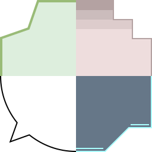
<figcaption>面对这样的边角，贴图是永远的幻神</figcaption>
</figure>

我翻阅了提议添加`corner-shape: superellipse()`的[议题](https://github.com/w3c/csswg-drafts/issues/10993)、[解说](https://github.com/noamr/explainers/blob/main/corner-shape-explainer.md)、[另一份解说](https://github.com/w3c/csswg-drafts/blob/main/css-borders-4/corner-shape-explainer.md)。该功能的主要目的在于在兼容目前的border-radius的前提下支持方圆形（squircle）——一种在原生平台已广泛使用（“Native platforms have had different versions of them for a long time”）、比正圆弧更美观的圆角画法（“Being able to design beautiful websites”），以解决设计师的诉求（“Some folks in the design community have been asking for this persistently”）。个性化边角将由border-shape负责，不在corner-shape处理范围内。

根据MathWorld上没有标注参考文献的定义，方圆形是超椭圆指数<var>n</var> = 4的特殊情况。如此一来，超椭圆是圆角的严格推广，覆盖方圆形的同时也支持直角、倒角、外圆角、切角，通过人造对称也支持了内圆角，单一参数还方便了动画插值。既然要提供方圆形，不如提供参数化的超椭圆。

……是不是有哪里不对？

设计师怎么可能指定一种怪诞的数学曲线？

## 方圆形到底是什么？

让我们回看设计师的初衷。正圆角有什么问题，以至于要换成别的曲线？

这是平凡的圆角矩形：

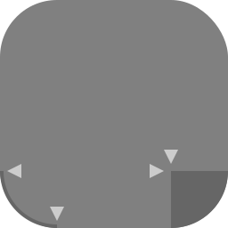

即便没有辅助，仅凭肉眼感觉，就能定位直线段和圆弧的相接点。四个圆角就像缝上去的一样，明明拼合处切线方向一致，却又好像凸出来一般，分外扎眼。

这是因为直线段与圆弧之间存在曲率突变，人眼能捕捉到曲率突变带来的不和谐。

下面是从[Apple Design Resources](https://developer.apple.com/design/resources/)页面获取的适用于iOS 26和iPad OS 26的应用图标模板。

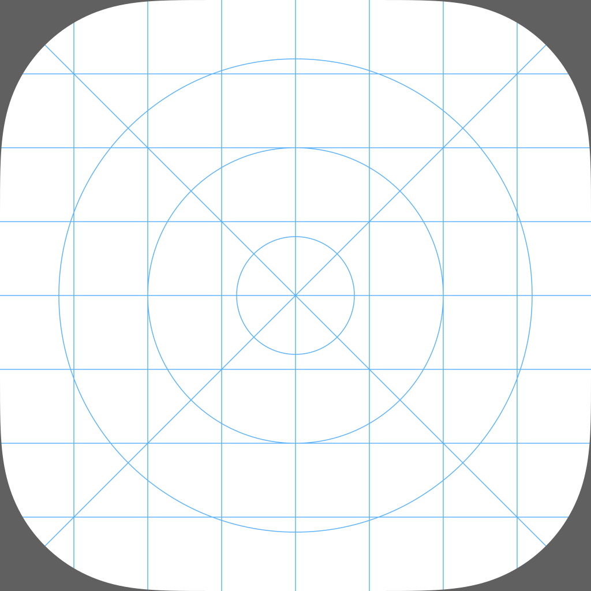

同样是圆角矩形，它就浑然一体，直线段和圆弧之间过渡自然，很难说直线段到某个点结束，圆弧从某个点开始。

直线段和圆弧之间的过渡带缓和了拼接带来的曲率突变，消除了拼接处的不协调感。

iOS应用图标这种打磨过的圆角矩形的形状被设计师称为方圆形。虽然曲线路径公开，其背后的原理我们仍无从得知。自从iOS 7用方圆形换掉了标准圆角矩形以来，有许多破解其中奥秘的尝试，其中不得不提的是在corner-shape议题和解说中频繁提到的一篇来自Figma的Daniel Furse的博文[Desperately seeking squircles](https://www.figma.com/blog/desperately-seeking-squircles/)。

既然目的是避免曲率突变，作者便计算了iOS图标圆角处各点的曲率。绘图可见分为曲率上升-保持-下降三段，曲率保持不变的部分就是原先的圆角，曲率变化的部分是打磨产物。

<figure lang=en>
<blockquote>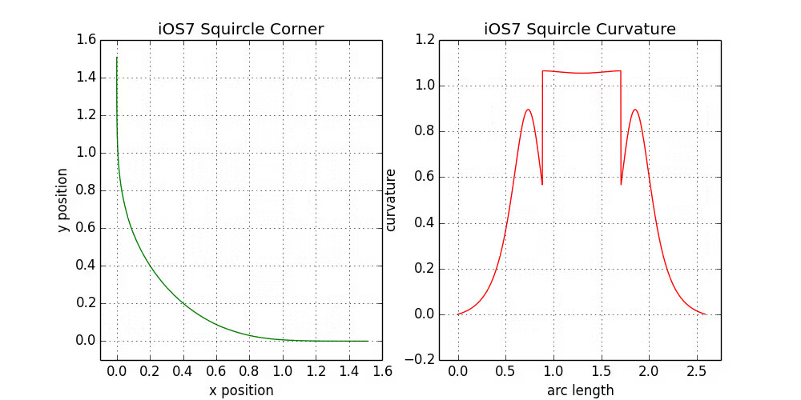</blockquote>
<figcaption>Desperately seeking squircles § Squircles under the scalpel</figcaption>
</figure>

iOS 7刚发布时，Marc Edwards最早尝试了用超椭圆拟合iOS图标，用叠图的方法得出了超椭圆指数<var>n</var> = 5的结论。这是打磨过的圆角矩形被传为方圆形的原因。

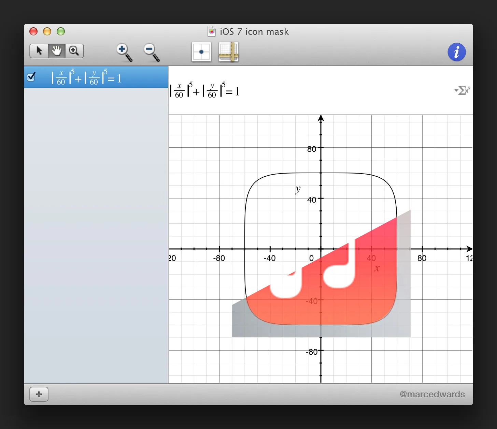

然而，图标的形状从根本上就不可能是超椭圆，因为超椭圆的曲率只有上升-下降，虽然解决了曲率突变，但原先的平顶部分没有了。换句话说，超椭圆不够圆。

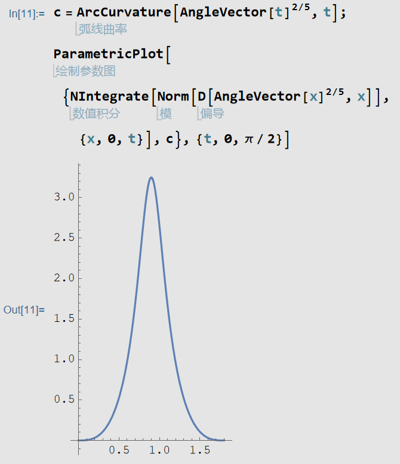

Figma最终也没有搞出iOS图标那样的圆角，而是出于泛用性考虑实现了另一种同样缓和了曲率突变，同时保留圆角印象的曲线，通过调整参数能实现与iOS足够近似的效果。

主流平台中只有苹果的使用方圆形。苹果以外的平台秉持着能用就行的态度，绝不可能打磨圆角的细节。Android文档中唯一提到方圆形的页面[Adaptive icons](https://developer.android.com/develop/ui/views/launch/icon_design_adaptive)只是将其作为一种厂商自定义的可能性，例图也与圆角矩形相去甚远。Flutter提供方圆形支持（[议题](https://github.com/flutter/flutter/issues/13914)），是为了匹配原生应用样式，仅用于iOS。corner-shape解说中提到的所谓“复数原生平台早已支持”，指的大概是macOS、iOS、watchOS、tvOS这几个平台吧。

## 结论

**corner-shape提供的方圆形与设计师所追求的方圆形没有任何关系。**

除了预定义值（round、square、bevel、scoop、notch，除去squircle），其他superellipse()没有应用场景。因为square、bevel、notch基于superellipse()定义，它们之间的动画插值会经过怪异的弧线。

我的内心有一万匹草泥马奔腾而过。太幽默了这CSS，闹半天实现的又是虚空需求 😾
