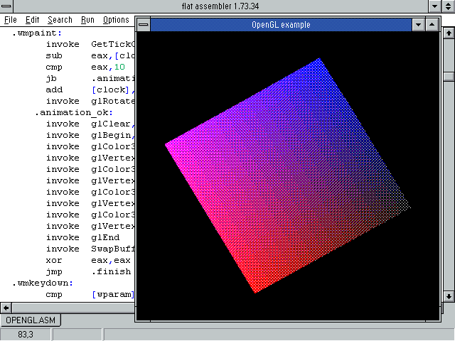
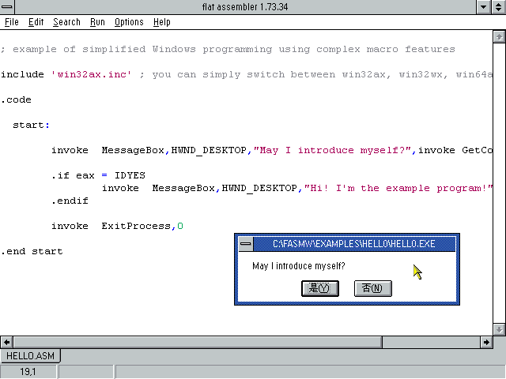
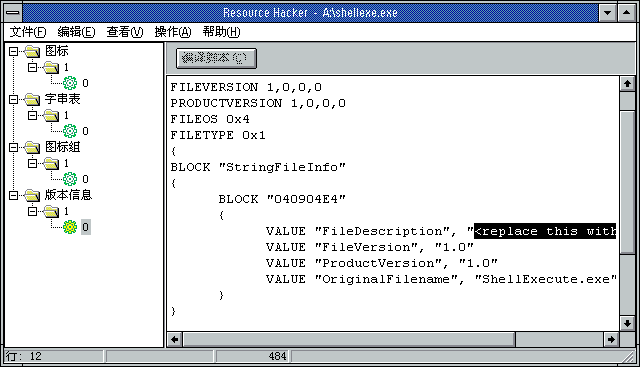
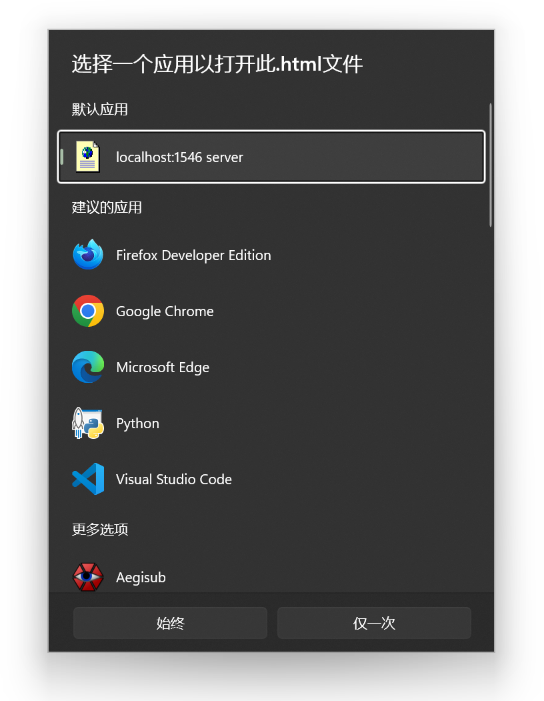

书接<a href="/archives/599/" title="替换双击网页时打开的file:/// URL为localhost">上回</a> 😾

将Firefox设为默认浏览器之后，HTML文件关联又被改了 😾 这倒也没问题吧，可是我原来精心设置的打开方式就这样丢失了 😾

前情提要：我需要将HTML文件关联的打开方式改为`"C:\Windows\py.exe" "C:\startup.py" "%1"`。

## 五个选项只有一个有用这种事难道不是常识吗？

Windows的打开方式菜单中只能选择下列类型的文件：EXE、PIF、COM、BAT、CMD。

EXE是王道，可惜不能图形化地添加额外参数。不管选择什么程序打开都只能产生单参数的命令行，比如`"C:\Windows\py.exe" "%1"`。上回说到可以修改注册表实现额外参数的传递，但这种方式也被微软自己打击，变得非常脆弱。

PIF和COM这两个是文物级的16位应用程序，在64位操作系统上实际上已经用不了了。

BAT和CMD是批处理文件，是一种一行代码都还没写就已经有一万个bug的屎山。\*nix用户可能会觉得这没什么，“不就是shell脚本吗，bash也有[至少520个屎](https://github.com/koalaman/shellcheck/wiki/Checks)，不也照样用”，试试就逝世。我还真不好说bash和batch哪个更屎一点，各有各的惊喜，但毕竟POSIX是被仔细研究的对象，写批处理则永远不知道微软当年拉在了哪里。

PS1文件无法作为打开方式使用，号称能取代批处理的PowerShell总是因为里里外外各种各样的原因用不了。

我试过在打开方式中选择快捷方式（LNK文件），但实际选中的还是快捷方式指向的文件，从而忽略快捷方式中携带的额外参数。

## 在既不支持shebang又不能自由创建软链接的操作系统上处处碰壁的\*nix原住民脚本语言们

我想到，通过脚本语言包管理器安装的命令行实用程序也会遇到类似的问题。例如，`pip install flask`安装得到的是Python脚本文件site-packages/flask/cli.py。在\*nix系统上可以在/usr/bin下创建带shebang的可执行小脚本，在Windows上又要怎么让flask在PATH上可用呢？

Python会为每个命令行工具复制一个启动器EXE，并将脚本内容打包成ZIP追加到EXE尾部。该启动器程序用传统Windows开发工具链（Visual Studio、C、RC资源脚本）制作，代码在[pypa/distlib](https://github.com/pypa/distlib/tree/0.4.0/PC)。

```console
C:\Users\satgo1546\AppData\Local\Programs\Python\Python312\Scripts>dir /b
f2py.exe
flask.exe
normalizer.exe
pip.exe
pip3.12.exe
pip3.exe
```

Ruby则会为每个命令行工具创建一个批处理文件。

```console
C:\Ruby34-x64\bin>dir /b
…
gem
gem.cmd
irb
irb.bat
jekyll
jekyll.bat
…

C:\Ruby34-x64\bin>type jekyll.bat
@ECHO OFF
@"%~dp0ruby.exe" "%~dpn0" %*
```

因为批处理从来不是Windows的一等公民，用批处理创建链接会产生不少问题，比如按Ctrl + C中止进程时会弹出一个毫无意义的“终止批处理操作吗(Y/N)?”询问。

用批处理文件作为打开方式的话，更令人恼火的问题是会有黑框一闪而过，把焦点搞乱。

## 许愿一个不用配置开发环境和等待编译的世界

Python的启动器程序的思路很好：既然只有EXE能用，那就创造EXE。但simple_launcher的实现和Python混乱的发行与打包状况有着千丝万缕的关系。要是它没有那么复杂，我可能就直接拿来用了。

我的需求很简单：创建一个EXE格式的快捷方式。这样我就可以将其用于打开方式，并带上额外参数。顺便如果这个EXE可以自定义图标和描述就更好了，将其选作打开方式时能自动获取到图标和名称。

这是个非常小的需求，我希望EXE也很小，即使复制几万个也不占多大地方——我可不希望一个快捷方式有1MB之大，小的可执行文件也势必启动得更快。作为参考，用MSVC编译得到的Python启动器EXE仍有百余KB。

我想起以前研究用汇编写Win32程序时找到的[flat assembler](https://flatassembler.net/)。


FASM虽是汇编器，其1MB的发行包里的示例程序却覆盖了Windows动态链接库、资源、COM、DirectDraw、OpenGL等主题，用百余行汇编代码挑战GUI编程，令我大开眼界。它甚至自带一个支持多标签页和代码高亮的汇编代码编辑器，而这个编辑器本身也是由万余行汇编写就。





FASM自带一些Windows支持，能直接编译到EXE，弹MessageBox所需的代码量并不比C语言多。这种开箱即用的体验虽然很原始，但对我的微小需求来说，已经甩开安装就要花几个小时的Visual Studio不知多远了。

我写了[不到80行代码](https://github.com/Salenzo/Utilities/blob/aab67880b26359ffd80e33cbeb0cabdcb501ee09/shellexecute.asm)，做出了转发命令行参数到另一个程序、自带名称和图标的快捷方式，[可执行文件](https://salenzo.github.io/Utilities/shellexecute.exe)只有4KB。之后如果需要修改快捷方式的名称、图标、目标的话，用Resource Hacker修改资源就足够，用FASM重新编译也可以，甚至用十六进制编辑器直接覆盖相关字符串都行。




我的打开方式回归了——这一次，不用再编辑注册表了。


