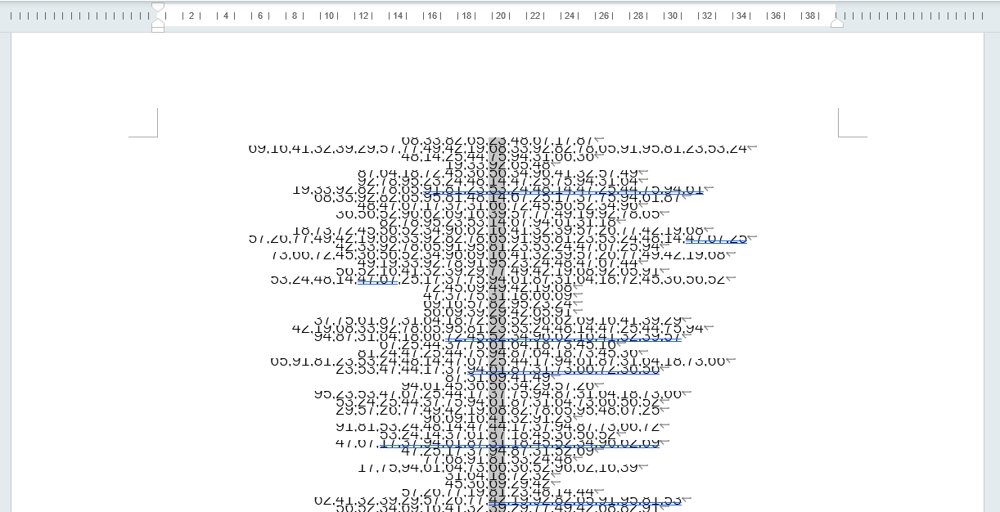
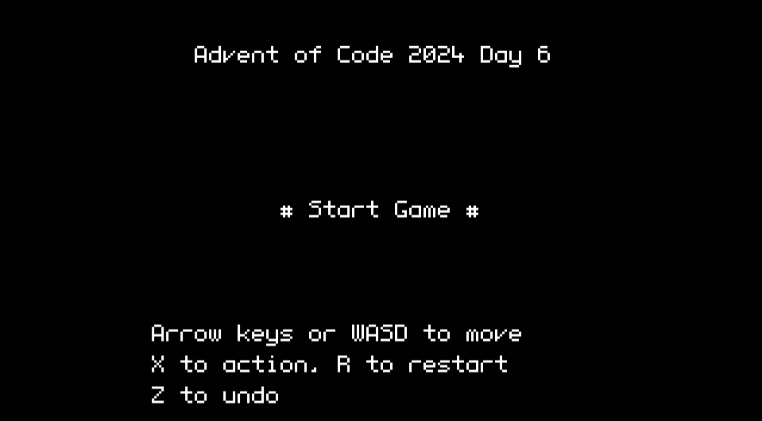
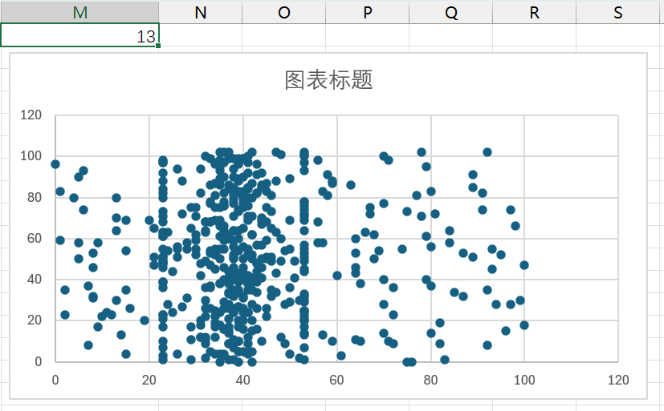
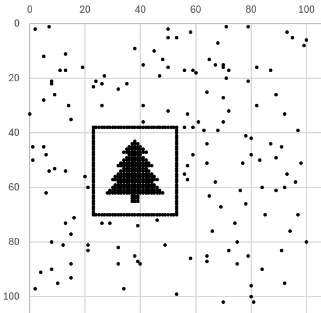
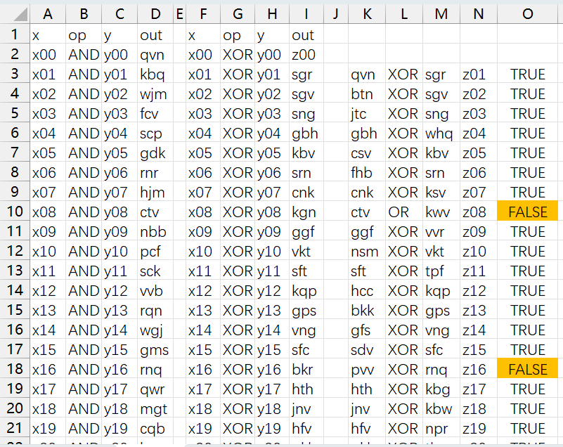

<div class=admonition>
本文最初发表在<a href="https://shuiyuan.sjtu.edu.cn/t/topic/329050">水源社区</a>。发表在本站时，移除了仅水源社区用户可访问的内容。
</div>

每个圣诞即将到来的12月是[Advent of Code](https://adventofcode.com/)的时节。从12月1日到12月25日，每天北京时间13:00，Eric Wastl会放出一道算法题，参加者通过编程解答，**提交正确答案**获得🌟🌟。

不像隔壁LeetCode，参加者并不提交程序，而是下载一组固定的输入数据，然后只提交答案，所以可以使用**任何语言、任何工具**，不受平台时间和空间限制，亦不必被边界场景困扰。无论是新手还是老登，都能获得乐趣。比起算法竞赛，网站的形式更像是puzzle hunt。虽然AoC有全球排行榜，但是上榜也不会有实物奖品，大可按自己的节奏完成。

今年的活动于<time datetime="2024-12-01T13:00+08:00">2024年12月1日星期日下午1点00分</time>开始。

## 常见问题解答

**问**：有中文版吗？

**答**：没有。考虑到公开时间和授权等因素，很难有翻译版本。所以本楼不仅限于交流题目做法，也欢迎讨论剧情文本。

**问**：我只看到通过GitHub等方式登录的选项。可以独立注册吗？

**答**：不能，必须通过第三方账号登录，网站没有独立的注册系统。但是，登录后可以在个人设置中选择匿名，便不会在排行榜上显示社交账号用户名。

**问**：错过了当日题目，还有机会吗？

**答**：从2015年首次举办至今的所有题目都完好地保存在网站上，不管是错过一天还是错过一年，都可以随时继续完成。

**问**：题目难度如何？

**答**：不算困难，整体比LeetCode简单。有的简单题甚至不需要写程序，Excel拉表都能解决。活动期间难度循序渐进，开始几天是简单题，越往后越难。

## 注意事项

**注意**：请勿在每日全球排行榜封榜前发布解题相关信息，参照[官方常见问题解答 / Can I stream my solution?](https://adventofcode.com/2024/about#faq_streaming)。不过全球榜一般题放出来几分钟就满了，读完题就已经差不多了，之后就可以随便讨论了。

**注意**：每个用户的输入数据不同，请不要公开输入数据。参照[官方常见问题解答 / Can I copy/redistribute part of Advent of Code?](https://adventofcode.com/2024/about#faq_copying)。

## Day 1

签到题。

### Excel

#### 前半

1. 复制输入数据到Excel中
2. 数据 > 分列 > 分隔符号 > 空格
3. 选中A列，数据 > 升序 > （旁边还有数据？）以当前选定区域排序
4. 选中B列，进行相同操作
5. C1`=ABS(A1-B1)`，双击填充柄
6. 在状态栏“求和”一项中读取答案

#### 后半

1. C1`=COUNTIF(B:B,A1)*A1`，双击填充柄
2. 在状态栏“求和”一项中读取答案

## Day 2

本想看看Excel能走多远，没想到第二天就寄了。

### 可读性很差的Python

```python
a = """在此处粘贴输入数据"""
a = [list(map(int, x.split())) for x in a.splitlines()]
from itertools import pairwise
def ok(a):
	return sorted(a) in (a, a[::-1]) and all(1 <= abs(x - y) <= 3 for x, y in pairwise(a))
print(sum(ok(x) for x in a))
def ok2(a):
	return ok(a) or any(ok(a[:i] + a[i+1:]) for i in range(len(a)))
print(sum(ok2(x) for x in a))
```

### 不幸作弊了

![That's not the right answer. Curiously, it's the right answer for someone else; you might be logged in to the wrong account or just unlucky. In any case, you need to be using your puzzle input. If you're stuck, make sure you're using the full input data; there are also some general tips on the about page, or you can ask for hints on the subreddit. Please wait one minute before trying again. [Return to Day 2]](unlucky.webp)

Unlucky!

## Day 3

### VSCode

【】标记的是可以在命令面板中找到的命令，可能有快捷键，因为快捷键可以自定义所以这里写出命令全名。

#### 前半

1. 在输入数据中【查找】`mul\(\d+,\d+\)`（区分大小写，使用正则表达式）
2. 【选择所有找到的查找匹配项】
3. 复制选中内容到新建文件
4. 【替换】`,`→`*`，【替换】`mul`→`+`
5. 全选，【合并行】
6. 【Emmet: Evaluate Math Expression】

#### 后半

1. 全选输入数据，【合并行】
    - 因为VSCode里，换行对正则有影响。不仅是`^.$`，连`[^x]`也跨不过行。被坑到了 😾
2. 【替换】`do()`→`对`（区分大小写）
3. 【替换】`don't\(\)[^对]*`→空（使用正则表达式）
4. 重复前半的操作

## Day 4

明明条件很简单，写起来就是很麻烦。二维网格题是这样的，以前刷LeetCode的时候也很讨厌。

### Python

```python
a = """在此处粘贴输入数据""".splitlines()
# 不想处理边界，所以补个边
for i in range(len(a)): a[i] += "____"
a.extend(("_" * len(a[0]),) * 4)
s = 0
for i in range(len(a) - 3):
    for j in range(len(a) - 3):
        for c in (
            ((i, j), (i, j + 1), (i, j + 2), (i, j + 3)),
            ((i, j), (i + 1, j), (i + 2, j), (i + 3, j)),
            ((i, j), (i + 1, j + 1), (i + 2, j + 2), (i + 3, j + 3)),
            ((i, j + 3), (i + 1, j + 2), (i + 2, j + 1), (i + 3, j)),
        ):
            if a[c[0][0]][c[0][1]] + a[c[1][0]][c[1][1]] + a[c[2][0]][c[2][1]] + a[c[3][0]][c[3][1]] in ("XMAS", "SAMX"):
                s += 1
print(s)
s = 0
for i in range(len(a) - 2):
    for j in range(len(a) - 2):
        if (
            a[i + 1][j + 1] == "A"
            and a[i][j + 2] + a[i + 2][j] in ("MS", "SM")
            and a[i][j] + a[i + 2][j + 2] in ("MS", "SM")
        ):
            s += 1
print(s)
```

一开始尝试用<https://tools.qhex.org/>的Word Search功能做，但是很慢（因为它还会主动寻找不在给定词典里的词），答案也没给出计数。[焖肉面](https://philippica.github.io/cipher_machine/)的Word Search也只能用固定词典，而且很慢。

不知道有没有神人用截图模板匹配做……

---

[在r/adventofcode上看到一个很能接受的Excel做法](https://www.reddit.com/r/adventofcode/comments/1h689qf/comment/m0bqvmc/)：

### Excel

#### 前半

1. 将输入数据粘贴到A5:A144
2. F5:F144`=MID(A5,SEQUENCE(,LEN(A5)),1)`（溢出）
3. F150:EO289`=(CONCAT(F2:F5)="XMAS")+(CONCAT(C5:F5)="XMAS")+(C2&D3&E4&F5="XMAS")+(F5&G4&H3&I2="XMAS")+(CONCAT(F2:F5)="SAMX")+(CONCAT(C5:F5)="SAMX")+(C2&D3&E4&F5="SAMX")+(F5&G4&H3&I2="SAMX")`
4. 在状态栏“求和”一项中读取答案

#### 后半

1. F300:EO439`=--AND(OR(E4&F5&G6="MAS",E4&F5&G6="SAM"),OR(E6&F5&G4="MAS",E6&F5&G4="SAM"))`
    - `--`用于转换布尔值为数值，布尔值无法用于求和
2. 在状态栏“求和”一项中读取答案

## Day 5

### 前半 VSCode+Office

查找排列有误的页码并剔除。

1. 复制粘贴输入数据到VSCode中的两个新建文件
2. 在规则数据中选中一个`|`，【选择所有找到的查找匹配项】
3. 键入`\b.*,`
4. 交换前后两列数字：Shift+End，Ctrl+X，Home，Ctrl+V，Ctrl+Shift+→，Ctrl+X，End，Ctrl+V
6. 合并为单行正则表达式：在行末键入`|`，Delete
7. 删除文末多余的`|`：Ctrl+End，Backspace
8. 在更新数据中【查找】上述步骤得到的正则表达式，【选择所有找到的查找匹配项】
9. 坍缩选区：→
10. 删除光标所在行：Ctrl+X，然后粘贴到新文件备用
11. 将剩余内容粘贴到Word中，全选，居中
    - 唉这个时候就想念Vim了，什么东西都有命令（:center），但什么命令都要Google一下才找得到
13. 为了方便选取（此步骤可跳过）：段落 > 行距 > 固定值 > 5磅
14. 按住Alt，用矩形选区框选中间列
    
15. 复制粘贴选中数据到Excel
16. 在状态栏“求和”一项中读取答案

### 后半 Python

没怎么想到用什么工具做批量带捕获组的替换。

```python
import re
a = r"在此处粘贴前半用过的正则表达式"
b = """在此处粘贴前半留着备用的数据""".splitlines()
u = 0
for x in b:
    while re.search(a, x):
        x = re.sub(a, lambda s: s[0][-2:] + s[0][2:-2] + s[0][:2], x)
    s = x.split(",")
    u += int(s[len(s) // 2])
print(u)
```

---

给出的规则是完整的（49 choose 2 = 1176），所以其实可以把规则集作为标准库排序函数的比较函数传入。

## Day 6

呃啊又是网格题。走路模拟器太多了！

### 前半 PuzzleScript

所以需要一款内置走路逻辑的语言……

```puzzlescript
title Advent of Code 2024 Day 6

========
OBJECTS
========

Background
gray

Trail
lightblue

Wall
brown

Player
yellow

=======
LEGEND
=======

. = Background
# = Wall
P = Player
T = Trail

=======
SOUNDS
=======

================
COLLISIONLAYERS
================

Background
Trail
Player, Wall

======
RULES
======

[ > Player | Wall ] -> [ v Player | Wall ]
[ > Player | No Wall ] -> [ Trail | > Player ]
[ > Player | ] -> [ > Background > Player | ]
[ > Player stationary Background ] -> [ Trail Background ]

[ > Player | Wall ] -> [ v Player | Wall ]
[ > Player | No Wall ] -> [ Trail | > Player ]
[ > Player | ] -> [ > Background > Player | ]
[ > Player stationary Background ] -> [ Trail Background ]

[ > Player | Wall ] -> [ v Player | Wall ]
[ > Player | No Wall ] -> [ Trail | > Player ]
[ > Player | ] -> [ > Background > Player | ]
[ > Player stationary Background ] -> [ Trail Background ]

[ > Player | Wall ] -> [ v Player | Wall ]
[ > Player | No Wall ] -> [ Trail | > Player ]
[ > Player | ] -> [ > Background > Player | ]
[ > Player stationary Background ] -> [ Trail Background ]

==============
WINCONDITIONS
==============

no Background

=======
LEVELS
=======

在此处粘贴输入数据，并手动把其中的^改成P
```

运行方法：在<https://mansoft.nl/puzzlescriptnext/editor.html>贴入上述程序和输入数据，点击工具栏上的RUN按钮，然后按空格启动。需要缩小浏览器缩放才能看到整个地图。按住方向键↑直到画面静止。点击工具栏上的LEVEL EDITOR按钮，然后点击地图左上角的S图块，复制下方的日志，到文本编辑器中搜索`T`，读取出现次数。

解释：

- `[ > Player | Wall ] -> [ v Player | Wall ]`：遇到墙右转。`>`是朝右，`v`是朝下的意思。
- `[ > Player | No Wall ] -> [ Trail | > Player ]`：可通行时保持移动并留下轨迹图块。
- `[ > Player | ] -> [ > Background > Player | ]`和`[ > Player stationary Background ] -> [ Trail Background ]`：玩家将要出框时，删除玩家，并留下轨迹图块。这是文档[Tips and Tricks](https://mansoft.nl/puzzlescriptnext/Documentation/tips_and_tricks.html) § 
 Checking Movement Against the Border中给出的技巧，利用了“正在移动的背景图块”可与普通的背景图块区分开的特性，将背景图块的移动作为标志使用。PuzzleScript没有办法用变量记录玩家朝向状态等，所有状态记录都只能用临时图块间接实现。

PuzzleScript需要用户交互才能执行。整段程序复制四次，这样按一个键就会滑行四次，所以只要按住初始方向键（↑）直到玩家消失，也算是自动化了。好处是能看到执行过程：



### 后半 Python

PuzzleScript作为一种DSL就是这样的，因为只有专用特性而缺乏通用编程能力，遇到无法应对的需求变化就只能重写了。

纯暴力，运行了一分钟。

技巧：坐标可以用高斯整数表示。但是常见语言中，除了GCC扩展的C以外，都没有高斯整数类型而只有复数（实部和虚部分别为浮点数），实际用起来会因为用于索引需要转换、判定范围需要取分量等问题不怎么好用。不过，如果不是网点坐标而是实数坐标的话，用复数类型真的很爽！

```python
a="""在此处粘贴输入数据""".splitlines()
def will_loop(obstacle: complex) -> bool:
    i = 84 + 89j  # 在此处填入起始坐标（行 + 列j，从0开始）
    d = -1
    v = set[tuple[complex, complex]]()
    while 0 <= i.real < len(a) and 0 <= i.imag < len(a):
        if (i, d) in v:
            return True
        v.add((i, d))
        j = i + d
        while j == obstacle or 0 <= j.real < len(a) and 0 <= j.imag < len(a) and a[int(j.real)][int(j.imag)] == "#":
            d *= -1j
            j = i + d
        i += d
    return False
from tqdm import trange
print(sum(will_loop(complex(x, y)) for x in trange(len(a)) for y in range(len(a))))
```

## Day 7

### 可读性很差的Python

```python
a = """在此处粘贴输入数据""".splitlines()
def possible(y: int, x: tuple[int, ...]) -> bool:
    return y == x[0] if len(x) < 2 else possible(y, (x[0] + x[1],) + x[2:]) or possible(y, (x[0] * x[1],) + x[2:]) # or possible(y, (int(str(x[0]) + str(x[1])),) + x[2:])
    # 后半：删除上行的“#”
print(sum(int(y) for y, _, x in (l.partition(": ") for l in a) if possible(int(y), tuple(map(int, x.split())))))
```

## Day 8

### Python 五重循环

```python
a = """在此处粘贴输入数据""".splitlines()
pos = set()
for i0 in range(len(a)):
    for j0 in range(len(a)):
        if a[i0][j0] != ".":
            for i1 in range(i0, len(a)):
                for j1 in range((j0 + 1 if i0 == i1 else 0), len(a)):
                    if a[i0][j0] == a[i1][j1]:
                        pos.add((i0 - (i1 - i0), j0 - (j1 - j0)))
                        pos.add((i1 + (i1 - i0), j1 + (j1 - j0)))
print(sum(1 for i, j in pos if 0 <= i < len(a) and 0 <= j < len(a)))

from math import gcd
pos.clear()
for i0 in range(len(a)):
    for j0 in range(len(a)):
        if a[i0][j0] != ".":
            for i1 in range(i0, len(a)):
                for j1 in range((j0 + 1 if i0 == i1 else 0), len(a)):
                    if a[i0][j0] == a[i1][j1]:
                        di = i1 - i0
                        dj = j1 - j0
                        g = gcd(di, dj)
                        di //= g
                        dj //= g
                        for k in range(-100, 100):
                            p = (i0 + di * k, j0 + dj * k)
                            if 0 <= p[0] < len(a) and 0 <= p[1] < len(a):
                                pos.add(p)
print(len(pos))
```

## Day 9

### Python

字符串真好用啊，真希望这些仅用于字符串的算法能泛化到其他序列数据结构。

Part 2本来写了个正则，可惜Python的正则复杂度爆炸，用不了。

```python
A = "在此处粘贴输入数据"
a = [None if i % 2 else i // 2 for i, c in enumerate(A) for _ in range(int(c))]
i = 0
j = len(a) - 1
while True:
    while a[i] is not None: i += 1
    while a[j] is None: j -= 1
    if i > j: break
    a[i], a[j] = a[j], a[i]
print(sum(i * b for i, b in enumerate(a) if b is not None))

a = "".join(("\uffff" if i % 2 else chr(i // 2)) * int(c) for i, c in enumerate(A))
for b in range(len(A) // 2, -1, -1):
    l = int(A[b * 2])
    i = a.find("\uffff" * l)
    j = a.index(chr(b))
    if 0 <= i < j:
        a = a[:i] + chr(b) * l + a[i+l:j] + "\uffff" * l + a[j+l:]
print(sum(i * ord(b) for i, b in enumerate(a) if b != "\uffff"))
```

我觉得前半必有妙解，但也没想出来怎么用Excel实现插入空隙。

## Day 10

抢答了第二小题，应该不止我一个。

### Python

```python
a = """在此处粘贴输入数据""".splitlines()
from functools import cache
@cache
def score(i: int, j: int):
    return ((i, j),) if a[i][j] == "9" else set(  # 后半：把set改成list
        p
        for i1, j1 in ((i - 1, j), (i + 1, j), (i, j - 1), (i, j + 1))
        if 0 <= i1 < len(a) and 0 <= j1 < len(a) and int(a[i1][j1]) - int(a[i][j]) == 1
        for p in score(i1, j1)
    )
print(sum(len(score(i, j)) for i in range(len(a)) for j in range(len(a)) if a[i][j] == "0"))
```

## Day 11

### Python

```python
from functools import cache
@cache
def f(n: int, x: int) -> int:
    if not n: return 1
    if x == 0: return f(n - 1, 1)
    s = str(x)
    if len(s) % 2 == 0:
        return f(n - 1, int(s[:len(s)//2])) + f(n - 1, int(s[len(s)//2:]))
    return f(n - 1, x * 2024)
print(sum(f(25, int(x)) for x in "在此处粘贴输入数据".split()))
# 后半：将25改为75
```

## Day 12

又是网格题 😾

### Python

```python
a = """在此处粘贴输入数据""".splitlines()
visited = set()
ans1 = ans2 = 0
from itertools import product, pairwise
for seed in product(range(len(a)), repeat=2):
    if seed in visited: continue
    stack = [seed]
    area = 0
    sides = []
    while stack:
        i, j = stack.pop()
        if (i, j) in visited: continue
        visited.add((i, j))
        area += 1
        for d, (i1, j1) in enumerate(((i + 1, j), (i - 1, j), (i, j + 1), (i, j - 1))):
            if 0 <= i1 < len(a) and 0 <= j1 < len(a) and a[i1][j1] == a[i][j]:
                stack.append((i1, j1))
            else:
                sides.append((d, i, j) if d < 2 else (d, j, i))
    sides.sort()
    ans1 += area * len(sides)
    ans2 += area * (sum(
        d0 != d1 or i0 != i1 or j1 - j0 != 1
        for (d0, i0, j0), (d1, i1, j1) in pairwise(sides)
    ) + 1)
print(ans1, ans2)
```

## Day 13

![That's the right answer! You are one gold star closer to finding the Chief Historian. You achieved rank 87 on this star's leaderboard and gained 14 points!
You have completed Day 13! You can [Share] this victory or [Return to Your Advent Calendar].](day13.webp)

首次得分！

### Python

首先实行一些文本替换操作把数据格式改好，然后用Mathematica算二元一次方程求解公式。这里必须用整数或分数算，NumPy只能用浮点数，精度不够.

```python
a = [
    # 按输入中数字的出现顺序
    [(11, 67), (17, 16), (2413, 6293)],
    [(22, 48), (43, 21), (3637, 10139)],
    [(23, 12), (31, 99), (3660, 8370)],
    # ……更多输入数据……
    [(50, 14), (16, 62), (2112, 994)],
]
s = 0
for (xa, ya), (xb, yb), (x, y) in a:
    x += 10000000000000  # 前半：删去这两行
    y += 10000000000000
    d = -xb * ya + xa * yb
    i = -xb * y + x * yb
    j = xa * y - x * ya
    if i % d == j % d == 0:
        i //= d
        j //= d
        s += i * 3 + j
print(s)
```

## Day 14 小机器人

我不理解，但我觉得是道好题。

### Excel

#### 前半

1. 复制粘贴输入数据到A1
2. 数据 > 分列 > 分隔符号 > 逗号、空格、其他（`=`）
3. G1:G100`=MOD(B1+E1*$M$1,101)`
   H1:H100`=MOD(C1+F1*$M$1,103)`
   I1:I100`=N(AND(G1<50,H1<51))`
   J1:J100`=N(AND(G1<50,H1>51))`
   K1:K100`=N(AND(G1>50,H1<51))`
   L1:L100`=N(AND(G1>50,H1>51))`
   M1=100
   I101:L101`=SUM(I1:I500)`
   M501`=PRODUCT(I501:L501)`
4. 读M501值即为答案

#### 后半

1. 选中G1:H100，插入 > 插入散点图（X、Y）或气泡图 > 散点图
2. 调整M1的值直到看到横向或纵向条纹
   
3. 注意到条纹周期性地出现。解模方程<math display=block><mo>{</mo><mtable><mtr><mtd><mi>x</mi><mo>mod</mo><mn>101</mn><mo>=</mo><mtext>出现纵向条纹的时刻</mtext></mtd></mtr><mtr><mtd><mi>x</mi><mo>mod</mo><mn>103</mn><mo>=</mo><mtext>出现横向条纹的时刻</mtext></mtd></mtr></mtable></math>取最小正整数解，此步骤可用Wolfram|Alpha完成



条件其实说得很清楚，由人类来识别是没有歧义的。只是这种条件难以用明确的数学方式描述。日常生活中遇到的数据处理问题，有很多其实也是像本题这样听上去可以自动化，却因为条件不够定量而难以实现的。

除了手工找到周期性以外，本题的条件也可以是：

- 机器人坐标方差最小
- 最大的四/八连通块面积最大
- 所有机器人互不重叠
- 有任意3×3区域被填充

但在看到最终图案之前，哪一种策略都不能保证找到。例如，如果图案是空心的，就没有区域被填充；如果多余的机器人叠在图案上，就不能通过互不重叠判定；如果图案为虚线，连通块面积就无效了。

## Day 15

### 非常丑陋的Python

这代码写得太赤石了。

```python
from itertools import product
a="""在此处粘贴输入网格""".splitlines()
b="""在此处粘贴输入指令""".replace("\n","")
boxes = {(i,j) for i,j in product(range(len(a)),repeat=2) if a[i][j]=='O'}
for i,j in product(range(len(a)),repeat=2):
		if a[i][j]=='@':
			break
for c in b:
	di,dj={'^':(-1,0),'<':(0,-1),'>':(0,1),'v':(1,0)}[c]
	i1=i2=i+di
	j1=j2=j+dj
	while (i2,j2) in boxes:
		i2+=di
		j2+=dj
	if a[i2][j2] == '#':
		continue
	if (i1,j1) in boxes:
		boxes.add((i2,j2))
		boxes.remove((i1,j1))
	i=i1
	j=j1
print(sum(i*100+j for i,j in boxes))

boxes = {(i,j) for i,j in product(range(len(a)),repeat=2) if a[i][j]=='O'}
for i,j in product(range(len(a)),repeat=2):
		if a[i][j]=='@':
			break
def affected_boxes(i:int,j:float,di:int,dj:float)->set[tuple[int,float]]:
	if (i,j) in boxes:
		y= {(i,j)}
		if di:
			for j1 in j-.5,j,j+.5:
				y|=affected_boxes(i+di,j1,di,dj)
		else:
			while (i,j) in boxes:
				y.add((i,j))
				j+=dj*2
		return y
	return set()
def pushable(i: int, j: float, di:int,dj:float)->bool:
	if di:
		if j%1:
			return a[i+di][int(j)]!='#' and a[i+di][int(j)+1]!='#'
		else:
			return a[i+di][int(j)]!='#'
	else:
		if j%1:
			return True
		else:
			return a[i][int(j+dj*2)]!='#'
for c in b:
	di,dj={'^':(-1,0),'<':(0,-.5),'>':(0,.5),'v':(1,0)}[c]
	i1=i+di
	j1=j+dj
	if c == '<':
		bx = affected_boxes(i1,j-1,di,dj)
	elif c=='>':
		bx = affected_boxes(i1,j+.5,di,dj)
	else:
		bx = affected_boxes(i1,j,di,dj)|affected_boxes(i1,j-.5,di,dj)
	if a[i1][int(j1)]!='#'and all(pushable(i,j,di,dj) for i,j in bx):
		boxes-=bx
		boxes.update((i+di,j+dj) for i,j in bx)
		i=i1
		j=j1
	print(c,bx,i,j)
print(sum(i*100+j*2 for i,j in boxes))
```

## Day 16

### 非常丑陋的Python

丑陋成常态了 🤡

球球了能不能别再出网格函数库容量检测器了

第一遍写的时候忘了要用heap了，又成功搞出了样例能过但测试点过不了的程序。

```python
a = """在此处粘贴输入数据""".splitlines()
from heapq import heappop, heappush
queue = [(0, len(a) - 2, 1, 0, None, None, None)]
path = {}
ans = 1145141919810
while queue:
    s, i, j, d, i0, j0, d0 = heappop(queue)
    if (i, j, d) in path:
        if path[i, j, d][0] == s:
            path[i, j, d][1].append((i0, j0, d0))
        continue
    path[i, j, d] = s, [(i0, j0, d0)]
    if a[i][j] == "E":
        ans = min(ans, s)
        continue
    for d1, (dx, dy) in enumerate(((0, 1), (1, 0), (0, -1), (-1, 0))):
        i1, j1 = i + dx, j + dy
        if a[i1][j1] == "#":
            continue
        heappush(queue, (s + 1 + 1000 * (d1 != d), i1, j1, d1, i, j, d))
print(ans)
p = path[1, len(a) - 2, 0][1]  # 0（终点左侧开口）可能需要改成3（终点下侧开口）
q = set((i, j) for i, j, d in p)
while True:
    p = [p1 for p0 in p for p1 in path[p0][1]]
    if p[0][0] is None:
        break
    q.update((i, j) for i, j, d in p)
print(len(q) + 1)
```

## Day 17

大的来了！

![That's the right answer! You are one gold star closer to finding the Chief Historian. You achieved rank 78 on this star's leaderboard and gained 23 points!
You have completed Day 17! You can [Share] this victory or [Return to Your Advent Calendar].](day17.webp)

### 前半 Python

```python
p = [0, 1, 5, 4, 3, 0]  # 在此处粘贴输入程序

def run(a, b, c):
    def combo():
        return (0, 1, 2, 3, a, b, c)[x]
    output = []
    ip = 0
    while ip < len(p) - 1:
        x = p[ip + 1]
        match p[ip]:
            case 0:
                a >>= combo()
            case 1:
                b ^= x
            case 2:
                b = combo() & 7
            case 3:
                if a:
                    ip = x
                    continue
            case 4:
                b ^= c
            case 5:
                output.append(combo() & 7)
            case 6:
                b = a >> combo()
            case 7:
                c = a >> combo()
        ip += 2
    return output

print(run(729, 0, 0))  # 在此处粘贴寄存器初值
```

### 后半 Python

跟quine没关系，输出完全靠输入决定，是逆推。但是因为一些位纠缠的问题导致逆映射是一对多，最小值需要搜索得到。

```python
# 通过手动推理和化简，得知我的输入程序实现了下列计算
def run2(a):
    output = []
    while a:
        output.append((a ^ (a >> (a & 7 ^ 3)) ^ 6) & 7)
        a >>= 3
    return output

def dfs(a, l):
    if not l:
        print(a)
        exit()
    a <<= 3
    tail = l[1:]
    for i in range(8):
        a1 = a | i
        if (a1 ^ (a1 >> (a1 & 7 ^ 3)) ^ 6) & 7 == l[0]:
            dfs(a1, tail)
dfs(0, p[::-1])
```

## Day 18

从Day 16的代码改的。

### 丑上加丑的Python

……所以里面有一堆没用到的变量和其实不需要的heap。

```python
seq = [
    (9, 17),
    (63, 40),
    (25, 16),
    # ……输入数据……
    (60, 30),
]
a = [[0] * 71 for _ in range(71)]
for i, j in seq[:1024]:
    a[i][j] = 1
from heapq import heappop, heappush
def find():
    queue = [(0, 0, 0, 0, None, None, None)]
    path = {}
    ans = 1145141919810
    while queue:
        s, i, j, d, i0, j0, d0 = heappop(queue)
        if (i, j, d) in path:
            if path[i, j, d][0] == s:
                path[i, j, d][1].append((i0, j0, d0))
            continue
        path[i, j, d] = s, [(i0, j0, d0)]
        if i == 70 and j == 70:
            ans = min(ans, s)
            continue
        for d1, (dx, dy) in enumerate(((0, 1), (1, 0), (0, -1), (-1, 0))):
            i1, j1 = i + dx, j + dy
            if 0 <= i1 < 71 and 0 <= j1 < 71:
                if a[i1][j1] == 1:
                    continue
                heappush(queue, (s + 1, i1, j1, d1, i, j, d))
    return ans
print(find())
from tqdm import tqdm
for i, j in tqdm(seq[1024:]):
    a[i][j] = 1
    if find() == 1145141919810:
        print(i, j)
        break
```

## Day 19

### 前半 Go

为什么突然换Go了呢？因为只有Go的正则表达式是线性复杂度！其他工具的正则最坏复杂度都是指数的，VSCode在我输完`$`的时候即刻卡死。

```go
package main

import (
	"regexp"
	"strings"
)

func main() {
	a := regexp.MustCompile("^(uwbr|bbgrb|wwbg|……|ubug)*$") // 在此处设定允许的毛巾种类
	b := `在此处粘贴目标条纹`
	y := 0
	for _, s := range strings.Split(b, "\n") {
		if a.MatchString(s) {
			y++
		}
	}
	println(y)
}
```

### 后半 Python

好吧，写个动态规划也不是很麻烦。

做前半的时候都猜到后半是什么了。

```python
a = "在此处粘贴允许的毛巾种类".split(", ")
b = """在此处粘贴目标条纹""".splitlines()
y = 0
for s in b:
    n = [1]
    t = ""
    for c in s:
        t += c
        n.append(sum(n[-len(g)] for g in a if t.endswith(g)))
    y += n[-1]
print(y)
```

## Day 20

又是网格题，我要闹了 😾

趁此机会学习一下networkx，成为调包侠。

### Python

虽然有个可以一键生成网格图的函数，输入解析还是得手工做，倒也正常。

这库居然没类型标注，无语了。

```python
a="""在此处粘贴输入数据""".splitlines()
from itertools import product
import networkx as nx
from tqdm import trange

g: nx.Graph = nx.grid_2d_graph(len(a), len(a))
for i, j in product(range(len(a)), repeat=2):
    if a[i][j] == "S":
        s = i, j
    elif a[i][j] == "E":
        e = i, j
    elif a[i][j] == "#":
        g.remove_node((i, j))
p = nx.shortest_path(g, s, e)
y = 0
for i in trange(len(p)):
    for j in range(i + 100, len(p)):
        d = abs(p[i][0] - p[j][0]) + abs(p[i][1] - p[j][1])
        if d <= 2 and j - i - d >= 100:  # 后半：把2改成20
            y += 1
print(y)
```

## Day 21

好玩，但有点难想。

看起来是4×3网格题，实际上……

### Python

动态规划。

要实际触发某一级机械臂的运动，上一级就必须按下A按钮。上一级要触发按下按钮的动作，上上级就必须按下A按钮。所以当某一级机械臂运动的时候，该级之前的所有机械臂都必定停在A按钮上。A按钮起到了检查点的效果，所以可以分别考虑各级。

不论在哪一级，`>>^`一定比`>^>`更优，因为`>>`中的第二个`>`可以通过再次按A简单地输入，而`>^>`中的第二个`>`需要重新定位。但是，`v>`和`>v`哪个更优就不一定了，打印中间变量可知，只有两级时`>v`更优，但此后`v>`更优。

```python
from itertools import pairwise
g = {a + b: 1 for a in "A^>v<" for b in "A^>v<"}
def f(s: str) -> int:
    return sum(g[a + b] for a, b in pairwise("A" + s))
for _ in range(2):  # 后半：把2改成25
    g = {
        "AA": 1,
        "A^": f("<A"),  # 将本级机械臂从A按钮移到^按钮后按下，所需的步数是将前级机械臂从A按钮移动到<按钮后按下，再移动到A按钮后按下的步数
        "A>": f("vA"),
        "Av": min(f("v<A"), f("<vA")),
        "A<": f("v<<A"),
        "^A": f(">A"),
        "^^": 1,
        "^<": f("v<A"),
        "^v": f("vA"),
        "^>": min(f("v>A"), f(">vA")),
        ">A": f("^A"),
        ">^": min(f("^<A"), f("<^A")),
        "><": f("<<A"),
        ">v": f("<A"),
        ">>": 1,
        "vA": min(f(">^A"), f("^>A")),
        "v^": f("^A"),
        "v<": f("<A"),
        "vv": 1,
        "v>": f(">A"),
        "<A": f(">>^A"),
        "<^": f(">^A"),
        "<<": 1,
        "<v": f(">A"),
        "<>": f(">>A"),
    }

print(sum(k * min(sum(g[a + b] for a, b in pairwise("A" + p)) for p in ps) for k, ps in {
    682: ["^^A^<AvvAv>A", "^^A^<AvvA>vA", "^^A<^AvvAv>A", "^^A<^AvvA>vA"],
    83: ["<A^^^A>vvAvA", "<A^^^Avv>AvA"],
    # ……手工填写数字键盘上的移动路径……
}.items()))
```

## Day 22

### 很慢的Python

后半跑了7分钟，非常暴力。

```python
a = """在此处粘贴输入数据"""
a = list(map(int, a.splitlines()))
def f(x: int) -> int:
    x ^= x * 64
    x &= 16777215
    x ^= x // 32
    x &= 16777215
    x ^= x * 2048
    x &= 16777215
    return x
from tqdm import tqdm
from itertools import product
A = []
ans1 = 0
for x in tqdm(a):
    s = bytearray(2000)
    t = bytearray(2000)
    for i in range(2000):
        y = f(x)
        s[i] = y % 10
        t[i] = y % 10 - x % 10 + 9
        x = y
    ans1 += x
    A.append((s, t))
print(ans1)
ans2 = -1
for p in tqdm(product(range(19), repeat=4), total=19**4):
    p = bytes(p)
    y = 0
    for s, t in A:
        i = t.find(p)  # 暴力，预处理一下会快很多
        if i >= 0:
            y += s[i + 3]
    ans2 = max(ans2, y)
print(ans2)
```

## Day 23

调包题真是调调又包包啊。

### Python w/ networkx

```python
a = """在此处粘贴输入数据"""
import networkx as nx
g = nx.Graph(s.split("-") for s in a.splitlines())
print(sum("t" in u[0] + v[0] + w[0] for u, v, w in nx.simple_cycles(g, 3)))
print(",".join(sorted(max((next(nx.find_cliques(g, [u])) for u in g), key=len))))
```

---

[AoC非官方调查问卷的结果](https://jeroenheijmans.github.io/advent-of-code-surveys/)发布了（[Reddit帖子](https://www.reddit.com/r/adventofcode/comments/1hkybho/2024_unofficial_aoc_2024_survey_results/)）。

好多自产自销的语言！


[Newt](https://github.com/dunhamsteve/newt/tree/main/aoc2024)是一门依值类型语言。

当我有自创语言的时候，也一定会用AoC作为试验场的。

今年有39人在编程语言一栏填了Excel或Google Sheets。

在IDE一栏里填了Word的用户是谁呢，该不会是我吧（目移


<blockquote lang=en>
<ul>
<li><strong>Microsoft Word</strong> as an "<strong>IDE</strong>" for someone (upping-the-ante on the spreadsheet users are we!? 😁)
</ul>
</blockquote>

## Day 24

![That's the right answer! You are one gold star closer to finding the Chief Historian. You achieved rank 14 on this star's leaderboard and gained 87 points!
You have completed Day 24! You can [Share] this victory or [Return to Your Advent Calendar].](day24.webp)

### 前半 JS + Vue

借用一下Vue的依赖图求值。

在<https://play.vuejs.org/>上编辑和运行。

```html
<script setup>
import { ref, computed } from 'vue'
// 使用Monaco的编辑功能，将输入数据转换成Vue响应式语法。
const x00 = ref(1)
const x01 = ref(0)
// …输入数据…
const y44 = ref(1)
const z43 = computed(() => ncj.value ^ gdc.value)
const kbw = computed(() => stp.value | qwr.value)
// …输入数据…
const wjm = computed(() => x02.value & y02.value)
console.log(BigInt('0b' +
  [z00, z01, z02, z03, z04, z05, z06, z07, z08, z09, z10, z11, z12, z13, z14, z15, z16, z17, z18, z19, z20, z21, z22, z23, z24, z25, z26, z27, z28, z29, z30, z31, z32, z33, z34, z35, z36, z37, z38, z39, z40, z41, z42, z43, z44, z45]
  .reverse().map(x => x.value).join('')))
</script>
<template>
</template>
```

### 后半 (Excel)

手工做的 🤣 数据量不大且程序描述复杂。Excel起到了排序和高亮异常的作用。



1. 按左侧输入排序，将以y开头的运算交换左右顺序，统一为x在左y在右的格式。
2. 按运算符、左侧输入排序，分离出x XOR y和x AND y两类运算。
3. 按输出排序，提取输出以z开头的运算，与上一步得到的运算并排放置。
4. 输出z的运算（除了z45）应为XOR，且一个输入是x XOR y的输出。编写条件格式，高亮异常运算。
5. 在剩余的运算中查找对应于异常运算的x XOR y输出变量，其中的XOR运算输出即为需要与之交换的变量。
6. 特殊地，存在一组同位的x XOR y和x AND y的输出需要交换，无法用上一步的方法找到。

## Day 25

圣诞快乐！

### Python

转换成二进制位图，用位运算交叠图像。

```python
a = """在此处粘贴输入数据"""
from itertools import combinations
a = [int(x, 2) for x in a.replace(".", "0").replace("#", "1").replace("\n", "_").split("__")]
print(sum(l & k == 0 for l, k in combinations(a, 2)))
```


完结撒花！来年再会！
