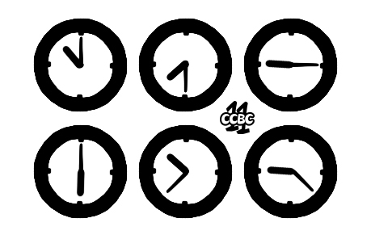

<style>
.map {
	border-collapse: collapse;
	font-size: .6666666667em;
	text-align: center;
}

.map td {
	width: 8em;
	height: 8em;
	border: thin solid;
	padding: .75em;
}
</style>

<dl>
<dt>队伍<dd>该队伍已注销
<dt>报告<dd>piscesciurus
</dl>

## 幻境

<dl>
<dt>解题<dd>piscesciurus、Chrysl
</dl>

> <div>2024-08-15 13:57:05 发布</div>
>
> 一道标题为【……境】的题目，题目形式有所更新。

原来这不是CTF题啊？

### 文字冒险！

Text adventure！又被硬控了。（顺带一提，另两种硬控方式是[纵横字谜](../summer-10/)和[语言推理](../lost-town-07/)。）我很想体验玩通一款纯文字冒险游戏的感觉，但英文ADV仿佛满是长篇阅读理解的考试，而中文社区对这种需要玩家打字的游戏形式并不感冒。这也正常：输入中文对玩家而言太费事了；程序面对中文的千万种表达方式，解析起来又是难上加难。感谢CCBC 15描绘了中文环境的文字冒险的一种可能性。

这黑框控制台和移动指令组可真是太熟悉了。首先输入help，得知有隐藏指令（废话），但可惜输入xyzzy没有彩蛋。没病先走两步，刚走两步（字面意思）就卡了。

```console
这是一个普通的房间。
你可以向西方向走。
> w
你向西走去。
这是一个普通的房间。
这个房间的西方有一扇上锁的门。
你可以向东、南方向走。
> s
你向南走去。
这是一个普通的房间。
你可以向北方向走。
> n
> w
不能向西走。
> open door
这个命令没有实现喵~ 请用 "use <物品>"
> i
你有：
    你咋啥也没有啊
```

<table class="map">
<tr>
	<td style="border-width: thick thin thin medium;">
	<td style="border-width: thick thick thick thin;">出生点
<tr>
	<td style="border-width: thin thick thick thick;">
	<td style="border: none;">
	<svg width="20" height="55" alt="上北下南">
		<path d="M0 30H20M10 55V5L5 15 13 20" fill="none" stroke="currentColor" stroke-miterlimit="9"/>
	</svg>
</table>

我钥匙呢？

这才发现look能得到一些进入房间时不会给出的信息。

> 这里是你起始的房间。这个房间北侧的墙似乎是后来砌的，本不属于这个房间。你可以向西方向走。

遂在共享表格中写下“进入房间先look一下，可能有额外信息”。

乱走的时候还触发了一声闷响事件：

> 你听到某处传来一声巨大的闷响，似乎是什么非常沉的东西重重落在地面上的声音。

出生点西南面的房间有一把钥匙，获取后打开新世界的大门。

```console
> use key
你用钥匙打开了西边的门。
> w
你向西走去。
这是一个普通的房间。
你可以向东、北方向走。
> l
这个房间有一个拼图 (piece)。
你可以向东、北方向走。
> get piece
你拿到了拼图 (piece)。
> i
你有：
一个红色的拼图，上面有三个正方形房间的鸟瞰图：
  第一个房间倾斜了 45°，而且缺失了东北方、西北方的两面墙；
  第二个房间缺失了东方的一面墙，而且其中有一个拼图；
  第三个房间缺失了东方、北方的两面墙，而且其中有一个拼图。
```

拼图的内容是在暗示其他拼图的位置吗？这块红色拼图就在一个缺失了东方、北方的两面墙的房间被捡到，那么是否在一个向西的死胡同里有另一块拼图？会有斜着的房间吗？还是说要自己改换视角来看？无论如何，应该要集齐拼图，它们很可能描绘了最终答案。

```console
> n
你向北走去。
这是一个普通的房间。
这个房间的西方有一扇上锁的门。
你可以向南、北方向走。
> l
这个房间的西方有一扇上锁的门。
你可以向南、北方向走。
> n
你向北走去。
墙上好像有什么……
你可以向东、南方向走。
> l
你发现这个房间的墙上挂着一株大喷菇的字迹：
    「时于一切的东南角开始，空在此处的东南角结束。」你可以向东、南方向走。
> e
你向东走去。
这是一个普通的房间。
你可以向东、西、北方向走。
> l
你可以向东、西、北方向走。
> e
你向东走去。
这个房间有个深坑 (pit)。
你可以向西、南方向走。
> l
这个房间有个深坑 (pit)。你觉得跳下去 (jump into) 绝对是个坏主意。你可以向西、南方向走。
> jump into pit
你跳进了洞里。
跳下这个深坑 (the pit) 时，你感觉到一阵刺痛 (a tingling)。
这里是死路。
> l
一旦跌入她脚下的土地 (the ground beneath her feet)，你是否觉得无可挽回 (irreversible)？这个房间有一把绿色钥匙 (green_key)。
这里是死路。
> get green_key
你拿到了绿色钥匙 (green_key)。
> go out
只能 "go <方向>" 或仅使用 "<方向>"。
> go up
不能向走。
> get the ground beneath her feet
只能 "get <东西>"
> get pit
这里没有 pit。
> reverse
不认识这个命令喵~
```

<table class="map">
<tr>
	<td style="border-width: thick thin thin thick;">大喷菇字迹
	<td style="border-bottom-width: thick;">（路口）
	<td style="border-width: thick thick thin thin;">深坑
	<td style="border: none;"><span style="font-size: 4em;">→</span>
	<td style="border-width: thick;"><span style="color: var(--green);">绿色钥匙</span><br>坑内
<tr>
	<td style="border-width: thin thick thin medium;">
<tr>
	<td style="border-width: thin 0 thick thick;">红色拼图
	<td style="border-width: thick thin thin medium;">
	<td style="border-width: thick thick thick thin; border-top-style: dashed;">出生点
<tr>
	<td style="border: none;">
	<td style="border-width: thin thick thick thick;">钥匙
</table>

我死了？好像只能重开了。我决定把速通流程记下来。因为是读取标准输入的控制台程序，所以只要将命令历史每行一个地记录下来，粘贴进控制台就能批量执行，一下子到达执行完所有命令的状态，这就是手动存档。

但重走了一遍发现深坑南边只有一个发光地板房间，能让自己变绿，但不知道变绿有什么意义，也不知道是否会保持，看着像是要来一次的样子，所以姑且认为来一次总没坏处吧。（其实并不会保持变绿。）

路口北面则是一进去就会被炮弹击中，也不知道有什么用。

```console
> n
你向北走去。
你被一枚向西飞行的炮弹击中。一瞬间，时间像是暂停 (pause) 了一刻。你死了。
使用 "rewind" 可以倒流时间。
> rewind
倒流了 1 个单位时长。
这是一个普通的房间。
你可以向东、西、北方向走。
> e
你向东走去。
这个房间有个深坑 (pit)。
你可以向西、南方向走。
> s
你向南走去。
这个房间的地面渗出强烈的白光。你被照得睁不开眼。
你可以向北方向走。
> l
你惊讶地发现自己变绿了。你可以向北方向走。
```

Chrysl发现进了坑可以用rewind回到坑外，同时保持持有绿色钥匙的状态。倒流不改变物品持有状态？但是试了下开场开了那扇门就倒流，钥匙就被回收了。很疑惑，难道这个机制是专为坑设计的？

Chrysl还发现了路口北能进，东面有加农炮，加农炮上有钥匙，西面有黄色拼图，地上有¼圆，wait命令可以原地等待。我很震惊，原来pause指令是有用的，随即发现rewind、pause、wait后都可加数字表示重复次数；进路口北不是必死，如果时机好的话就能逃过一劫（要到两侧还是得pause），只不过第一次进房间就被我撞上了炮弹，让我以为那里还不能进去。

```console
> pause
暂停了 1 个单位时长。
> w
你向西走去。
地上好像有什么……
你可以向东、西方向走。
> l
你发现这个房间西北角的地面上画着一个巨大 1/4 圆，圆心就在房间的西北角。你可以向东、西方向走。
> pause
暂停了 1 个单位时长。
> w
你向西走去。
地上好像有什么……
你可以向东方向走。
> l
你发现这个房间东北角的地面上画着一个巨大 1/4 圆，圆心就在房间的东北角。这个房间有一个拼图 (piece)。
你可以向东方向走。
> get piece
你拿到了拼图 (piece)。
> i
你有：
    绿色钥匙 (green_key)
一个黄色的拼图，上面有三个正方形房间的鸟瞰图：
  第一个房间缺失了南方的一面墙；
  第二个房间的四面墙都完好；
  第三个房间倾斜了 45°，缺失了东北方、西北方的两面墙，而且其中有一个拼图。
> pause
暂停了 1 个单位时长。
> e
你向东走去。
你被一枚向西飞行的炮弹击中。一瞬间，时间像是暂停 (pause) 了一刻。你死了。
使用 "rewind" 可以倒流时间。
> rewind 3
倒流了 3 个单位时长。
这是一个普通的房间。
你可以向东、西、南方向走。
> pause
暂停了 1 个单位时长。
> e
你向东走去。
这个房间有一门很明显的绿色加农炮 (cannon)，炮口朝西。你很好奇！
你可以向西方向走。
> l
你发现这个房间中有一门绿色的加农炮 (cannon)，这门加农炮朝向西方。由于后坐力，东侧的墙已经有了裂痕。你可以向西方向走。
> l cannon
你看到这门绿色的加农炮的炮口有一把钥匙。但是加农炮好像刚刚开火过，炮口非常烫。你不禁后退一步。
> wait
原地等待了 1 个单位时长。
> l cannon
你看到这门绿色的加农炮的炮口有一把钥匙。但加农炮看起来很危险，像是马上就要开火了。你不禁后退一步。
> wait
原地等待了 1 个单位时长。
> l cannon
这门绿色的加农炮没什么动静。你发现炮口竟然有一把钥匙！
> get key
你拿到了一把钥匙 (key)。
```

加农炮上有钥匙到底是哪个小天才想出来的设计？加农炮为什么轰不烂钥匙？为什么不能把破墙轰开？为什么pause后还是会被炮弹击中？为什么不能get cannon？加农炮似乎是每三回合开一次火，但貌似既不是实体炮弹每回合飞一格，又不是类激光的一直线全消灭。（根据解析文档，实体炮弹每回合飞两格。确实没猜到。）

既得钥，去开门。

```console
> use green_key
你用绿色钥匙打开了西边的门。
> w
你向西走去。
这是一个普通的房间。
这个房间的北方有一扇上锁的绿色的门。
你可以向东方向走。
> l
这个房间有一个拼图 (piece)。
这个房间的北方有一扇上锁的绿色的门。
你可以向东方向走。
> get piece
你拿到了拼图 (piece)。
> i
你有：
    钥匙 (key)
一个橙色的拼图，上面有三个正方形房间的鸟瞰图：
  第一个房间倾斜了 45°，而且缺失了东南方、西南方的两面墙；
  第二个房间的四面墙都完好；
  第三个房间倾斜了 45°，而且缺失了西南方、西北方的两面墙。
```

等等，普通的门能用绿色钥匙开，那绿色的门也能用普通钥匙开。

```console
> use key
你用钥匙打开了北边绿色的门。
> n
你向北走去。
这是一个普通的房间。
这个房间的西方有一扇上锁的门。
你可以向南方向走。
> l
这个房间的西方有一扇上锁的门。
你可以向南方向走。
```

怎么还有门啊！

<table class="map">
<tr>
	<td style="border-width: thick thin thick thick; background: radial-gradient(circle at top right, currentcolor 1em, transparent 0) no-repeat;">黄色拼图
	<td style="border-top-width: thick; background: radial-gradient(circle at top left, currentcolor 1em, transparent 0) no-repeat;">
	<td style="border-top-width: thick;">
	<td style="border-top-width: thick; border-right: thick dashed;">钥匙<br><span style="color: var(--green);">绿色加农炮向西发射</span>
<tr>
	<td style="border-left-width: medium;">
	<td style="border-width: thick thin thin thick;">大喷菇字迹
	<td>
	<td style="border-width: thick thick thin thin;">深坑
	<td style="border: none; width: 4em;">
	<td style="border-width: thick;"><span style="color: var(--green);">绿色钥匙</span><br>坑内
<tr>
	<td style="border-width: medium medium thick thick; border-top-color: var(--green);">橙色拼图
	<td>
	<td style="border-width: thick;">
	<td style="border-right-width: thick;">地面白光<br><span style="color: var(--green);">自己变绿</span>
<tr>
	<td style="border: none;">
	<td style="border-width: thin 0 thick thick;">红色拼图
	<td style="border-width: thick thin thin medium;">
	<td style="border-width: thick thick thick thin; border-top-style: dashed;">出生点
<tr>
	<td style="border: none;">
	<td style="border: none;">
	<td style="border-width: thin thick thick thick;">钥匙
</table>

我在整理速通流程时，发现速通时输出的第5回合闷响文本竟和队友给出的有差别，可以判断所处位置距离声源远近。如果在出生点wait超过5回合，闷响输出就会被吞掉，所以还是一回合一回合等待为好。（实际上并非是消息被吞，而是跳过了墙壁掉落事件。这种情况下，能自如进出蓝色拼图的房间。但我当时并没有发现这一点。）

没有找到第四把钥匙。[唉，头大……这一地的（~~谜图~~ 拼图）碎片，要怎么提取啊？](https://prts.wiki/w/%E4%BD%A9%E4%BD%A9/%E8%AF%AD%E9%9F%B3%E8%AE%B0%E5%BD%95)直到这时我终于发现，在这个四四方方的地图上已经期待不了出现斜着的房间了。拼图碎片并不是指出哪里有更多拼图，只是与迷宫无关的一种密文。把拼图上的描述画下来，很像是猪圈密码，房间里的拼图就是猪圈的点，解得“solvethew”，还需要更多拼图碎片才能知道要求解什么。

看到提示里有个“本题的主题是什么？”，十分疑惑：本题哪里有主题？猜测这个迷宫其实有原型，那几个打不开的门就是打不开的，需要找到原作对应上才能知道里面有什么。“本不属于这里”的墙或许是在说这堵墙原作中没有。要怎么才能找到原作呢？如果不是这样的话，那主题难道是钥匙、拼图、加农炮吗？

前途一片抽象啊。

### welcome_to_ccbc_ctf (Reverse)

从题目形式的角度考虑，为什么此题提供了可执行文件下载，而不是放在网页上完全由服务器计算？比如此题完全可以做成序章的《后院探险》那样。或许题目的预期流程中就包含了逆向工程，毕竟puzzle hunt里塞CTF题也不是[一回](https://pku1.miaomiaomiao.com.cn/puzzle/7)[两回](https://archive.cipherpuzzles.com/index.html#/problem?c=ccbc12/problems/a/p1853)了。

注意到运行时任务管理器中会多出一条c15adventure.exe，打开其所在路径发现题中提供的文件是RAR自解压程序，看起来是为了加图标，不过用7z打开可见是为了打包运行库。将其中的c15adventure.exe单独取出，也能正常运行。

把EXE拖入IDA的那一刻，映入眼帘的是main函数里的923个局部变量。这是把所有程序全部内联到main里了吗？！逆不了一点，溜了溜了。

用文本编辑器打开EXE，字符串是UTF-8编码的，但只能找到help输出和若干可以公开的指令名，连jump都没有，看来字符串是加密过了。不过倒是知道了rewind可以缩写为rw，倒流时间稍微方便了点。

静态分析不成，还是得动态运行。

游戏启动后等待输入的那一刻，至少应已解密了“这是一个普通的房间。”和“你可以向西方向走。”这两条字符串，可能有更多字符串被批量解密。尝试用任务管理器转储内存，并在内存中查找中文字符串，发现确实已有不少字符串被解密，果然有两块尚未发现的拼图，还有一个未知的房间。

> 青色的拼图，上面有三个正方形房间的鸟瞰图：
>   第一个房间缺失了东方、南方的两面墙；
>   第二个房间倾斜了 45°，而且缺失了西南方、西北方的两面墙；
>   第三个房间的四面墙都完好，而且其中有一个拼图。
>
> 蓝色的拼图，上面有三个正方形房间的鸟瞰图：
>   第一个房间的四面墙都完好；
>   第二个房间倾斜了 45°，而且缺失了东北方、西北方的两面墙；
>   第三个房间倾斜了 45°，而且缺失了东北方、西北方的两面墙。
>
> 你发现这个房间东侧的墙壁是双层墙，墙上还有一个实心的六边形记号。这个六边形记号有一组水平的对边。

再三确认没有绿色和紫色的拼图后，可以解完猪圈了。提交“solve the witness”得到信息“继续加油喵~”。

要解见证者谜题，还得先画完游戏地图才行。目前已知尚未探索的区域只有那扇没开的门了，开门用任意钥匙，用Cheat Engine的话应该能很容易定位到保存钥匙持有状态的变量，这真是个绝妙的注意。

启动游戏，连接进程。搜索初始值为0的字节，走几步值不变，拿到钥匙后变为1，走几步值不变，开门后归0。这样就能得到记录钥匙的变量地址。变量地址不是固定的。随后，在门前将钥匙变量改为1，就能刷出一把钥匙。打开门后，发现里面只有青色拼图，不与其他房间连接。就这？

还有什么其他要素没有被探索吗？说起来，那个第5回合的闷响到底是啥啊？为了在第5回合前赶到事发地，可以篡改回合数变量。找到wait和移动会增加1，而rewind会减少1的变量地址，即为回合数。在游戏开始时一边移动一边重置回合数为0，在每个房间都尝试等待到第5回合，发现大喷菇和深坑之间的房间最初四方皆通，在此等待至第5回合会输出：

> 你看到这个房间南边的墙壁重重落在地面上，传来一声巨大的闷响。

其南面的房间就是蓝色拼图的房间，并能看到那句双层墙的文本。至此，内存转储中的所有提前解密的文本都出现在了游戏过程中，虽然不知道要怎样合法地到达这些房间，又没有见到第四把钥匙。

还有未被探索的房间吗？比如，加农炮后方的墙能否被砸穿？文字游戏通常按(行, 列)存储坐标，所以+<var>y</var>向南，+<var>x</var>向东，wait不改变坐标，移动使坐标值增减1，据此可继续用Cheat Engine得到保存<var>x</var>和<var>y</var>的变量地址，并发现目前已知房间坐标都位于(1, 1)和(5, 5)之间，深坑实际上在(1, 1)。然后尝试修改所在地为已知房间周围的房间，发现所有这样的房间都没有描述，大部分房间都只有一句“这里是死路”，左下角的六个房间互相可通行，但离开(1, 1)～(5, 5)的范围就回不来了。也就是说，房间的探索已经到头了。

目前已知的信息：内存映射如下。

相对回合数的偏移量|含义
-|-
0|回合数
+0x08|<var>y</var>
+0x0C|<var>x</var>
+0x10|持有钥匙

地图如下。

<table class="map">
<thead>
	<tr>
		<th>
		<th>1
		<th>2
		<th>3
		<th>4
		<th>5
<tbody>
	<tr>
		<th>1
		<td style="border-width: thick;"><span style="color: var(--green);">绿色钥匙</span><br>坑内
		<td style="border-width: thick thin thick thick; background: radial-gradient(circle at top right, currentcolor 1em, transparent 0) no-repeat;">黄色拼图
		<td style="border-top-width: thick; background: radial-gradient(circle at top left, currentcolor 1em, transparent 0) no-repeat;">
		<td style="border-top-width: thick;">
		<td style="border-top-width: thick; border-right: thick dashed;">钥匙<br><span style="color: var(--green);">绿色加农炮向西发射</span>
	<tr>
		<th>2
		<td style="border-width: thick 0 thick thick;">青色拼图
		<td style="border-width: thick thick 0 medium;">
		<td style="border-width: thick thin thin thick;">大喷菇字迹
		<td>
		<td style="border-width: thick thick thin thin;">深坑
	<tr>
		<th>3
		<td>
		<td style="border-width: medium medium thick thick; border-top-color: var(--green);">橙色拼图
		<td style="border-right-width: thick;">
		<td style="border-width: thick; border-right-style: double; border-top: dashed medium;">蓝色拼图<br>东墙双层、六边形记号
		<td style="border-right-width: thick;">地面白光<br><span style="color: var(--green);">自己变绿</span>
	<tr>
		<th>4
		<td>
		<td>
		<td style="border-width: thin 0 thick thick;">红色拼图
		<td style="border-width: thick thin thin medium;">
		<td style="border-width: thick thick thick thin; border-top-style: dashed;">出生点
	<tr>
		<th>5
		<td>
		<td>
		<td>
		<td style="border-width: thin thick thick thick;">钥匙
		<td>
</table>

六边形记号明显是见证者谜题里的符号，可全场只有这一个记号有些奇怪。“空在此处的东南角结束”指出了终点，“时于一切的东南角开始”是想说起点在初始房间的右下角吗？有门的墙是必经、能走还是不可通行？裂开的墙和本不属于房间的墙不能走吗？绿色和普通门是否意味着两条不同色的路线？自己变成了绿色说明要画的是绿色路径？即使画完了路线，又该如何提取？

虽已得到了完整的地图，仍然在此卡了近一天。即使用上了Cheat Engine，也不能立即得到答案，颇具puzzle hunt风味。解锁提示后，终于发现见证者的起点其实是那个地上的圆。因为不知道主题是什么，所以不能确定哪些元素剩余，要用于见证者。那“时于一切的东南角开始”这句有什么用啊？

> 破译的密码，提示你再用某方法解一遍此题。请注意一些本题的主题不存在、却又在本题中出现的元素：房间中地面上的几何图形、墙壁上的符号、和所谓“空间的终点”。 这之后，你需要以破译该密码相同的方法再解码一次。

仍然不是很懂要怎样切割路线为猪圈。这种提取方法会导致答案只能包含A–R，并且相邻字母组合很受限，需要答案很巧合地满足限制才行。但出题人就是这样一种生物，不凑答案就无法生存。尝试了多种见证者解法（门是否必须走、落墙是否可走、坑是否要和白光隔开）和猪圈解读法（读路径（边可重复使用）、读路径（边不可重复使用）、读路径经过的房间（双侧）、读路径经过的房间（单侧）），最后还是根据双层墙上的六边形必然意味着要走进走出确定是读路径（边不可重复使用），从终点反向推得门不可走、落墙不可走、坏墙不可走、本不属于出生点的墙属于见证者的规则，得到答案ROLLBACK。

### welcome_to_ccbc_ctf (Pwn)

8月15日13:57，公告称《幻境》的题目形式更新，同时可观察到附件也有变化。虽然第一条公告写明了“每队应至少有一名成员可以使用Windows操作系统的PC”，可能还是为部分没有能运行附件的Windows电脑的队伍考虑，现在玩家可以直接通过网页与服务器交互来冒险，但也没有删去附件，导致这道题现在巨无比像一道标准的pwn题……

此题标题结合“时空”，以及跳下坑后的几个英文词组the pit、a tingling、the ground beneath her feet、irreversible都在暗示《时空幻境》。可惜直接搜索这几个英文词组搜不到相关信息，只能找到一本同名小说《The Ground Beneath Her Feet》。在各种hunt里做到好几道见证者谜题了，时空幻境的谜题还是第一次见。

完赛群文件里有6个不同版本的c15_adventuregame.exe，这个游戏的bug真多啊。

```console
> jump into cannon
从常识上考虑，你最终还是放弃了跳进加农炮的打算。
```

据出题人Ted Zyzsdy所说，这个程序是C++编写的，而网页上的版本是由<s><a href="https://www.bilibili.com/video/av112918918139886">bili_71344523985</a></s> [Nano](https://nano.ac/posts/66848e61/)移植的，所以最初上线时有运行结果不一致的问题。因为使用了C++ STL，所以更难逆向。

## CCBC 11 #25

### 成就：幻境DLC

《幻境》两区后，在做往届CCBC回顾题《押题大师》时发现[CCBC 11的第25题](https://archive.cipherpuzzles.com/index.html#/problem?c=ccbc11/problems/25)也需要玩家下载并运行一个只有Windows才能运行的文字游戏，也做做看吧。

```console
>instructions
这是一个文字游戏，任何行动和反馈都以文本的形式展现。
如无额外说明，游戏指令皆为简单的英语单词，但是指令对象可以是中文。
例：如果想看日历的具体描述，'look 日历' 和 'look calendar' 都是可以被游戏理解的，但是'看日历'则不行。
有一些指令有简写，例如查看身上物品的 'inventory' 指令也可以用 'i' 来代替。
至于具体有哪些指令，还请自己 search。
加油！
```

虽然嘴上说着“还请自己search”，但这段话已经透露了三个指令了，真是傲娇啊。

```console
>n
这个方向没有出口。

>e
这个方向没有出口。

>w
这个方向没有出口。

>s
这个方向没有出口。

>u
这个方向没有出口。

>d
这个方向没有出口。
```

完蛋，我被墙壁包围了……

```console
>get body
尸体太重了。

>get safe
保险箱太重了。

>get desk
桌子太重了。

>get door
你不能把它拿起来。

>get box
你不能把它拿起来。

>look body
令你一头雾水的男人的尸体，你也不清楚他是自杀的为何还要你救他。尸体的手里握着一把手枪。

>get gun
你掰开尸体的手指拿到了手枪。

>look calendar
这是一本日历，被翻到了8月11日。

>look box
这是一个1950年代警察亭，但你丝毫不觉得出现在这里有任何的奇怪。可以打开进去（enter）。

>enter box
蓝箱子
天哪！It's bigger! On the inside! Than it is! On the outside! 你感觉你对空间的认知都被颠覆了！
惊叹之余你发现中央操作台上两个按键：left 和 right。

>go out
你想getout of什么？

>left
机器上的指示灯疯狂闪烁着，周围挂钟的指针开始逆时针旋转，越来越快……

某个奇怪的房间
你身处在一个奇怪的房间。门是关着的。房间里有一张桌子，桌子旁是一个保险箱。另外的一个角落里有一个奇怪的一人多高的蓝箱子。
墙上挂着一本日历。
桌子上有一台笔记本电脑和一个烟灰缸。

>look calendar
这是一本日历，被翻到了8月10日。

>inventory
你身上什么也没有。
```

看起来通过蓝箱子可以穿越时间。但是，无论进入多少次蓝箱子，都只能穿越到8月10日或8月11日。这个世界只有两天可用。而且，穿越后身上的物品会丢失，这真糟糕。

```console
>look door
这是一道普通的门，但是你就是没有打开它出去的欲望。门的下方有一个用来投递快件的邮箱。

>look mailbox
这是一个用来投递快件的邮箱。

>look desk
这是一张桌子。桌子上有一台笔记本电脑和一个烟灰缸。

>look ashtray
这是一个烟灰缸。

>look computer
笔记本电脑是关着的，黑漆漆的屏幕上倒映出你茫然的胖脸。

>turn on computer
你启动了笔记本电脑，来到了一个长得有点奇怪的登录页面。
请输入（type）密码：
```

突然间，文字游戏里出现了图片！说好的“任何行动和反馈都以文本的形式展现”呢？

<!---->

注意到指针位置相当精准地指向45°位置，不符合时钟特性，这是伪装成钟表的旗语，解得密码TARDIS。TARDIS是《神秘博士》里的传送装置，这与蓝箱子的外形与初次进入蓝箱子时的提示“It's bigger! On the inside! Than it is! On the outside!”完全相符。

```console
>type tardis
你想输入那个，但是打算用（on）什么？

>type tardis on computer
你输入了tardis，成功登录进了电脑，发现唯一能用的是一个名叫银河商场的应用软件：
欢迎来到银河商场
一根芹菜　　　　　　购买
声波爆能枪　　　　　购买
声波螺丝刀　　　　　购买
通灵纸片　　　　　　购买

>order celery on laptop
请输入(type)你的银河银行信用卡号码：
```

点击“购买”可以直接执行order 物品 on laptop，不需要知道order指令的语法。我不知道密码是什么。

突然想起来可以search。instructions特地教的，结果马上就忘了。

```console
>search calendar
一本日历里面没什么特别的东西。

>search computer
一台笔记本电脑里面没什么特别的东西。

>search ashtray
一个烟灰缸上没有什么特别的东西。

>search box
蓝箱子里面没什么特别的东西。

>search door
门里面没什么特别的东西。

>search safe
(先试着打开保险箱)
保险箱上了锁，打不开。

>search desk
你在桌子的抽屉里找到了一个手机。

>get phone
拿好了。

>turn on phone
你按下手机开关，可是什么也没有发生。
```

可是搜索完了也没发现接下来要做什么，探索到此停滞了。

### CTF启动！

这题的程序使用TADS制作，并打包为了单个文件。注意到“TADS”是“TARDIS”的子序列，选择此工具或许只是为了这个文字游戏（这个文字游戏）。基于DSL的制作工具打包脚本为单个可执行文件时通常只是简单地将脚本原文或编译后的字节码作为常量贴在预备好的解释器程序模板里。用文本编辑器打开EXE，没有发现任何ASCII编码的纯文本脚本，也没有剧情文本以UTF-8、UTF-16或GBK编码存储，可能存在压缩或加密的情况，但应不会太复杂。

搜索得到两个TADS逆向工具：[字符串工具](http://toastball.net/glulx-strings/)和一个七年前的用Perl写的未完成的[TADS3反编译器](https://github.com/FictitiousFrode/Decompilers/blob/master/tads3.pl)。因为逻辑已经被编译成字节码，所以不用对反编译抱有太大期望，先从字符串开始。工具不能识别打包后的可执行文件，需要T3格式的文件。T3是TADS虚拟机映像，[其文档](http://www.tads.org/t3doc/doc/techman/t3spec/format.htm)描述映像文件须以`"T3-image\r\n\x1a"`开头。用十六进制编辑器在EXE中搜索此模式，共有5处。

距文件首偏移|其后可读数据
-|-
0x1E6A2C|`MRES`
0x20105C|`TADS2 bin`
0x297008|`Fri May 17 01:28:40 2013MRES`
0x29E90A|`Sat Apr 24 02:20:07 2021ENTP`
0x53B624|`Wed Aug 19 23:43:07 2020MRES`

前两个应为解释器识别文件格式用，后三个大概都是内置映像文件。根据文档描述，此处时间为编译时间，猜测可能有两个内置示例或无用的映像。出题不太可能提前很久开始，故选择与比赛时间相近的2021年的那个。T3文件从前向后解析，有文件尾标记，所以只要确定头在哪里，尾可交给工具自动解决。切出T3映像后，解析到一些有用的和没用的字符串。在总计5248条记录中，其中一条引人注意：

>  他迟疑了一下，继续道：“为了感谢你，似乎我只要告诉你我的真实身份就足够了。我是 TIME LORDS 的一员，我想我的能力——”他指了指角落里的蓝箱子，“——你已经见识了。据未来的我说，TIME LORDS 这个名称对你会有帮助。” \</font>

提交TIME LORDS，答案正确，游戏结束。

……或许一开始就直接尝试提取字符串的话能更速通一点。

### 解析到一些有用的和**没用的**字符串

通过搜集到的字符串能直接得到银行卡密码。

> 这是一张信用卡。上面写着：
>
> > 银河银行
> >
> > Sebastien C.<.reveal sebastien>
> >
> > 123456787654321

那么那些没用的字符串用在哪里了呢？

```console
>lie
(地板上)
好吧，你现在躺在地板上.

>jump
(先standing up)
你跳了起来，但又马上落回原地。

>jump over floor
你 不能 jump over 它.

>lie on ceiling
它 是n’t something 你 can lie on.

>hint
Sorry, this story doesn’t have any built-in hints.
```

笑点解析：CCBC题目页也没有预设提示。卡在找不到东西真是文字冒险游戏不得不品的一环。

```console
>enter
>look clock
挂钟题目
```

建议加入The Cutting Room Floor。

前文提到的TADS3 Perl反编译脚本是可以用的，虽然没什么用，解析出的字符串还不全，但它提取出来了一个[音频资源](suiside.mp3)，内容是带灰烬回到前一天所得纸条上的内容，但游戏内阅读纸条时并不会播放这段音频，在字符串中也没有引用。

```console
$ perl --version

This is perl 5, version 38, subversion 2 (v5.38.2) built for x86_64-linux-thread-multi

Copyright 1987-2023, Larry Wall

Perl may be copied only under the terms of either the Artistic License or the
GNU General Public License, which may be found in the Perl 5 source kit.

Complete documentation for Perl, including FAQ lists, should be found on
this system using "man perl" or "perldoc perl".  If you have access to the
Internet, point your browser at https://www.perl.org/, the Perl Home Page.

$ perl tads3.pl ccbcxi.t3
Parsing ccbcxi.t3
Extracting 3 Resources...
Analyzing...
Analyzing Objects...
Writing results...
Decompiling completed in 1 seconds.
```
