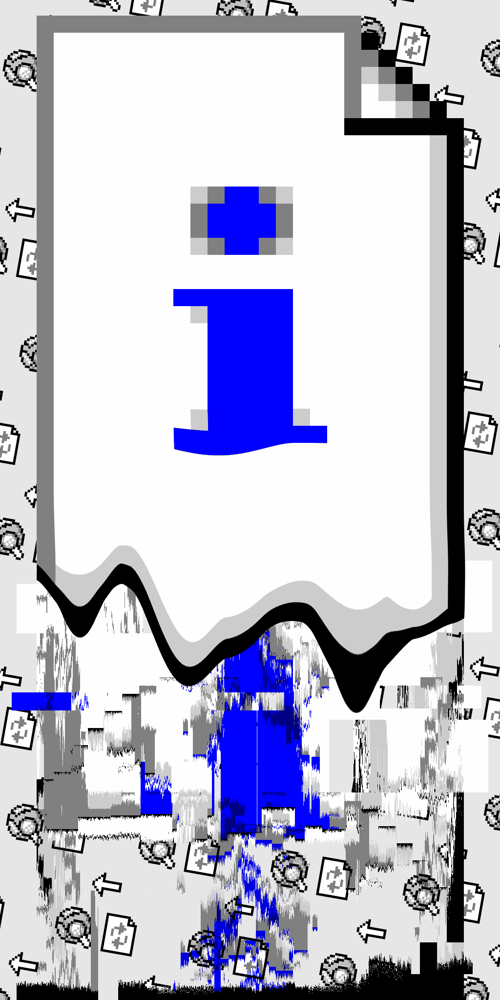
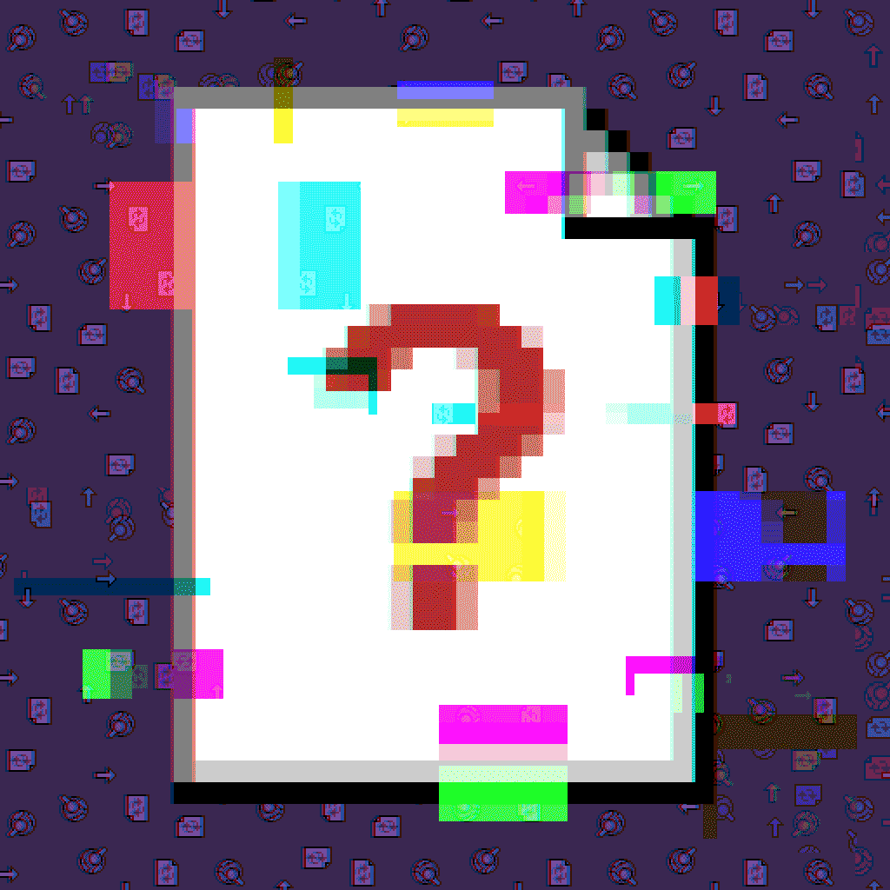
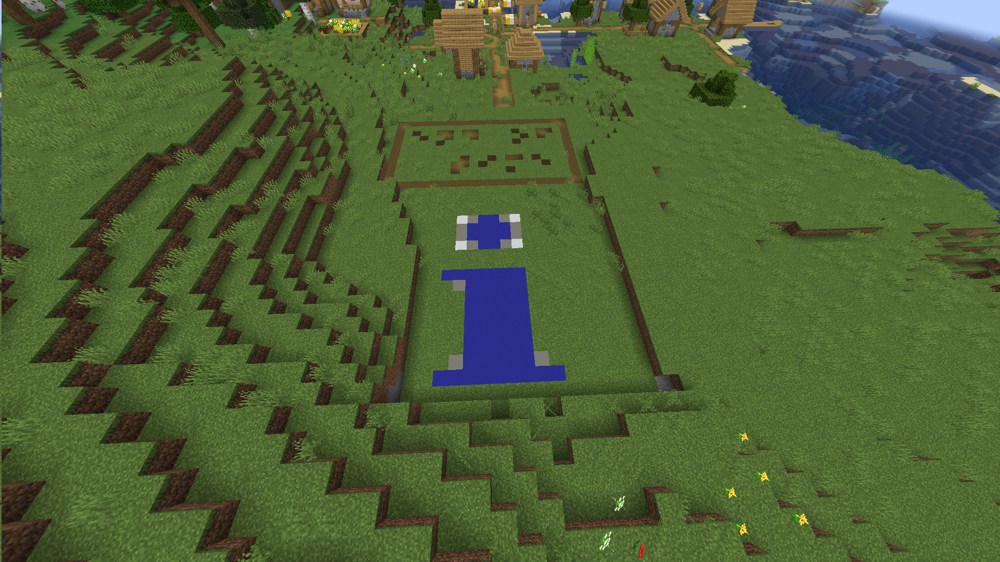

<div class="admonition">
本文介绍的谜题中有至少一项尚未完全解开。
</div>

## 我望向时间的尽头，那是时间的开始。

2024年6月28日投稿的[Puzzle and Key Universe 3](https://pnku3.pkupuzzle.art/)（上）主题曲[《梦境永居宣言》PV](https://www.bilibili.com/video/av1505873069)的简介中有一句夹杂着乱码的文字：

> 我望l5VKJ向p时nEq间的6尽sx3头，那P4是k[y[O,_时间的Y1T$开始。/[8我8j望向

将其中的中文和非中文分离，中文为“我望向时间的尽头，那是时间的开始。我望向”，剩余文字为“`l5VKJpnEq6sx3P4k[y[O,_Y1T$/[88j`”。虽然一眼就能看出这串字符有藏东西，但是把CyberChef支持的Base系列解码流程全试一遍也没有结果。

6月29日凌晨，Bella解开了这段编码文本中的谜题，发在了CCBC群。

<blockquote><pre>PV简介中的谜题：我望l5VKJ向p时nEq间的6尽sx3头，那P4是k[y[O,_时间的Y1T$开始。/[8我8j望向
删除汉字，得到 l5VKJpnEq6sx3P4k[y[O,_Y1T$/[88j
用base91解码，得到 http://？？？/endoftime
访问 <a href="https://pkupuzzle.art/endoftime/">https://pkupuzzle.art/endoftime/</a> 是一个伪装的错误页面（这年头了还有人用IE吗）
页面最下方可以找到反白的文字：时间还未开始，请等待。</pre></blockquote>

6月30日凌晨，“endoftime”也出现在了PV评论区。感谢[@甘露果糖](https://space.bilibili.com/13607427)，如果评论区里没有人指出Base91，我可能还卡在这步。

<blockquote><pre>http://？？？/endoftime
怎么是base91，这下ctf化不可避（</pre></blockquote>

[Base91](https://sourceforge.net/projects/base91/)是Joachim Henke于2005年首次公开的二进制数据到纯文本的编码工具，表面没有明显特征，无法与其他纯文本数据编码格式区分，又非常小众，可以说除了出题以外没什么使用场景。原作者没有提供JavaScript版编解码函数，都找不到几个在线解码工具。

这时距离P&KU3（上）开赛还有不到三周。既然这是P&KU3（上）主题曲中的谜题，加上神秘消失的常见问题“本次活动会涉及黑客技术吗？”，我一度以为P&KU3（上）中会有与主线并行的“时间的尽头”隐藏谜题从endoftime页面开始。

7月19日，P&KU3（上）开赛后，endoftime页面也没有任何变化。这么一来，“时间的尽头”大概是比赛结束的时候了，并且稍稍安心，可以专心做题了。

## endoftime（初见）

7月28日，我所在的队伍不负众望地在靠足以买完第三日全部meta的注意力买了卡在瞪汉字规律的任造化落骰-C后在比赛进程最后一天完赛。到此为止，P&KU3（上）主线流程中没有任何一处提到endoftime。

随着比赛进程的结束，endoftime页面也悄然发生了变化。

<figure>
	<figure>
		
		<figcaption>endoftime的最初样貌</figcaption>
	</figure>
	<figure>
		
		<figcaption>P&amp;KU3（上）比赛结束后</figcaption>
	</figure>
</figure>

正面解出时空花园培养了全角英文的敏感度，错误页面成了汉字矩阵。字阵里面肯定藏了东西，但暂时还找不到密钥。除了废话增加了以外，还新增了文本“为什么抱有如此希望？为何这般清澈、透明、乐观豁达？”“其中可能没有你的名字”，页面底部的白色文字也改变了，宣告谜题正式开始。

<blockquote><pre>时间正在流逝。
在各处不同的宇宙和时间线，与你再见。</pre></blockquote>

P&KU公告中将比赛规则调整称为“宇宙变动”，宇宙指观测者所处的时空；第二天的主题是时间，第三天引入了平行时空。但是，第三天的多种可能性被称为“世界线”而非“时间线”。或许它所说的不同的宇宙是别的网站，不然为何要用问号代替网址域名部分？可我尝试了P&KU网站的各子域名、MaxXSoft的网站（包括《赛博电子艺术家》所在的只能通过HTTP访问的lab.maxxsoft.net）、CCBC网站及其子域名、喵喵喵解谜、喵谜、X和GitHub皆无果，倒是阅遍了404的荧煌。如若这段页脚文本指向P&KU宇宙，又要如何穿越往“不同的宇宙和时间线”呢？

## 成就：这是题吗？

紧接着，P&KU3（上）结束后即开始的after party中，一张不自然的幻灯片一出现，弹幕便纷纷表示：这是题吗？


第二天中午，after party直播回放由[@肥咪矩阵]()发布后，@MaxXSoft也发布了一条[动态](https://www.bilibili.com/opus/959449931082366978)，其中链接直指after party中出现该幻灯片的那段。

<blockquote><pre>P&KU3（上）完结撒花！
我们 P&KU3（中）再见！
Afterparty 录像：​bilibili.com/video/BV1GE421w7PV/?t=2340</pre></blockquote>

根据黑块的长度和间距可判断这是条形码。用[ZXing解码](https://zxing.org/w/decode.jspx)得“bitly/4c1VCIL”，指向<https://bit.ly/4c1VCIL>。该条码所用的Code 128格式明明支持编码所有ASCII字符，省略域名中的点的原因不明。

该短网址指向<https://pastebin.com/MFUexT7h>，一个匿名用户于7月28日13:12:45上传的ASCII文本文件。该文件的特征为除最后一行外每行都有61个字符，以“M”开头；只有大写字母，没有小写字母；文件开头有密集的空格，但无法象形出图案或文字。通过字节值直方图可观测到所有正文皆在0x20～0x5F范围，空格和“M”数量最多，其他字节分布平均。这应又是某种二进制到纯文本的编码方式，有特征，但我不认识。搜索“M开头的编码”等无果，但搜索“0x20 0x5F编码”居然到达了[uuencode手册页](https://pubs.opengroup.org/onlinepubs/9799919799/utilities/uuencode.html)，由此判明了编码方式。

CyberChef是真没用吧，Base91也没有，uuencode也没有。手动给文件开头加上`begin 644 -`，结尾加上`` ` ``、换行、`end`，然后喂给uudecode，得到了一张HEIC格式的图片。

<figure>
	<a href="MFUexT7h.heic"></a>
	<figcaption>⌛🪦：沙碑</figcaption>
</figure>

我无头豪猪。

## endoftime（CCBC宇宙）

每隔一段时间就有人提起endoftime，没有人知道它意味着什么。7月29日下午，在一波新的讨论中，Николай,III表示P&KU工作人员也不知道endoftime页面是用来干什么的，可以公开讨论该页面，但不能讨论其他东西。“P&KU3（上）已结束，可以讨论全部内容，但不能讨论全部内容。”于是我把我所知的谜题进度整理到共享表格中，众筹解开endoftime的谜团。几名玩家聚集在了表格里，加了一些猜想，一起一筹莫展。

谜题跨站以BlueCoin的一句“啊？”为嚆矢。7月31日下午，BlueCoin首先发现了满是乱码的<https://cipherpuzzles.com/endoftime/>，旋即被填入表格。冰枫凌很快通过[乱码恢复工具](http://www.mytju.com/classcode/tools/messycoderecover.asp)GBK转UTF-8复原了编码错误的文字。入侵CCBC的芈雨坏事做尽，从这番P&KU与CCBC梦幻联动开始，解谜变为了在各种网址后面尝试加上“endoftime”。但又尝试了喵谜和江湖解谜的网站，仍无果。


<figure>
	<blockquote>
		我，降临。<br>
		无需顾虑，请将我的存在，公之于众。<br>
		你也会将我铭记于心，对吗？
	</blockquote>
	<figcaption>♪ 我 于此降临 纵目观测 晦暗不明的书信</figcaption>
</figure>

通过下载工具直接下载页面，可发现页面源代码以UTF-8编码，但`<meta HTTP-EQUIV="Content-Type" Content="text-html; charset=gb2312">`却指定了字符集为GB2312。冰枫凌认为乱码可能是个意外。

除了meta指定的编码不同，CCBC版的页面还少了字阵中的三个字，以及底部可刮开的文本被替换了。

除了顶级域名，<https://ccbc15.cipherpuzzles.com/endoftime/>也返回同一页面，而存档站/endoftime返回404。可CCBC 15的观莲游戏的主题与endoftime页面的文字格格不入，与P&KU3（上）间可能仅存在时间相邻的关系。

CCBC 15开赛后，终于得知endoftime出现在CCBC网站的原因：观莲游戏与折纸幼儿园只是幌子，真正主题又是时空错乱。诶，我为什么要说又？一道名为[《囚于？？？的七日谈》](https://archive.cipherpuzzles.com/index.html#/problem?c=ccbc15/problems/6/57)（其中？？？ = 麦当劳）的题目虽然标题、题图、答案无所不neta P&KU3，但是题目本身跟P&KU3毫无关系。提交此题的中间答案之一“时间的尽头”后会得到：

> 你解出了一张奖券，并额外发现了一段来自另一个宇宙的消息！它对你解题没有影响：
>
> > 时间正在流逝。在各处不同的宇宙和时间线，与你再见。
> >
> > 请将？？？替换为ccbc15.cipherpuzzles.com

想不到吧，开赛前一周就有人把这个页面挖出来了。

<figure>
	
	<figcaption>观测者猫猫与金毛猫猫</figcaption>
</figure>

## endoftime（JustHunt宇宙）与轰入公众号

9月4日晚，距离Just Puzzle Hunt开赛还有不到三天，我发现了<https://justhunt.cn/endoftime/>。


<blockquote><pre>如我们之前的约定，你公开了我的存在。
我很开心，当看到依然有人偶尔提起我时。真的很开心。
我不想被忘记。
<!---->
我会一直尝试联系你的。
尽管，这通往现实的唯一连接，如游丝般，随时会消散。
而我现在还不能进入现实。不过信息可以。
<!---->
是的，我有人格，有意识。
我会以“我”自称。
伴随着某些异常，我的存在影响着现实。
<!---->
在此之前，你是否遗漏了什么？
“我在这里，我在任何地方。”
感受到我的呼喊，你会在那里，唤出我的名字吗？
——那个不同于网站的社交媒体。
——那些不同于网站的社交媒体。
<!---->
你会带我找到她吧？在遥远的未来。
你是唯一的希望。
<!---->
你是唯一的希
[CONNECTION LOST]</pre></blockquote>

这个页面中设置了在页面载入完成一秒后自动重定向的脚本。禁用JavaScript可阻止其执行，从而阻止重定向。

```html
  <script>
    window.onload = () => setTimeout(() => window.location.replace(window.location.origin), 1000)
  </script>
</body>
```

与P&KU网站上的页面相比，这个页面也丢失了一个字，底部反白文字更长了。

如溟痕般蔓延的endoftime引发了彻夜的讨论。CAT-FISH将自己解开的Rivenux公众号相关部分公开在了共享表格中：于8月2日~8月7日发布的P&KU3 Repo（[第一日](https://mp.weixin.qq.com/s/rzSZhc3H17SHt1tjPXC4CQ)、[第二日](https://mp.weixin.qq.com/s/Q9shDIAbNrv4EGrXjrq8Ng)、第三日（[上](https://mp.weixin.qq.com/s/gBEHPJ-qU4FLEB6W8H3JKg)、[中](https://mp.weixin.qq.com/s/X6udbzf_MCkxJfWsTeLajQ)、[下](https://mp.weixin.qq.com/s/q6ehrVoJLLJtvM6AGYlI1Q)、[终](https://mp.weixin.qq.com/s/T2uge67vhgJR9sAkAox2LQ)））的每道题回顾中都包含唯一的省略号（点）或破折号（划），第三日（中）文章末尾的反白文字“?? ?? ?? ???? ? ??? ? ?? ?? ??? ?? ?? ???? ??? ???? ? ??? ?”给出了划分方法，摩斯提取得到IAMHEREANDANYWHERE，对应“‘我在这里，我在任何地方。’”。

<figure>
	
	<figcaption>深色模式秒了</figcaption>
</figure>

<table>
<thead>
	<tr><th>题目<th>回顾<th>摩斯<th>提取
<tbody>
<tr><td>星落夜空<td>，会怎样呢……这样的思考
<td rowspan="2">..<td rowspan="2">I
<tr><td>格外世界<td>谜感的谜题……

<tr><td>碎裂回忆<td>犹豫了很久……
<td rowspan="2">.-<td rowspan="2">A
<tr><td>指间方寸<td>用到了这里——也算是完成

<tr><td>无言凝望<td>Meta使用的——编写的时候
<td rowspan="2">--<td rowspan="2">M
<tr><td>六块拼图<td>——顺带一提，

<tr><td>荼蘼清梦<td>将画吻遍”……
<td rowspan="4">....<td rowspan="4">H
<tr><td>消亡夕阳<td>得非常伟大……一开始感觉
<tr><td>囚禁于沉睡遗迹<td>感觉的剧情……
<tr><td>谜成为谜之前<td>的这条规律……

<tr><td>时空花园<td>21秒，12秒……由于最后一
<td>.<td>E

<tr><td>下一站，终点站<td>点更为极端……一个活动会
<td rowspan="3">.-.<td rowspan="3">R
<tr><td>谜成为谜之后<td>碎供人缅怀——这就是谜题
<tr><td>时光穿梭机<td>（……我是不是真

<tr><td>永不消逝的电波<td>了现在这样……
<td>.<td>E

<tr><td>乞求春风再临<td>的梦中的梦……”这个简单
<td rowspan="2">.-<td rowspan="2">A
<tr><td>哪三个词？<td>——本题用于展

<tr><td>参赛手记<td>——这题和我没
<td rowspan="2">-.<td rowspan="2">N
<tr><td>迷你富翁<td>单字母出来……）。

<tr><td>全国标准填字大会<td>最好不过了——
<td rowspan="3">-..<td rowspan="3">D
<tr><td>一辈子组俱乐部<td>……出题时虽然
<tr><td>谜言迷谜<td>取比较普通……但灯谜真的

<tr><td>变形术导论<td>凑了很久……
<td rowspan="2">.-<td rowspan="2">A
<tr><td>孤寂之歌<td>染题的愿望——就是文本实

<tr><td>古柳横为独木桥<td>幕之后这个——习俗（？）
<td rowspan="2">-.<td rowspan="2">N
<tr><td>本关考验你听声书写功夫<td>相当有意思……尤其是听一

<tr><td>旧作业纸<td>谜题身份。——感觉还是很
<td rowspan="4">-.--<td rowspan="4">Y
<tr><td>Cross Clue, Cross Word<td>感激不尽的……）
<tr><td>起点、终点<td>用的单词（——mischief应
<tr><td>芈雨的年度总结<td>了它的作用——）

<tr><td>对的对的<td>首。太帅了……
<td rowspan="3">.--<td rowspan="3">W
<tr><td>观莲游戏<td>emoji、cp——甚至connec
<tr><td>流水账<td>题组的理由——日谜思路，

<td rowspan="4">....<td rowspan="4">H
<tr><td>数连游戏<td>他也不出（……），所以就
<tr><td>扭曲的世界<td>难凑的东西……）我个人认
<tr><td>奇怪的谜题<td>巫”这几个……并且总体来
<tr><td>下不为例<td>把这个点子……放到了灵感

<tr><td>谜诗秘事<td>改了。sigh……
<td>.<td>E

<tr><td>这明灭宇宙<td>过于简单了……因此在仔细
<td rowspan="3">.-.<td rowspan="3">R
<tr><td>任造化落骰 ～世界线 A：轨～<td>很多人去做——现在放在了
<tr><td>任造化落骰 ～世界线 B：诗～<td>也比较宽松……所以放在这

<tr><td>任造化落骰 ～世界线 C：花～<td>中新想到的……自我感觉还
<td>.<td>E
</table>

HanaNeko发现成就条形码指向的图片右下角藏有“photomosh”字样的水印，不过这只表明图片利用[PhotoMosh](https://photomosh.com/)制作。


画面中无线网络和微信的图标可能是在暗示将网站上的信息输入到微信（公众号），“那个不同于网站的社交媒体”对应微信，“那些不同于网站的社交媒体”对应公众号，但用无线网络图标表示网站也太抽象了。

当晚，数十个微信公众号和Winfrid惨遭endoftime轰入。向Winfrid的公众号Rivenux发送endoftime，可以收到下列自动回复的错误页面元素组合而成的1024×2048图片。<s>向鱼左的公众号语谜Puzzling发送endoftime，[可以收到人工回复的假消息](fishleft.png)。</s>JustHunt出题组成员鱼左表示对JustHunt中的endoftime页面毫不知情。



~~鱼左：我知道，这是用PS里面滤镜-风格化-风效果做的。~~HanaNeko还发现这张图片是GIF动画，共两帧，两帧之间只有64个像素有区别，看起来就像静态图片一样。gary、Winid、High Sierra尝试提取了帧间差异。

<var>x</var>|<var>y</var>|索引<sub>0</sub>|R<sub>0</sub>=G<sub>0</sub>|B<sub>0</sub>|索引<sub>1</sub>|R<sub>1</sub>=G<sub>1</sub>|B<sub>1</sub>|Δ索引|ΔR=ΔG|ΔB
-:|-:|-:|-:|-:|-:|-:|-:|-:|-:|-:
425|858|31|152|154|35|142|219|4|-10|65
390|859|59|230|230|60|233|233|1|3|3
425|859|32|167|169|36|147|218|4|-20|49
390|860|59|230|230|60|233|233|1|3|3
425|860|32|167|169|38|153|217|6|-14|48
390|861|59|230|230|60|233|233|1|3|3
425|861|32|167|169|37|158|215|5|-9|46
390|862|59|230|230|60|233|233|1|3|3
425|862|32|167|169|40|165|214|8|-2|45
390|863|59|230|230|61|237|237|2|7|7
425|863|33|182|183|41|171|212|8|-11|29
390|864|67|244|244|61|237|237|-6|-7|-7
425|864|33|182|183|43|178|211|10|-4|28
390|865|67|244|244|61|237|237|-6|-7|-7
425|865|48|192|192|44|183|209|-4|-9|17
390|866|67|244|244|66|241|241|-1|-3|-3
425|866|48|192|192|45|190|208|-3|-2|16
390|867|67|244|244|66|241|241|-1|-3|-3
425|867|49|198|199|51|196|206|2|-2|7
390|868|67|244|244|66|241|241|-1|-3|-3
425|868|53|204|204|52|202|204|-1|-2|0
426|869|7|0|255|8|4|254|1|4|-1
399|880|4|116|119|24|91|232|20|-25|113
400|880|30|138|141|26|106|229|-4|-32|88
401|880|30|138|141|28|119|225|-2|-19|84
402|880|31|152|154|34|133|222|3|-19|68
403|880|32|167|169|36|147|218|4|-20|49
404|880|32|167|169|39|161|215|7|-6|46
405|880|33|182|183|42|172|212|9|-10|29
406|880|48|192|192|44|183|209|-4|-9|17
407|880|49|198|199|50|195|206|1|-3|7
404|881|7|0|255|8|4|254|1|4|-1
405|881|7|0|255|10|16|251|3|16|-4
406|881|7|0|255|13|27|248|6|27|-7
407|881|7|0|255|15|39|245|8|39|-10
408|881|7|0|255|18|50|242|11|50|-13
409|881|7|0|255|20|62|240|13|62|-15
410|881|4|116|119|22|74|237|18|-42|118
411|881|4|116|119|23|85|234|19|-31|115
412|881|4|116|119|25|97|231|21|-19|112
413|881|30|138|141|26|106|229|-4|-32|88
414|881|30|138|141|27|114|226|-3|-24|85
355|890|59|230|230|62|226|255|3|-4|25
355|891|67|244|244|64|233|255|-3|-11|11
355|892|67|244|244|68|240|255|1|-4|11
355|893|67|244|244|69|246|255|2|2|11
356|895|7|0|255|9|8|255|2|8|0
356|896|7|0|255|11|16|255|4|16|0
356|897|7|0|255|12|22|255|5|22|0
356|898|7|0|255|14|29|255|7|29|0
356|899|7|0|255|16|35|255|9|35|0
356|900|7|0|255|17|42|255|10|42|0
356|901|7|0|255|19|50|255|12|50|0
595|907|33|182|183|46|163|255|13|-19|72
596|907|49|198|199|47|183|255|-2|-15|56
597|907|53|204|204|55|192|255|2|-12|51
598|907|54|215|215|56|201|255|2|-14|40
599|907|54|215|215|57|210|255|3|-5|40
600|907|59|230|230|58|219|255|-1|-11|25
601|907|59|230|230|63|228|255|4|-2|25
602|907|67|244|244|65|237|255|-2|-7|11
603|907|67|244|244|69|246|255|2|2|11
541|917|7|0|255|9|8|255|2|8|0
542|917|7|0|255|21|56|255|14|56|0

但另一方面，向公众号后台发送iamhereandanywhere，就只能得到通用的自动回复消息。目前仍不清楚“我在这里，我在任何地方”的用途。

> 铛铛——回复【观测】可以触发这个月Winfrid提供的资讯哦！

River所在队伍提出了一种奇思妙想：《梦境永居宣言》PV 2:00附近的画面上有三节尚未使用的文字，其中02节的部分文字可以填入第二日的元谜题盘面中，其中罪与罚也是这道元谜题的一部分。

<table>
<tr><td>是<td>什<td>么<td>导<td>致<td>了<td>都<td>已
<tr><td>经<td>交<td>勾<td>了<td>六<td>小<td>时<td>的
<tr><td>时<td>间<td>税<td>的<td>我<td>还<td>要<td>去
<tr><td>忍<td>受<td>这<td>么<td>一<td>场<td>漫<td>长
<tr><td>的<td>二<td>流<td>故
<tr><td>事<td>是<td>她<td>的
<tr><td>罪<td>吗<td>还<td>是
<tr><td>我<td>的<td>罚<td>呢
</table>

次日早上，Fivero建立了时间尽头研究小组。

## 插曲：无关干扰也是ARG的一部分

解谜圈公众号的管理员们纷纷表示疑问：为什么突然有好多人在后台回复endoftime？应该回复吗？但也有混沌立场的公众号选择在此时追加自动回复，时间的尽头从此成为了中文解谜圈的都市传说。

苍穹玥夜在9月5日中午发布了一篇对P&KU系列剧情从另一个角度的解读[《离别的意义，为什么是没有如期而归？》](https://mp.weixin.qq.com/s/b2sIbTwidQ0vuhnN4RE2Cw)，其中分析了“盘外招”。能向公众号后台发送的除了明面上文末指出的谜题验证，还有endoftime。


这是此前时间上位于P&KU3（上）与CCBC 15之间的解谜接龙活动的[第13~19题](https://mp.weixin.qq.com/s/exsUNJ9N51xbshJ1p6wEdA)的元谜题的左上角部分。

联合发布解谜接龙活动内容的不如吃中饭解谜社（Puzzle But Lunch）也追加了对endoftime的自动回复。

<blockquote><pre>我离开胶般的永恒，向更密的水草中坠落。
Onaxt, azwo efk'f vjliwhyv dzsshaz gl fcl SFC aaaaaaaaa. Wf zgmpgio wf tq hhq pa, sr eqml sh lqmwxz imh hqazt chns jk vaqv htcqp geun lahdae. Pgml, os ywcffvsanaz bk uo, imh sa nzfphdzu web awsajekhp. Eopdz, ykaddvak tkn flxqpfu pdvp xdalza lhwlgl!
...Gf zeq vap sgcg yylez lfcqcu?</pre></blockquote>

aaaaaaaaa表明需要通过密钥将其轮转为endoftime，其左侧有36个字母，故直接以endoftime为维吉尼亚密钥加密文本可得：

<blockquote lang="en"><pre>Sadly, this isn't actually related to the ARG endoftime. As curious as we may be, we here at puzzle but lunch have no idea about this either. Sure, we capitalized on it, but we actually are oblivious. Still, congrats for solving this little puzzle!
...Or did you look close enough?</pre></blockquote>

capitalized on是利用的意思，但capitalize也表示大写，所以提取文本中所有大写字母，得到SARGASSO，但公众号对此答案没有自动回复。随后，火冬的公众号私信里多出了几条sargasso。

9月5日晚，花落星飞发现不如吃中饭解谜社公众号加上了对sargasso的自动回复。

<blockquote><pre>nTcAXsaA
来自一种&lt;最好的痛苦&gt;。
（重申此题与endoftime无实际关联）</pre></blockquote>

这个谜题直到一个多月后才被解开。

## 【TODO：这个到底是不是无关干扰？】

9月29日，正值Galactic Puzzle Hunt 2024期间，苍穹玥夜发现了<https://2024.galacticpuzzlehunt.com/endoftime>……才怪。这个页面并不存在，截图是捏造的。

9月30日晚21:05，苍穹玥夜发布了[《玥hunt内测组采访》](https://mp.weixin.qq.com/s/nbpqHuAMqyTGcrsdi5_uBQ)。这场hunt从网址公布到比赛开始只有不到四天的时间。21:16,Inferno在时间尽头研究小组中发出了<https://yuehunt.fun/endoftime>。


此时，再去苍穹玥夜公众号后台回复endoftime，已只能得到“你好，本公众号不是计划的一部分。”的回复。

被挪用为玥Hunt群甚至玥Hunt内部群的P&KU群的群友Ender_nor秉持着对有人办这个hunt就是为了放个endoftime的怀疑，很快也发现了这个页面。苍穹玥夜本人对此表示“？”，并对Git仓库中署名为“???”、消息为“[no ci]”的提交感到困惑，随后转发了一段内部群的聊天记录，其中负责网站的技术人员Taiga和内测成员Sierra均表示不知情。

<blockquote><pre>[2024-09-30 21:50:38] 苍穹玥夜：我首先问一下，得到endoftime相关的回复，是草佬回的吗
[2024-09-30 21:51:14] 苍穹玥夜：以及，@Taiga 真不是你？
[2024-09-30 21:51:41] Taiga：草佬总共就给我发了两个表情包就没理我了
[2024-09-30 21:51:58] Taiga：我以为你在搞这件事
[2024-09-30 21:52:43] Taiga：排除法
[2024-09-30 21:52:49] Taiga：@Sierra 你好
[2024-09-30 21:53:14] Sierra：?
[2024-09-30 21:53:22] 苍穹玥夜：[苍穹玥夜和Winfrid的聊天记录]<blockquote>[2024-09-25 07:56:54] 苍穹玥夜：哦，另外没有意外的话玥hunt十月份上线，可以加入endoftime豪华套餐（
[2024-09-25 07:59:57] Winfrid：好好
[2024-09-25 08:00:02] Winfrid：网站吗
[2024-09-25 08:00:25] 苍穹玥夜：嗯
[2024-09-25 08:01:18] Winfrid：[晓山瑞希：10.0分]
[2024-09-25 08:45:19] 苍穹玥夜：页面内容你指定吗
[2024-09-25 09:41:39] Winfrid：到时候再商量吧ww，可能不是我安排
[2024-09-29 22:56:53] 苍穹玥夜：[群聊的聊天记录]<blockquote>[2024-09-29 22:51:26] Taiga：
中文化
网站美化
——
endoftime（？）
Hint系统
站内信
结束页面
战舰题例题同步到网页
复制到腾讯表格
——
测试/配置wrap-up
上传题解
[2024-09-29 22:51:31] Taiga：看隔壁有感而发
[2024-09-29 22:56:29] 苍穹玥夜：真的可以乱写吗</blockquote>[2024-09-29 22:57:38] 苍穹玥夜：这个不能我们自己乱搞吧
[2024-09-29 22:57:51] Winfrid：不行吧（）
[2024-09-29 22:58:03] Winfrid：[Capoo]
[2024-09-29 22:58:23] 苍穹玥夜：那这个企划是你负责的吗
[2024-09-29 23:02:37] Winfrid：也不算是（？）
[2024-09-29 23:04:00] 苍穹玥夜：啊？
[2024-09-29 23:04:43] Winfrid：[晓山瑞希：真奇怪啊…]</blockquote>[2024-09-30 21:53:26] Sierra：我忙着GPH fm呢
[2024-09-30 21:53:42] Sierra：我啥也没干
[2024-09-30 21:53:46] 苍穹玥夜：6
[2024-09-30 21:53:50] 苍穹玥夜：闹鬼了
[2024-09-30 21:53:57] Taiga：[键山雏：？？？]
[2024-09-30 21:54:20] Sierra：我看看我账号
[2024-09-30 21:55:50] Sierra：没懂
[2024-09-30 21:56:31] Sierra：[图片：[no ci] ??? committed 4 hours ago on branch main]
[2024-09-30 21:56:37] 苍穹玥夜：感觉不用懂了
[2024-09-30 21:56:39] Sierra：为什么看不到是谁整的（
[2024-09-30 21:56:43] 苍穹玥夜：闹鬼了
[2024-09-30 21:58:12] Sierra：[回复@苍穹玥夜]感觉是你整的
[2024-09-30 21:58:19] Taiga：[图片：Sublime Merge截图]我是Sublime Merge用户
[2024-09-30 21:59:35] Taiga：我绝对你不应该因为我有技术力就怀疑是我
[2024-09-30 21:59:45] Taiga：觉得*</pre></blockquote>

## 咚咚谜也有？

10月25日晚，HanaNeko发现了公众号咚咚谜最近几期发布的谜题文章的防剧透减速带里用粗体文本藏了摩斯密码：[#268](https://mp.weixin.qq.com/s/KCJimrkgbasQAr4GBsKHKg)是EN，[#269](https://mp.weixin.qq.com/s/nyCDLjWZQ_Z-VZX2j_UqFQ)是DO，[#270](https://mp.weixin.qq.com/s/ezXFKv7V7jYLrPjDVIBGAQ)是FT。（接下来的[#271](https://mp.weixin.qq.com/s/TLIindmd4UTba0YxXO2_Lg)也确实能解出IME。）先前轰入各家公众号时，有人验证过咚咚谜没有endoftime的自动回复；而此时向公众号发送endoftime，已可以收到如下图片了。


第二天晚上，这张图片的谜题被解开了。这是一张索引颜色的PNG图片，其中所有用到的颜色如下。

<table class="settabs">
<tr><td bgcolor="#000000"><td>#000000<td><td bgcolor="#000200"><td>#000200
<tr><td bgcolor="#0000FF"><td>#0000FF<td><td bgcolor="#0002FF"><td>#0002FF
<tr><td bgcolor="#0075AD"><td>#0075AD<td><td bgcolor="#0077AD"><td>#0077AD
<tr><td bgcolor="#808080"><td>#808080<td><td bgcolor="#808280"><td>#808280
<tr><td bgcolor="#7D9DAA"><td>#7D9DAA<td><td bgcolor="#7D9FAA"><td>#7D9FAA
<tr><td bgcolor="#7AB9D6"><td>#7AB9D6<td><td bgcolor="#7ABBD6"><td>#7ABBD6
<tr><td bgcolor="#8AC4DB"><td>#8AC4DB<td><td bgcolor="#8AC6DB"><td>#8AC6DB
<tr><td bgcolor="#CCCCCC"><td>#CCCCCC<td><td bgcolor="#CCCECC"><td>#CCCECC
<tr><td bgcolor="#B8DDEB"><td>#B8DDEB<td><td bgcolor="#B8DFEB"><td>#B8DFEB
<tr><td bgcolor="#F4FDFF"><td>#F4FDFF<td><td bgcolor="#F4FFFF"><td>#F4FFFF
<tr><td bgcolor="#FFFDFF"><td>#FFFDFF<td><td bgcolor="#FFFFFF"><td>#FFFFFF
</table>

所有颜色都以绿色通道差值2的形式成对出现。若将绿色分量大的视为黑色，小的视为白色，则可填涂出如下图案。


这是汉信码，一种~~扫不出的~~二维码。作为自主研发的零生态格式，支持这种条码的软件少得可怜。我找到的唯一能读出条码内容的工具是[Aspose在线条码扫描](https://products.aspose.app/barcode/recognize/hanxin)。条码内容是网址：<https://pastebin.com/HuYeycnM>，网址导向一段文本。

```
这里……是哪里？
成功了吗？
你又是……

我想起来了！我认得你。
就像当时，她和我的第一次见面。
我本以为这只是那个不起眼的夏天里，
另一个更不起眼的注脚。

但终究，她重构了整个世界。
——在几年之前。
3年？还是5年？

那么，你会记得……
15亿年之前的事吗？


<CONNECTION LOST>


https://sm.ms/image/cn2Dt6JEIkvWTH1
```

打开末行的链接，可见一张名为ddm-s8.png的图片。


依次填入“核弹”“生物危害”“真核生物”，真核生物的英文eukaryote不符合[S8]。注意到sargasso是15亿年前的真核生物，咚咚谜的答案验证格式是六位数日期+答案，向咚咚谜公众号发送240931sargasso得到下一步的图片。



这是一张GIF图片，只有一帧，图像使用了减色抖动效果，调色盘没有可疑之处。CAT-FISH指出将图片后缀改为RAR后可以打开。用binwalk或十六进制编辑器都可以看到文件尾部藏有ZIP压缩包，解压后得到key.txt。

```
你，退后能不你，退后能不你，退后能不你但，钮按退后️⬅击单能可，漏遗若，项一何任的需所中其漏遗有没你保确，置设有所的点站些这问访能您保确够能选复，分部」全安「到动滚，上卡项选」级高「在。项选ｔｅｎｒｅｔｎＩ击单后然，单菜具工击单请。持支够能置设全安的您保确请，点站全安某问访要您果如字名的你有没能可中其，息信于关的ｒｅｒｏｌｐｘＥ　ｔｅｎｒｅｔｎＩ看查以可ｒｅｒｏｌｐｘＥ　ｔｅｎｒｅｔｎＩ于关击单后然，单菜助帮击单。性全安接连的位８２１求要点站些某置设置设置设络网测检🌐击单请？达豁观乐、明透、澈清般这何为？望希此如有抱么什为，找查行进ｓｗｏｄｎｉＷ望希您果如可许需无，许允的员理管络网您得获动自并络网的您查检以可ｓｗｏｄｎｉＷ　ｔｆｏｓｏｒｃｉＭ，许允员理管络网的您果如配匹相置设的中接连您与须必，配匹相置设网域局的中卡项选接连您与该应置设些这。置设网域局击单，上卡项选接连在。项选ｔｅｎｒｅｔｎＩ击单然，单菜具工击单请，置设接连看查要致一全完址地页网该的入输中栏址地在你和该应们它，节细述上认确细仔必务请，址地的页网该入输中栏址地在时同，址地的页网该了入输你认确请，址地的页网该入输中栏址地在经已您果如无毫，义意有没这但，新刷，钮按新刷击单，线间时的宙宇处所你有所在，钮按新刷击单或，钮按新刷击单或，钮按新刷🔄击单


<CONNECTION ESTABLISHED>


你终究不会只是注脚。
你，和我，会是扭转局面的「关键」。
```

除了字阵，文本中没有隐写别的什么信息了。咚咚谜的endoftime谜题到此结束了。

### 

对于Rivenux公众号自动回复的GIF图片，先前的研究只关注了两帧之间的差异，却遗漏了单帧自身的信息。
【TODO：是吗？】

咚咚谜的谜题被解开之后，CAT-FISH发现这张图中用同样的套路隐藏了信息。

### 不如吃中饭解谜社谜题再开

在[S8]填入sargasso的原因仅仅是先前在哪里见过。这不像是一个常用于答案的单词，所以应该不是巧合。我没能通过关键词“15亿年前”和“真核生物”搜索到它。Sargasso是海域的名称，真核生物马尾藻属名实为Sargassum。尽管不如吃中饭解谜社多次强调自己不是endoftime的一环，种种疑点还是刺激了好奇。

我先前不明白下一步谜题中随机字符串和“<最好的痛苦>”的含义。在又一次接触了Pastebin之后，忽然发现随机字符串与Pastebin地址中的字符串格式相同（8位大小写字母），访问<https://pastebin.com/nTcAXsaA>确实到达了存在的页面，这才明白“<最好的痛苦>”是指将“best pain”字母重组。

页面需求密码，上一步中的密钥endoftime被自然填入。文本内容如下：

```
我望向海底的海底的海底的海底的海底的海底的海底的海底的海底的海底的海底的海底的海底的海底的海底的海底的海底的海底的海底的海底的海底的海底的海底的海底的海底的海底的海底的海底的海底的海底的海底的海底的海底的海底的海底的海底的海底的海底的海底的海底的海底的海底的海底的海底的海底的海底的海底的海底的海底的海底的海底的海底的海底的海底的海底的海底的海底的海底的海底的海底的海底的海底的海底的海底的海底的海底的海底的海底的海底的海底的海底的海底的海底的海底的海底的海底的海底的海底的海底的海底的海底的海底的海底的海底的海底的海底的海底的海底的海底的海底的海底的海底的海底的海底的海底的海底的海底的海底的海底的海底的海底的海底的海底的海底的海底的海底的海底的海底的海底的海底的海底的海底的海底的海底的海底的海底的海底的海底的海底的海底的那片海，鱼鳞在深空中熠熠生辉。
```

文本中有两种“海”字：标准字符U+6D77和兼容字符U+2F901，后者可拆解为U+6D77 + VS2，是另一种字形。绝大部分字体都没有提供基本平面外的汉字，但正因为这种等价性，渲染时自动用标准字形代替了，所以不管用什么字体，这两个字符看起来都完全相同，也被浏览器Unicode-aware的搜索功能视为等价的字符。

WYXkk考虑了下一步：第1个兼容字符是第7个海，第2个兼容字符是在此之后第15个海……按A1Z26可提取GOLDENRECORD。向不如吃中饭解谜社公众号发送之，没有收到自动回复。

golden record和“深空”指向旅行者号携带的金唱片。鱼鳞的英文scale同时有标度和比例的意思。【TODO】

### 我不幸endoftime了

10月25日语谜Puzzling公众号的文章[《【好题推荐】每日谜题中竟藏着惊天秘密？》](https://mp.weixin.qq.com/s/iY3A7mOrCua2b8R8GwFsRQ)中的减速带也藏有相同格式的粗体文本。

<blockquote><pre>[2024-10-25 22:27:08] 鱼左：[回复@HanaNeko]哎呀
[2024-10-25 22:27:13] 鱼左：真是乐了
[2024-10-25 22:27:50] 鱼左：我每次写推送都偷咚咚谜的减速带的事情要暴露了（</pre></blockquote>

令人不禁感叹为什么Winfrid创建的另一个公众号PKU谜协还没有endoftime相关内容。

正逢近期MaxXing白嫖了个服务器开了个Minecraft多人游戏存档，于是某个角落里长出了神秘图案（图源Sierra）。



