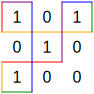

给定一个包含 0 和 1 且第一行第一列为 1 的矩阵 `matrix`。你需要从矩阵的 **左上角** 开始，沿矩阵数字之间和外侧的网格线上下左右移动任意格，形成线段组成的轨迹，最后回到起点，使所有 1 左侧的线段数目为 **奇数**，所有 0 左侧的线段数目为 **偶数**。

请返回线段数目的 **最小值**。

给定的矩阵中，所有 1 可能不是连通的。

**示例1：**



```
输入：matrix = [[1,0,1],[0,1,0],[1,0,0]]
输出：10
解释：一种方案是从左上角开始，向下 1 格，向右 3 格，向上 1 格，向左 1 格，向下 2 格，向左 2 格，向下 1 格，向右 1 格，向上 3 格，向左 1 格。不存在线段数更少的方案。
```

**示例2：**

```
输入：matrix = [[1]]
输出：4
```

**提示：**

* `1 <= matrix.length <= 200`
* `1 <= matrix.length[i] <= 200`
* `matrix[0][0] == 1`
