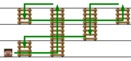

一幢房屋中的梯子需要检修。这幢房屋有个奇怪的特性：**经过** 每层楼的梯子数量总是 **偶数**。**经过** 指的是楼层位于梯子连接两层楼之间的半开半闭区间，即如果第 `i` 部梯子连接 <code>a<sub>i</sub></code> 和 <code>b<sub>i</sub></code> 层，且 `level` 满足 <code>a<sub>i</sub> <= level < b<sub>i</sub></code>，则称梯子 `i` **经过** 楼层 `level`。

一个检修工从底层（第 0 层）开始，一边爬梯子一边检查梯子的状况。梯子使他从一个楼层移动到另一个楼层。他将检查所有梯子 **至少一次**，最后回到底层。

给出房屋中的梯子连接的楼层列表，返回检修工使用梯子的顺序，使爬梯 **次数最少**。生成的数据保证存在至少一种可行的顺序。可能存在多种爬梯次数最少的顺序，你可以返回 **任意** 一种。

**示例1：**



```
输入：ladders = [[0,1],[0,3],[1,3],[3,2],[2,3]]
输出：[0,2,4,3,1]
解释：开始时，检修工在第 0 层。
梯子 0 连接第 0 层和第 1 层，检修工上升到第 1 层。
梯子 2 连接第 1 层和第 3 层，检修工上升到第 3 层。
梯子 4 连接第 2 层和第 3 层，检修工下降到第 2 层。
梯子 3 连接第 3 层和第 2 层，检修工上升到第 3 层。
梯子 1 连接第 0 层和第 3 层，检修工下降到第 0 层。
总计爬了 5 次梯子。因为总共有 5 个梯子，不存在爬梯次数更少的方案。
[0,2,3,4,1] 和 [1,4,3,2,0] 也是可接受的输出。
```

**示例2：**

```
输入：ladders = [[0,1],[0,1]]
输出：[0,1]
[1,0] 也是可接受的输出。
```

**提示：**

* `2 <= ladders.length <= 10⁵`
* `0 <= ladders[i][j] <= 500`
