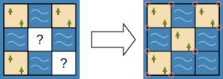

一张地图用大小为 `m × n` 的网格 `grid` 表示，其中每个格子可以是海洋、陆地或者是未知。

- 海洋用字符 `'.'` 表示。地图以外的区域被海洋包围。
- 陆地用字符 `'#'` 表示。
- 未知的格子用字符 `'?'` 表示。

**角** 是一种网格线的交点，其周围四个格子中有一个格子与另三个格子不同（即三块陆地、一块海洋，或三块海洋、一块陆地）。

请将地图中未知的格子填充为海洋或陆地，使地图中 **角** 的数量 **最少**。返回修改后的地图。可能有多种填法使角最少，你可以返回 **任意** 一种。

**示例 1：**

<!---->

```
输入：grid = ["#.#",".?.","#.?"]
输出：["#.#",".#.","#.."]
解释：填充后的地图共有 10 个角。其他填充方法都会产生更多的角。
```

**示例 2：**

```
输入：grid = ["####?","?...?"]
输出：["#####","....."]
解释：["####.","....."] 也是可接受的输出。
```

**示例 3：**

```
输入：grid = ["??????"]
输出：["......"]
``` 

**提示：**

- `m == grid.length`
- `n == grid[i].length`
- `1 <= m, n <= 100`
- `grid` 仅包含字符 `'.'`, `'#'` 以及 `'?'`
- `grid` 包含 **至少一个** `'?'`

---

部分测试用例：

```
["#.#",".?.","#.?"]
["#.#",".#.","#.."]
["??????"]
["......"]
["###","#.#","#?#","#.#","###"]
["###","#.#","#.#","#.#","###"]
["#..",".?#","#.#"]
["#..",".##","#.#"]
["#.#",".?.",".#."]
["#.#",".#.",".#."]
["???#","??##","?###","####","##.."]
["####","####","####","####","##.."]
```

以及所有旋转、翻转后的地图。以上测试用例的输出是唯一的。
