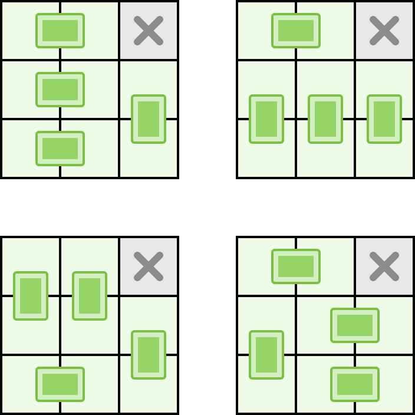

你有一块棋盘，棋盘上有一些格子已经坏掉了。你还有无穷块大小为 1 × 2 的多米诺骨牌，你想把这些骨牌不重叠地覆盖 **所有** 完好的格子上，这些骨牌可以横着或者竖着放。请找出覆盖骨牌的 **方案总数**。

输入 `board` 是一个 0 和 1 组成的矩阵，其中 0 表示坏掉的格子，1 表示完好的格子。

示例1：

输入：`[[1, 1, 0], [1, 1, 1], [1, 1, 1]]`
输出：`4`
解释：所有方案如下。

<!---->

示例2：

输入：`[[0, 1, 1, 0], [1, 1, 1, 0], [1, 0, 1, 1], [1, 1, 1, 1], [1, 1, 0, 0]`
输出：`9`

示例3：

输入：`[[1, 1], [1, 0]]`
输出：`0`

提示：

- `m == board.length`
- `n == board[i].length`
- `1 <= m, n <= 8`
- `0 <= board[i][j] <= 1`
- 完好的格子未必是连通的

---

本题灵感来源于Galactic Puzzle Hunt 2024中[Domino Effect](https://2024.galacticpuzzlehunt.com/puzzle/domino_effect)一题，示意图设计抄自[LCP 04. 覆盖](https://leetcode.cn/problems/broken-board-dominoes/)。
