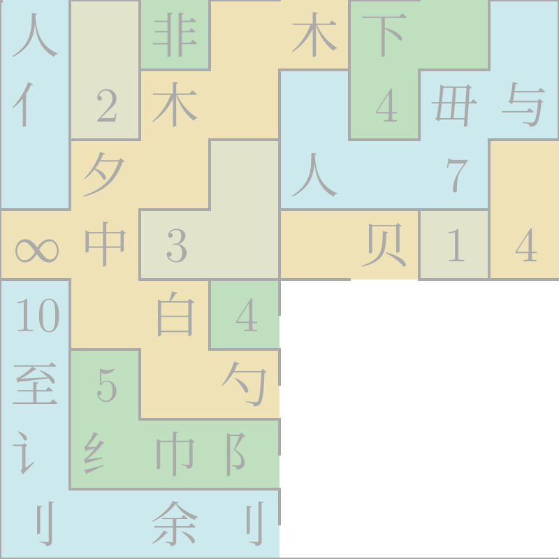
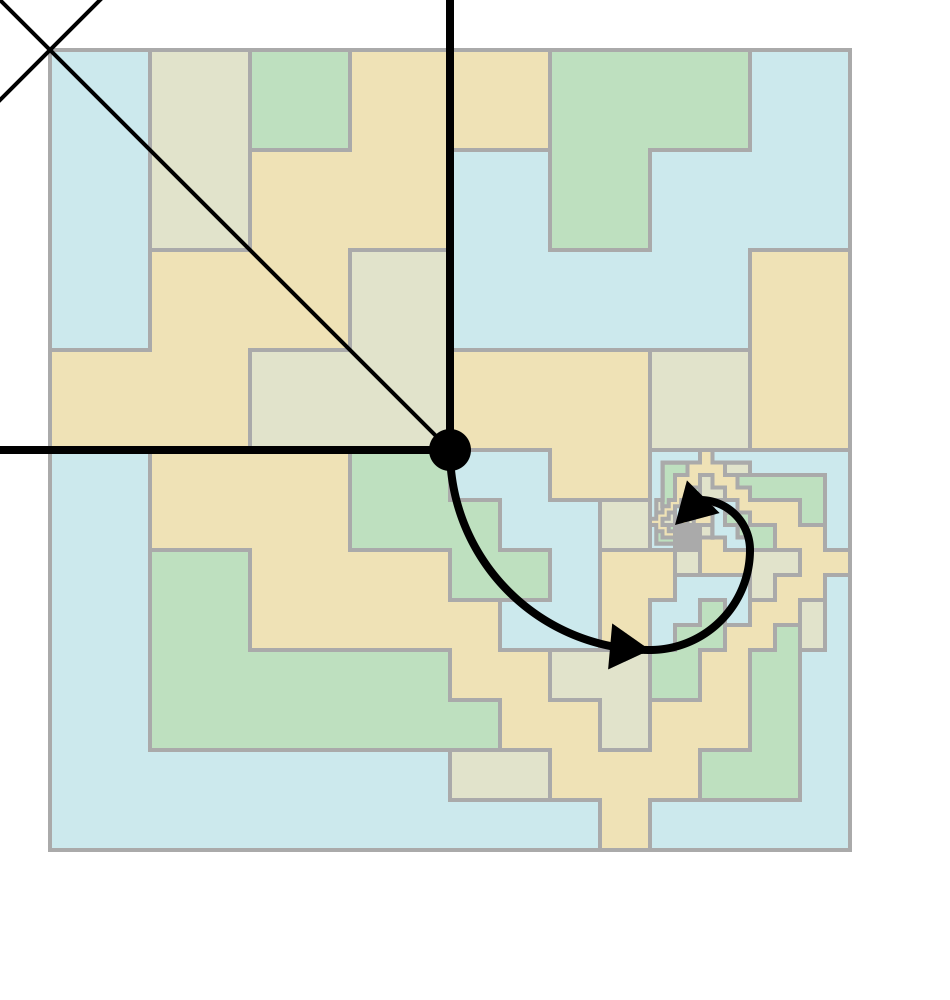

Puzzle and Key Universe 3（上）第二日meta谜题[《乞求春风再临》](https://pnku3.pkupuzzle.art/puzzle?key=day2_meta)将逻辑谜题fillomino以分形的形式拓展到无限的平面，由于将∞引入盘面实在是太过超前而催生了不计其数的二创。不满足于已有诠释中轮回间的割裂感，本篇再次创作了向内凹陷的没有尽头的盘面~~，用最粉的色彩还原最刀的剧情~~。

## 既没有参数又不能递归的宏展开

- CSS可以为具有指定类名的SVG元素批量应用表现属性（presentation attribute），这包括仿射变换。
- SVG提供了`<use>`功能，效果是将指定元素及其子元素复制粘贴到目标位置，复制的元素会在目标位置基于目标位置的变换矩阵被完全重新渲染。
- 嵌套的变换会叠加应用，连续应用变换矩阵作为幂。

借由矢量数值指定的精确性和Web平台出了名的复杂性，SVG成了最适合绘制分形图案的图片格式。

## 线宽均一的描边

标准的SVG变换会连带描边一起缩放。有时我很羡慕TikZ，变换只改变坐标，不改变线宽，也不旋转或缩放节点，用变换描述图形的几何，又能在靠变换定位的点间绘制粗细一致的美丽描边和大小一致的美丽标签，绘制图表、示意图、平面几何图形都很方便。

直到有一天，我发现了`vector-effect="non-scaling-stroke"`。虽然vector-effect是SVG 2.0版本才定义的属性，现今没有浏览器完整支持SVG 2，但是*这个*属性的*这个*值的兼容性却在标准尚未完稿的时日就已奇好无比。

原先等价的填充和描边、`stroke-linecap="butt"`和`stroke-linecap="square"`，在添加了vector-effect后，效果便不再相同，需要按语义配置了。

## 沿着对数螺线的轨迹

轨迹越可微，运动越丝滑。

盘面的结构让人联想到黄金螺线的样子，这近似于对数螺线。用圆弧可构建<var>C</var>1光滑的摄像机轨迹。

SVG没有原生的摄像机的概念，通过对物体施加变换模拟镜头的运动。对于CSS transform属性，若关键帧中的变换列表版式相同，插值将分配到各项，否则会回退到变换矩阵的先组合后分解，幻化出不知所云的轨迹——详见[CSS Transforms Module Level 1 § Interpolation of Transforms](https://www.w3.org/TR/css-transforms-1/#interpolation-of-transforms)和[CSS Transforms Module Level 2 § Decomposing a 3D matrix](https://www.w3.org/TR/css-transforms-2/#decomposing-a-3d-matrix)。通常transform由值到none能产生合理的效果，正是因为插值中会自动将none补全，但若用translate变相改变了原点，需要在none一侧补充这部分平移变换，以免原点定义也被插了值。

## 对时间的感知只有悄然变慢

CSS动画和过渡的默认缓动模式是ease，着实是个奇怪的选择。在无限循环的动画中使用此类非线性的缓动易引发动画速度跳变，选择linear缓动是最简单的修复办法。

此时摄像机在螺线上以匀角速度移动和旋转，两次轮回间没有一点喘息的机会，在对时间的感知不知不觉地变慢的过程中陷得越来越深。

然画框缩放速度有所跳变。缩放比例匀速放大到原来的两倍，紧接着又重复从两倍放大到四倍，这是在尝试用线段拟合指数函数。将缓动换为拟合指数函数的贝塞尔曲线可使之更加光滑，但每个动画只能指定一个缓动效果，旋转又已要求线性，只好增加线段段数，使拟合逼真。

## 缝，永远的痛

一切都很完美，直到列文虎克出现。

<big>有缝啊啊啊！</big>

抗锯齿导致形状边缘的一个像素受到矢量定义的影响。可惜抗锯齿不一定能关闭，即使关闭了也可能导致有锯齿的缝隙出现。凭什么GPU绘制两个共边三角形就不会有缝？

我只好选择在渲染时使用更高的分辨率，然后降采样。平等地憎恶每一条缝。
