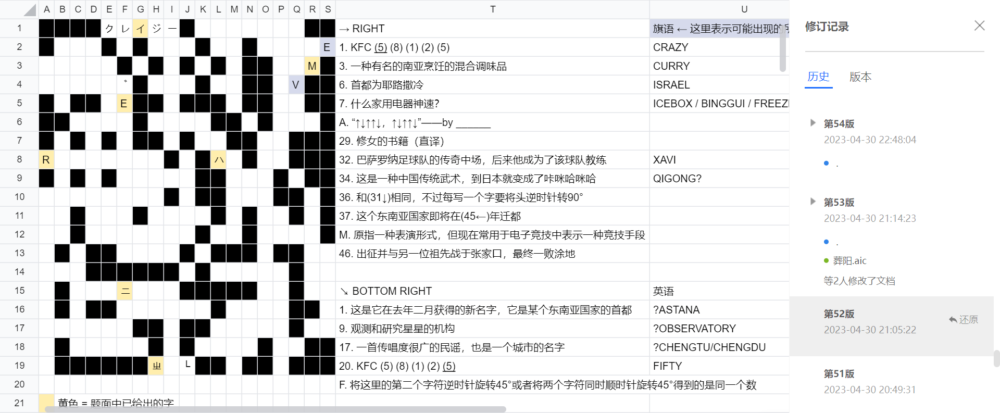
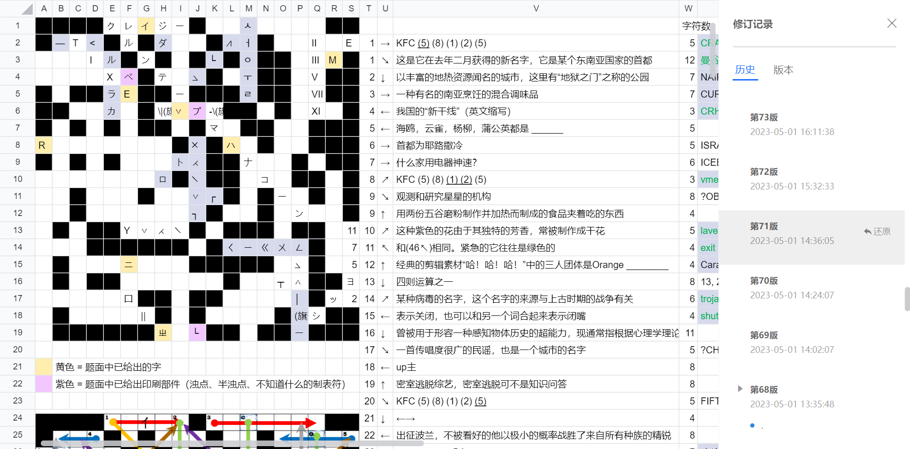
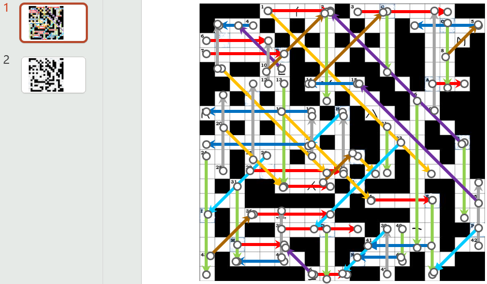
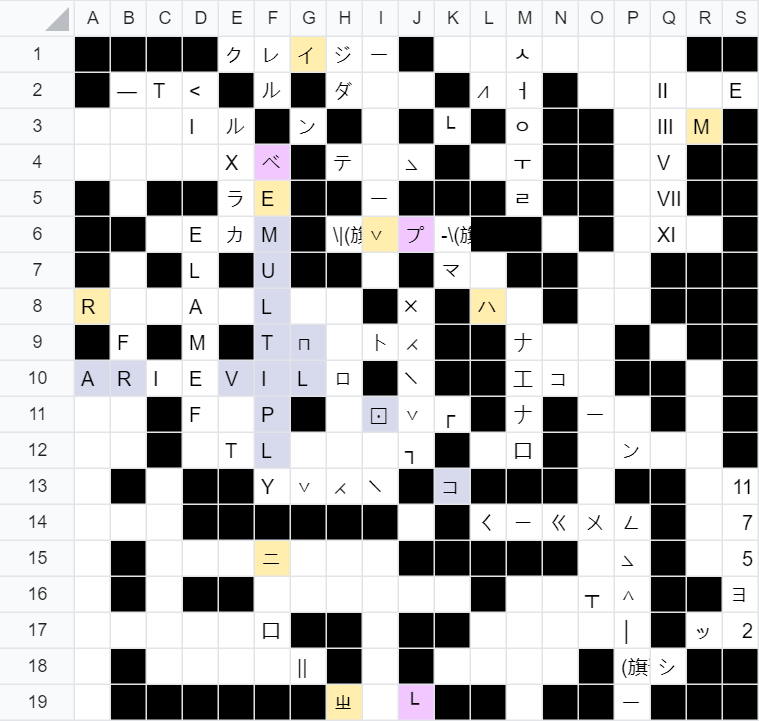
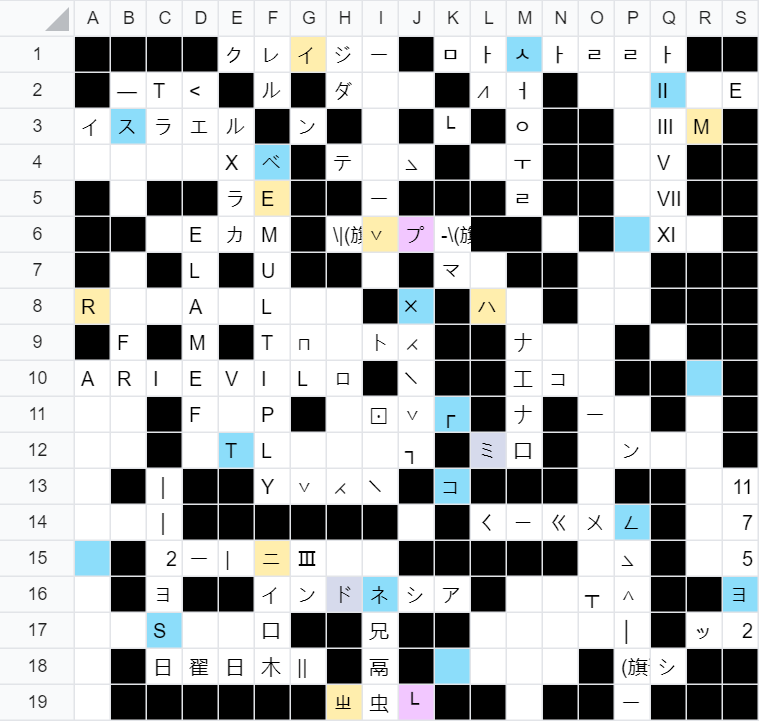
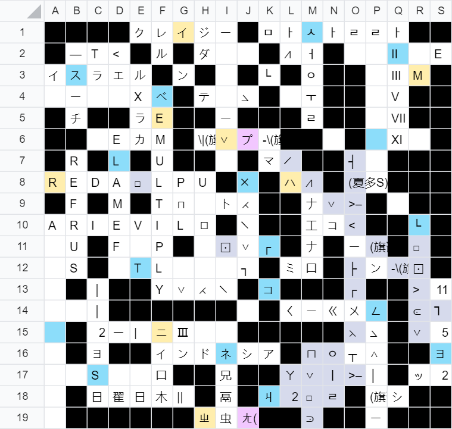
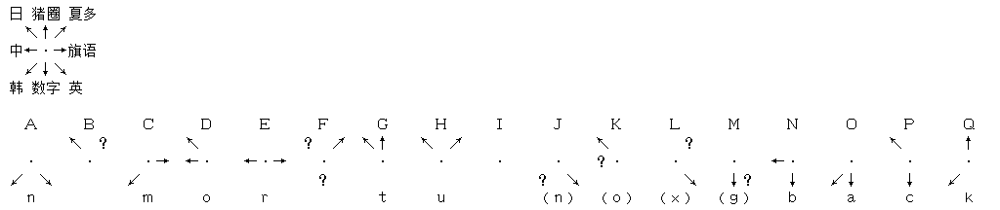
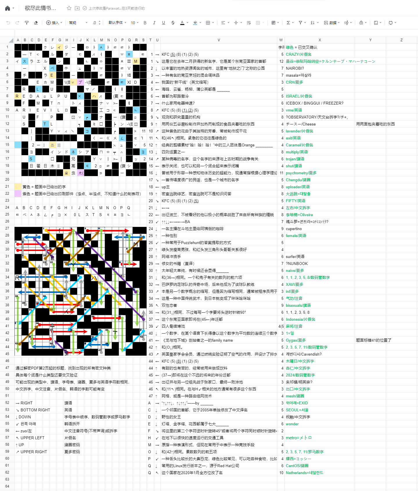

队伍：Find&amp;Discover Union

## 爱慕猫体邻国斯必克二

解题：piscesciurus、Andantino 
报告：piscesciurus

正如出题人预想的那样，这是一道不会没有思路的题。第一遍翻阅题目文档时识别出了英语、旗语、A1Z26、注音、拼字、日语、猪圈，猜测左下是韩语拼音，upper right是某种字母替换密码，于是马上就去翻第一道题（我没有参与解第一道题，但知道里面有必知必会），检查是不是有我没见过的常见密码，借此确认了夏多。查韩语字母表看不太懂，想到这可能是纯正的韩语而不像片假名拼读，于是Google翻译lower left为韩语，确认了ㅇㅚㄴㅉㅗㄱ ㅇㅏㄹㅐ是韩语“왼쪽 아래”拆成单个部件（Hangul jamo），顺便找了个[在线韩文拆解工具](http://www.ch2ko.com/huoxingwen/)。

明确了所有语言和密码后，阅读提示，可以无视语言和字符数立即确认的有下面这些。

- KFC (5) (8) (1) (2) (5) = crazy Thursday V me fifty
- 太年轻太单纯，sometimes = naïve
- 数学家的下界，程序员的无穷 = inf
- 关闭，加一词变为闭嘴 = shut

能确认答案但不知道语言的有下面这些。

- 芳香紫色干花 = 薰衣草
- 给阿姨倒一杯 = 卡布奇诺
- 上古战争命名的病毒 = 木马
- 地下快速交通工具 = 地铁
- 在地铁里有很多、紧急是绿色 = 出口
- 素数数列 = 2, 3, 5, 7, 11（原来是单纯的数字而不是A1Z26吗？）
- 兔子数列 = 0?, 1, 1, 2, 3, 5, 8?
- 2020年1月全方改名的国家 = 荷兰
- 首都为耶路撒冷 = 以色列或巴勒斯坦
- 即将迁都的东南亚国家 = 印度尼西亚，2024
- 2005年单独修改了中文译名的邻国首都 = 首尔
- 某个东南亚国家的首都去年二月获得的新名字 = 恭贴玛哈纳空（曼谷）

虽然这题充满了各种打不出的符号，但是因为还有好多我不知道描述的是什么的词条，我还是选择了新建工作表……

其他队伍一定都是打印出来做的吧……

建完工作表后Andantino神速地又填了一大堆词条。

- 神速 = 冰柜
- 新干线 = CRH
- 民谣和城市 = 成都
- 咔咪哈咪哈 = 气功
- 传奇中场教练 = Xavi
- 四则运算之一 = multiply
- 绿色吃人恐龙 = ヨッシー
- 灯塔、金字塔、花园都属于七大 = 奇迹
- 南亚烹饪调味品 = 咖喱？
- 排水集气法 = 卡文迪什？
- 地狱之门的地热城市 = 内罗毕？
- 观测和研究星星的机构 = 天文台？
- 源于Red Hat的Linux发行版 = Fedora？

可惜幻灯片标题的语言和词条的语言并不对应，填完发现还要确定语言才行。

最先能够确定的是疯狂星期四带预填字的两条“クレイジー”和“VME”。第一个差点就把CRAZY填上去了。要是这题没有被winfrid削弱，我肯定不知道怎么下手。

接下来搜索知道曼谷改名，填入了クルンテープ・マハーナコーン。有ク、゜、ハ三格验证，答案肯定不会错了，但差了一个字，发现是日语Wikipedia上的拼法跟Google翻译结果差了个长音符。填出这条以前我一直以为那个半浊点是句号。怎么会有人把浊点写在右下角的啊！明明横竖排也不会改变浊点位置的……

为什么ジ的浊点没有在题面中给出，而プ给出了？一定是因为与プ交叉的条目是另一种语言，且只用到了フ的部分。15←的答案是shut，与フ交叉的H在旗语中就是←↙，所以这条也填上了。题板上另一个给出了浊点的位置（B）也一定是因为两种语言交叉，其中一种语言是日语。

因为一下子填出了最长的词条，有了“这题能做完”的错觉。

还是继续从有交叉验证格的地方入手。32→ XAVI第三格里有个⋌，和夏多密码中的V能对上，就填入了。于是33↗ INF也是夏多密码，30↑ NAIVE也是，H↙ メトロ是日语。

像“⋌”这样很难打出的符号可以在[Shapecatcher](https://shapecatcher.com/)上画，视Unicode收录情况，有可能能打出来。打不出来的符号想必也不会在交叉口上出现吧！这么想着，就更加要把八方字谜在工作表里填完的想法贯彻到底了。

11↖和46↖怎么想都是指出口，exit能对上，但“出”的声母又不是ㄓ，注音字数也不对。思考良久，得出结论：把“出”拆成“ㄓ”和“丨丨”绝对是全场最抽象的操作，没有之一。4← CRH与之交叉验证，填入。本来以为“哈！哈！哈！”是金馆长，也是迫真三人团体，但是没有团体名也不叫Orange，这时搜到了12↑ Caramel，只能是日语了，也填入。6→ イスラエル对着第四格的竖线看了半天，才发现题目中字母I的写法是带有夸张衬线的。10↗ ラベンダー也确认了。

另一方面，O↓ 2, 3, 5, 7, 11里第三个已经填了V，显然是罗马数字了。这样一来，同为素数数列的42↑想必不是罗马数字而是数码管数字，我赌出题人不会把罗马数字用两遍。P↙ ヨッシー字数和首字也都对上了，于是填入。E↓ WONDER的末字能对上，应该是旗语。34→ ㄑㄧˋ ㄍㄨㄥ的末字交叉验证了这一点，遂全部填入。

14↗ TROJAN首字能对上，也是旗语。C↓虽然SEOUL字数对得上，但密码对不上，看来只能是서울了。只要长得像就行了，笔画的弧度什么的，已经无所谓了。

同步一下现在的题板（赛中6→ イスラエル是后来才填上的）：

发现交叉验证在这个字谜中很重要后，我就把所有词条在题板上的位置都画出来了。当然是用PPT画的。而且一点也不规范。为了避免选中，背景图是贴在幻灯片母版里的。做某题的队友读到这里可能已经PTSD了吧。

通过这张图很快发现20↘ FIFTY已经能填入了。我本来以为25↑ FEMALE说不定不是二元性别之一，但字谜本身就够难了。四则运算其实都是八个字母，但addition、subtract、multiply、division里只有乘法能以Y结尾，夏多密码也套不上，这才确定13↓ MULTIPLY。17↘ CHENGDU一路上出现了L（英语）、ロ（日语）、┐（夏多）、ㄑ（注音），集其大成者，猪圈也。太离谱了。22←现在确认大概率是英语了，通过Nutrimatic解出来了个Oliveira。一直以为是什么历史战役，没想到是电子竞技。

21↓应该是“左右”两字拆开写，毕竟幻灯片标题里也是把“左”字拆成了“ナエ”。我相信看到这个标题以为是片假名的绝对不是少数。23↙是众所周知的魂斗罗作弊码，17↘填出来的那个猪圈D应该是コ，那么23↙就应该是日语コナ□コ□□□。コナミコントラ？コナミ应该是能确定了，末字ラ的话跟36→对不起来。总之感觉很怪，这条暂时搁置。

37→ インドネシア只有日语字数对得上。直到此刻我都还以为44↑也是日语，可是不知道是什么。过了个灵感才发现，这不就是杏仁吗……相比于ナエナロ，我觉得还是ホロイニ更加逆天。于是44← 木曜日怎么都凑不对字数的原因也水落石出了。通过“日”交叉确认了31↓为数码管数字。在拆字的兴头上，百度到了D↓ 祝融。直到此刻我都还以为46→是注音，因为“出口”被拆得过于抽象，想必这条也是从“虫”里拆出来个“ㄖ”之类的。

因为咖喱怎么都对不上，所以重新搜了3→ 마살라。

5月1日晚上到5月2日凌晨，在我睡大觉的时候，队长Parawatch_Wiki果断买下了翻译考试和迷宫的答案，队友突突掉了EVA，这时夏区还剩八角伞、的的赋、爱慕猫没有通过。在咖啡店外死活没看出到底要怎么close it，于是在爱慕猫和的的赋之间选择购买了的的赋的答案。~~感谢队友看到我做得很开心于是没买爱慕猫的答案~~

Andantino又填了几条：

- 两面包夹 = 芝士
- ↑↓↑↑↓ = 위아래 = EXID
- 修女的书籍 = nunbook？
- 败于张家口 = 朱祁镇/明英宗？

我买了提示获知提取方法，不过发现这时填出来的字还是太少了，不足以推断出最终答案，还得再填些。

后现代文化自信出过考点，cheese字数对不上，ス又不应该加长音，总不会真是两面包夹芝士吧！因为不知道ㅈ还有另一种写法，结果硬是把チーズ强行改成了チースー塞进去了……然后大胆猜测9↘是“天文台”拆字，天 = チ + ㇏……也没想到7→应该怎么填，左上角这块就卡死在这了。看上去快填满了，但这里的两个蓝色格子都只有一种语言，提取不出来。

28↑ \_ \_ R \_ \_ \_看起来是surfer，搞不懂为什么一定要加上“网上”的限定语。一直以为18←说的UP主的意思是这条是某个UP主的名字，但是人脑nutri了一下\_ \_ L \_ \_ \_ E R发现就是uploader，绷不住了。

至今不知道最末一行题面上印的那个奇怪的制表符是什么意思，在散步的时候突发奇想，之前39↙一直填不进去的“麻将”可能是注音，五个字中的最后两个字合成一个字来用了，“ㄐ”又很像45←里要用到的“4”。41← GYGAX、45← 2024、47↑ MESH（新概念猪圈⪾□∨ㄇ）全都能交叉确认。因为只有韩语有长得像2的东西ㄹ，所以试图把各种数字翻译到韩语来找到40↓，最后发现일这个明显就是答案的字确实有一的意思。

16↓必定是夏多密码了，通过Nutrimatic找到了psychometry一词完美符合描述，填入。35↖因为bisexual字数对不上一直不知道怎么填，现在发现只是加了个s没说而已。Q↓也就是CentOS而不是Fedora。

Q↖ 네덜란드路上的ㄹ说明这条是韩语，半信半疑，不过翻译出来完全对得上便放心了。A→ EXID也完全正确。因为韩国综艺和韩语里有ㅌ，这样看来19↑很可能是韩语，搜索得到19↑ 대탈출。那么5←也是韩语了，罗马数字Ⅱ的衬线相连也必定是为了跟ㅍ凑成一样。

至此，虽然还有好些没有填出来的词条，但是足以看出答案了。

答案是no more turning back，“事到如今，却也无法回头”。

<table class="spreadsheet">
<thead>
<tr><th><th>A<th>B<th>C<th>D<th>E<th>F<th>G<th>H<th>I<th>J<th>K<th>L<th>M<th>N<th>O<th>P<th>Q<th>R<th>S
<tbody>
<tr><th>1<td><td><td><td><td>ク<td>レ<td>イ<td>ジ<td>ー<td><td>ㅁ<td>ㅏ<td>ㅅ<td>ㅏ<td>ㄹ<td>ㄹ<td>ㅏ<td><td></td>
<tr><th>2<td><td>—<td>T<td>&lt;<td><td>ル<td><td>ダ<td>⦣<td>ㄷ<td><td>⩘<td>ㅓ<td><td>ㅇ<td>ㅜ<td>ㅍ<td>ㅐ<td>ㅌ
<tr><th>3<td>イ<td>ス<td>ラ<td>エ<td>ル<td><td>ン<td><td>\|(旗语T)<td><td>ㄴ<td><td>ㅇ<td><td><td>ㅊ<td>Ⅲ<td>M<td></td>
<tr><th>4<td>ㄅ<td>ㅣ<td>ㄥ<td>ㄍ<td>ㄨ<td>ベ<td><td>テ<td>⦣<td>⦣<td><td>ㅏ<td>ㅜ<td><td><td>ㄹ<td>Ⅴ<td><td></td>
<tr><th>5<td><td>ㅊ<td><td><td>ラ<td>E<td><td><td>ー<td><td><td><td>ㄹ<td><td><td>ㅏ<td>Ⅶ<td><td></td>
<tr><th>6<td><td><td>ㅓ<td>E<td>カ<td>M<td><td>\|(旗语T)<td>∨<td>プ<td>-\(旗语S)<td><td><td>ㄹ<td><td>ㅌ<td>Ⅺ<td>D<td></td>
<tr><th>7<td><td>R<td><td>L<td><td>U<td><td><td>⩘<td><td>マ<td>╱<td><td><td>ㅓ<td>ㅐ<td><td><td></td>
<tr><th>8<td>R<td>E<td>D<td>A<td>ㅁ<td>L<td>P<td>⊔<td><td>╳<td><td>ハ<td>⩘<td><td>(夏多S)<td>ㄷ<td><td><td></td>
<tr><th>9<td><td>F<td><td>M<td><td>T<td>⊓<td>⟔<td>ト<td>⋌<td><td><td>ナ<td>∨<td>&gt;–<td><td>ㅔ<td><td></td>
<tr><th>10<td>A<td>R<td>I<td>E<td>V<td>I<td>L<td>ロ<td><td>╲<td><td><td>工<td>コ<td>&lt;<td><td><td>ㄴ<td></td>
<tr><th>11<td>ㄎ<td>U<td><td>F<td>&gt;<td>P<td><td>ㄷ<td>⊡<td>∨<td>┌<td><td>ナ<td><td>ー<td>(旗语E)<td><td>□<td></td>
<tr><th>12<td>ㄚ<td>S<td><td>ㅅ<td>T<td>L<td>ㅕ<td>ㅊ<td>ㅐ<td>ㄱ<td><td>ミ<td>口<td><td>├<td>ン<td>-\(旗语S)<td>⊡<td></td>
<tr><th>13<td>ㄅ<td><td>｜<td><td><td>Y<td>∨<td>⋌<td>╲<td><td>コ<td><td><td><td>┌<td><td><td>&gt;<td>11
<tr><th>14<td>ㄨ<td>(旗语E)<td>｜<td><td><td><td><td><td><td>マ<td><td>ㄑ<td>ㄧ<td>ㄍ<td>ㄨ<td>ㄥ<td><td>⪽<td>⅂
<tr><th>15<td>ㄑ<td><td>2<td>ー<td>|<td>ニ<td>|||<td>五<td>ン<td><td><td><td><td><td>⋋<td>⦣<td><td>∨<td>5
<tr><th>16<td>ㄧ<td><td>ヨ<td><td><td>イ<td>ン<td>ド<td>ネ<td>シ<td>ア<td><td>ㄇ<td>ㅇ<td>┬<td>∧<td><td><td>ヨ
<tr><th>17<td>ㄋ<td>ー<td>S<td>□<td>L<td>口<td><td><td>兄<td><td><td>ㄚ<td>∨<td>ㅣ<td>&gt;–<td>│<td><td>ッ<td>2
<tr><th>18<td>メ<td><td>日<td>翟<td>日<td>木<td>||<td><td>鬲<td><td>ㄐ<td>2<td>□<td>ㄹ<td><td>(旗语E)<td>シ<td><td></td>
<tr><th>19<td>ㄛ<td><td><td><td><td><td><td>ㄓ<td>虫<td>尤<td><td><td>⪾<td><td><td>ー<td><td><td></td>
</tbody>
</table>

### 彩蛋

> 𠩄𢇔𡥜𨜞𢦩𠔱𨉥𡥜，𠙐𨒵𥄢䚱𠘲䏻𡈟𢤦，𣌭𥞬𣊒：𤯞𩫨。

什么都打得出来哦！

Unicode提供的[部首笔画索引表](https://www.unicode.org/Public/15.0.0/charts/RSIndex.pdf)可说是有史以来收字最全的字典。因为是Unicode嘛。
