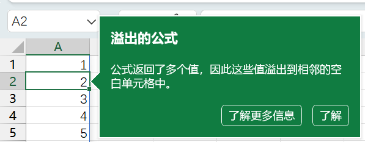
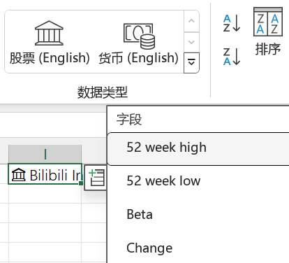

[Advancing Excel as a programming language with Andy Gordon and Simon Peyton Jones](https://www.microsoft.com/en-us/research/podcast/advancing-excel-as-a-programming-language-with-andy-gordon-and-simon-peyton-jones/)

Excel在函数式编程九宫格里能占一格是应得的：这是年轻人的第一门函数式编程语言。无副作用、图形化界面、终端用户编程、面向数据编程（物理），编程语言中的尖端科技Excel全给占了。

近来加强的对数组值的支持，通过自动溢出到周围单元格的行为，让原本操作极为不便的数组公式变得十分自然。



一些预设的来自网络的数据源现在以结构体的形式提供。一个单元格内存有多个字段，获取股票价格的方式是`=A1.Price`。



在Office 365中添加的LAMBDA函数使Excel的公式系统图灵完备了。函数正式成为公式值，显示为#CALC!。现在，可以在Excel中编写Z组合子，实现单个公式内递归。

```excel
=FACT(5)
=LAMBDA(f,LAMBDA(x,x(x))(LAMBDA(x,f(LAMBDA(v,x(x)(v))))))(LAMBDA(fac,LAMBDA(n,IF(n<=2,n,n*fac(n-1)))))(5)
```

通过名称管理器可以定义具名函数，从而以更传统的方式定义递归函数。

<figure lang="en">
<blockquote lang="zh-Hans">
我的程序生涯，我的微软生涯，我的教育生涯，此刻浓缩成了一句话：“头一回，我们可以用Excel教小孩子编程了。”
</blockquote>
<blockquote>
It would bring the pieces of my life together—my functional programming life, my Microsoft life, and my education life. It could bring that all together into, “We teach children programming using Excel for the first time.”
</blockquote>
<figcaption>Simon Peyton Jones</figcaption>
</figure>
