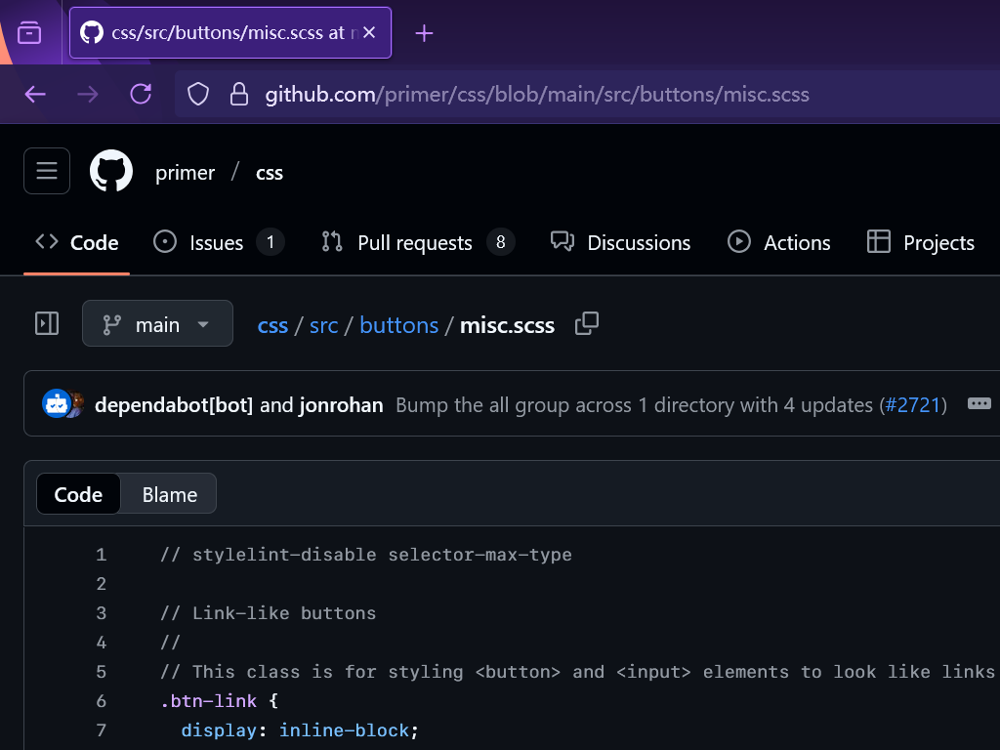
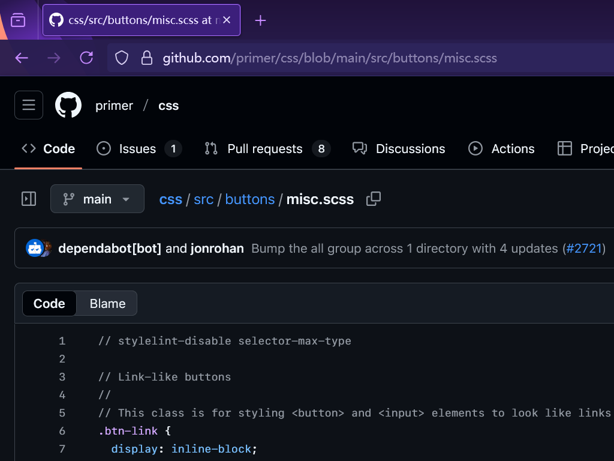

我此前从[SF Symbols](https://developer.apple.com/sf-symbols/)软件包中获取了SF Pro和SF Compact字体。方法如下：下载链接处显示“Requires macOS Ventura or later.”。无视之，可下载到一个DMG文件。这是一个应用程序，所以确实必须在macOS上运行，但是其中字体资源可被提取出来。用7-Zip打开，导航到<strong>SF-Symbols-6.dmg/</strong>SFSymbols/<strong>SF Symbols.pkg/</strong>SFSymbols.pkg/<strong>Payload/</strong><strong>Payload~/</strong>./Library/Fonts/（粗体的为文件，实际经历解包），其中就包含了San Francisco系列字体的OTF和TTF文件。

不只是SF Pro和SF Compact，其实SF全系列字体都可以从<https://developer.apple.com/fonts/>下载到。

安装SF Mono后，GitHub的代码字体也从Consolas变成了SF Mono 😹

但难绷的是，GitHub的UI因为用了`-apple-system, BlinkMacSystemFont`而非明确的字体名指定，周边控件还是Segoe UI。



于是我定义了一个真的叫BlinkMacSystemFont的字体 😾

```css
@font-face {
	font-family: "BlinkMacSystemFont";
	src: local("SF Pro");
}
```

众所周知，微软程序员都用苹果电脑，对Segoe UI字体导致的纵向不对齐浑然不觉 😾 经过这样的修改覆盖，现在我看到的才是GitHub设计师真正想呈现的样式。


