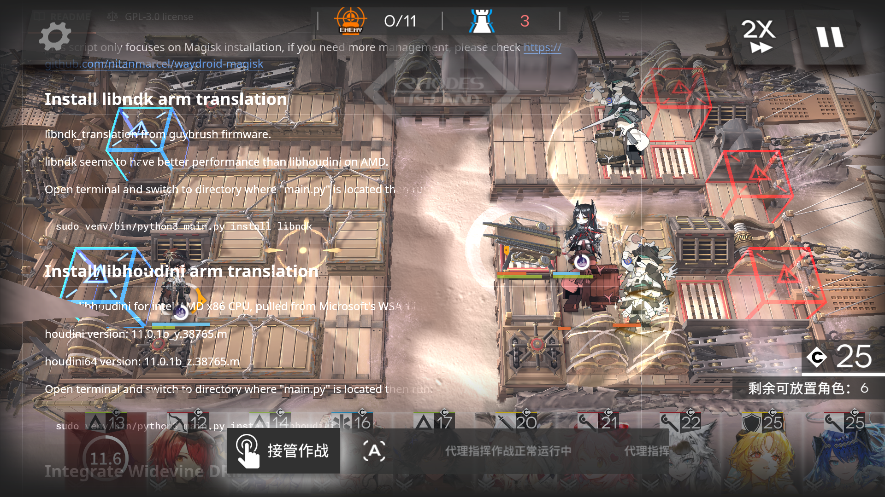
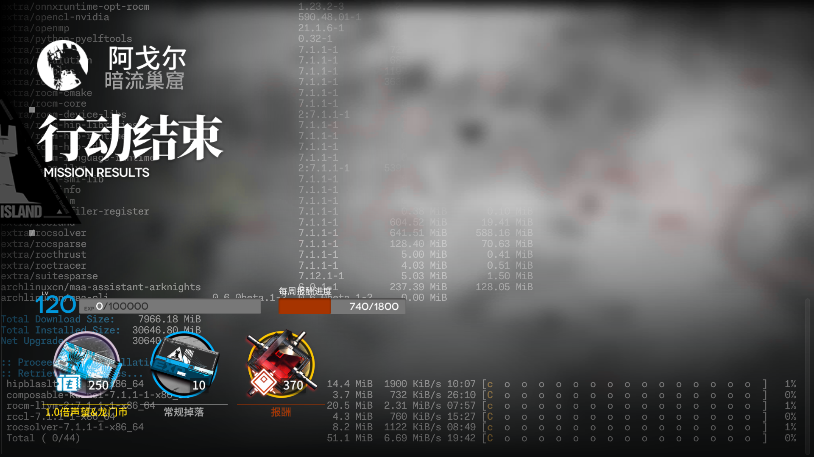
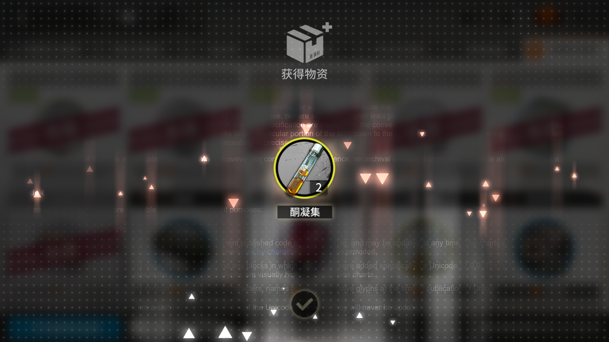
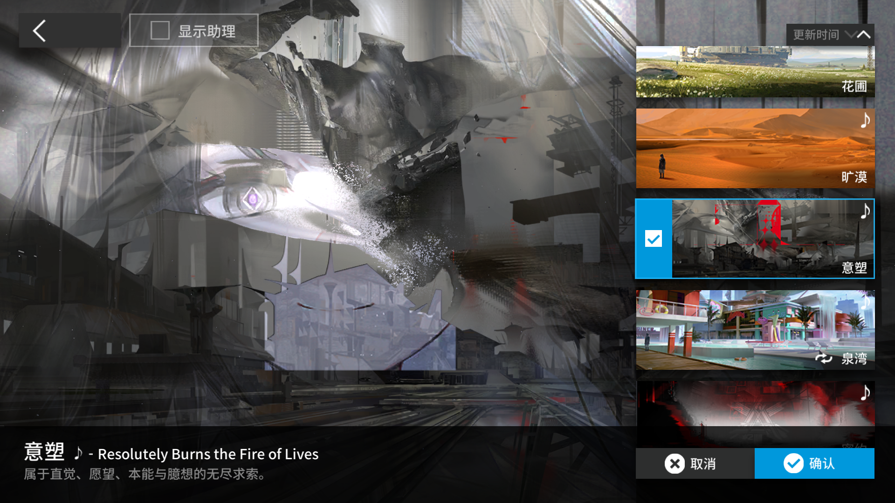

---
tags:
- 明日方舟
---

投喂可爱<s>PRTS</s>渲染bug：

这是目前Waydroid（一种在Linux上运行Android应用的方案）开启<code>persist.<wbr>waydroid.<wbr>multi_<wbr>windows</code>后渲染游戏的效果。我猜测这是因为合成时传入了窗口背后的图像，目的是正确渲染半透明或非长方形的Android应用。但包括明日方舟在内的许多应用从未考虑过这种渲染方式，以底色为黑色的前提编写了渲染逻辑和着色器。证据是，如果窗口背后是纯黑色，渲染效果就正常了。

---

## ◇

你不会真的以为，这只是简单的程序错误吧？

